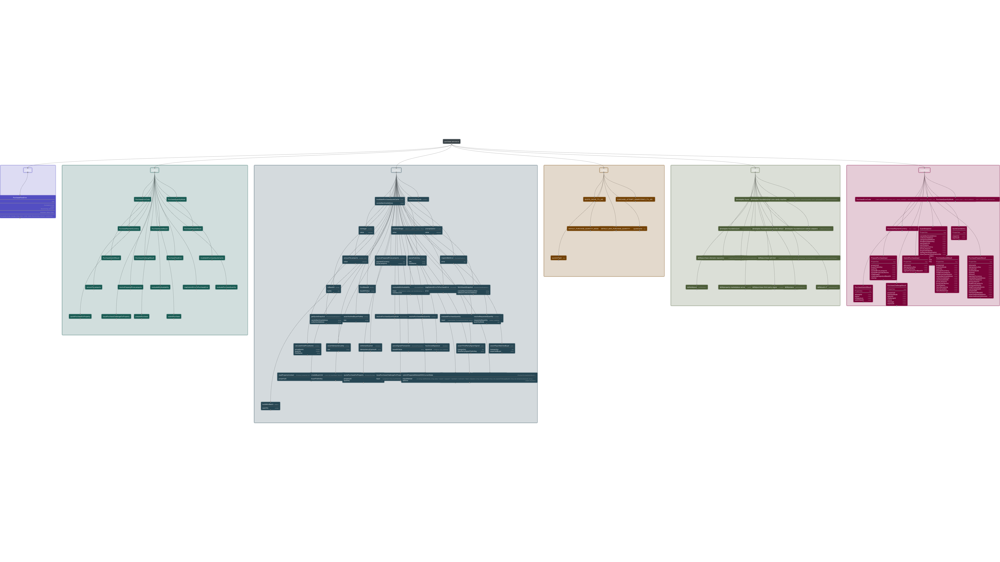
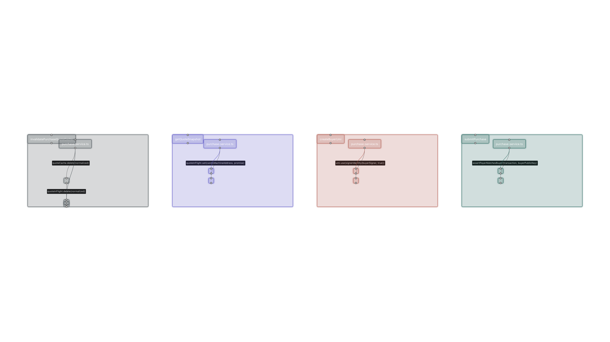

# BRIDS

This README includes an auto-generated snapshot of project documentation.

<!-- DOCS-AUTO:START -->
## Documentation Snapshot (Auto-generated)

Updated: 2026-04-01 08:20:34 UTC

| Document | Scope | Last Updated | Last Commit |
| --- | --- | --- | --- |
| [`STAKE_AUDIT.md`](./docs/STAKE_AUDIT.md) | general | not set | 2026-04-01 d0c0f7d |
| [`architecture.md`](./docs/architecture.md) | blockchain | 2026-04-01 08:20:33 UTC | 2026-04-01 d0c0f7d |
| [`auth-flow.md`](./docs/auth-flow.md) | frontend/auth | 2026-03-27 08:35:00 UTC | 2026-04-01 d0c0f7d |
| [`authority-model.md`](./docs/authority-model.md) | blockchain | 2026-04-01 08:20:33 UTC | 2026-04-01 d0c0f7d |
| [`devnet-proof.md`](./docs/devnet-proof.md) | blockchain | 2026-04-01 08:20:33 UTC | 2026-04-01 d0c0f7d |
| [`nft-spec.md`](./docs/nft-spec.md) | nft | 2026-04-01 08:20:33 UTC | 2026-04-01 3e89303 |
| [`purchase-tracing.md`](./docs/purchase-tracing.md) | general | 2026-03-20 19:25:00 UTC | 2026-04-01 d0c0f7d |
| [`rbac.md`](./docs/rbac.md) | general | 2026-03-03 UTC | 2026-04-01 d0c0f7d |
| [`session-model.md`](./docs/session-model.md) | frontend/auth | 2026-03-27 08:35:00 UTC | 2026-04-01 d0c0f7d |
| [`state-machine.md`](./docs/state-machine.md) | blockchain | 2026-04-01 08:20:33 UTC | 2026-04-01 d0c0f7d |
| [`threat-model.md`](./docs/threat-model.md) | blockchain | 2026-04-01 08:20:33 UTC | 2026-04-01 d0c0f7d |

### Required Docs by Change Type
- Blockchain (/programs): `architecture.md`, `authority-model.md`, `state-machine.md`, `threat-model.md`, `devnet-proof.md`
- Frontend/Auth (/app): `auth-flow.md`, `session-model.md`
- NFT features: `nft-spec.md`
<!-- DOCS-AUTO:END -->

## Operational Map

This repository is currently a Next.js application with Solana integrations and governance automation around it. The governance documents still define `/programs` and `/packages`, but the active implementation today lives mainly in `app/`, `components/`, `lib/`, `tests/`, `e2e/`, and `scripts/`.

### Main Modules

- `app/`: App Router pages and route handlers. Use this first when the change affects URLs, API contracts, server-rendered pages, auth endpoints, admin endpoints, checkout, marketplace, feeds, or webhooks.
- `components/`: UI composition layer. Use this for visual changes, client interactions, dashboards, admin panels, modals, filters, and page-specific presentation logic.
- `lib/`: Core domain and server logic. This is the main backend layer of the repo: auth, SIWS, RBAC, Solana RPC helpers, Metaplex/Core Candy Machine flows, purchases, checkout, compliance, referrals, observability, content, SEO, and admin services.
- `db/`: SQL migrations and database evolution. Start here when a feature needs new persistence, audit tables, queue state, idempotency storage, or read-model support.
- `tests/`: Unit and route-level verification with Vitest. This is the first place to update for TDD and regression coverage on application logic.
- `e2e/`: Playwright and Synpress coverage for browser, auth, admin, wallet, and responsive flows. Use this when the change affects critical UI journeys or wallet-connected behavior.
- `docs/`: Canonical architecture, security, auth, NFT, feature-note, RFC, and workflow documentation. Update this alongside code according to `docs/governance/documentation-policy.md`.
- `scripts/`: Repo automation for docs sync, PR governance, RFC scaffolding, devnet proof helpers, migrations, and workflow bootstrap. Check here before inventing a new one-off command.
- `.mcp.json`: Solana MCP and Helius MCP project wiring. Review this when the task depends on MCP-backed Solana guidance or Helius asset/transaction inspection.

### Where To Start By Change Type

- Landing, marketplace, checkout, protected pages, admin screens, or page routing: start in `app/`, then follow imports into `components/` and `lib/`.
- Auth, session, wallet sign-in, admin gating, referral binding, or role logic: start in `app/api/auth/*`, `lib/auth.ts`, `lib/auth-store.ts`, `lib/auth-session.ts`, `lib/siws.ts`, `lib/rbac.ts`, and `proxy.ts`.
- Solana RPC policy, explorer links, wallet client behavior, or network restrictions: start in `lib/solana.ts` and then the feature service using it.
- Marketplace read paths, property listing/detail data, or collection-backed listing synchronization: start in `lib/property-marketplace-server.ts`, `lib/property-service.ts`, and the relevant `app/marketplace*` routes/pages.
- Purchase flow, anti-bot challenge, idempotency, or webhook reconciliation: start in `lib/purchase-service.ts`, `lib/purchase-anti-bot.ts`, `lib/purchase-flow-trace.ts`, `lib/purchase-attempts-repository.ts`, and `app/api/purchase/*`.
- Checkout cart, order lifecycle, Airwallex handoff, or onboarding reward discount usage: start in `lib/checkout-service.ts`, `lib/checkout-domain.ts`, `lib/checkout-repository.ts`, `lib/airwallex-client.ts`, and `app/api/checkout/*`.
- Admin collection editing, uploads, collection health, or marketplace entry creation: start in `lib/admin/*`, `components/admin/*`, and `app/api/admin/collections/*` or `app/api/admin/assets/*`.
- Core Candy Machine, Metaplex Core minting, authority rotation, snapshots, or devnet mint/admin tooling: start in `lib/core-candy-machine-admin.ts`, `lib/metaplex-core-admin.ts`, `lib/core-authority-lifecycle.ts`, and the matching `app/api/admin/core-candy-machine/*` or `app/api/admin/metaplex-core/*` handlers.
- Compliance, KYC, AML, suspension, or operational review queues: start in `lib/compliance/*`, `lib/kyc/*`, `app/api/internal/compliance/*`, and `app/api/admin/compliance/*`.
- Content, AI-readable endpoints, knowledge pages, feeds, or SEO/schema output: start in `lib/content/*`, `lib/knowledge*`, `lib/schema/*`, `lib/seo/*`, and the related route handlers under `app/api`, `app/feeds`, `app/knowledge`, `app/ai.txt`, and `app/llms.txt`.
- Governance, docs sync, PR policy, RFC enforcement, or branch/PR automation: start in `scripts/ci/*`, `scripts/docs-sync.sh`, `scripts/rfc-new*.js`, `scripts/linear-plan*.js`, and `docs/governance/*`.

### Current Architectural Notes

- The repo is governed as a Solana-first fullstack project, but there is no active `/programs` directory in the current tree. The blockchain behavior in this repository is implemented primarily through TypeScript services and admin routes.
- Sessions are currently process-local in-memory tokens in `lib/auth-store.ts`. This is acceptable for local/dev workflows but not enough for multi-instance production.
- `npm run validate` is the top-level quality gate. It already includes docs governance checks, route/content/schema contracts, observability contracts, and type/lint validation.
- Critical browser coverage lives in `e2e/` and should be the default verification path for frontend, auth, wallet, and responsive changes.

### Dependency Graph Snapshot

The following screenshots were exported with VS Code's `Dependency Graph Viewer` extension using `lib/purchase-service.ts` as a representative service map.

Graph view:

Sequential view:

## Auth Persistence Note

- Wallet auth uses SIWS with a server-side session cookie (`httpOnly`).
- Current session storage is in-memory (process-local), so sessions are lost on server restart.
- Before production or horizontal scaling, migrate session storage to a shared persistent backend (for example Redis).

## Solana + Helius MCP Integration

This repo includes MCP configuration for Solana + Helius workflows:

- Claude Code project scope: [`/.mcp.json`](./.mcp.json)
- Cursor workspace scope: [`/.cursor/mcp.json`](./.cursor/mcp.json)

Endpoints and transport:

- Solana MCP URL: `https://mcp.solana.com/mcp` (HTTP/mcp-remote)
- Helius MCP package: `helius-mcp@latest` (via `npx`)

Quick verify (Claude Code):

- `claude mcp list`
- `claude mcp get solana-mcp-server`
- `claude mcp get helius`

Expected behavior:

- Ask: `How are events implemented in Anchor 0.31?`
- You should see an MCP tool call such as `Ask_Solana_Anchor_Framework_Expert`.
- Ask: `Parse this transaction signature with Helius`
- You should see a Helius MCP tool call for transaction parsing/query.

Important for this project (Devnet-only policy):

- Helius MCP defaults to `mainnet-beta`.
- Before Helius MCP usage, set:
  - `export HELIUS_NETWORK=devnet`
  - `export HELIUS_API_KEY=YOUR_API_KEY`

## Nix Dev Environment

This repository includes a reproducible Nix development shell:

- Enter shell: `nix develop`
- If flakes are not enabled globally yet: `nix --extra-experimental-features 'nix-command flakes' develop`
- Install dependencies: `npm ci`
- Run baseline validation: `npm run validate`

Toolchain governance for maintenance/update cadence is defined in:

- [`docs/toolchain-policy.md`](./docs/toolchain-policy.md)

## Testing

- `npm test`: run all unit tests with Vitest.
- `npm run test:watch`: run tests in watch mode.
- `npm run test:coverage`: run tests with coverage report.
- `npm run preflight:start`: run an initial workspace preflight that reviews branches, suggests next actions, checks package/lock drift, and summarizes `AGENTS.md` guidance without cleaning branches automatically.
- `npm run pr:ready`: run local PR governance preflight (`validate` + required docs + commit convention + PR-size + branch-age checks).
  - Includes feature-note enforcement: qualifying feature/fix/refactor/nft product changes must update `docs/features/*.md`.
- `npm run e2e:install`: install Playwright Chromium (one-time setup).
- `npm run e2e:playwright`: run Playwright smoke gate.
- `npm run e2e:synpress`: build Synpress Phantom cache and run wallet E2E gate.
- `npm run e2e:synpress:user`: run Synpress gate with non-admin wallet profile.
- `npm run e2e:synpress:admin`: run Synpress gate with admin wallet profile.
- `npm run e2e:roles`: validate `/admin` access control with SIWS signatures from local admin/non-admin keypairs.
- `npm run e2e:evidence`: capture responsive critical-path evidence (320/375/768/1024) and build `test-results/evidence-index.json`.
- `npm run e2e`: run Playwright + Synpress gates in sequence.

E2E env vars:

- `E2E_BASE_URL` (default: `http://127.0.0.1:3000`)
- `E2E_PHANTOM_PASSWORD` (optional; defaults to a local test password in setup file)
- `E2E_PHANTOM_SEED_PHRASE` (optional; defaults to test mnemonic only for local/devnet use)
- `E2E_ADMIN_KEYPAIR_PATH` (optional; default: `$HOME/my-solana-wallet.json`)
- `E2E_USER_KEYPAIR_PATH` (optional; default: `.keys/purchase-third-party-signer.json`)
- `E2E_SYNPRESS_WALLET_ROLE` (`admin` or `user`, default: `user`)
- `SYNPRESS_PHANTOM_CRX_URL` (optional override to download Phantom extension if default mirror is unavailable)

Evidence workflow:

- Run `npm run e2e:evidence`.
- Collect artifacts from `test-results/` (PNG/JSON/trace/video).
- Use `test-results/evidence-index.json` as the deterministic manifest to attach in PR review/MCP evidence checkpoints.

## Git Workflow

- Day-to-day work is `develop`-first.
- Create feature/fix branches from latest `develop`.
- Open regular PRs into `develop`.
- Use `main` only for release PRs from `develop`.
- CI enforces this rule with `.github/workflows/enforce-main-source-branch.yml` (PRs to `main` must come from `develop`).

Quick start:

- `git checkout develop && git pull origin develop`
- `./scripts/git-start.sh app admin-asset-form-v3`

## RFC Workflow (Epics)

Start every epic with the RFC scaffold command:

- `npm run rfc:new -- --epic 12 --slug staking`

This creates:

- `docs/rfcs/EPIC-012-staking/README.md`
- `docs/rfcs/EPIC-012-staking/STORY-012-01-kickoff.md`

Common options:

- `npm run rfc:new -- --epic 12 --slug staking --story-id 02 --story-slug asset-validation`
- `npm run rfc:new -- --epic 12 --slug staking --owner jay`
- `npm run rfc:new -- --epic 12 --slug staking --force`

Notes:

- Use `--` before script flags so npm forwards arguments correctly.
- Naming follows the governance policy in `docs/governance/documentation-policy.md`.
