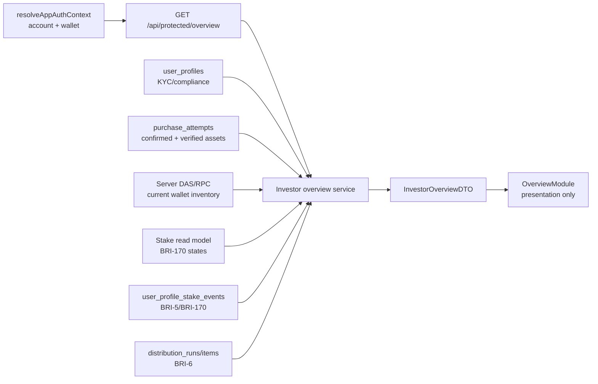

# implementation(feature): BRI-171 Investor Dashboard Overview with real data

## ES

## Estado
- Issue padre: `BRI-171`
- Linear URL: `https://linear.app/brids-app/issue/BRI-171/feature-investor-dashboard-overview-real-data`
- Rama de iniciativa canónica: `initiative/bri-171-investor-dashboard-overview-real-data`
- Slice actual: `S01 - Documentation`
- Artefacto base: `docs/features/feature-app-investor-dashboard-overview-real-data-bri-171.md`
- Estado: listo para revisión, sin implementación runtime

## Objetivo técnico
Construir un Overview de inversionista real, server-authoritative y reusable, que reemplace las métricas mock de `components/dashboard/overview-module.tsx` sin duplicar la lógica sensible de Stake, Compras, Perfil o Distribuciones.

La feature debe entregar un read model protegido. El navegador no decide elegibilidad, propiedad, montos ni estados finales.

## Arquitectura propuesta

## Contrato de datos v1

### `InvestorOverviewDTO`
Campos propuestos:

- `walletPublicKey`
- `accountStatus`
  - `wallet_bound`
  - `wallet_required`
  - `session_conflict`
- `profile`
  - `kycStatus`
  - `complianceStatus`
  - `profileCompletedAt`
- `summary`
  - `historicalInvestedMinor`
  - `historicalInvestedCurrency`
  - `currentlyOwnedFractions`
  - `readyToStakeCount`
  - `readyToUnstakeCount`
  - `syncPendingCount`
  - `unsupportedCount`
  - `preparedDistributionMinor`
  - `preparedDistributionCurrency`
- `holdingsPreview`
  - asset address
  - property id
  - property title
  - collection address
  - visible state
  - image URL
- `recentActivity`
  - type
  - property title
  - tx signature
  - validation status
  - block time / observed time
- `dataQuality`
  - `status`: `ready`, `partial`, `empty`, `wallet_required`, `sync_pending`, `error`
  - degraded sources
  - last refreshed time

Regla: el DTO es calculado en servidor. La UI solo formatea y renderiza.

## Fuentes y límites por módulo

### Auth/session
Usar:

- `resolveAppAuthContext`
- `getAuthenticatedPublicKeyFromRequest`
- `getRequestRole` solo si el endpoint sigue ese patrón

No usar:

- wallet public key enviada por query param
- estado `useWallet()` como autoridad de lectura

### Perfil y compliance
Usar:

- `user_profiles`
- `kyc_cases`
- funciones existentes de `lib/compliance/profile-repository.ts`

Regla:

- compliance afecta copy/estado de elegibilidad, pero no debe ocultar holdings actuales si el usuario necesita entender su cuenta
- cualquier restricción debe mostrarse como estado operativo, no como datos inventados

### Compras e inversión histórica
Usar:

- `purchase_attempts`
- `status = 'confirmed'`
- asset verification cuando exista

Regla:

- inversión histórica y holdings actuales son métricas distintas
- si una compra está confirmada pero el NFT ya no está en la wallet, no debe contarse como fracción actualmente poseída

### Wallet inventory
Usar:

- DAS/RPC server-side
- filtro de inventario BRIDS ya probado en Stake
- `marketplace_entries`
- `asset_mint_snapshots.verification_status = 'verified'`

Regla:

- no usar mock ni supply esperado
- no confiar en lista de NFTs enviada por cliente

### Stake state
Usar:

- read model de BRI-170 o extraer helper compartido desde `listStakeAssetsForWallet`

Regla:

- evitar duplicar validación `hasOwnerFreezeDelegatePlugin`
- estados del Overview deben ser consistentes con `/protected/stake`

### Stake history
Usar:

- `listStakeProfileEventsByWallet`

Regla:

- `pending` y `reconcile_pending` se muestran como pendientes, no como actividad finalizada

### Distribuciones BRI-6
Usar:

- `distribution_items`
- `distribution_runs`

Regla:

- solo leer datos existentes
- no preparar nuevas distribuciones desde Overview
- si las tablas no existen o la migración no está aplicada, degradar sección de distribución
- no usar la palabra `claimable` hasta que exista claim ledger o contrato equivalente

## Plan de slices

| Slice | Branch | Responsabilidad única | TDD RED obligatorio | Límites clean-code | Merge target |
| --- | --- | --- | --- | --- | --- |
| S01 - Documentation | `feature/app-investor-dashboard-overview-real-data-bri-171-s01-documentation` | Definir problema, fuente de verdad, DTO, slices, pruebas y gates | Validación documental y revisión del artifact pair | No toca runtime, DB, API ni UI | `initiative/bri-171-investor-dashboard-overview-real-data` |
| S02 - Read-model service | `feature/app-investor-dashboard-overview-real-data-bri-171-s02-read-model-service` | Crear servicio puro/orquestador server-side y DTO tipado | Tests de servicio fallan por módulo ausente y contratos de agregación | Sin React, sin rutas HTTP, sin cálculos monetarios float | initiative |
| S03 - Protected API | `feature/app-investor-dashboard-overview-real-data-bri-171-s03-protected-api` | Exponer endpoint protegido con auth server-side y degradación controlada | Tests de ruta fallan por auth, no-wallet, partial y error contracts | Sin SQL en route, sin wallet query param, sin presentación | initiative |
| S04 - Overview UI | `feature/app-investor-dashboard-overview-real-data-bri-171-s04-overview-ui` | Reemplazar mock data por DTO real en `OverviewModule` | Tests de componente fallan porque aún aparecen métricas mock | UI presentacional, sin autoridad ni cálculos sensibles | initiative |
| S05 - Responsive and wallet QA | `feature/app-investor-dashboard-overview-real-data-bri-171-s05-responsive-wallet-qa` | Playwright/browser evidence, responsive widths y estados críticos | Tests/e2e cubren empty, partial, sync pending y wallet required | No agrega comportamiento nuevo salvo ajustes QA | initiative |
| S06 - Closeout | `feature/app-investor-dashboard-overview-real-data-bri-171-s06-closeout` | Validación total, clean-code, docs, Linear y PR final | `npm run validate` y gates específicos limpios | No agrega feature nueva | `develop` |

## Flujo TDD obligatorio
1. RED: escribir el test del contrato antes de implementación.
2. GREEN: implementar lo mínimo sin cruzar responsabilidades de otro slice.
3. REFACTOR: limpiar nombres, duplicación, boundaries y tipos.
4. GATE: ejecutar pruebas focalizadas y validación requerida.
5. EVIDENCE: actualizar artefacto y Linear con comandos, resultados y riesgos.

## Casos TDD mínimos

### S02 - Servicio
- retorna `wallet_required` cuando la cuenta no tiene wallet operativa
- agrega inversión histórica solo desde compras confirmadas
- cuenta holdings actuales solo desde inventario server-side filtrado como BRIDS
- distingue inversión histórica de holdings actuales
- suma estados `ready_to_stake`, `ready_to_unstake`, `sync_pending`, `disabled_unsupported`
- incluye actividad reciente sin convertir pending en finalized
- degrada distribuciones si BRI-6 no está disponible
- no usa floating point para dinero

### S03 - API
- retorna 401 si no hay sesión protegida
- no acepta `walletPublicKey` desde query/body
- usa wallet derivada de sesión
- devuelve `wallet_required` para sesión federada sin wallet
- devuelve `partial` si una fuente secundaria falla
- propaga errores no recuperables con código estable

### S04 - UI
- no renderiza valores mock cuando API devuelve datos reales
- renderiza skeleton sin números inventados
- renderiza empty state para wallet sin NFTs BRIDS
- renderiza partial state con fuente degradada explícita
- renderiza sync pending con copy consistente con Stake
- no calcula montos; muestra valores del DTO

### S05 - QA
- `/protected` no desborda en 320, 375, 768 y 1024 px
- estados `empty`, `partial`, `sync_pending`, `wallet_required` son legibles
- navegación protegida conserva i18n y shell actual
- evidencia browser captura wallet conectada cuando aplique

## Security gates
- Endpoint protegido deriva wallet desde sesión server-side.
- No hay lectura cross-wallet por input de cliente.
- UI no calcula dinero ni elegibilidad.
- Mock data se elimina del path productivo.
- Las fuentes degradadas se marcan; no se reemplazan por fixtures.
- Se documenta si BRI-6 migration falta en el ambiente.
- Security review obligatorio para S02/S03.

## Clean-code gates
- Servicio de agregación separado de la ruta HTTP.
- UI separada del DTO mapper.
- Nombres de dominio explícitos: `historicalInvested`, `currentlyOwnedFractions`, `preparedDistributions`, `syncPending`.
- Sin duplicar validación de inventario BRIDS si puede extraerse desde Stake.
- Sin helpers genéricos ambiguos que mezclen compra, stake y distribución.
- Sin `any` en DTOs públicos.
- Sin `console.log` ni fallbacks mock en producción.

## Validación esperada
- `npm run validate`
- tests focalizados de servicio
- tests de API protegida
- tests de componente Overview
- Playwright/responsive para `/protected`
- Synpress solo si el slice cambia interacción wallet; si solo lee sesión ya establecida, documentar por qué no aplica
- `validate:db` si se agregan migraciones o consultas nuevas dependen de migración

## Linear sync
Linear `BRI-171` debe reflejar desde este artefacto:

- objetivo
- rama de iniciativa canónica
- path de artefactos
- slice plan
- fuente de verdad
- riesgos
- gates TDD/QA/security

Nota operativa: Linear generó inicialmente `feature-investor-dashboard-overview-real-data-bri-171` como git branch name. El flujo canónico de este repo requiere `initiative/bri-171-investor-dashboard-overview-real-data` para la rama padre multi-slice. Si Linear permite editar el campo de branch, debe alinearse antes de abrir delivery slices.

## Estado S01
- Estado: documentación creada, pendiente de revisión del usuario.
- Implementación: no iniciada.
- Archivos:
  - `docs/features/feature-app-investor-dashboard-overview-real-data-bri-171.md`
  - `docs/features/feature-app-investor-dashboard-overview-real-data-bri-171-implementation.md`

## Estado S02
- Estado: implementado en `feature/app-investor-dashboard-overview-real-data-bri-171-s02-read-model-service`.
- Alcance entregado:
  - servicio `lib/investor-overview-service.ts`
  - DTO server-side `InvestorOverviewDTO`
  - lectura read-only `listDistributionItemsByWallet` para consumir BRI-6 desde Overview
  - agregación de compras confirmadas, holdings actuales, estados Stake, actividad reciente y distribuciones finalizadas
  - degradación controlada de fuente `distributions`
- Evidencia:
  - RED: `npm test -- tests/lib/distribution-repository.test.ts tests/lib/investor-overview-service.test.ts` falló por `investor-overview-service` inexistente y `listDistributionItemsByWallet is not a function`.
  - GREEN: `npm test -- tests/lib/distribution-repository.test.ts tests/lib/investor-overview-service.test.ts` - passed, 8 tests.
- Clean-code:
  - servicio separado de API y React
  - dependencias inyectadas para evitar RPC/DB en unit tests
  - dinero agregado con `bigint` y serializado como string
  - sin fallback mock de producción

## Estado S03
- Estado: implementado en `feature/app-investor-dashboard-overview-real-data-bri-171-s03-protected-api`.
- Alcance entregado:
  - ruta `GET /api/protected/overview`
  - autenticación con `resolveAppAuthContext`
  - rechazo 401 para cuenta no autenticada
  - lectura de wallet exclusivamente desde contexto server-side
  - delegación completa a `getInvestorOverview`
- Evidencia:
  - RED: `npm test -- tests/api/protected-overview-route.test.ts` falló por ruta inexistente.
  - GREEN: `npm test -- tests/api/protected-overview-route.test.ts tests/lib/investor-overview-service.test.ts tests/lib/distribution-repository.test.ts` - passed, 11 tests.
- Clean-code:
  - ruta delgada, sin SQL ni cálculo financiero
  - no acepta `walletPublicKey` por query/body
  - errores con código estable `INVESTOR_OVERVIEW_FETCH_FAILED`

## Estado S04
- Estado: implementado en `feature/app-investor-dashboard-overview-real-data-bri-171-s04-overview-ui`.
- Alcance entregado:
  - `components/dashboard/overview-module.tsx` reemplazado por lectura real de `/api/protected/overview`
  - eliminación del path mock de métricas locales del Overview
  - eliminación de `DashboardCharts` del Overview de usuario porque contiene data mock para `context="user"`
  - estados `loading`, `error`, `wallet_required`, `empty`, `partial` y `sync_pending`
  - holdings preview y actividad reciente desde DTO server-side
- Evidencia:
  - RED: `npm test -- tests/components/overview-module.test.ts` falló por dependencia de `useSearchParams`/mock y ruta no consumida.
  - GREEN: `npm test -- tests/components/overview-module.test.ts tests/api/protected-overview-route.test.ts tests/lib/investor-overview-service.test.ts tests/lib/distribution-repository.test.ts` - passed, 14 tests.
- Clean-code:
  - UI no calcula elegibilidad ni consulta wallet client-side
  - UI solo formatea strings/números ya entregados por servidor
  - degradación y sync pending pueden coexistir sin ocultarse

## Estado S05
- Estado: ejecutado en `feature/app-investor-dashboard-overview-real-data-bri-171-s05-responsive-wallet-qa`.
- Alcance entregado:
  - ajuste de typing de ruta/test para `GET /api/protected/overview`
  - verificación de typecheck sobre contratos S02-S04
  - verificación lint focalizada sobre archivos tocados
  - tests focalizados de UI/API/servicio/repositorio
- Evidencia:
  - `npm run lint -- --max-warnings=0 components/dashboard/overview-module.tsx lib/investor-overview-service.ts lib/distributions/distribution-repository.ts tests/components/overview-module.test.ts tests/api/protected-overview-route.test.ts tests/lib/investor-overview-service.test.ts tests/lib/distribution-repository.test.ts` - passed.
  - `npm run typecheck` - passed.
  - `npm test -- tests/components/overview-module.test.ts tests/api/protected-overview-route.test.ts tests/lib/investor-overview-service.test.ts tests/lib/distribution-repository.test.ts` - passed, 14 tests.
- QA notes:
  - La UI usa grids responsive existentes `sm:grid-cols-2 xl:grid-cols-4`.
  - Identificadores largos de assets usan `break-all` y contenedores `min-w-0`.
  - Synpress no aplica en este slice porque no cambia interacción de firma wallet; solo lee una sesión protegida existente.

## Estado S06
- Estado: ejecutado en `feature/app-investor-dashboard-overview-real-data-bri-171-s06-closeout`.
- Alcance entregado:
  - actualización de `docs/auth-flow.md`
  - actualización de `docs/session-model.md`
  - validación completa de repo
  - clean-code/reviewer pass explícito
- Evidencia:
  - `npm run validate` - passed.
  - `validate:db` dentro de `npm run validate` - skipped porque `DATABASE_URL` no está configurado localmente.
  - `rg -n "TODO|FIXME|console\\.log|\\bany\\b|\\$48,500|\\$365\\.10|Portfolio Value|mock" ...` - sin hallazgos bloqueantes en código productivo tocado; coincidencias restantes están en tests o documentación.
  - `git diff --check` - passed.
- Clean-code pass:
  - responsabilidades separadas: repositorio read-only de distribución, servicio agregador, ruta protegida y UI presentacional
  - no hay SQL en ruta
  - no hay cálculo financiero en UI
  - no hay fallback mock en producción
  - no hay lectura cross-wallet desde input de cliente
  - hallazgos bloqueantes: ninguno
- Riesgo operativo:
  - Si la migración BRI-6 no está aplicada en un ambiente, la sección de distribuciones se degrada como `partial` y no rompe el Overview completo.

## EN

## Status
- Parent issue: `BRI-171`
- Linear URL: `https://linear.app/brids-app/issue/BRI-171/feature-investor-dashboard-overview-real-data`
- Canonical initiative branch: `initiative/bri-171-investor-dashboard-overview-real-data`
- Current slice: `S01 - Documentation`
- Base artifact: `docs/features/feature-app-investor-dashboard-overview-real-data-bri-171.md`
- Status: ready for review, no runtime implementation

## Technical Goal
Build a real, server-authoritative, reusable investor Overview that replaces the mock metrics in `components/dashboard/overview-module.tsx` without duplicating sensitive Stake, Purchase, Profile, or Distribution logic.

The feature must deliver a protected read model. The browser does not decide eligibility, ownership, amounts, or final states.

## Proposed Architecture

## v1 Data Contract

### `InvestorOverviewDTO`
Proposed fields:

- `walletPublicKey`
- `accountStatus`
  - `wallet_bound`
  - `wallet_required`
  - `session_conflict`
- `profile`
  - `kycStatus`
  - `complianceStatus`
  - `profileCompletedAt`
- `summary`
  - `historicalInvestedMinor`
  - `historicalInvestedCurrency`
  - `currentlyOwnedFractions`
  - `readyToStakeCount`
  - `readyToUnstakeCount`
  - `syncPendingCount`
  - `unsupportedCount`
  - `preparedDistributionMinor`
  - `preparedDistributionCurrency`
- `holdingsPreview`
  - asset address
  - property id
  - property title
  - collection address
  - visible state
  - image URL
- `recentActivity`
  - type
  - property title
  - tx signature
  - validation status
  - block time / observed time
- `dataQuality`
  - `status`: `ready`, `partial`, `empty`, `wallet_required`, `sync_pending`, `error`
  - degraded sources
  - last refreshed time

Rule: the DTO is calculated on the server. The UI only formats and renders.

## Sources And Module Boundaries

### Auth/session
Use:

- `resolveAppAuthContext`
- `getAuthenticatedPublicKeyFromRequest`
- `getRequestRole` only if the endpoint follows that pattern

Do not use:

- wallet public key sent by query param
- `useWallet()` state as read authority

### Profile and compliance
Use:

- `user_profiles`
- `kyc_cases`
- existing functions in `lib/compliance/profile-repository.ts`

Rule:

- compliance affects copy/eligibility state, but must not hide current holdings when the user needs to understand their account
- any restriction must be shown as operational state, not invented data

### Purchases and historical investment
Use:

- `purchase_attempts`
- `status = 'confirmed'`
- asset verification when available

Rule:

- historical investment and current holdings are different metrics
- if a purchase is confirmed but the NFT is no longer in the wallet, it must not count as a currently owned fraction

### Wallet inventory
Use:

- server-side DAS/RPC
- the BRIDS inventory filter already tested in Stake
- `marketplace_entries`
- `asset_mint_snapshots.verification_status = 'verified'`

Rule:

- do not use mock data or expected supply
- do not trust a client-submitted NFT list

### Stake state
Use:

- BRI-170 read model or extract a shared helper from `listStakeAssetsForWallet`

Rule:

- avoid duplicating `hasOwnerFreezeDelegatePlugin` validation
- Overview states must be consistent with `/protected/stake`

### Stake history
Use:

- `listStakeProfileEventsByWallet`

Rule:

- `pending` and `reconcile_pending` are shown as pending, not finalized activity

### BRI-6 distributions
Use:

- `distribution_items`
- `distribution_runs`

Rule:

- only read existing data
- do not prepare new distributions from Overview
- if tables do not exist or migration is not applied, degrade the distribution section
- do not use the word `claimable` until there is a claim ledger or equivalent contract

## Slice Plan

| Slice | Branch | Single responsibility | Mandatory TDD RED | Clean-code limits | Merge target |
| --- | --- | --- | --- | --- | --- |
| S01 - Documentation | `feature/app-investor-dashboard-overview-real-data-bri-171-s01-documentation` | Define problem, source of truth, DTO, slices, tests, and gates | Documentation validation and artifact-pair review | No runtime, DB, API, or UI changes | `initiative/bri-171-investor-dashboard-overview-real-data` |
| S02 - Read-model service | `feature/app-investor-dashboard-overview-real-data-bri-171-s02-read-model-service` | Create server-side pure/orchestrator service and typed DTO | Service tests fail because aggregation module and contracts do not exist | No React, no HTTP routes, no floating money math | initiative |
| S03 - Protected API | `feature/app-investor-dashboard-overview-real-data-bri-171-s03-protected-api` | Expose protected endpoint with server-side auth and controlled degradation | Route tests fail for auth, no-wallet, partial, and error contracts | No SQL in route, no wallet query param, no presentation | initiative |
| S04 - Overview UI | `feature/app-investor-dashboard-overview-real-data-bri-171-s04-overview-ui` | Replace mock data with real DTO in `OverviewModule` | Component tests fail because mock metrics still appear | Presentation-only UI, no authority or sensitive calculations | initiative |
| S05 - Responsive and wallet QA | `feature/app-investor-dashboard-overview-real-data-bri-171-s05-responsive-wallet-qa` | Playwright/browser evidence, responsive widths, and critical states | Tests/e2e cover empty, partial, sync pending, and wallet required | No new behavior except QA adjustments | initiative |
| S06 - Closeout | `feature/app-investor-dashboard-overview-real-data-bri-171-s06-closeout` | Full validation, clean-code, docs, Linear, and final PR | `npm run validate` and specific gates pass cleanly | No new feature behavior | `develop` |

## Mandatory TDD Flow
1. RED: write the contract test before implementation.
2. GREEN: implement the minimum without crossing into another slice responsibility.
3. REFACTOR: clean names, duplication, boundaries, and types.
4. GATE: run focused tests and required validation.
5. EVIDENCE: update artifact and Linear with commands, results, and risks.

## Minimum TDD Cases

### S02 - Service
- returns `wallet_required` when the account has no operational wallet
- aggregates historical investment only from confirmed purchases
- counts current holdings only from server-side inventory filtered as BRIDS
- distinguishes historical investment from current holdings
- sums `ready_to_stake`, `ready_to_unstake`, `sync_pending`, `disabled_unsupported`
- includes recent activity without turning pending into finalized
- degrades distributions when BRI-6 is unavailable
- does not use floating point for money

### S03 - API
- returns 401 when no protected session exists
- does not accept `walletPublicKey` from query/body
- uses wallet derived from session
- returns `wallet_required` for federated session without wallet
- returns `partial` when a secondary source fails
- propagates non-recoverable errors with stable code

### S04 - UI
- does not render mock values when API returns real data
- renders skeleton without invented numbers
- renders empty state for wallet without BRIDS NFTs
- renders partial state with explicit degraded source
- renders sync pending with copy consistent with Stake
- does not calculate amounts; displays DTO values

### S05 - QA
- `/protected` does not overflow at 320, 375, 768, and 1024 px
- `empty`, `partial`, `sync_pending`, `wallet_required` states are readable
- protected navigation preserves current i18n and shell
- browser evidence captures connected-wallet state when applicable

## Security Gates
- Protected endpoint derives wallet from server-side session.
- No cross-wallet read through client input.
- UI does not calculate money or eligibility.
- Mock data is removed from the production path.
- Degraded sources are marked; they are not replaced with fixtures.
- Document whether BRI-6 migration is missing in the environment.
- Security review is mandatory for S02/S03.

## Clean-code Gates
- Aggregation service separated from HTTP route.
- UI separated from DTO mapper.
- Explicit domain names: `historicalInvested`, `currentlyOwnedFractions`, `preparedDistributions`, `syncPending`.
- Do not duplicate BRIDS inventory validation if it can be extracted from Stake.
- No ambiguous generic helpers mixing purchase, stake, and distribution.
- No `any` in public DTOs.
- No `console.log` or mock fallbacks in production.

## Expected Validation
- `npm run validate`
- focused service tests
- protected API tests
- Overview component tests
- Playwright/responsive for `/protected`
- Synpress only if the slice changes wallet interaction; if it only reads an already established session, document why it does not apply
- `validate:db` if migrations are added or new queries depend on a migration

## Linear Sync
Linear `BRI-171` must reflect from this artifact:

- objective
- canonical initiative branch
- artifact paths
- slice plan
- source of truth
- risks
- TDD/QA/security gates

Operational note: Linear initially generated `feature-investor-dashboard-overview-real-data-bri-171` as the git branch name. This repository's canonical flow requires `initiative/bri-171-investor-dashboard-overview-real-data` for the multi-slice parent branch. If Linear allows editing the branch field, it must be aligned before delivery slices open.

## S01 Status
- Status: documentation created, pending user review.
- Implementation: not started.
- Files:
  - `docs/features/feature-app-investor-dashboard-overview-real-data-bri-171.md`
  - `docs/features/feature-app-investor-dashboard-overview-real-data-bri-171-implementation.md`

## S02 Status
- Status: implemented in `feature/app-investor-dashboard-overview-real-data-bri-171-s02-read-model-service`.
- Delivered scope:
  - `lib/investor-overview-service.ts`
  - server-side `InvestorOverviewDTO`
  - read-only `listDistributionItemsByWallet` to consume BRI-6 from Overview
  - aggregation of confirmed purchases, current holdings, Stake states, recent activity, and finalized distributions
  - controlled degradation for the `distributions` source
- Evidence:
  - RED: `npm test -- tests/lib/distribution-repository.test.ts tests/lib/investor-overview-service.test.ts` failed because `investor-overview-service` did not exist and `listDistributionItemsByWallet is not a function`.
  - GREEN: `npm test -- tests/lib/distribution-repository.test.ts tests/lib/investor-overview-service.test.ts` - passed, 8 tests.
- Clean-code:
  - service separated from API and React
  - dependencies injected to avoid RPC/DB in unit tests
  - money aggregated with `bigint` and serialized as string
  - no production mock fallback

## S03 Status
- Status: implemented in `feature/app-investor-dashboard-overview-real-data-bri-171-s03-protected-api`.
- Delivered scope:
  - `GET /api/protected/overview`
  - authentication through `resolveAppAuthContext`
  - 401 rejection for unauthenticated accounts
  - wallet read exclusively from server-side context
  - full delegation to `getInvestorOverview`
- Evidence:
  - RED: `npm test -- tests/api/protected-overview-route.test.ts` failed because the route did not exist.
  - GREEN: `npm test -- tests/api/protected-overview-route.test.ts tests/lib/investor-overview-service.test.ts tests/lib/distribution-repository.test.ts` - passed, 11 tests.
- Clean-code:
  - thin route, no SQL or financial calculation
  - does not accept `walletPublicKey` through query/body
  - stable error code `INVESTOR_OVERVIEW_FETCH_FAILED`

## S04 Status
- Status: implemented in `feature/app-investor-dashboard-overview-real-data-bri-171-s04-overview-ui`.
- Delivered scope:
  - `components/dashboard/overview-module.tsx` replaced with real `/api/protected/overview` reads
  - local mock metrics removed from Overview
  - `DashboardCharts` removed from user Overview because `context="user"` contains mock data
  - `loading`, `error`, `wallet_required`, `empty`, `partial`, and `sync_pending` states
  - holdings preview and recent activity from the server-side DTO
- Evidence:
  - RED: `npm test -- tests/components/overview-module.test.ts` failed because the component still depended on `useSearchParams`/mock state and did not consume the route.
  - GREEN: `npm test -- tests/components/overview-module.test.ts tests/api/protected-overview-route.test.ts tests/lib/investor-overview-service.test.ts tests/lib/distribution-repository.test.ts` - passed, 14 tests.
- Clean-code:
  - UI does not calculate eligibility or read client wallet state
  - UI only formats strings/numbers returned by the server
  - degraded data and sync pending can coexist without hiding each other

## S05 Status
- Status: executed in `feature/app-investor-dashboard-overview-real-data-bri-171-s05-responsive-wallet-qa`.
- Delivered scope:
  - route/test typing adjustment for `GET /api/protected/overview`
  - typecheck verification across S02-S04 contracts
  - focused lint verification on touched files
  - focused UI/API/service/repository tests
- Evidence:
  - `npm run lint -- --max-warnings=0 components/dashboard/overview-module.tsx lib/investor-overview-service.ts lib/distributions/distribution-repository.ts tests/components/overview-module.test.ts tests/api/protected-overview-route.test.ts tests/lib/investor-overview-service.test.ts tests/lib/distribution-repository.test.ts` - passed.
  - `npm run typecheck` - passed.
  - `npm test -- tests/components/overview-module.test.ts tests/api/protected-overview-route.test.ts tests/lib/investor-overview-service.test.ts tests/lib/distribution-repository.test.ts` - passed, 14 tests.
- QA notes:
  - UI uses existing responsive grids `sm:grid-cols-2 xl:grid-cols-4`.
  - Long asset identifiers use `break-all` and `min-w-0` containers.
  - Synpress does not apply in this slice because no wallet-signature interaction changed; the feature only reads an existing protected session.

## S06 Status
- Status: executed in `feature/app-investor-dashboard-overview-real-data-bri-171-s06-closeout`.
- Delivered scope:
  - `docs/auth-flow.md` update
  - `docs/session-model.md` update
  - full repository validation
  - explicit clean-code/reviewer pass
- Evidence:
  - `npm run validate` - passed.
  - `validate:db` inside `npm run validate` - skipped because `DATABASE_URL` is not configured locally.
  - `rg -n "TODO|FIXME|console\\.log|\\bany\\b|\\$48,500|\\$365\\.10|Portfolio Value|mock" ...` - no blocking findings in touched production code; remaining matches are tests or documentation.
  - `git diff --check` - passed.
- Clean-code pass:
  - responsibilities are separated: read-only distribution repository, aggregation service, protected route, and presentation UI
  - no SQL in route
  - no financial calculation in UI
  - no production mock fallback
  - no cross-wallet read from client input
  - blocking findings: none
- Operational risk:
  - If the BRI-6 migration is not applied in an environment, the distributions section degrades as `partial` and does not break the full Overview.
