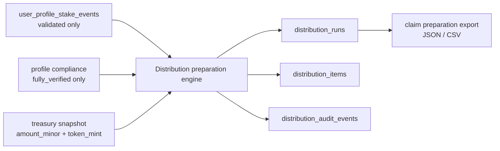

# implementation(feature): BRI-6 Stake-event reconciliation and distribution preparation service

## ES

## Estado
- Issue padre: `BRI-6`
- Rama de iniciativa: `initiative/bri-6-stake-event-reconciliation-distribution`
- Slice actual: `S01 - Spec`
- Artefacto base: `docs/features/feature-stake-event-reconciliation-distribution-preparation-bri-6.md`
- Este artefacto define el contrato de build, no ejecuta pagos.

## Objetivo técnico
Construir una preparación de distribución server-side, auditable e idempotente, basada en eventos validados de `user_profile_stake_events`.

La feature no introduce un programa Anchor ni cambia el flujo Stake / Unstake. Consume el resultado validado de BRI-5/BRI-170.

## Arquitectura v1

## Contratos de entrada

### Stake events
Fuente: `user_profile_stake_events`

Campos requeridos:

- `asset_address`
- `owner_wallet`
- `collection_address`
- `property_id`
- `product_action`
- `blockchain_action`
- `tx_signature`
- `instruction_index`
- `slot`
- `block_time`
- `observed_at`
- `validation_status`

Reglas:

- Solo `validation_status = 'validated'`.
- Orden estable: `COALESCE(block_time, observed_at)`, `slot`, `instruction_index`, `tx_signature`.
- Para finalizar, `block_time` debe estar disponible para todos los eventos incluidos en el período.

### Compliance
Fuente: perfil/KYC existente.

Reglas:

- Solo `compliance_status = 'fully_verified'` es elegible.
- La corrida guarda snapshot de compliance usado.
- Wallet excluida por compliance queda en auditoría.

### Treasury
Fuente v1:

- input server-side explícito `amount_minor`, `token_mint`, `treasury_source`, `treasury_reference`.

Reglas:

- `amount_minor` es entero string/BigInt compatible.
- No se usa floating point.
- Squads real puede integrarse en slice posterior si el contrato queda aprobado.

## Modelo de datos propuesto

### `distribution_runs`
- `id`
- `period_key`
- `period_start_at`
- `period_end_at`
- `period_timezone`
- `policy_version`
- `status`
  - `draft`
  - `blocked`
  - `finalized`
  - `failed`
- `token_mint`
- `total_amount_minor`
- `allocated_amount_minor`
- `rounding_remainder_minor`
- `total_eligible_seconds`
- `eligible_wallet_count`
- `eligible_asset_count`
- `blocked_reason`
- `output_checksum`
- `created_by`
- `finalized_by`
- `created_at`
- `updated_at`
- `finalized_at`

### `distribution_items`
- `id`
- `run_id`
- `wallet_public_key`
- `compliance_status_snapshot`
- `eligible_seconds`
- `asset_count`
- `amount_minor`
- `rounding_remainder_rank`
- `exclusion_reason`
- `item_payload`
- `created_at`

### `distribution_audit_events`
- `id`
- `run_id`
- `event_name`
- `actor_type`
- `actor_id`
- `event_payload`
- `created_at`

## Slice plan

| Slice | Branch | Scope | Tests first | Merge target |
| --- | --- | --- | --- | --- |
| S01 - Spec | `feature/shared-stake-event-distribution-bri-6-s01-spec` | Artifact pair, decisions, slice map, Linear sync | docs governance | `initiative/bri-6-stake-event-reconciliation-distribution` |
| S02 - Persistence | `feature/shared-stake-event-distribution-bri-6-s02-persistence` | SQL migration, repositories, status/idempotency constraints | repository tests + migration validation | initiative |
| S03 - Calculation Engine | `feature/shared-stake-event-distribution-bri-6-s03-engine` | pure interval and allocation engine | unit tests for intervals, pending events, rounding, KYC exclusion | initiative |
| S04 - Service/API | `feature/app-stake-event-distribution-bri-6-s04-service-api` | admin/server API to create draft, finalize, export | route/service tests | initiative |
| S05 - Admin UI | `feature/app-stake-event-distribution-bri-6-s05-admin-ui` | replace distribution mock data with real run reads and states | component/Playwright responsive tests | initiative |
| S06 - Initiative closeout | `feature/shared-stake-event-distribution-bri-6-s06-closeout` | full validate, docs sync, Linear, final PR to develop | full validation | develop |

## TDD plan

### S02 tests
- migration creates tables and constraints.
- repository creates idempotent draft by `period_key + policy_version`.
- repository prevents finalization without finalized data.
- audit event is append-only.

### S03 tests
- stake then unstake inside period counts exact seconds.
- stake before period and unstake inside period counts from `period_start_at`.
- unstake without prior stake does not infer frozen state.
- pending/reconcile events block finalization.
- wallet not `fully_verified` is excluded.
- allocation uses integer math and records remainder.
- repeated calculation produces identical output checksum.

### S04 tests
- unauthenticated/admin-missing request is rejected.
- create draft validates period and amount.
- finalize blocks when unresolved events exist.
- export returns deterministic JSON/CSV payload.

### S05 tests
- admin distribution console reads real runs.
- mobile table/card layout does not overflow.
- blocked/finalized/draft states are visually distinct.

## Security gates
- No client-provided wallet eligibility is trusted.
- No browser writes distribution results directly.
- Admin routes require server-side role check.
- Finalization requires explicit actor.
- Finalized runs are immutable.
- Money uses integer minor units only.
- Every block/exclusion/finalization has audit event.
- `npm run validate` and `validate:db` are mandatory before merge.

## Definition of Done
- Artifact pair committed in S01.
- Linear BRI-6 references initiative branch and slice plan.
- Each delivery slice starts with failing tests.
- Database changes have tracked migrations.
- `npm run validate` passes on each slice.
- Clean-code pass completed.
- Security review completed for persistence/API slices.
- Final initiative PR merges to `develop`.

## Estado de S01
- Estado: completado localmente, pendiente de PR hacia rama de iniciativa.
- Evidencia:
  - `npm run validate:docs-governance` - passed.
  - Linear BRI-6 sincronizado con rama de iniciativa, artefactos y slice plan.
- Pendiente:
  - PR de S01 hacia initiative branch.

## EN

## Status
- Parent issue: `BRI-6`
- Initiative branch: `initiative/bri-6-stake-event-reconciliation-distribution`
- Current slice: `S01 - Spec`
- Base artifact: `docs/features/feature-stake-event-reconciliation-distribution-preparation-bri-6.md`
- This artifact defines the build contract and does not execute payments.

## Technical Goal
Build an auditable, idempotent server-side distribution preparation flow based on validated `user_profile_stake_events`.

The feature does not introduce an Anchor program and does not change Stake / Unstake. It consumes the validated output from BRI-5/BRI-170.

## v1 Architecture

## Input Contracts

### Stake events
Source: `user_profile_stake_events`

Required fields:

- `asset_address`
- `owner_wallet`
- `collection_address`
- `property_id`
- `product_action`
- `blockchain_action`
- `tx_signature`
- `instruction_index`
- `slot`
- `block_time`
- `observed_at`
- `validation_status`

Rules:

- Only `validation_status = 'validated'`.
- Stable ordering: `COALESCE(block_time, observed_at)`, `slot`, `instruction_index`, `tx_signature`.
- To finalize, `block_time` must be available for every included event in the period.

### Compliance
Source: existing profile/KYC.

Rules:

- Only `compliance_status = 'fully_verified'` is eligible.
- The run stores the compliance snapshot used.
- Wallets excluded by compliance appear in audit.

### Treasury
v1 source:

- explicit server-side input: `amount_minor`, `token_mint`, `treasury_source`, `treasury_reference`.

Rules:

- `amount_minor` is an integer string/BigInt-compatible value.
- No floating point.
- Real Squads integration can be added in a later slice once this contract is approved.

## Proposed Data Model

### `distribution_runs`
- `id`
- `period_key`
- `period_start_at`
- `period_end_at`
- `period_timezone`
- `policy_version`
- `status`
  - `draft`
  - `blocked`
  - `finalized`
  - `failed`
- `token_mint`
- `total_amount_minor`
- `allocated_amount_minor`
- `rounding_remainder_minor`
- `total_eligible_seconds`
- `eligible_wallet_count`
- `eligible_asset_count`
- `blocked_reason`
- `output_checksum`
- `created_by`
- `finalized_by`
- `created_at`
- `updated_at`
- `finalized_at`

### `distribution_items`
- `id`
- `run_id`
- `wallet_public_key`
- `compliance_status_snapshot`
- `eligible_seconds`
- `asset_count`
- `amount_minor`
- `rounding_remainder_rank`
- `exclusion_reason`
- `item_payload`
- `created_at`

### `distribution_audit_events`
- `id`
- `run_id`
- `event_name`
- `actor_type`
- `actor_id`
- `event_payload`
- `created_at`

## Slice Plan

| Slice | Branch | Scope | Tests first | Merge target |
| --- | --- | --- | --- | --- |
| S01 - Spec | `feature/shared-stake-event-distribution-bri-6-s01-spec` | Artifact pair, decisions, slice map, Linear sync | docs governance | `initiative/bri-6-stake-event-reconciliation-distribution` |
| S02 - Persistence | `feature/shared-stake-event-distribution-bri-6-s02-persistence` | SQL migration, repositories, status/idempotency constraints | repository tests + migration validation | initiative |
| S03 - Calculation Engine | `feature/shared-stake-event-distribution-bri-6-s03-engine` | pure interval and allocation engine | unit tests for intervals, pending events, rounding, KYC exclusion | initiative |
| S04 - Service/API | `feature/app-stake-event-distribution-bri-6-s04-service-api` | admin/server API to create draft, finalize, export | route/service tests | initiative |
| S05 - Admin UI | `feature/app-stake-event-distribution-bri-6-s05-admin-ui` | replace distribution mock data with real run reads and states | component/Playwright responsive tests | initiative |
| S06 - Initiative closeout | `feature/shared-stake-event-distribution-bri-6-s06-closeout` | full validate, docs sync, Linear, final PR to develop | full validation | develop |

## TDD Plan

### S02 tests
- migration creates tables and constraints.
- repository creates idempotent draft by `period_key + policy_version`.
- repository prevents finalization without finalized data.
- audit event is append-only.

### S03 tests
- stake then unstake inside period counts exact seconds.
- stake before period and unstake inside period counts from `period_start_at`.
- unstake without prior stake does not infer frozen state.
- pending/reconcile events block finalization.
- wallet not `fully_verified` is excluded.
- allocation uses integer math and records remainder.
- repeated calculation produces identical output checksum.

### S04 tests
- unauthenticated/admin-missing request is rejected.
- create draft validates period and amount.
- finalize blocks when unresolved events exist.
- export returns deterministic JSON/CSV payload.

### S05 tests
- admin distribution console reads real runs.
- mobile table/card layout does not overflow.
- blocked/finalized/draft states are visually distinct.

## Security Gates
- No client-provided wallet eligibility is trusted.
- No browser writes distribution results directly.
- Admin routes require server-side role check.
- Finalization requires explicit actor.
- Finalized runs are immutable.
- Money uses integer minor units only.
- Every block/exclusion/finalization has audit event.
- `npm run validate` and `validate:db` are mandatory before merge.

## Definition of Done
- Artifact pair committed in S01.
- Linear BRI-6 references initiative branch and slice plan.
- Each delivery slice starts with failing tests.
- Database changes have tracked migrations.
- `npm run validate` passes on each slice.
- Clean-code pass completed.
- Security review completed for persistence/API slices.
- Final initiative PR merges to `develop`.

## S01 Status
- Status: completed locally, pending PR into the initiative branch.
- Evidence:
  - `npm run validate:docs-governance` - passed.
  - Linear BRI-6 synced with initiative branch, artifacts, and slice plan.
- Pending:
  - S01 PR into initiative branch.
