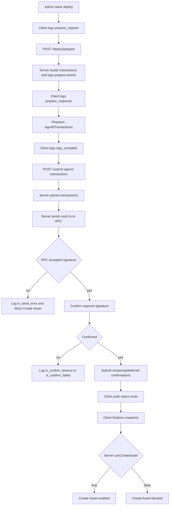

# Candy Machine Deploy Iteration: Current System Branch

## Purpose

Capture the current `/admin/assets/new` Core Candy Machine deploy system before implementing the next fix.

This iteration starts after PR `#294`, where detailed diagnostics were added but deploy semantics were intentionally left unchanged.

## Iteration Metadata

- Date: 2026-06-07
- Branch: `codex/fix-admin-cm-deploy-current-system`
- Base branch: `develop` after PR `#294`
- PR: pending
- Final merged PR: pending
- Related issue: no Linear issue assigned yet
- Human acceptance: pending
- Runtime target: devnet
- Scope: diagnose and fix the current Core Candy Machine deploy lifecycle

## Functional Baseline

The current system prepares all deploy transactions on the server, asks Phantom to sign them, submits signed transactions to the backend, sends each transaction through the configured Solana RPC, confirms required signatures, finalizes a server-side snapshot, and enables Create Asset only when `canCreateAsset: true`.

The current baseline includes detailed logs from PR `#294`, but it does not include retry, config-line recovery, pending deployment records, or relaxed snapshot gating.

## Observed State: 2026-06-07

This observation was made after a real devnet deploy attempt that ended in the UI with:

```text
Mint snapshot could not be verified. Create Asset remains blocked until the snapshot is finalized.
```

The UI also reported:

```text
Deploy confirmed, but mint snapshot is not ready.
```

### On-Chain Accounts

Collection:

- Address: `57U9nhAghgjmcChZhCqoCRbuNnX6AwgrRAkXE9RAXMdn`
- Exists on devnet: yes
- Owner program: `CoREENxT6tW1HoK8ypY1SxRMZTcVPm7R94rH4PZNhX7d`
- Metaplex Core decode: successful
- Name: `117 Fix Flip Brandon 117 Test 2`
- URI: `ipfs://QmceoYpmSrCTSNmjGR45yM7XT3SvrJe51HZm6qdHvNnKqM`
- Update authority: `3tW8Jp3QAMqY2KM27KgddizUyS7rvc7hEsbwCU8siATd`
- `numMinted`: `0`
- `currentSize`: `0`

Core Candy Machine:

- Address: `HftFBr7NZwH5iitTgBdh5iejEHqwe2T4PXAzhUGmZY4b`
- Exists on devnet: yes
- Owner program: `CMACYFENjoBMHzapRXyo1JZkVS6EtaDDzkjMrmQLvr4J`
- Metaplex Core Candy Machine decode: successful
- `collectionMint`: `57U9nhAghgjmcChZhCqoCRbuNnX6AwgrRAkXE9RAXMdn`
- `authority`: `3tW8Jp3QAMqY2KM27KgddizUyS7rvc7hEsbwCU8siATd`
- `mintAuthority`: `86mMViNda476Wi1RjPUMuG68WjVeMfD2YXbPxv7XsEUz`
- `itemsAvailable`: `200`
- `itemsLoaded`: `200`
- `itemsRedeemed`: `0`
- Candy Guard: present
- Candy Guard address: `86mMViNda476Wi1RjPUMuG68WjVeMfD2YXbPxv7XsEUz`
- Config line settings: present

Config line settings:

```json
{
  "prefixName": "Fix Flip Brandon 117 #",
  "nameLength": 3,
  "prefixUri": "ipfs://QmVjShNQL4R6WvVVVM72cULUxpNcuMJj3CCMxw5oRpSnBN",
  "uriLength": 0,
  "isSequential": true
}
```

### Confirmed Signatures

All deploy signatures below are finalized on devnet with no transaction error:

| Step | Signature | Expected account |
| --- | --- | --- |
| Create Core Collection | `4aoPEoU2Rzt63nGrRpwXYUm78ZVh6SWCnbnpjXtN7RWzk6iRnGj7tvjbJQq6e6sh6W2JMGV51GNGrmCS86tD2ipT` | `57U9nhAghgjmcChZhCqoCRbuNnX6AwgrRAkXE9RAXMdn` |
| Create Core Candy Machine + Guard | `3jJVELF54DW3aMQMRnszXXXofzV2N6hUhg5t5ZNd2sqBWDgQhrQwfbkHc97hwuzouDZM863dJj6DHggjDqG7jDv2` | `HftFBr7NZwH5iitTgBdh5iejEHqwe2T4PXAzhUGmZY4b` |
| Load config lines 1-48 | `3khUD16MW9m6kxMZNDWY2UTuaGLzys21zWspCsKAa9yuqktcLgrt2T2hkVedf6HaWxmvHafv71WhoLeHviLQrajm` | `HftFBr7NZwH5iitTgBdh5iejEHqwe2T4PXAzhUGmZY4b` |
| Load config lines 49-96 | `4rfEnxbY13gc7GUPnuq2gMp13HUaDwfe7hkGbbBAjRuFANWaxd79Br8cV8SHM6aD7Y8QskUzpNp2TGJfrNyGuf4x` | `HftFBr7NZwH5iitTgBdh5iejEHqwe2T4PXAzhUGmZY4b` |
| Load config lines 97-144 | `wBkv71uuQKMXySGP8VNX6AeQZDhTgoVnRnnQT8LE4gn3AwGjAByf7AQ9ViaRyDqwWusQCLkfz52aj3MB6GBw12R` | `HftFBr7NZwH5iitTgBdh5iejEHqwe2T4PXAzhUGmZY4b` |
| Load config lines 145-192 | `3pschgwq8RgwWW2kKzyyzqudGXLoTCZAxn3vYnKuzAJWs8yiadmFc3ruS6ALmGjLMhw1hBuWC4ASsg8tdNkemwcz` | `HftFBr7NZwH5iitTgBdh5iejEHqwe2T4PXAzhUGmZY4b` |
| Load config lines 193-200 | `21KW2EfwgqWhjg1VZhbZX9T3uTWLsNpJQjw1qkjXDDyEqEJmKDZREo5JmVa3G6FAAgG8SyPuMofrmeHQCvXLAMU9` | `HftFBr7NZwH5iitTgBdh5iejEHqwe2T4PXAzhUGmZY4b` |

### What Is Working

- Phantom signing produced valid transactions.
- The backend submitted all deploy transactions.
- RPC accepted and finalized all seven deploy signatures.
- The Core Collection exists and decodes successfully.
- The Core Candy Machine exists and decodes successfully.
- The Candy Guard exists.
- Config-line loading completed on-chain: `itemsLoaded` is `200` for expected quantity `200`.
- The on-chain Candy Machine points to the expected collection.

### What Is Not Working

- The app still reports the mint snapshot as not verified.
- Create Asset remains blocked even though the on-chain state now satisfies the current snapshot readiness rule.
- The current UI does not appear to recover from a snapshot finalization false negative after the Candy Machine state becomes readable.
- Server operability logs could not be inspected from shell because `/api/admin/monitoring/logs?limit=200` requires an admin `siws_session` cookie.
- Server stdout for the running `next-server` process was not attached to this Codex thread, so runtime console logs could not be read directly.

### Protected Working Modules

Do not change these in the next implementation slice unless new evidence proves they are failing:

- Deploy prepare: `app/api/admin/core-candy-machine/deploy/prepare/route.ts`
- Transaction assembly: `prepareCoreCandyMachineDeploy`
- Phantom signing mode: current `signAllTransactions` flow
- Submit route: `app/api/admin/core-candy-machine/submit/route.ts`
- RPC send and confirmation helpers: `sendRawTransactionWithRetry`, `waitForConfirmedSignature`
- Config-line chunking and load transaction construction
- Metaplex Core Collection creation
- Core Candy Machine + Guard creation
- Metaplex Core plugin assembly
- Create Asset security gate semantics

Reason: the observed devnet deploy proves these modules can produce finalized transactions and the expected on-chain state.

### Target Area For Fix

The fix should target only snapshot/handoff recovery:

- UI state after snapshot finalization returns `canCreateAsset: false`
- re-running server-side snapshot finalization for the same deploy
- keeping Create Asset disabled until server verification succeeds

The fix must not:

- prepare new deploy transactions,
- ask Phantom to sign again,
- submit new deploy transactions,
- create another collection,
- create another Candy Machine,
- reload config lines,
- set `snapshotId` manually,
- enable Create Asset from client state.

### Current Diagnosis

The deploy itself is not the failing subsystem for this observed attempt. The failing subsystem is the post-deploy snapshot/handoff path.

Given the current code in `lib/core-candy-machine-snapshot-service.ts`, a snapshot should be eligible for `canCreateAsset: true` when:

- deploy proofs resolve to completed,
- collection address matches the Candy Machine `collectionMint`,
- `itemsAvailable` equals requested quantity,
- `itemsLoaded` equals requested quantity.

All on-chain conditions are true for this deploy now. Therefore the current failure is most likely one of:

- snapshot finalization ran before RPC exposed `itemsLoaded=200` and the app did not provide a safe retry/re-finalize path,
- the snapshot finalization request used incomplete or stale payload data,
- the finalized failed snapshot state persisted and the UI did not re-run or replace it after on-chain state became ready,
- the UI message is reflecting an earlier failure even though the current on-chain state is now valid.

## Proposed Fix For This Branch

Add a snapshot-only recovery path in the admin UI.

When the deploy is confirmed but snapshot finalization returns `canCreateAsset: false`, the UI should keep the confirmed deploy context and show a recoverable state. The recovery action should call `/api/admin/core-candy-machine/snapshot/finalize` again with the same:

- draft id,
- form snapshot,
- quantity,
- collection address,
- Candy Machine address,
- deploy signatures.

If the server now reads `itemsLoaded === quantity` and validates the rest of the snapshot invariants, it returns `canCreateAsset: true` and the existing Create Asset gate can open.

This path is safe because it asks the server to verify again. It does not let the client assert verification.

## Slice Plan For This Branch

1. Documentation guardrails
   - Current status: done.
   - Confirmed what is working and what must not be touched.

2. Snapshot recovery state
   - Touch: `components/admin/core-candy-machine-panel.tsx`.
   - Add state for a failed-but-recoverable snapshot after confirmed deploy.
   - Preserve the exact deploy context needed to re-run snapshot finalization.

3. Re-check snapshot action
   - Touch: `components/admin/core-candy-machine-panel.tsx`.
   - Call the existing snapshot finalize route.
   - Do not call prepare, sign, submit, or config-line load.

4. Verification and tests
   - Add tests that `Re-check snapshot` enables Create Asset only after `canCreateAsset: true`.
   - Add tests that re-check does not trigger deploy or wallet signing.
   - Run targeted tests and `npm run validate`.

## Implementation Snapshot

Frontend:

- File: `components/admin/core-candy-machine-panel.tsx`
- Responsibility: admin deploy state, metadata preparation, wallet signing, submit request, status polling, snapshot finalization, and Create Asset gate display.
- Notable state transitions: prepare request, prepare response, signing, submit request, submit response, status polling, snapshot finalization, success or recoverable error.

Prepare route:

- File: `app/api/admin/core-candy-machine/deploy/prepare/route.ts`
- Responsibility: receives deploy payload and returns a prepared transaction bundle.
- Inputs: quantity, metadata URIs, guard/payment settings, admin wallet context.
- Outputs: `deployId`, collection address, Candy Machine address, prepared transactions, transaction metadata.

Submit route:

- File: `app/api/admin/core-candy-machine/submit/route.ts`
- Responsibility: receives signed transactions and forwards them to the server submit pipeline.
- Inputs: signed transactions and optional `deployId` for trace correlation.
- Outputs: submitted signatures and transaction metadata.

Core deploy service:

- File: `lib/core-candy-machine-admin.ts`
- Responsibility: builds Core Collection, Core Candy Machine, guard, and config-line transactions; submits signed transactions; confirms signatures.
- Important functions: `prepareCoreCandyMachineDeploy`, `submitCoreCandyMachineSignedTransactions`, `sendRawTransactionWithRetry`, `waitForConfirmedSignature`, `emitCoreCandyMachineDeployLog`.

Snapshot/finalize:

- File: `lib/core-candy-machine-snapshot-service.ts`
- Responsibility: reads Candy Machine state and decides whether Create Asset can be enabled.
- Gate condition: Create Asset remains blocked unless the server verifies snapshot readiness and returns `canCreateAsset: true`.

Observability:

- Files: `lib/core-candy-machine-admin.ts`, `components/admin/core-candy-machine-panel.tsx`, `lib/observability/store.ts`, `app/api/admin/monitoring/logs/route.ts`
- Runtime log location: server console, browser console, and in-memory admin operability logs.
- Markdown memory location: this file.

## Current Log Surfaces

Server JSON logs:

- Prefix: `core_candy_machine.deploy.*`
- Console: `console.warn` for info/warn and `console.error` for errors.
- Store: `recordOperabilityLog`.

Client JSON logs:

- Prefix: `core_candy_machine.deploy.client.*`
- Console: browser `console.info`.
- Store: browser console only.

Admin monitoring:

- Route: `GET /api/admin/monitoring/logs?limit=200`
- Scope: server-side operability logs only.
- Limitation: in-memory buffer, not durable across server restarts.

## Expected Event Sequence

Prepare:

1. `core_candy_machine.deploy.client.prepare_request`
2. `core_candy_machine.deploy.prepare_start`
3. `core_candy_machine.deploy.prepare_blockhash`
4. `core_candy_machine.deploy.prepare_accounts`
5. `core_candy_machine.deploy.config_line_plan`
6. `core_candy_machine.deploy.transaction_prepared`
7. `core_candy_machine.deploy.prepare_complete`
8. `core_candy_machine.deploy.client.prepare_response`

Signing:

1. `core_candy_machine.deploy.client.sign_start`
2. `core_candy_machine.deploy.client.sign_complete`

Submit and confirmation:

1. `core_candy_machine.deploy.client.submit_request`
2. `core_candy_machine.deploy.submit_start`
3. `core_candy_machine.deploy.tx_parse_start`
4. `core_candy_machine.deploy.tx_parsed`
5. `core_candy_machine.deploy.tx_send_attempt`
6. `core_candy_machine.deploy.tx_send_accepted`
7. `core_candy_machine.deploy.tx_confirm_start`
8. `core_candy_machine.deploy.tx_confirm_status`
9. `core_candy_machine.deploy.tx_confirm_ok`
10. `core_candy_machine.deploy.submit_complete`
11. `core_candy_machine.deploy.client.submit_response`

Post-submit:

1. `core_candy_machine.deploy.client.status_poll_complete`
2. `core_candy_machine.deploy.client.snapshot_finalize_response`

## Flow Diagram



## Transaction Assembly

Deploy transaction order:

1. Create Core Collection.
2. Create Core Candy Machine and Guard.
3. Load config lines in chunks.

Create Core Collection:

- Builder: server-side Core Collection builder in `prepareCoreCandyMachineDeploy`.
- Required signers: admin payer and generated collection signer.
- Confirmation: structural, immediate.
- Expected state: collection account exists.
- Failure meaning: Candy Machine and config lines do not exist yet.

Create Core Candy Machine and Guard:

- Builder: server-side Core Candy Machine builder in `prepareCoreCandyMachineDeploy`.
- Required signers: admin payer and generated Candy Machine signer.
- Confirmation: structural, immediate.
- Expected state: Candy Machine account exists and guard is configured.
- Failure meaning: snapshot and config-line recovery cannot proceed until this exists.

Load config lines:

- Builder: server-side chunking loop in `prepareCoreCandyMachineDeploy`.
- Required signers: admin payer and Candy Machine authority context.
- Confirmation: can be deferred after structural transactions.
- Expected state: Candy Machine `itemsLoaded` reaches expected quantity.
- Failure meaning: Candy Machine may exist but is incomplete.

## Metaplex Core Plugins

PermanentFreezeDelegate:

- Level: collection-level permanent plugin.
- Creation point: collection or asset creation path.
- Authority model: permanent freeze authority configured at creation.
- Why it exists: collection-level freeze control.
- Security concern: do not confuse with owner-managed per-asset freeze behavior.

PermanentTransferDelegate:

- Level: collection-level permanent plugin.
- Creation point: collection or asset creation path.
- Authority model: permanent transfer authority.
- Why it exists: controlled transfer authority.
- Security concern: changes transfer authority semantics and must be intentional.

FreezeDelegate:

- Level: asset-level plugin.
- Creation point: after an asset exists.
- Authority model: owner-managed asset freeze authority for Stake/Unstake semantics.
- Why it exists: supports asset-level freeze behavior.
- Security concern: cannot be applied during Candy Machine deploy before minted assets exist.

AppData external plugin adapter:

- Level: asset-level external plugin adapter.
- Creation point: after mint or asset creation.
- Authority model: application-controlled app data.
- Why it exists: attaches economic or marketplace data to a Core asset.
- Security concern: app data must be server-verified before marketplace activation.

## Security Contract

Allowed diagnostics:

- public keys
- signatures
- transaction kind and index
- serialized byte length
- signer count
- instruction count
- RPC host
- blockhash and last valid block height
- confirmation status and error summary

Forbidden diagnostics:

- private keys
- wallet secrets
- auth headers
- cookies
- request bodies
- full signed transaction payloads
- full transaction base64

Client-provided correlation ids must not authorize, verify, or unblock Create Asset.

## What Changed In This Iteration

- Created this branch-level current-system snapshot.
- No deploy behavior has been changed yet in this branch.

## What Did Not Work

No new attempt has been made in this branch yet.

Carryover lessons:

- Longer snapshot waits did not solve failures that occur before snapshot finalization.
- Config-line recovery cannot work if the Candy Machine account was never created.
- Client-triggered recovery must still rely on server-side RPC proof before unblocking Create Asset.

## Manual Test Record

### 2026-06-07: Deploy Confirmed, Snapshot Blocked

```text
Date: 2026-06-07
Wallet: 3tW8Jp3QAMqY2KM27KgddizUyS7rvc7hEsbwCU8siATd
Quantity: 200
RPC host: api.devnet.solana.com
Deploy id: not available from shell evidence
Collection: 57U9nhAghgjmcChZhCqoCRbuNnX6AwgrRAkXE9RAXMdn
Candy Machine: HftFBr7NZwH5iitTgBdh5iejEHqwe2T4PXAzhUGmZY4b
Signatures: 7 deploy signatures, all finalized with no err
Final UI message: Mint snapshot could not be verified. Create Asset remains blocked until the snapshot is finalized.
Last successful log event: not available from shell; admin/browser logs require session or attached server stdout
First failing log event: not available from shell
Conclusion: deploy and config lines are complete on-chain; failure is snapshot/handoff false negative or stale failed snapshot state
Next action: add or use a server-verified snapshot re-finalize path that re-reads the same Candy Machine and enables Create Asset only after server-side RPC proof
```

```text
Date:
Wallet:
Quantity:
RPC host:
Deploy id:
Collection:
Candy Machine:
Signatures:
Final UI message:
Last successful log event:
First failing log event:
Conclusion:
Next action:
```

## Open Questions

- Which event is the last successful event in the next failed deploy?
- Does every prepared transaction reach `tx_send_attempt`?
- Which transactions reach `tx_send_accepted`?
- Does the failing deploy have a Candy Machine account on-chain?
- Does the failure happen before status polling or before snapshot finalization?
