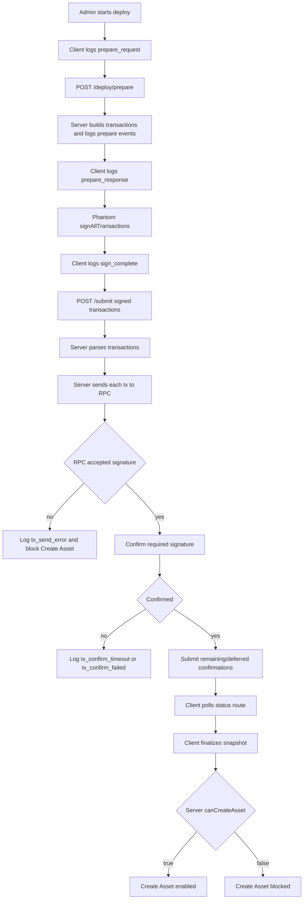

# Candy Machine Deploy Iteration: Current System Branch

## Purpose

Capture the current `/admin/assets/new` Core Candy Machine deploy system before implementing the next fix.

This iteration starts after PR `#294`, where detailed diagnostics were added but deploy semantics were intentionally left unchanged.

## Iteration Metadata

- Date: 2026-06-07
- Branch: `codex/fix-admin-cm-deploy-current-system`
- Base branch: `develop` after PR `#294`
- PR: pending
- Final merged PR: pending
- Related issue: no Linear issue assigned yet
- Human acceptance: pending
- Runtime target: devnet
- Scope: diagnose and fix the current Core Candy Machine deploy lifecycle

## Functional Baseline

The current system prepares all deploy transactions on the server, asks Phantom to sign them, submits signed transactions to the backend, sends each transaction through the configured Solana RPC, confirms required signatures, finalizes a server-side snapshot, and enables Create Asset only when `canCreateAsset: true`.

The current baseline includes detailed logs from PR `#294`, but it does not include retry, config-line recovery, pending deployment records, or relaxed snapshot gating.

## Implementation Snapshot

Frontend:

- File: `components/admin/core-candy-machine-panel.tsx`
- Responsibility: admin deploy state, metadata preparation, wallet signing, submit request, status polling, snapshot finalization, and Create Asset gate display.
- Notable state transitions: prepare request, prepare response, signing, submit request, submit response, status polling, snapshot finalization, success or recoverable error.

Prepare route:

- File: `app/api/admin/core-candy-machine/deploy/prepare/route.ts`
- Responsibility: receives deploy payload and returns a prepared transaction bundle.
- Inputs: quantity, metadata URIs, guard/payment settings, admin wallet context.
- Outputs: `deployId`, collection address, Candy Machine address, prepared transactions, transaction metadata.

Submit route:

- File: `app/api/admin/core-candy-machine/submit/route.ts`
- Responsibility: receives signed transactions and forwards them to the server submit pipeline.
- Inputs: signed transactions and optional `deployId` for trace correlation.
- Outputs: submitted signatures and transaction metadata.

Core deploy service:

- File: `lib/core-candy-machine-admin.ts`
- Responsibility: builds Core Collection, Core Candy Machine, guard, and config-line transactions; submits signed transactions; confirms signatures.
- Important functions: `prepareCoreCandyMachineDeploy`, `submitCoreCandyMachineSignedTransactions`, `sendRawTransactionWithRetry`, `waitForConfirmedSignature`, `emitCoreCandyMachineDeployLog`.

Snapshot/finalize:

- File: `lib/core-candy-machine-snapshot-service.ts`
- Responsibility: reads Candy Machine state and decides whether Create Asset can be enabled.
- Gate condition: Create Asset remains blocked unless the server verifies snapshot readiness and returns `canCreateAsset: true`.

Observability:

- Files: `lib/core-candy-machine-admin.ts`, `components/admin/core-candy-machine-panel.tsx`, `lib/observability/store.ts`, `app/api/admin/monitoring/logs/route.ts`
- Runtime log location: server console, browser console, and in-memory admin operability logs.
- Markdown memory location: this file.

## Current Log Surfaces

Server JSON logs:

- Prefix: `core_candy_machine.deploy.*`
- Console: `console.warn` for info/warn and `console.error` for errors.
- Store: `recordOperabilityLog`.

Client JSON logs:

- Prefix: `core_candy_machine.deploy.client.*`
- Console: browser `console.info`.
- Store: browser console only.

Admin monitoring:

- Route: `GET /api/admin/monitoring/logs?limit=200`
- Scope: server-side operability logs only.
- Limitation: in-memory buffer, not durable across server restarts.

## Expected Event Sequence

Prepare:

1. `core_candy_machine.deploy.client.prepare_request`
2. `core_candy_machine.deploy.prepare_start`
3. `core_candy_machine.deploy.prepare_blockhash`
4. `core_candy_machine.deploy.prepare_accounts`
5. `core_candy_machine.deploy.config_line_plan`
6. `core_candy_machine.deploy.transaction_prepared`
7. `core_candy_machine.deploy.prepare_complete`
8. `core_candy_machine.deploy.client.prepare_response`

Signing:

1. `core_candy_machine.deploy.client.sign_start`
2. `core_candy_machine.deploy.client.sign_complete`

Submit and confirmation:

1. `core_candy_machine.deploy.client.submit_request`
2. `core_candy_machine.deploy.submit_start`
3. `core_candy_machine.deploy.tx_parse_start`
4. `core_candy_machine.deploy.tx_parsed`
5. `core_candy_machine.deploy.tx_send_attempt`
6. `core_candy_machine.deploy.tx_send_accepted`
7. `core_candy_machine.deploy.tx_confirm_start`
8. `core_candy_machine.deploy.tx_confirm_status`
9. `core_candy_machine.deploy.tx_confirm_ok`
10. `core_candy_machine.deploy.submit_complete`
11. `core_candy_machine.deploy.client.submit_response`

Post-submit:

1. `core_candy_machine.deploy.client.status_poll_complete`
2. `core_candy_machine.deploy.client.snapshot_finalize_response`

## Flow Diagram



## Transaction Assembly

Deploy transaction order:

1. Create Core Collection.
2. Create Core Candy Machine and Guard.
3. Load config lines in chunks.

Create Core Collection:

- Builder: server-side Core Collection builder in `prepareCoreCandyMachineDeploy`.
- Required signers: admin payer and generated collection signer.
- Confirmation: structural, immediate.
- Expected state: collection account exists.
- Failure meaning: Candy Machine and config lines do not exist yet.

Create Core Candy Machine and Guard:

- Builder: server-side Core Candy Machine builder in `prepareCoreCandyMachineDeploy`.
- Required signers: admin payer and generated Candy Machine signer.
- Confirmation: structural, immediate.
- Expected state: Candy Machine account exists and guard is configured.
- Failure meaning: snapshot and config-line recovery cannot proceed until this exists.

Load config lines:

- Builder: server-side chunking loop in `prepareCoreCandyMachineDeploy`.
- Required signers: admin payer and Candy Machine authority context.
- Confirmation: can be deferred after structural transactions.
- Expected state: Candy Machine `itemsLoaded` reaches expected quantity.
- Failure meaning: Candy Machine may exist but is incomplete.

## Metaplex Core Plugins

PermanentFreezeDelegate:

- Level: collection-level permanent plugin.
- Creation point: collection or asset creation path.
- Authority model: permanent freeze authority configured at creation.
- Why it exists: collection-level freeze control.
- Security concern: do not confuse with owner-managed per-asset freeze behavior.

PermanentTransferDelegate:

- Level: collection-level permanent plugin.
- Creation point: collection or asset creation path.
- Authority model: permanent transfer authority.
- Why it exists: controlled transfer authority.
- Security concern: changes transfer authority semantics and must be intentional.

FreezeDelegate:

- Level: asset-level plugin.
- Creation point: after an asset exists.
- Authority model: owner-managed asset freeze authority for Stake/Unstake semantics.
- Why it exists: supports asset-level freeze behavior.
- Security concern: cannot be applied during Candy Machine deploy before minted assets exist.

AppData external plugin adapter:

- Level: asset-level external plugin adapter.
- Creation point: after mint or asset creation.
- Authority model: application-controlled app data.
- Why it exists: attaches economic or marketplace data to a Core asset.
- Security concern: app data must be server-verified before marketplace activation.

## Security Contract

Allowed diagnostics:

- public keys
- signatures
- transaction kind and index
- serialized byte length
- signer count
- instruction count
- RPC host
- blockhash and last valid block height
- confirmation status and error summary

Forbidden diagnostics:

- private keys
- wallet secrets
- auth headers
- cookies
- request bodies
- full signed transaction payloads
- full transaction base64

Client-provided correlation ids must not authorize, verify, or unblock Create Asset.

## What Changed In This Iteration

- Created this branch-level current-system snapshot.
- No deploy behavior has been changed yet in this branch.

## What Did Not Work

No new attempt has been made in this branch yet.

Carryover lessons:

- Longer snapshot waits did not solve failures that occur before snapshot finalization.
- Config-line recovery cannot work if the Candy Machine account was never created.
- Client-triggered recovery must still rely on server-side RPC proof before unblocking Create Asset.

## Manual Test Record

No manual deploy test has been recorded for this branch yet.

```text
Date:
Wallet:
Quantity:
RPC host:
Deploy id:
Collection:
Candy Machine:
Signatures:
Final UI message:
Last successful log event:
First failing log event:
Conclusion:
Next action:
```

## Open Questions

- Which event is the last successful event in the next failed deploy?
- Does every prepared transaction reach `tx_send_attempt`?
- Which transactions reach `tx_send_accepted`?
- Does the failing deploy have a Candy Machine account on-chain?
- Does the failure happen before status polling or before snapshot finalization?
