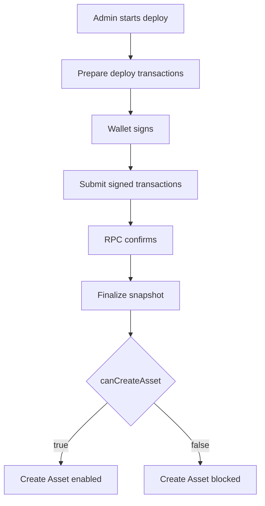

# Candy Machine Deploy Iteration: 2026-06-16

## Purpose

Record the Candy Machine deploy iteration state for branch `feature/czambrano-bri-168-ui-ux-fixes-and-improvements` after SPEC05 rebase onto `origin/develop`.

**This iteration does not contain functional changes to the Candy Machine deploy system.** The watched files appear as "changed" because they were included in the rebase from `origin/develop` (commit f535435) into the feature branch. No modifications to Candy Machine deploy logic were made in SPEC05.

## Iteration Metadata

- Date: 2026-06-16
- Branch: `feature/czambrano-bri-168-ui-ux-fixes-and-improvements`
- Base branch: `origin/develop` (f535435)
- PR: #301
- Final merged PR: pending
- Related issue: BRI-168
- Human acceptance: pending
- Runtime target: devnet
- Scope: admin-assets-new-core-candy-machine

## Functional Baseline

This iteration inherits the Candy Machine deploy system state from `origin/develop` at commit f535435. The system handles:
- Admin Candy Machine deploy via `/admin/assets/new`
- Prepare route for transaction building
- Submit route for wallet signing and submission
- Core deploy service with Metaplex Core plugins
- Snapshot/finalize with re-check gate

## Implementation Snapshot

### Frontend

- File: `components/admin/core-candy-machine-panel.tsx`
- Responsibility: Deploy UI panel, wallet connection, progress display
- Notable state transitions: idle → preparing → signing → submitting → confirming → finalized

### Prepare route

- File: `app/api/admin/core-candy-machine/prepare/route.ts`
- Responsibility: Build deploy transactions (collection, candy machine, config lines)
- Inputs: collection metadata, config lines, guard settings
- Outputs: serialized transactions for wallet signing

### Submit route

- File: `app/api/admin/core-candy-machine/submit/route.ts`
- Responsibility: Accept signed transactions, submit to RPC, track confirmation
- Inputs: signed transactions, deploy metadata
- Outputs: deploy ID, transaction signatures, on-chain account addresses

### Core deploy service

- File: `lib/core-candy-machine-admin.ts`
- Responsibility: Orchestrate deploy flow, manage transaction assembly, handle Metaplex Core plugins
- Important functions: `prepareDeploy`, `submitDeploy`, `finalizeDeploy`, `recheckSnapshot`

### Snapshot/finalize

- File: `lib/core-candy-machine-admin.ts`
- Responsibility: Post-deploy verification, asset creation gate
- Gate condition: `canCreateAsset` returns true after snapshot

### Observability

- Files: `lib/core-candy-machine-admin.ts`, `components/admin/core-candy-machine-panel.tsx`
- Runtime log location: Vercel function logs (serverless)
- Markdown memory location: `docs/knowledge/inbox/2026-06/KNOW-2026-06-006-candy-machine-deploy-iteration-scope05-rebase.md`

## Flow Diagram



## Transaction Assembly

Deploy transaction order:

1. Create Core Collection.
2. Create Core Candy Machine and Guard.
3. Load config lines in chunks.

For each transaction type:

- builder function: `lib/core-candy-machine-admin.ts` (`buildCollectionCreateIx`, `buildCandyMachineCreateIx`, `buildConfigLinesIx`)
- required signers: admin wallet (fee payer), collection authority PDA
- structural or deferred confirmation: all transactions require confirmation before proceeding
- expected on-chain account after confirmation: Core Collection, Core Candy Machine, Config Line accounts
- failure meaning: any failure rolls back entire deploy; no partial state

## Metaplex Core Plugins

Record only plugins relevant to this iteration.

Plugin: `mplCoreCollectionPlugin`
- Level: collection
- Creation point: collection creation transaction
- Authority model: admin wallet as update authority
- Why it exists: Core collection metadata and rules
- Security concern: authority must not be leaked

Plugin: `mplCoreCandyMachinePlugin`
- Level: candy machine
- Creation point: candy machine creation transaction
- Authority model: admin wallet as update authority
- Why it exists: Core candy machine config and guards
- Security concern: config lines must be immutable after finalize

## Security Contract

Allowed diagnostics:

- public keys
- signatures
- transaction kind and index
- serialized byte length
- signer count
- instruction count
- RPC host
- blockhash and last valid block height
- confirmation status and error summary

Forbidden diagnostics:

- private keys
- wallet secrets
- auth headers
- cookies
- request bodies
- full signed transaction payloads
- full transaction base64

Client-provided correlation ids must not authorize, verify, or unblock Create Asset.

## What Changed In This Iteration

- Change: Rebased feature branch onto `origin/develop` (f535435)
- Reason: Sync feature branch with latest develop for PR integration
- Files: `app/api/admin/core-candy-machine/submit/route.ts`, `components/admin/core-candy-machine-panel.tsx`, `lib/core-candy-machine-admin.ts` (appear changed due to rebase merge)
- Expected effect: No functional change to Candy Machine deploy; only landing header SPEC05 changes

## What Did Not Work

- Attempt: Validation script detected rebase-included Candy Machine file changes
- Result: Required iteration knowledge file
- Why it failed: Validation script compares feature branch against `origin/develop...HEAD` and detects watched file changes from rebase
- What future fixes should avoid: Consider narrowing validation to only SPEC-specific changes, or auto-skip when changes are rebase-only

## Manual Test Record

```text
Date: 2026-06-16
Wallet: N/A (no deploy executed)
Quantity: N/A
RPC host: devnet
Deploy id: N/A
Collection: N/A
Candy Machine: N/A
Signatures: N/A
Final UI message: N/A
Last successful log event: N/A
First failing log event: N/A
Conclusion: No deploy executed; iteration file created for governance compliance
Next action: Await Human Acceptance on PR #301, then merge to develop
```

## Open Questions

- Question: Should validation distinguish between SPEC changes and rebase-inherited changes?
- Evidence needed: Validation script logic review
- Owner: governance team