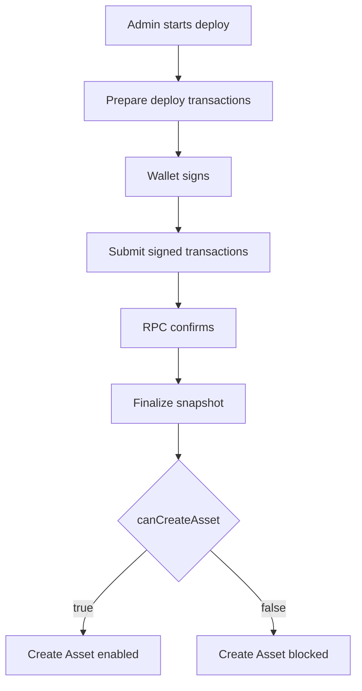

# Candy Machine Deploy Iteration: YYYY-MM-DD

## Purpose

Record one implementation snapshot of the `/admin/assets/new` Candy Machine deploy system.

This file should explain what the system does in this iteration, why it does it that way, what changed, what failed, and how future debugging should read the state.

## Iteration Metadata

- Date:
- Branch:
- Base branch:
- PR:
- Final merged PR:
- Related issue:
- Human acceptance:
- Runtime target: devnet
- Scope:

## Functional Baseline

Describe the previous behavior this iteration starts from.

## Implementation Snapshot

Frontend:

- File:
- Responsibility:
- Notable state transitions:

Prepare route:

- File:
- Responsibility:
- Inputs:
- Outputs:

Submit route:

- File:
- Responsibility:
- Inputs:
- Outputs:

Core deploy service:

- File:
- Responsibility:
- Important functions:

Snapshot/finalize:

- File:
- Responsibility:
- Gate condition:

Observability:

- Files:
- Runtime log location:
- Markdown memory location:

## Flow Diagram



## Transaction Assembly

Deploy transaction order:

1. Create Core Collection.
2. Create Core Candy Machine and Guard.
3. Load config lines in chunks.

For each transaction type, record:

- builder function
- required signers
- structural or deferred confirmation
- expected on-chain account after confirmation
- failure meaning

## Metaplex Core Plugins

Record only plugins relevant to this iteration.

Plugin:

- Level: collection, asset, external adapter, or guard-adjacent
- Creation point:
- Authority model:
- Why it exists:
- Security concern:

## Security Contract

Allowed diagnostics:

- public keys
- signatures
- transaction kind and index
- serialized byte length
- signer count
- instruction count
- RPC host
- blockhash and last valid block height
- confirmation status and error summary

Forbidden diagnostics:

- private keys
- wallet secrets
- auth headers
- cookies
- request bodies
- full signed transaction payloads
- full transaction base64

Client-provided correlation ids must not authorize, verify, or unblock Create Asset.

## What Changed In This Iteration

- Change:
- Reason:
- Files:
- Expected effect:

## What Did Not Work

- Attempt:
- Result:
- Why it failed:
- What future fixes should avoid:

## Manual Test Record

```text
Date:
Wallet:
Quantity:
RPC host:
Deploy id:
Collection:
Candy Machine:
Signatures:
Final UI message:
Last successful log event:
First failing log event:
Conclusion:
Next action:
```

## Open Questions

- Question:
- Evidence needed:
- Owner:
