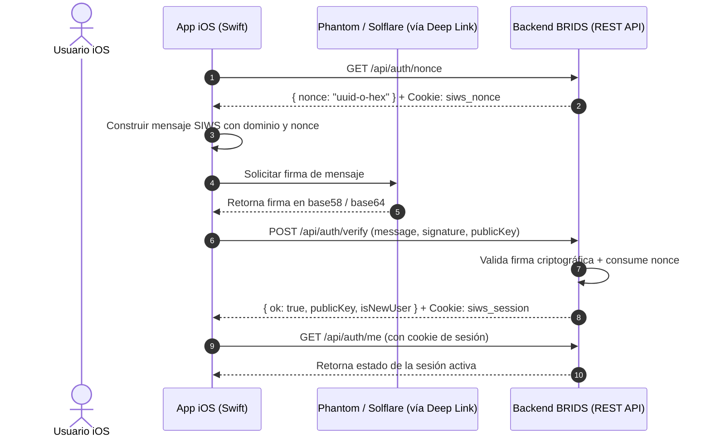

# 📱 BRIDS — Guía Exhaustiva de Integración de API para iOS

Esta guía proporciona la especificación técnica completa y los contratos de datos de las **REST APIs** expuestas por la plataforma BRIDS (basadas en el PR #327 / arquitectura FDD monorepo), diseñada para que el equipo de iOS pueda construir la aplicación nativa en **Swift / SwiftUI** consumiendo directamente todos los servicios.

---

## 📑 Tabla de Contenidos
1. [Arquitectura de Comunicación & Convenciones](#1-arquitectura-de-comunicación--convenciones)
2. [Flujo de Autenticación SIWS (Sign In With Solana)](#2-flujo-de-autenticación-siws-sign-in-with-solana)
3. [Catálogo Inmobiliario & Datos Públicos](#3-catálogo-inmobiliario--datos-públicos)
4. [Flujo Transaccional de Compra On-Chain (Purchase Flow)](#4-flujo-transaccional-de-compra-on-chain-purchase-flow)
5. [Área Protegida del Inversor (`/api/protected/*`)](#5-área-protegida-del-inversor-apiprotected)
6. [Staking & Rendimientos Inmobiliarios](#6-staking--rendimientos-inmobiliarios)
7. [Reclamo de Dividendos / Rentas (Claims)](#7-reclamo-de-dividendos--rentas-claims)
8. [Verificación de Identidad KYC](#8-verificación-de-identidad-kyc)
9. [Programa de Referidos](#9-programa-de-referidos)
10. [Estructura de Errores & Trazabilidad (`x-flow-id`)](#10-estructura-de-errores--trazabilidad-x-flow-id)

---

## 1. Arquitectura de Comunicación & Convenciones

* **Protocolo:** HTTP/2 y HTTPS sobre REST.
* **Formato:** `application/json` en todas las solicitudes y respuestas.
* **Codificación:** UTF-8.
* **Manejo de Sesiones:** Basado en cookies HTTP-only (`siws_session`). `URLSession` en iOS persiste y envía estas cookies automáticamente a través de `HTTPCookieStorage.shared`.
* **Ambientes (Base URLs):**
  * **QA / Preview (develop):** `https://qa.brids.io`
  * **Release Candidate (RC):** `https://rc.brids.io`
  * **Producción:** `https://brids.io` (y `https://www.brids.io`)
  * **Desarrollo Local:** `http://localhost:3001` (o la IP local del Mac en simulador)
* **Cabeceras Estándar:**
  ```http
  Content-Type: application/json
  Accept: application/json
  x-flow-id: <UUIDv4>  (Opcional, recomendado para trazabilidad de compras y errores)
  ```

---

## 2. Flujo de Autenticación SIWS (Sign In With Solana)

El acceso a las rutas protegidas no utiliza contraseñas ni tokens estáticos, sino el estándar criptográfico **SIWS**.



### 2.1 Obtener Nonce
* **Endpoint:** `GET /api/auth/nonce`
* **Autenticación:** Ninguna.
* **Respuesta Exitosa (200 OK):**
  ```json
  {
    "nonce": "a7b3c4d5-e6f7-8901-abcd-ef1234567890"
  }
  ```
  *(El backend adjunta automáticamente la cookie `siws_nonce` en la respuesta).*

### 2.2 Verificar Firma y Crear Sesión
* **Endpoint:** `POST /api/auth/verify`
* **Autenticación:** Ninguna (valida nonce previo).
* **Cuerpo de la Petición (Request Body):**
  ```json
  {
    "message": "brids.io wants you to sign in with your Solana account:\n9WzDXwBbmkg8ZTbNmqUxvQRAyrZzDsGYdLVL9zYtAWWM\n\nSign in to BRIDS\n\nURI: https://brids.io\nVersion: 1\nChain ID: devnet\nNonce: a7b3c4d5-e6f7-8901-abcd-ef1234567890\nIssued At: 2026-08-16T13:30:00.000Z",
    "signature": "3wZ7x... (base58 o base64)",
    "publicKey": "9WzDXwBbmkg8ZTbNmqUxvQRAyrZzDsGYdLVL9zYtAWWM",
    "referralCode": "INVITE123" 
  }
  ```
  *(Campos opcionales: `referralCode`, `attributionSource`, `attributionMetadata`).*
* **Respuesta Exitosa (200 OK):**
  ```json
  {
    "ok": true,
    "publicKey": "9WzDXwBbmkg8ZTbNmqUxvQRAyrZzDsGYdLVL9zYtAWWM",
    "isNewUser": false,
    "referralBindingOutcome": "skipped_existing_wallet"
  }
  ```
  *(El backend adjunta la cookie de sesión `siws_session`).*

### 2.3 Consultar Sesión Activa
* **Endpoint:** `GET /api/auth/me`
* **Autenticación:** Cookie `siws_session`.
* **Respuesta Exitosa (200 OK):**
  ```json
  {
    "authenticated": true,
    "pubkey": "9WzDXwBbmkg8ZTbNmqUxvQRAyrZzDsGYdLVL9zYtAWWM",
    "role": "user",
    "authMethod": "siws",
    "walletPublicKey": "9WzDXwBbmkg8ZTbNmqUxvQRAyrZzDsGYdLVL9zYtAWWM",
    "sessionConflict": false
  }
  ```

### 2.4 Cerrar Sesión
* **Endpoint:** `POST /api/auth/logout`
* **Autenticación:** Cookie `siws_session`.
* **Respuesta Exitosa (200 OK):**
  ```json
  {
    "ok": true,
    "cleared": true
  }
  ```

---

## 3. Catálogo Inmobiliario & Datos Públicos

### 3.1 Listar Propiedades / Marketplace
* **Endpoint:** `GET /properties`
* **Query Parameters (Opcionales):**
  * `search` (string): Búsqueda por texto en título o descripción.
  * `city` (string): Filtro por ciudad (ej. `Bogota`, `Medellin`, `Miami`).
  * `status` (string): Estado (`active`, `funding`, `sold-out`).
  * `minRoi` (number): Retorno anual estimado mínimo (ej. `10.5`).
* **Ejemplo de llamada:**
  `GET /properties?city=Medellin&status=funding&minRoi=8.0`
* **Respuesta Exitosa (200 OK):**
  ```json
  {
    "data": [
      {
        "id": "prop-apt-medellin-01",
        "title": "Apartamento Luxury El Poblado",
        "city": "Medellin",
        "country": "Colombia",
        "priceUsd": 250000,
        "tokenPriceUsd": 50,
        "totalTokens": 5000,
        "availableTokens": 1250,
        "expectedApy": 12.4,
        "status": "funding",
        "featuredImageUrl": "https://cdn.brids.io/assets/properties/med-01.jpg",
        "gallery": [
          "https://cdn.brids.io/assets/properties/med-01-living.jpg",
          "https://cdn.brids.io/assets/properties/med-01-view.jpg"
        ],
        "collectionAddress": "9vM... (Solana Metaplex Core Collection Address)",
        "candyMachineAddress": "CM... (Solana Core Candy Machine)",
        "publishedAt": "2026-07-01T00:00:00Z"
      }
    ],
    "meta": {
      "total": 1,
      "filters": {
        "city": "Medellin",
        "status": "funding",
        "minRoi": 8.0
      },
      "availableCities": ["Bogota", "Medellin", "Cartagena", "Miami"],
      "availableStatuses": ["active", "funding", "sold-out"]
    }
  }
  ```

### 3.2 Detalle de una Propiedad
* **Endpoint:** `GET /properties/[id]`
* **Parámetro de Ruta:** `id` (slug o identificador único de la propiedad).
* **Respuesta Exitosa (200 OK):**
  Retorna la entidad completa con desglose financiero, documentos de debida diligencia (títulos, certificados de tradición, avalúos en PDF), distribución de rendimientos proyectada y metadata de Metaplex Core.

---

## 4. Flujo Transaccional de Compra On-Chain (Purchase Flow)

El flujo de adquisición de fracciones inmobiliarias (NFTs de Metaplex Core) sigue un protocolo estricto de 4 pasos para garantizar seguridad anti-bot, idempotencia y validación de precios en tiempo real:

```
1. Quote (Cotizar) ──> 2. Challenge (Desafío) ──> 3. Prepare (Serializar TX) ──> 4. Submit (Enviar)
```

### 4.1 Cotización de Precio (Quote)
* **Endpoint:** `POST /api/purchase/quote`
* **Autenticación:** Ninguna requerida (usa caché pública protegida).
* **Cuerpo:**
  ```json
  {
    "propertyId": "prop-apt-medellin-01",
    "quantity": 2
  }
  ```
* **Respuesta Exitosa (200 OK):**
  ```json
  {
    "ok": true,
    "data": {
      "propertyId": "prop-apt-medellin-01",
      "quantity": 2,
      "priceLamports": 500000000,
      "totalPriceLamports": 1000000000,
      "priceUsdcAtomic": 50000000,
      "totalPriceUsdcAtomic": 100000000,
      "paymentCurrency": "SOL",
      "itemsRemaining": 1250,
      "expiresAt": "2026-08-16T13:40:00Z"
    }
  }
  ```

### 4.2 Desafío Anti-Bot (Challenge)
* **Endpoint:** `GET /api/purchase/challenge` o `POST /api/purchase/challenge`
* **Autenticación:** Cookie `siws_session`.
* **Respuesta Exitosa (200 OK):**
  ```json
  {
    "ok": true,
    "data": {
      "challengeId": "ch_987654321",
      "nonce": "anti-bot-nonce-string",
      "message": "Authorize purchase challenge for prop-apt-medellin-01 with nonce anti-bot-nonce-string",
      "expiresAt": "2026-08-16T13:35:00Z"
    }
  }
  ```

### 4.3 Preparación de la Transacción en Solana (Prepare)
* **Endpoint:** `POST /api/purchase/prepare`
* **Autenticación:** Cookie `siws_session`.
* **Cuerpo:**
  ```json
  {
    "propertyId": "prop-apt-medellin-01",
    "quantity": 2,
    "quotedPriceLamports": 1000000000,
    "challengeId": "ch_987654321",
    "challengeSignatureBase64": "SGVsbG8gV29ybGQ..." 
  }
  ```
* **Respuesta Exitosa (200 OK):**
  ```json
  {
    "ok": true,
    "data": {
      "attemptId": "att_abc123xyz",
      "idempotencyKey": "idem_456def789",
      "transactionBase64": "AQAAAAAAAAAAAAAAAAAAAAAAAAAAAAAAAAAAAAAAAAAAAAAAAAAAAAAAAAAAAAAAAAAAAAAAAAAAAAAAAAAAAA...",
      "expectedAssetAddresses": [
        "AssetPubkey11111111111111111111111111111111",
        "AssetPubkey22222222222222222222222222222222"
      ],
      "paymentCurrency": "SOL",
      "priceLamports": 1000000000
    }
  }
  ```

### 4.4 Firma en el Dispositivo iOS
En la app de iOS, se deserializa la transacción desde `transactionBase64`, se firma con la clave privada de la wallet del usuario (o mediante Phantom / Solflare via Deep Link) y se vuelve a serializar en `base64`.

### 4.5 Envío y Confirmación On-Chain (Submit)
* **Endpoint:** `POST /api/purchase/submit`
* **Autenticación:** Cookie `siws_session`.
* **Cuerpo:**
  ```json
  {
    "attemptId": "att_abc123xyz",
    "idempotencyKey": "idem_456def789",
    "signedTransactionBase64": "AQAAAA...(Transacción firmada por el usuario en base64)"
  }
  ```
* **Respuesta Exitosa (200 OK):**
  ```json
  {
    "ok": true,
    "data": {
      "attemptId": "att_abc123xyz",
      "txSignature": "5wK9xP... (Firma de transacción en Solana Devnet)",
      "status": "confirmed",
      "verifiedAssetAddresses": [
        "AssetPubkey11111111111111111111111111111111",
        "AssetPubkey22222222222222222222222222222222"
      ]
    }
  }
  ```

---

## 5. Área Protegida del Inversor (`/api/protected/*`)

Todas estas rutas requieren que la cookie `siws_session` esté presente.

### 5.1 Dashboard General del Inversor
* **Endpoint:** `GET /api/protected/overview`
* **Respuesta Exitosa (200 OK):**
  ```json
  {
    "ok": true,
    "data": {
      "walletPublicKey": "9WzDXwBbmkg8ZTbNmqUxvQRAyrZzDsGYdLVL9zYtAWWM",
      "accountStatus": "wallet_bound",
      "profile": {
        "kycStatus": "approved",
        "complianceStatus": "cleared",
        "profileCompletedAt": "2026-07-15T10:00:00Z"
      },
      "summary": {
        "historicalInvestedMinor": "5000000000",
        "historicalInvestedCurrency": "LAMPORTS",
        "currentlyOwnedFractions": 5,
        "readyToStakeCount": 2,
        "readyToUnstakeCount": 3,
        "syncPendingCount": 0,
        "unsupportedCount": 0,
        "preparedDistributionMinor": "125000000",
        "preparedDistributionCurrency": "USDC"
      },
      "holdingsPreview": [
        {
          "assetAddress": "AssetPubkey11111111111111111111111111111111",
          "propertyId": "prop-apt-medellin-01",
          "propertyTitle": "Apartamento Luxury El Poblado",
          "collectionAddress": "9vM...",
          "visibleState": "staked",
          "imageUrl": "https://cdn.brids.io/assets/properties/med-01.jpg"
        }
      ],
      "recentActivity": [
        {
          "id": "act-1",
          "type": "STAKE",
          "propertyTitle": "Apartamento Luxury El Poblado",
          "txSignature": "4nB...",
          "validationStatus": "confirmed",
          "occurredAt": "2026-08-10T14:20:00Z"
        }
      ],
      "dataQuality": {
        "status": "ready",
        "degradedSources": []
      }
    }
  }
  ```

### 5.2 Portafolio Completo
* **Endpoint:** `GET /api/protected/portfolio`
* **Respuesta Exitosa (200 OK):**
  Retorna el desglose de todos los activos en posesión, valor estimado actual, rendimientos acumulados por propiedad y estado de bloqueo/staking.

### 5.3 Perfil del Usuario
* **Endpoint:** `GET /api/protected/profile`
* **Actualización:** `PATCH /api/protected/profile`
* **Cuerpo para PATCH:**
  ```json
  {
    "displayName": "Jeison Inversionista",
    "email": "inversionista@ejemplo.com",
    "avatarNftAddress": "AssetPubkey11111111111111111111111111111111"
  }
  ```

---

## 6. Staking & Rendimientos Inmobiliarios

Permite a los usuarios bloquear sus fracciones NFT para ser elegibles en el reparto de rentas mensuales.

### 6.1 Activos Elegibles para Staking
* **Endpoint:** `GET /api/protected/stake/assets`
* **Respuesta:** Lista de NFTs en la wallet con su estado (`ready_to_stake`, `staked`, `locked`).

### 6.2 Preparar Transacción de Staking
* **Endpoint:** `POST /api/protected/stake/prepare`
* **Cuerpo:**
  ```json
  {
    "assetAddress": "AssetPubkey11111111111111111111111111111111",
    "action": "STAKE"
  }
  ```
  *(Valores posibles para `action`: `"STAKE"` o `"UNSTAKE"`).*
* **Respuesta:** `{ "ok": true, "data": { "transactionBase64": "...", "stakeRecordId": "stk_123" } }`.

### 6.3 Enviar Staking Firmado
* **Endpoint:** `POST /api/protected/stake/submit`
* **Cuerpo:**
  ```json
  {
    "stakeRecordId": "stk_123",
    "signedTransactionBase64": "..."
  }
  ```

---

## 7. Reclamo de Dividendos / Rentas (Claims)

### 7.1 Consultar Rentas Disponibles
* **Endpoint:** `GET /api/protected/claims`
* **Respuesta:** Monto acumulado en USDC/SOL pendiente de cobro por concepto de alquileres.

### 7.2 Confirmar Retiro de Fondos
* **Endpoint:** `POST /api/protected/claims/[claimId]/confirm`
* **Respuesta:** `{ "ok": true, "txSignature": "...", "amountClaimedMinor": "50000000" }`.

---

## 8. Verificación de Identidad KYC

Integración con **Stripe Identity SDK** en iOS.

### 8.1 Consultar Estado KYC
* **Endpoint:** `GET /api/protected/kyc/status`
* **Respuesta:**
  ```json
  {
    "status": "not_started"
  }
  ```
  *(Estados: `not_started`, `processing`, `requires_input`, `approved`, `rejected`).*

### 8.2 Crear Sesión de Stripe Identity
* **Endpoint:** `POST /api/protected/kyc/stripe/session`
* **Respuesta:**
  ```json
  {
    "clientSecret": "seti_1N..._secret_...",
    "ephemeralKeySecret": "ek_test_..."
  }
  ```
  *La app de iOS pasa este `clientSecret` al SDK nativo `StripeIdentity` de Apple para abrir la cámara y escanear el pasaporte o cédula.*

---

## 9. Programa de Referidos

### 9.1 Resumen y Código Personal
* **Endpoint:** `GET /api/protected/referrals/summary`
* **Respuesta:**
  ```json
  {
    "referralCode": "JEISON2026",
    "shareUrl": "https://brids.io/invite/JEISON2026",
    "totalInvited": 12,
    "activeInvestors": 4,
    "totalEarnedUsd": 350.00
  }
  ```

### 9.2 Lista de Invitados
* **Endpoint:** `GET /api/protected/referrals/invitees`
* **Respuesta:** Listado de wallets/usuarios invitados con su fecha de registro y volumen invertido.

---

## 10. Estructura de Errores & Trazabilidad (`x-flow-id`)

En caso de fallo (HTTP 4xx o 5xx), las APIs retornan un formato homogéneo:

```json
{
  "error": {
    "code": "INSUFFICIENT_FUNDS",
    "message": "The buyer wallet does not have enough SOL for this purchase.",
    "details": {
      "requiredLamports": 1000000000,
      "availableLamports": 450000000
    }
  }
}
```

### Tabla de Códigos de Error Frecuentes
| Código | HTTP Status | Descripción |
| :--- | :--- | :--- |
| `UNAUTHORIZED` | 401 | Falta la cookie de sesión o ha expirado. Requiere relogin SIWS. |
| `COMPLIANCE_RESTRICTED` | 403 | La cuenta está suspendida o pendiente de verificación KYC. |
| `INVALID_QUANTITY` | 400 | La cantidad solicitada no es válida o excede el límite por orden. |
| `SOLD_OUT` | 400 | No quedan tokens disponibles en la colección. |
| `PRICE_CHANGED` | 409 | El precio del oráculo/cotización cambió. Debe refrescar cotización. |
| `INVALID_CHALLENGE` | 400 | El desafío anti-bot expiró o la firma es incorrecta. |
| `RATE_LIMITED` | 429 | Límite de peticiones por minuto superado. |

