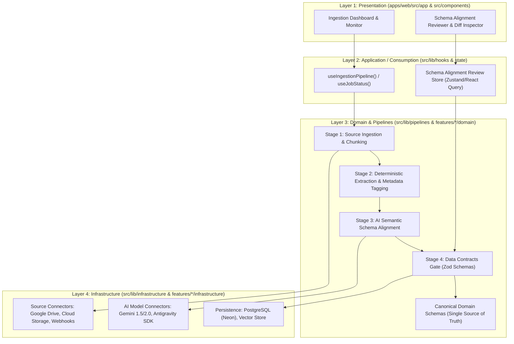

# 🤖 AI-Augmented Ingestion Pipeline & Schema Alignment Architecture

## 1. Executive Summary & Core Philosophy

This architecture defines the canonical design for ingesting, transforming, aligning, and persisting semi-structured and unstructured external data (e.g. Google Drive documents, property deeds, financial records, API feeds) into strongly typed domain models using AI augmentation and deterministic validation gates.

The pipeline adheres to **Feature-Driven Design (FDD / Vertical Slices)** and the **4-Layer Functional Architecture**:



---

## 2. The 5-Stage Ingestion Pipeline Lifecycle

Every ingestion workflow executes through 5 strictly isolated and observable stages:

### Stage 1: Source Acquisition & Extraction
- **Layer**: Infrastructure (Layer 4) -> Domain (Layer 3)
- **Responsibility**: Fetch binary/raw payloads from external sources (Google Drive API, GCS, S3, Webhooks).
- **Invariants**: Raw payloads are hashed (SHA-256) for idempotency and cached before extraction. Never execute unbounded memory reads.

### Stage 2: Deterministic Preprocessing & Token Chunking
- **Layer**: Domain (Layer 3)
- **Responsibility**: Extract clean text, parse tables, split into semantic chunks with token boundaries, and tag metadata (source ID, timestamp, byte offsets).
- **Invariants**: Pure deterministic TypeScript functions (`pipe()`). Zero LLM calls in this stage.

### Stage 3: AI-Augmented Semantic Schema Alignment
- **Layer**: Domain (Layer 3) consuming Infrastructure (Layer 4 AI Transport)
- **Responsibility**: Pass structured prompts with candidate target schemas to Gemini / Antigravity SDK models. The model outputs structured JSON proposals aligning raw field variants into canonical domain entities.
- **Invariants**: All AI prompts must enforce temperature <= 0.2 and structured JSON mode. Model responses are treated as **untrusted proposals** until validated in Stage 4.

### Stage 4: Data Contracts & Invariant Validation Gate
- **Layer**: Domain (Layer 3)
- **Responsibility**: Validate AI alignment output against strict Zod schemas (`CanonicalPropertySchema`, `CanonicalInvestorRecordSchema`, etc.).
- **Invariants**: Zero unvalidated data may cross to persistence or presentation. Any schema discrepancy triggers either automatic fallback strategies or raises a human-in-the-loop review item.

### Stage 5: Persistence, Indexing & Dispatch
- **Layer**: Infrastructure (Layer 4)
- **Responsibility**: Write verified entities to PostgreSQL/Neon within explicit database transactions. Index embeddings in Vector stores where applicable. Emit event notifications to client subscribers.

---

## 3. Schema Alignment & Data Contract Rules

1. **Single Source of Truth**: All domain entities have a canonical Zod schema located in `knowledge/api/schemas/` and colocated in `features/[feature_name]/domain/[feature]-schema.ts`.
2. **Schema Drift Detection**: The pipeline records alignment confidence scores and tracks schema versions. If input data structure deviates by > 20% from known formats, flag as `DRIFT_DETECTED`.
3. **Zero Implicit Any**: No dynamic untyped objects (`Record<string, any>`). Every intermediate payload must declare an explicit TypeScript interface.

---

## 4. 4-Layer Directory Isolation & Whitelist

```text
apps/web/src/features/[feature_name]/
├── index.ts                      <-- 🛡️ Public Barrel Export
├── presentation/                 <-- Capa 1: UI Views, Ingestion Status Cards
│   ├── ingestion-view.tsx
│   └── ingestion-view.test.tsx
├── application/                  <-- Capa 2: Hooks (useIngestionJob), Stores
│   ├── use-ingestion-job.ts
│   └── use-ingestion-job.test.ts
├── domain/                       <-- Capa 3: Pure Pipelines, Zod Schemas
│   ├── ingestion-pipeline.ts     <-- pipe(extract, align, validate)
│   ├── ingestion-pipeline.test.ts
│   └── ingestion-schema.ts
└── infrastructure/               <-- Capa 4: External Connectors, DB Repos
    ├── drive-connector.ts
    ├── gemini-aligner.ts
    └── ingestion-repository.ts
```

### Layer Enforcement Matrix

| Layer | Path Scope | Allowed Imports | Forbidden Imports |
| :--- | :--- | :--- | :--- |
| **Layer 1: Presentation** | `app/`, `components/`, `features/*/presentation/` | Layer 2, Layer 3 Types | ❌ Raw DB, AI SDKs (`@google/genai`), direct Node.js `fs` |
| **Layer 2: Application** | `lib/hooks/`, `lib/state/`, `features/*/application/` | Layer 3, Layer 4 Services | ❌ Direct JSX rendering |
| **Layer 3: Domain** | `lib/pipelines/`, `features/*/domain/` | Zod, pure utils | ❌ React, Next.js, UI frameworks, PostgreSQL drivers |
| **Layer 4: Infrastructure**| `lib/infrastructure/`, `lib/db/`, `features/*/infrastructure/` | SDKs (Drive, Gemini, Neon) | ❌ UI components, React hooks |

---

## 5. Mandatory In-Code Commentary Standard

Every source file must include:
1. **File Role Header**: Declaring the 4-layer role and purpose.
2. **TSDoc / JSDoc Blocks**: Documenting every exported function, type, and parameter.
3. **Numbered Step Indicators (`// Step N: ...`)**: Detailing pipeline progression.
4. **Security & Invariant Rationale**: Explaining schema boundaries and fallback safety guards.
