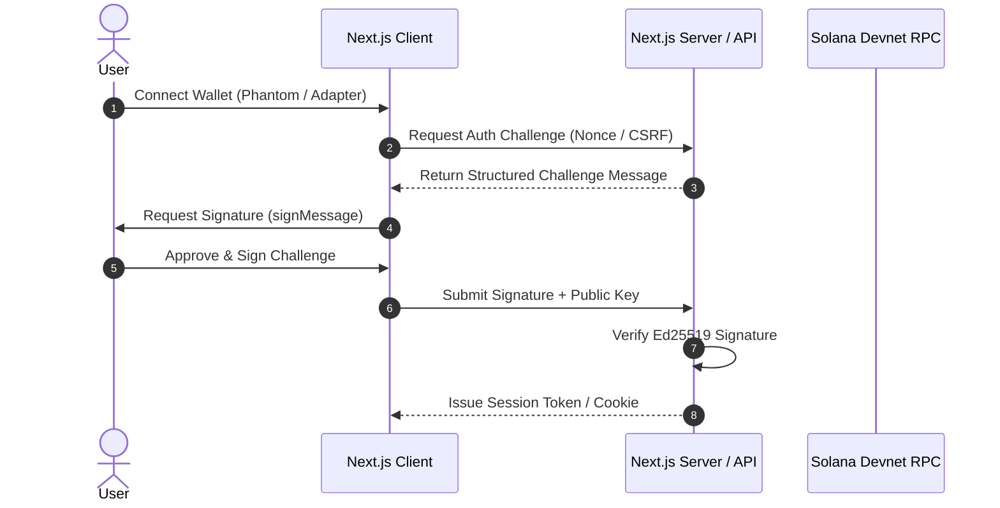

# Authentication Flow Specification

## Scope
- Wallet connection, message challenge creation, cryptographic signature verification, and session binding.

## Sequence Diagram

## Security Invariants
- Nonces must be cryptographically random and time-bound (TTL <= 120s).
- Signatures must match the claiming public key with zero replay allowance.
