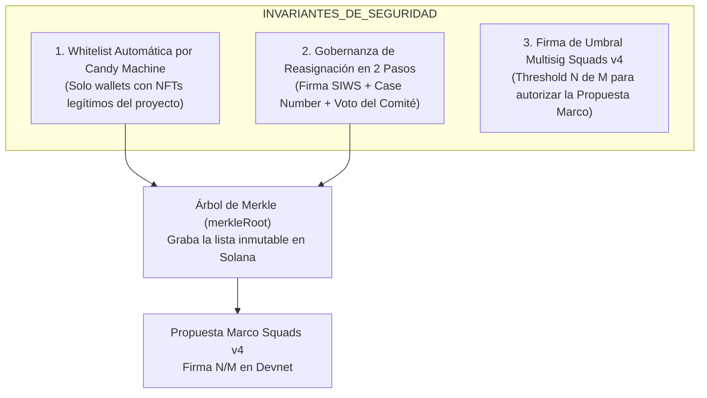

# Diseño de Seguridad y Modelo de Amenazas: Dispersión de Tesorería Multisig con Squads v4

## 1. Resumen Ejecutivo y Principios Cero-Confianza

El presente documento establece el diseño de seguridad de nivel bancario y de grado blockchain para el sistema de dispersión de tesorería y reclamación de rentas en la plataforma **BRIDS**.

El sistema opera bajo un **Modelo de Seguridad de Cero Confianza (*Zero-Trust Security Shielding*)**, donde ni los administradores del servidor, ni el motor de segundo plano (*worker bot*), ni usuarios externos poseen la capacidad de alterar wallets destinatarias o transferir fondos sin una verificación criptográfica inmutable en la red Solana.

---

## 2. Los 3 Invariantes Fundamentales de Seguridad

### Invariante 1: Whitelist Automática por Candy Machine & Staking Ponderado por Tiempo
- Únicamente las wallets que poseen o compraron NFTs válidos dentro del contrato Candy Machine correspondiente (`approved_candy_machine_address`) son elegibles.
- **Rendimiento por Tiempo de Stake**: El derecho a rendimiento no sigue ciegamente al minting inicial ni al dueño actual en el momento del snapshot; se asigna **proporcionalmente a la cantidad exacta de segundos/días que cada wallet mantuvo el NFT en estado congelado (*staked*) durante el período**.
- Si un NFT fue vendido/transferido durante el período, el rendimiento se divide entre las wallets vendedora y compradora de acuerdo al tiempo que cada una mantuvo el NFT stacheado. Durante los intervalos en que el NFT estuvo descongelado (*unfrozen*), nadie acumula rendimiento.

### Invariante 2: Gobernanza de Cambio de Wallet de Pago en 2 Pasos
- Si un usuario solicita cambiar su wallet de pago (por pérdida de llave o migración), la solicitud exige:
  1. Firma criptográfica **SIWS** (*Sign-In With Solana*) de la wallet titular original.
  2. Asignación obligatoria de un **Número de Caso / Ticket de Compliance** (`case_number`, ej. `CASE-2026-0891`).
  3. La solicitud permanece congelada en estado `PENDING` hasta que el oficial de cumplimiento y el comité la aprueban en `/admin/compliance`.

### Invariante 3: Firma de Umbral Multisig en Squads v4 (Threshold N/M)
- Ninguna transferencia puede salir de la Vault de Tesorería (`squadsVaultPda`) a menos que la Propuesta Marco supere el **umbral estricto de firmas multisig ($N$ de $M$)** otorgadas por las wallets Phantom/Solflare de los administradores.

### Invariante 4: Inspección Minimalista e Interactiva en Interfaz
- La consola `/admin/treasury/squads` presenta las filas de beneficiarios de forma **minimalista y limpia** (Nombre, Días Stacheados, Wallet de Pago, Neto a Recibir y Badge de Estado).
- Cada fila dispone de un botón de expansión (*chevron*) para abrir el desglose de **Wallet de Origen, Wallet de Pago, Dirección Mint del NFT, Fecha/Días del Mint y Desglose Financiero**.
- La tabla cuenta con un **Toggle Global ("Expandir Todos / Ocultar Todos")** para desplegar o replegar la totalidad de las filas de un solo clic.

---

## 3. Matriz del Modelo de Amenazas (Modo Paranoico)

| Vector de Ataque Potencial | Escenario de Amenaza | Análisis de Vulnerabilidad | Mecanismo de Mitigación Criptográfica (Escudo) |
| :--- | :--- | :--- | :--- |
| **1. Alteración en Base de Datos Postgres** | Un atacante con acceso a la DB modifica una wallet o eleva el monto de un pago tras la aprobación. | **IMPOSIBLE**. | **Ancla de Árbol de Merkle en Solana**: La `merkleRoot` se graba inmutablemente en la PDA de Squads. Si 1 solo bit cambia en Postgres, la prueba de Merkle no coincide y Solana aborta la transacción. |
| **2. Inyección por Bot Ejecutor (Hot Key)** | El worker en segundo plano intenta alterar una transferencia enviando fondos a su propia wallet. | **IMPOSIBLE**. | **Restricción de la Vault PDA de Squads v4**: La Vault PDA de Squads *solo* ejecuta instrucciones cuya tupla exacta `(destino, monto)` fue aprobada dentro del Batch por el comité. La Hot Key del bot no tiene poder de gasto. |
| **3. Inyección por API de Overrides** | Un atacante llama a la API `/api/claims/[id]/override` para redirigir fondos. | **IMPOSIBLE**. | **Firma SIWS + Estado PENDING**: Exige firma de la llave original + aprobación previa del comité en `/admin/compliance`. No hay auto-aprobación por API. |
| **4. Ataque de Reintegración / Replay** | Re-transmitir una transacción pasada que ya fue pagada para cobrar 2 veces. | **IMPOSIBLE**. | **Indexación de Transacción Única (`transactionIndex`)**: Squads v4 asigna un índice incremental de 64 bits a cada propuesta. Una vez ejecutada, cambia inmutablemente a `Executed`. |
| **5. Modificación de Parámetros por Admin Solitario** | Un solo administrador intenta liberar un pago retenido sin consultar al comité. | **IMPOSIBLE**. | **Threshold Multisig N/M**: Requiere la firma de múltiples signatarios para aprobar la propuesta marco en la red. |
| **6. Script/XSS Injection en Metadata** | Inyección de código en nombres de usuario, notas de auditoría o `case_number`. | **IMPOSIBLE**. | **Sanitización Zod + Content Security Policy**: Sanitización estricta en la capa API de Next.js y escapado seguro en la interfaz React 19. |
| **7. Alteración Maliciosa de `project_start_at` / `project_end_at` por API o DB** | Un hacker modifica Postgres o envía un payload HTTP para alterar las fechas del proyecto y distorsionar los pagos. | **IMPOSIBLE**. | **Validadores API Rígidos (`IMMUTABLE_PROJECT_DATE_FIELDS`) + Lectura Directa PDA Solana**: Los validadores HTTP de la API (`collection-patch-payload.ts`) rechazan cualquier petición que contenga campos de fechas (`400 IMMUTABLE_PROJECT_DATE_FIELD`). El motor de cálculo lee directamente la PDA Notario en Solana RPC. Postgres es solo un caché de lectura. |

---

## 4. Arquitectura de Verificación Criptográfica por Árbol de Merkle

Para garantizar que la lista de beneficiarios es matemáticamente consistente y resistente a manipulación, el sistema implementa la derivación de **Árboles de Merkle**:

1. **Leaf Hashing (Hash de Hoja)** — Codec canónico único (ver `SOLUTION-ARCHITECTURE.md` §Codec Canónico Único):
   Cada beneficiario de la corrida representa una hoja calculada con `solana_program::keccak::hashv`:
   $$\text{Leaf}_i = \text{keccak256}(\text{domain} \parallel \text{runId} \parallel \text{claimId} \parallel \text{mint} \parallel \text{tokenProgram} \parallel \text{recipientWallet} \parallel \text{recipientAta} \parallel \text{amountMinor})$$
   Domain separator: `"brids:epic015:payout:v1"`. Encoding: pubkeys 32 bytes, u64 little-endian 8 bytes.

2. **Verificación en el Pipeline TypeScript**:
   Antes de emitir cualquier propuesta, la función `verifyAllTreeLeaves` recorre la totalidad de las hojas en memoria confirmando que el 100% satisface la raíz del árbol (`merkleRoot`).

3. **Ecuación Estricta de Conservación de Fondos**:
   Se requiere que la suma de los componentes satisfaga la ecuación en todo momento:
   $$\text{Monto Vault Total} = \sum_{i=1}^{N} \text{Neto}_i + \sum \text{Comisiones Retenidas} + \sum \text{Holds Retenidos}$$

---

## 5. Mecanismos de Resiliencia y Control de Excepciones

El sistema proporciona 3 herramientas de control operativo para el comité:

1. **Rechazo Global (`proposalReject`)**: Permite a cualquier miembro del comité cancelar la Propuesta Marco en Squads v4 antes de su ejecución, devolviendo los ítems a la cola sin tocar fondos.
2. **Veto Granular de Ítems (`vetoClaimItem`) — Pre-Seal Only**: Permite vetar a un usuario individual **antes de sellar** el run, excluyéndolo del snapshot y recalculando la raíz de Merkle automáticamente. Tras `seal_run`, la root es inmutable on-chain y el mecanismo es `pause_run` + `cancel_run` (propuesta Squads) + nuevo run sin la leaf vetada. No existe PDA de revocación individual.
3. **Freno de Emergencia (`circuitBreaker` & `pause_run` 1-de-M)**: Permite pausar inmediatamente la ejecución desatendida del bot propio en base de datos (~50ms) y ejecutar `pause_run` directamente on-chain por **cualquier miembro individual del Multisig de Squads (1-de-M, ~400ms)** desde su wallet conectada. El bloqueo on-chain revierte cualquier llamada a `settle_claim` de crankers externos. La reanudación (`resume_run`) o cancelación (`cancel_run`) exige estrictamente propuesta con umbral multisig N-de-M.

---

## 6. Trazabilidad e Auditoría Inmutable

Toda acción de seguridad, firma multisig, veto, cambio de wallet o rechazo queda registrada permanentemente en 2 fuentes:
- **Base de Datos Local**: Tabla `claim_or_payout_events` con registro inmutable y sello de tiempo.
- **Cadena de Bloques Solana Devnet**: Transacciones verificables públicamente en Solscan / SolanaFM Explorer.

---

## 7. Trazabilidad de Documentación
- **Plan de Implementación**: [`implementation_plan.md`](file:///Users/jaymusicmachine/.gemini/antigravity/brain/025e8432-54aa-4845-ae4d-a3e457f6a52c/implementation_plan.md)
- **RFC Épica**: [`EPIC-015-squads-v4-treasury-claims`](file:///Users/jaymusicmachine/Documents/Desarrollo/brids/knowledge/rfcs/EPIC-015-squads-v4-treasury-claims/README.md)
- **Historias Tácticas**: `STORY-015-01` a `STORY-015-05`
