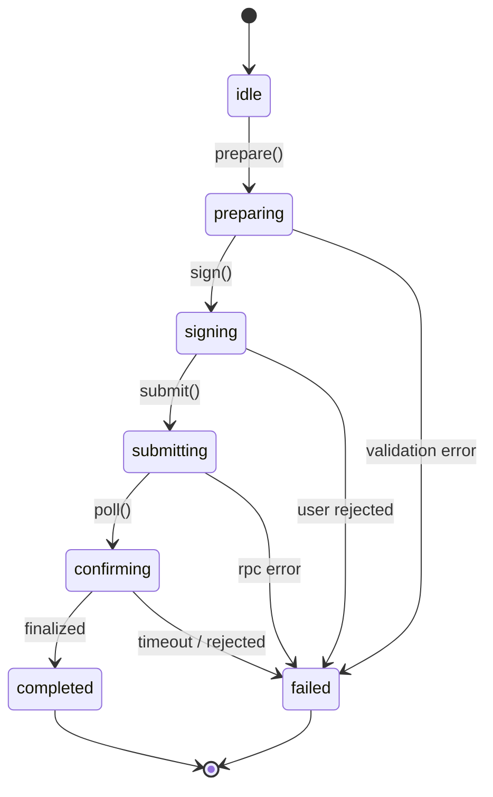

# State Machine Architecture

## Scope
- Domain entity / pipeline lifecycle states and transition invariants.

## States
| State | Description | Entry Condition | Exit Condition |
| --- | --- | --- | --- |
| `idle` | Initialized, waiting for user trigger | Component mounted / initialized | User initiates action |
| `preparing` | Assembling transaction parameters and payload | User trigger received | Payload validation succeeds |
| `signing` | Awaiting cryptographic wallet signature | Payload prepared | Wallet returns signature |
| `submitting` | Broadcasting transaction to Solana Devnet RPC | Signature accepted | RPC returns signature / ack |
| `confirming` | Polling on-chain transaction confirmation | Transaction broadcasted | Reaches commitment level (`confirmed`) |
| `completed` | Terminal success state | On-chain confirmation confirmed | Terminal |
| `failed` | Terminal failure state | Error encountered / transaction rejected | Terminal |

## Allowed Transitions
| From | Action | To | Validation |
| --- | --- | --- | --- |
| `idle` | `prepare` | `preparing` | Valid request parameters |
| `preparing` | `sign` | `signing` | Schema validation passed |
| `signing` | `submit` | `submitting` | Valid Ed25519 signature |
| `submitting` | `poll` | `confirming` | RPC transaction hash returned |
| `confirming` | `finalize` | `completed` | Status == confirmed / finalized |
| `*` | `catchError` | `failed` | Error caught at any stage |

## Illegal Transitions
- [x] Transition: `completed -> preparing`
  - Reason blocked: Completed transactions are terminal and immutable.
  - Expected error: `InvalidTransitionError: Terminal state cannot be re-executed.`
- [x] Transition: `failed -> submitting`
  - Reason blocked: Failed workflows must re-enter from `idle` or `preparing`.
  - Expected error: `InvalidTransitionError: Direct submission from failed state is prohibited.`

## State Diagram

## Determinism & Invariants
- No floating-point arithmetic used for accounting or balance math.
- State transitions are deterministic and pure.
