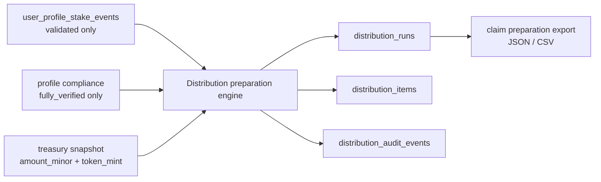

# implementation(feature): BRI-6 Stake-event reconciliation and distribution preparation service

## ES

## Estado
- Issue padre: `BRI-6`
- Rama de iniciativa: `initiative/bri-6-stake-event-reconciliation-distribution`
- Slice actual: `S01 - Spec`
- Artefacto base: `knowledge/features/feature-stake-event-reconciliation-distribution-preparation-bri-6.md`
- Este artefacto define el contrato de build, no ejecuta pagos.

## Objetivo técnico
Construir una preparación de distribución server-side, auditable e idempotente, basada en eventos validados de `user_profile_stake_events`.

La feature no introduce un programa Anchor ni cambia el flujo Stake / Unstake. Consume el resultado validado de BRI-5/BRI-170.

## Arquitectura v1

## Contratos de entrada

### Distribution scope
Fuente: input admin/server-side de la corrida.

Campos requeridos v1:

- `collection_address`
- `property_id`

Reglas:

- El motor no calcula una distribución global de todo BRIDS.
- El monto de una corrida pertenece a una collection/property concreta.
- Solo eventos, NFTs y wallets vinculados a ese scope pueden participar.
- El scope se persiste en la corrida y en el payload exportado.

### Stake events
Fuente: `user_profile_stake_events`

Campos requeridos:

- `asset_address`
- `owner_wallet`
- `collection_address`
- `property_id`
- `product_action`
- `blockchain_action`
- `tx_signature`
- `instruction_index`
- `slot`
- `block_time`
- `observed_at`
- `validation_status`

Reglas:

- Solo `validation_status = 'validated'`.
- Solo eventos cuyo `collection_address` y `property_id` coinciden con el scope de la corrida.
- Orden estable: `COALESCE(block_time, observed_at)`, `slot`, `instruction_index`, `tx_signature`.
- Para finalizar, `block_time` debe estar disponible para todos los eventos incluidos en el período.

### Compliance
Fuente: perfil/KYC existente.

Reglas:

- Solo `compliance_status = 'fully_verified'` es elegible.
- La corrida guarda snapshot de compliance usado.
- Wallet excluida por compliance queda en auditoría.

### Treasury
Fuente v1:

- input server-side explícito `amount_minor`, `token_mint`, `treasury_source`, `treasury_reference`.

Reglas:

- `amount_minor` es entero string/BigInt compatible.
- No se usa floating point.
- Squads real puede integrarse en slice posterior si el contrato queda aprobado.

## Modelo de datos propuesto

### `distribution_runs`
- `id`
- `period_key`
- `collection_address`
- `property_id`
- `period_start_at`
- `period_end_at`
- `period_timezone`
- `policy_version`
- `status`
  - `draft`
  - `blocked`
  - `finalized`
  - `failed`
- `token_mint`
- `total_amount_minor`
- `allocated_amount_minor`
- `rounding_remainder_minor`
- `total_eligible_seconds`
- `eligible_wallet_count`
- `eligible_asset_count`
- `blocked_reason`
- `output_checksum`
- `created_by`
- `finalized_by`
- `created_at`
- `updated_at`
- `finalized_at`

### `distribution_items`
- `id`
- `run_id`
- `wallet_public_key`
- `compliance_status_snapshot`
- `eligible_seconds`
- `asset_count`
- `amount_minor`
- `rounding_remainder_rank`
- `exclusion_reason`
- `item_payload`
- `created_at`

### `distribution_audit_events`
- `id`
- `run_id`
- `event_name`
- `actor_type`
- `actor_id`
- `event_payload`
- `created_at`

## Contrato clean-code por slice

Cada slice debe entregar una responsabilidad dominante y nada más. El objetivo es que el sistema pueda leerse, probarse y extenderse sin mezclar cálculo financiero, persistencia, HTTP y UI en el mismo lugar.

Reglas obligatorias:

- Cada slice empieza con pruebas que fallan antes de escribir implementación.
- Las pruebas deben ser rápidas, independientes, repetibles, auto-verificables y oportunas.
- Los nombres deben expresar intención de dominio: `distributionRun`, `eligibleFrozenSeconds`, `allocationRemainder`, no abreviaturas ambiguas.
- Las funciones deben hacer una sola cosa y no ocultar efectos secundarios.
- No se permite floating point para dinero ni porcentajes de reparto.
- No se permite estado global mutable para cálculo de distribución.
- Los DTOs de entrada/salida deben ser explícitos y validados en el borde del sistema.
- Los errores de dominio deben ser distinguibles: período inválido, eventos pendientes, wallet no elegible, scope inválido, corrida finalizada.
- El refactor de clean-code se ejecuta antes de mergear cada slice, no al final de la iniciativa.
- Cualquier hallazgo que no se corrija debe quedar documentado en el artefacto del slice antes de merge.

## Plan de slices

| Slice | Branch | Responsabilidad única | TDD RED obligatorio | Límites clean-code | Merge target |
| --- | --- | --- | --- | --- | --- |
| S01 - Spec | `feature/shared-stake-event-distribution-bri-6-s01-spec` | Definir verdad, alcance, slices y gates | `npm run validate:docs-governance` debe fallar si falta artefacto requerido | No toca runtime, DB, API ni UI | `initiative/bri-6-stake-event-reconciliation-distribution` |
| S02 - Persistence | `feature/shared-stake-event-distribution-bri-6-s02-persistence` | Migraciones, constraints y repositorios de distribución | Tests de repositorio fallan por tablas/contratos inexistentes | No calcula repartos, no expone rutas HTTP, no renderiza UI | initiative |
| S03 - Calculation Engine | `feature/shared-stake-event-distribution-bri-6-s03-engine` | Motor puro de intervalos, elegibilidad y asignación | Unit tests fallan por casos de tiempo, KYC, pending y redondeo | Sin DB, HTTP, env vars, wallet adapter ni sesiones | initiative |
| S04 - Service/API | `feature/app-stake-event-distribution-bri-6-s04-service-api` | Orquestar repositorio + motor para crear, bloquear, finalizar y exportar corridas | Tests de servicio/ruta fallan por auth, DTOs, finalización y export determinístico | Sin SQL inline en rutas, sin duplicar matemática del motor, sin lógica de presentación | initiative |
| S05 - Admin UI | `feature/app-stake-event-distribution-bri-6-s05-admin-ui` | Reemplazar mock data por lectura real y estados operativos | Component/Playwright tests fallan por estados y responsive | Sin cálculos financieros en cliente, sin writes directos a resultados | initiative |
| S06 - Initiative closeout | `feature/shared-stake-event-distribution-bri-6-s06-closeout` | Validación total, docs, Linear, PR final y evidencia | `npm run validate` y gates específicos deben ejecutarse limpios | No agrega comportamiento nuevo; solo cierre, auditoría y trazabilidad | develop |

## Flujo TDD por slice

1. RED: escribir la prueba mínima que demuestra el contrato del slice y verla fallar por la razón esperada.
2. GREEN: implementar lo mínimo para pasar esa prueba sin resolver responsabilidades de otro slice.
3. REFACTOR: aplicar clean-code, reducir duplicación, aclarar nombres y separar efectos secundarios.
4. GATE: ejecutar pruebas focalizadas, `npm run validate` cuando aplique y validaciones de DB si hay migraciones.
5. EVIDENCE: registrar comandos, resultados y hallazgos en el artefacto o comentario Linear antes del merge.

## Casos TDD mínimos

### S02 tests
- La migración crea tablas, constraints e índices requeridos.
- El repositorio crea drafts idempotentes por `period_key + policy_version + collection_address + property_id`.
- El repositorio impide finalizar sin datos finalizables.
- Los audit events son append-only.
- Una corrida finalizada no puede ser modificada por update directo de repositorio.

### S03 tests
- Solo cuentan eventos cuyo `collection_address` y `property_id` coinciden con el scope de la corrida.
- Stake y unstake dentro del período cuentan segundos exactos.
- Stake antes del período y unstake dentro del período cuenta desde `period_start_at`.
- Stake antes del período sin unstake cuenta hasta `period_end_at` si el estado inicial validado era frozen.
- Unstake sin stake previo no infiere estado frozen.
- Eventos `pending` o `reconcile_pending` bloquean finalización.
- Wallet sin `fully_verified` queda excluida con razón auditable.
- La asignación usa enteros y registra remanente.
- Recalcular con la misma entrada produce el mismo checksum.

### S04 tests
- Requests sin sesión admin son rechazados.
- Crear draft valida período, monto, scope y versión de política.
- Finalizar bloquea si existen eventos unresolved.
- Finalizar bloquea si el checksum calculado no coincide con el draft.
- Export devuelve JSON/CSV determinístico.
- Reintentar la misma creación no duplica corridas.

### S05 tests
- La consola admin lee corridas reales desde API.
- La UI no permite finalizar cuando el backend reporta `blocked`.
- Los estados `draft`, `blocked`, `finalized` y `failed` son visualmente distintos.
- El layout mobile no desborda tablas/cards.
- La UI no calcula montos; solo muestra los valores devueltos por el servidor.

## Dependencias entre slices

- S03 no inicia hasta que S02 defina contratos de datos o mocks equivalentes documentados.
- S04 no inicia hasta que S02 y S03 tengan contratos estables.
- S05 no inicia hasta que S04 defina DTOs de lectura y mutación.
- S06 solo inicia cuando S01-S05 estén mergeados en la rama de iniciativa.

## Security gates
- No client-provided wallet eligibility is trusted.
- No browser writes distribution results directly.
- Admin routes require server-side role check.
- Finalization requires explicit actor.
- Finalized runs are immutable.
- Money uses integer minor units only.
- Every block/exclusion/finalization has audit event.
- `npm run validate` and `validate:db` are mandatory before merge.

## Definition of Done
- Artifact pair committed in S01.
- Linear BRI-6 references initiative branch and slice plan.
- Each delivery slice starts with failing tests.
- Database changes have tracked migrations.
- `npm run validate` passes on each slice.
- Clean-code pass completed.
- Security review completed for persistence/API slices.
- Final initiative PR merges to `develop`.

## Estado de S01
- Estado: mergeado en `initiative/bri-6-stake-event-reconciliation-distribution`.
- Evidencia:
  - `npm run validate:docs-governance` - passed.
  - Linear BRI-6 sincronizado con rama de iniciativa, artefactos y slice plan.

## Estado de S02
- Estado: implementado en subrama `feature/shared-stake-event-distribution-bri-6-s02-persistence`.
- Alcance entregado:
  - Migración `034_distribution_preparation.sql`.
  - Tablas `distribution_runs`, `distribution_items` y `distribution_audit_events`.
  - Repositorio `lib/distributions/distribution-repository.ts`.
  - Idempotencia por `period_key + policy_version + collection_address + property_id`.
  - Inmutabilidad de corridas finalizadas.
- Evidencia:
  - RED: tests fallaron por migración/repositorio ausentes.
  - GREEN: `npm test -- tests/db/distribution-preparation-migration.test.ts tests/lib/distribution-repository.test.ts` - passed.
- Clean-code:
  - Persistencia aislada; no incluye motor de cálculo, rutas HTTP ni UI.
  - Nombres de dominio explícitos para run, items, audit events y scope.

## Estado de S03
- Estado: implementado en subrama `feature/shared-stake-event-distribution-bri-6-s03-engine`.
- Alcance entregado:
  - Motor puro `lib/distributions/distribution-engine.ts`.
  - Cálculo de intervalos frozen por asset dentro del período.
  - Filtro estricto por `collection_address`/`property_id`.
  - Bloqueo por eventos `pending`/`reconcile_pending` y `block_time` faltante.
  - Exclusión por compliance distinto de `fully_verified`.
  - Asignación con enteros y ranking determinístico de remanentes.
- Evidencia:
  - RED: test falló por módulo de motor ausente.
  - GREEN: `npm test -- tests/lib/distribution-engine.test.ts` - passed.
- Clean-code:
  - Motor aislado de DB, HTTP, env vars, wallet adapter y sesiones.
  - Funciones pequeñas por responsabilidad: scope, blocking reasons, intervalos, elegibilidad, asignación y checksum.

## Estado de S04
- Estado: implementado en subrama `feature/app-stake-event-distribution-bri-6-s04-service-api`.
- Alcance entregado:
  - Servicio `lib/distributions/distribution-service.ts`.
  - Rutas admin `GET/POST /api/admin/distributions/runs`.
  - Ruta admin `POST /api/admin/distributions/runs/[runId]/finalize`.
  - Lectura de eventos stake validados por scope desde `user_profile_stake_events`.
  - Lectura de compliance por wallet desde `user_profiles`.
  - Serialización segura de `bigint` para API.
- Evidencia:
  - RED: tests fallaron por servicio/rutas ausentes.
  - GREEN: `npm test -- tests/lib/distribution-service.test.ts tests/api/admin-distribution-runs-route.test.ts tests/api/admin-distribution-run-finalize-route.test.ts` - passed.
- Clean-code:
  - Rutas solo validan auth, parsean request y delegan al servicio.
  - Servicio orquesta repositorios y motor sin SQL inline ni matemática duplicada.

## Estado de S05
- Estado: implementado en subrama `feature/app-stake-event-distribution-bri-6-s05-admin-ui`.
- Alcance entregado:
  - `components/admin/distributions-console.tsx` reemplaza mock data por `GET /api/admin/distributions/runs`.
  - Estados UI: loading, error, empty, draft, blocked, finalized y failed.
  - Vista desktop en tabla y mobile en cards para evitar overflow.
  - Detalle de corrida con scope, wallets, items, monto menor, checksum y bloqueo.
- Evidencia:
  - RED: test falló porque la consola no llamaba API y renderizaba `D-2026-03`.
  - GREEN: `npm test -- tests/components/admin-distributions-console.test.ts` - passed.
- Clean-code:
  - UI no calcula montos ni elegibilidad; solo presenta valores server-returned.
  - Fetch aislado, estados tipados y helpers de formato pequeños.

## Estado de S06
- Estado: closeout ejecutado en subrama `feature/shared-stake-event-distribution-bri-6-s06-closeout`.
- Evidencia:
  - `npm run validate` - passed.
  - `validate:db` - skipped porque `DATABASE_URL` no esta configurado en el entorno local.
  - `npm test -- tests/components/admin-distributions-console.test.ts tests/lib/distribution-service.test.ts tests/api/admin-distribution-runs-route.test.ts tests/api/admin-distribution-run-finalize-route.test.ts tests/lib/distribution-engine.test.ts tests/lib/distribution-repository.test.ts tests/db/distribution-preparation-migration.test.ts` - passed.
- Clean-code pass:
  - Sin `TODO`, `FIXME`, `console.log`, `any` ni mock `BATCHES` en codigo de produccion tocado.
  - Responsabilidades separadas por slice: persistencia, motor puro, servicio/API y UI.
  - Hallazgos bloqueantes: ninguno.
  - Observacion no bloqueante: `distribution-repository.ts` es el archivo mas grande porque concentra DB + fallback in-memory para tests; se mantiene cohesivo y cubierto por tests, pero debe dividirse si crece con nuevas operaciones.
- Pendiente operativo:
  - Ejecutar `npm run db:migrate` y `npm run validate:db` en un entorno con `DATABASE_URL` antes de promover a ambiente persistente.

## EN

## Status
- Parent issue: `BRI-6`
- Initiative branch: `initiative/bri-6-stake-event-reconciliation-distribution`
- Current slice: `S01 - Spec`
- Base artifact: `knowledge/features/feature-stake-event-reconciliation-distribution-preparation-bri-6.md`
- This artifact defines the build contract and does not execute payments.

## Technical Goal
Build an auditable, idempotent server-side distribution preparation flow based on validated `user_profile_stake_events`.

The feature does not introduce an Anchor program and does not change Stake / Unstake. It consumes the validated output from BRI-5/BRI-170.

## v1 Architecture

## Input Contracts

### Distribution scope
Source: admin/server-side run input.

Required v1 fields:

- `collection_address`
- `property_id`

Rules:

- The engine does not calculate one global BRIDS-wide distribution.
- A run amount belongs to a concrete collection/property.
- Only events, NFTs, and wallets linked to that scope may participate.
- The scope is persisted on the run and in the exported payload.

### Stake events
Source: `user_profile_stake_events`

Required fields:

- `asset_address`
- `owner_wallet`
- `collection_address`
- `property_id`
- `product_action`
- `blockchain_action`
- `tx_signature`
- `instruction_index`
- `slot`
- `block_time`
- `observed_at`
- `validation_status`

Rules:

- Only `validation_status = 'validated'`.
- Only events whose `collection_address` and `property_id` match the run scope.
- Stable ordering: `COALESCE(block_time, observed_at)`, `slot`, `instruction_index`, `tx_signature`.
- To finalize, `block_time` must be available for every included event in the period.

### Compliance
Source: existing profile/KYC.

Rules:

- Only `compliance_status = 'fully_verified'` is eligible.
- The run stores the compliance snapshot used.
- Wallets excluded by compliance appear in audit.

### Treasury
v1 source:

- explicit server-side input: `amount_minor`, `token_mint`, `treasury_source`, `treasury_reference`.

Rules:

- `amount_minor` is an integer string/BigInt-compatible value.
- No floating point.
- Real Squads integration can be added in a later slice once this contract is approved.

## Proposed Data Model

### `distribution_runs`
- `id`
- `period_key`
- `collection_address`
- `property_id`
- `period_start_at`
- `period_end_at`
- `period_timezone`
- `policy_version`
- `status`
  - `draft`
  - `blocked`
  - `finalized`
  - `failed`
- `token_mint`
- `total_amount_minor`
- `allocated_amount_minor`
- `rounding_remainder_minor`
- `total_eligible_seconds`
- `eligible_wallet_count`
- `eligible_asset_count`
- `blocked_reason`
- `output_checksum`
- `created_by`
- `finalized_by`
- `created_at`
- `updated_at`
- `finalized_at`

### `distribution_items`
- `id`
- `run_id`
- `wallet_public_key`
- `compliance_status_snapshot`
- `eligible_seconds`
- `asset_count`
- `amount_minor`
- `rounding_remainder_rank`
- `exclusion_reason`
- `item_payload`
- `created_at`

### `distribution_audit_events`
- `id`
- `run_id`
- `event_name`
- `actor_type`
- `actor_id`
- `event_payload`
- `created_at`

## Clean-Code Slice Contract

Each slice must deliver one dominant responsibility and nothing more. The goal is for the system to be readable, testable, and extensible without mixing financial calculation, persistence, HTTP, and UI in the same place.

Mandatory rules:

- Every slice starts with failing tests before implementation.
- Tests must be fast, independent, repeatable, self-validating, and timely.
- Names must reveal domain intent: `distributionRun`, `eligibleFrozenSeconds`, `allocationRemainder`, not ambiguous abbreviations.
- Functions must do one thing and must not hide side effects.
- Floating point is forbidden for money and distribution percentages.
- Global mutable state is forbidden for distribution calculation.
- Input/output DTOs must be explicit and validated at the system boundary.
- Domain errors must be distinguishable: invalid period, pending events, ineligible wallet, invalid scope, finalized run.
- The clean-code refactor runs before each slice merge, not only at initiative closeout.
- Any finding that is not fixed must be documented in the slice artifact before merge.

## Slice Plan

| Slice | Branch | Single responsibility | Required TDD RED | Clean-code boundaries | Merge target |
| --- | --- | --- | --- | --- | --- |
| S01 - Spec | `feature/shared-stake-event-distribution-bri-6-s01-spec` | Define truth, scope, slices, and gates | `npm run validate:docs-governance` must fail if a required artifact is missing | No runtime, DB, API, or UI changes | `initiative/bri-6-stake-event-reconciliation-distribution` |
| S02 - Persistence | `feature/shared-stake-event-distribution-bri-6-s02-persistence` | Distribution migrations, constraints, and repositories | Repository tests fail because tables/contracts do not exist yet | No allocation math, HTTP routes, or UI rendering | initiative |
| S03 - Calculation Engine | `feature/shared-stake-event-distribution-bri-6-s03-engine` | Pure interval, eligibility, and allocation engine | Unit tests fail for time, KYC, pending-event, and rounding cases | No DB, HTTP, env vars, wallet adapter, or sessions | initiative |
| S04 - Service/API | `feature/app-stake-event-distribution-bri-6-s04-service-api` | Orchestrate repository + engine to create, block, finalize, and export runs | Service/route tests fail for auth, DTOs, finalization, and deterministic export | No inline SQL in routes, no duplicated engine math, no presentation logic | initiative |
| S05 - Admin UI | `feature/app-stake-event-distribution-bri-6-s05-admin-ui` | Replace mock data with real reads and operational states | Component/Playwright tests fail for states and responsive behavior | No client-side financial calculation, no direct writes to results | initiative |
| S06 - Initiative closeout | `feature/shared-stake-event-distribution-bri-6-s06-closeout` | Full validation, docs, Linear, final PR, and evidence | `npm run validate` and specific gates must run cleanly | No new behavior; closeout, audit, and traceability only | develop |

## TDD Workflow Per Slice

1. RED: write the minimum test that proves the slice contract and verify it fails for the expected reason.
2. GREEN: implement the minimum required to pass without solving another slice's responsibility.
3. REFACTOR: apply clean-code, reduce duplication, clarify names, and separate side effects.
4. GATE: run focused tests, `npm run validate` when applicable, and DB validation when migrations exist.
5. EVIDENCE: record commands, results, and findings in the artifact or Linear comment before merge.

## Minimum TDD Cases

### S02 tests
- Migration creates required tables, constraints, and indexes.
- Repository creates idempotent drafts by `period_key + policy_version + collection_address + property_id`.
- Repository prevents finalization without finalizable data.
- Audit events are append-only.
- A finalized run cannot be modified through a direct repository update.

### S03 tests
- Only events matching the run `collection_address` and `property_id` are counted.
- Stake then unstake inside the period counts exact seconds.
- Stake before the period and unstake inside the period counts from `period_start_at`.
- Stake before the period without unstake counts until `period_end_at` when the validated initial state was frozen.
- Unstake without a previous stake does not infer frozen state.
- `pending` or `reconcile_pending` events block finalization.
- Wallets without `fully_verified` are excluded with an auditable reason.
- Allocation uses integer math and records remainder.
- Recalculation with the same input produces the same checksum.

### S04 tests
- Requests without admin session are rejected.
- Draft creation validates period, amount, scope, and policy version.
- Finalization blocks when unresolved events exist.
- Finalization blocks when the calculated checksum differs from the draft.
- Export returns deterministic JSON/CSV.
- Retrying the same creation does not duplicate runs.

### S05 tests
- Admin console reads real runs from the API.
- UI cannot finalize when the backend reports `blocked`.
- `draft`, `blocked`, `finalized`, and `failed` states are visually distinct.
- Mobile layout does not overflow tables/cards.
- UI does not calculate amounts; it only displays server-returned values.

## Slice Dependencies

- S03 does not start until S02 defines data contracts or documented equivalent mocks.
- S04 does not start until S02 and S03 have stable contracts.
- S05 does not start until S04 defines read and mutation DTOs.
- S06 starts only after S01-S05 are merged into the initiative branch.

## Security Gates
- No client-provided wallet eligibility is trusted.
- No browser writes distribution results directly.
- Admin routes require server-side role check.
- Finalization requires explicit actor.
- Finalized runs are immutable.
- Money uses integer minor units only.
- Every block/exclusion/finalization has audit event.
- `npm run validate` and `validate:db` are mandatory before merge.

## Definition of Done
- Artifact pair committed in S01.
- Linear BRI-6 references initiative branch and slice plan.
- Each delivery slice starts with failing tests.
- Database changes have tracked migrations.
- `npm run validate` passes on each slice.
- Clean-code pass completed.
- Security review completed for persistence/API slices.
- Final initiative PR merges to `develop`.

## S01 Status
- Status: merged into `initiative/bri-6-stake-event-reconciliation-distribution`.
- Evidence:
  - `npm run validate:docs-governance` - passed.
  - Linear BRI-6 synced with initiative branch, artifacts, and slice plan.

## S02 Status
- Status: implemented in sub-branch `feature/shared-stake-event-distribution-bri-6-s02-persistence`.
- Delivered scope:
  - Migration `034_distribution_preparation.sql`.
  - Tables `distribution_runs`, `distribution_items`, and `distribution_audit_events`.
  - Repository `lib/distributions/distribution-repository.ts`.
  - Idempotency by `period_key + policy_version + collection_address + property_id`.
  - Immutability for finalized runs.
- Evidence:
  - RED: tests failed because migration/repository were absent.
  - GREEN: `npm test -- tests/db/distribution-preparation-migration.test.ts tests/lib/distribution-repository.test.ts` - passed.
- Clean-code:
  - Persistence remains isolated; no calculation engine, HTTP routes, or UI.
  - Explicit domain names for run, items, audit events, and scope.

## S03 Status
- Status: implemented in sub-branch `feature/shared-stake-event-distribution-bri-6-s03-engine`.
- Delivered scope:
  - Pure engine `lib/distributions/distribution-engine.ts`.
  - Frozen interval calculation per asset inside the period.
  - Strict filtering by `collection_address`/`property_id`.
  - Blocking for `pending`/`reconcile_pending` events and missing `block_time`.
  - Compliance exclusion when status is not `fully_verified`.
  - Integer allocation and deterministic remainder ranking.
- Evidence:
  - RED: test failed because the engine module was absent.
  - GREEN: `npm test -- tests/lib/distribution-engine.test.ts` - passed.
- Clean-code:
  - Engine isolated from DB, HTTP, env vars, wallet adapter, and sessions.
  - Small functions by responsibility: scope, blocking reasons, intervals, eligibility, allocation, and checksum.

## S04 Status
- Status: implemented in sub-branch `feature/app-stake-event-distribution-bri-6-s04-service-api`.
- Delivered scope:
  - Service `lib/distributions/distribution-service.ts`.
  - Admin routes `GET/POST /api/admin/distributions/runs`.
  - Admin route `POST /api/admin/distributions/runs/[runId]/finalize`.
  - Scoped validated stake-event reads from `user_profile_stake_events`.
  - Wallet compliance reads from `user_profiles`.
  - Safe `bigint` API serialization.
- Evidence:
  - RED: tests failed because service/routes were absent.
  - GREEN: `npm test -- tests/lib/distribution-service.test.ts tests/api/admin-distribution-runs-route.test.ts tests/api/admin-distribution-run-finalize-route.test.ts` - passed.
- Clean-code:
  - Routes only validate auth, parse requests, and delegate to the service.
  - Service orchestrates repositories and engine without inline SQL or duplicated math.

## S05 Status
- Status: implemented in sub-branch `feature/app-stake-event-distribution-bri-6-s05-admin-ui`.
- Delivered scope:
  - `components/admin/distributions-console.tsx` replaces mock data with `GET /api/admin/distributions/runs`.
  - UI states: loading, error, empty, draft, blocked, finalized, and failed.
  - Desktop table and mobile cards to avoid overflow.
  - Run detail with scope, wallets, items, minor amount, checksum, and block reason.
- Evidence:
  - RED: test failed because the console did not call the API and rendered `D-2026-03`.
  - GREEN: `npm test -- tests/components/admin-distributions-console.test.ts` - passed.
- Clean-code:
  - UI does not calculate amounts or eligibility; it only presents server-returned values.
  - Fetch is isolated, state is typed, and formatting helpers stay small.

## S06 Status
- Status: closeout executed in sub-branch `feature/shared-stake-event-distribution-bri-6-s06-closeout`.
- Evidence:
  - `npm run validate` - passed.
  - `validate:db` - skipped because `DATABASE_URL` is not configured in the local environment.
  - `npm test -- tests/components/admin-distributions-console.test.ts tests/lib/distribution-service.test.ts tests/api/admin-distribution-runs-route.test.ts tests/api/admin-distribution-run-finalize-route.test.ts tests/lib/distribution-engine.test.ts tests/lib/distribution-repository.test.ts tests/db/distribution-preparation-migration.test.ts` - passed.
- Clean-code pass:
  - No `TODO`, `FIXME`, `console.log`, `any`, or production `BATCHES` mock remains in touched production code.
  - Responsibilities are separated by slice: persistence, pure engine, service/API, and UI.
  - Blocking findings: none.
  - Non-blocking note: `distribution-repository.ts` is the largest file because it contains DB persistence plus in-memory test fallback; it remains cohesive and tested, but should be split if new operations expand it.
- Operational pending item:
  - Run `npm run db:migrate` and `npm run validate:db` in an environment with `DATABASE_URL` before promoting to a persistent environment.
