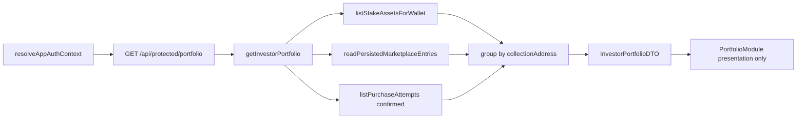

# Feature BRI-174 Implementation: Investor Portfolio Real Holdings

## Espanol

### Arquitectura propuesta

### Contrato DTO

`InvestorPortfolioDTO`:

- `walletPublicKey: string | null`
- `accountStatus: "wallet_bound" | "wallet_required" | "session_conflict"`
- `positions: InvestorPortfolioPosition[]`
- `summary`
  - `positionCount`
  - `totalOwnedQuantity`
  - `knownProjectOwnershipPctSum`
  - `knownPurchasePriceUsd`
- `dataQuality`
  - `status: "ready" | "partial" | "empty" | "wallet_required" | "error"`
  - `degradedSources: string[]`
  - `refreshedAt`

`InvestorPortfolioPosition`:

- `collectionAddress`
- `propertyId`
- `propertyTitle`
- `locationLabel`
- `imageUrl`
- `nftIds`
- `nftIdPreview`
- `ownedQuantity`
- `supplyTotal`
- `projectOwnershipPct`
- `purchasePriceUsd`
- `purchasePriceSource: "marketplace_listing_usd" | "unavailable"`
- `estimatedYieldPct`
- `yieldSource: "marketplace_projected_net_roi" | "marketplace_annual_roi" | "unavailable"`
- `statusCounts`
- `documents`

### Slices canonicos

| Slice | Rama | Responsabilidad unica | RED test antes de codigo | Gates |
| --- | --- | --- | --- | --- |
| S01 - Documentation | `feature/app-investor-portfolio-real-holdings-bri-174-s01-documentation` | Definir problema, fuentes, DTO, slices, TDD y clean-code gates | N/A documental | docs governance |
| S02 - Read model service | `feature/app-investor-portfolio-real-holdings-bri-174-s02-read-model-service` | Crear `lib/investor-portfolio-service.ts` y agrupacion por collection | `tests/lib/investor-portfolio-service.test.ts` falla porque no existe servicio | service tests |
| S03 - Protected API | `feature/app-investor-portfolio-real-holdings-bri-174-s03-protected-api` | Crear `GET /api/protected/portfolio` con wallet server-side | `tests/api/protected-portfolio-route.test.ts` falla porque no existe route/contrato | route tests |
| S04 - Portfolio UI | `feature/app-investor-portfolio-real-holdings-bri-174-s04-portfolio-ui` | Reemplazar `PORTFOLIO_DATA` y consumir DTO real | `tests/components/portfolio-module.test.ts` falla si aparecen datos mock o una card por NFT | component tests |
| S05 - Responsive and state QA | `feature/app-investor-portfolio-real-holdings-bri-174-s05-responsive-state-qa` | Estados empty/partial/wallet_required y responsive cards | prueba/QA falla si overflow o estados ambiguos | lint/typecheck/component tests |
| S06 - Clean-code closeout | `feature/app-investor-portfolio-real-holdings-bri-174-s06-clean-code-closeout` | Auditoria clean-code, docs finales, Linear, PR | scan/audit documenta hallazgos | `npm run validate`, clean-code pass |

### TDD por slice

S02 debe probar:

- Agrupa multiples NFTs de la misma collection en una sola posicion.
- Calcula `ownedQuantity`.
- Calcula `projectOwnershipPct = ownedQuantity / supplyTotal * 100`.
- Resuelve yield desde `economics.projectedNetRoiPct`, fallback `investment.annualRoiPct`.
- Resuelve purchase price desde `marketplace.investment.nftPriceUsd * ownedQuantity`.
- No convierte `preparedPriceLamports/quotedPriceLamports` a USD.
- Marca `partial` si falta marketplace para una collection poseida.

S03 debe probar:

- 401 si no hay cuenta autenticada.
- `wallet_required` si hay cuenta pero no wallet.
- No acepta wallet por query/body.
- Delega a `getInvestorPortfolio` con `auth.walletPublicKey`.
- Error estable `INVESTOR_PORTFOLIO_FETCH_FAILED`.

S04 debe probar:

- Llama `/api/protected/portfolio`.
- No renderiza `PORTFOLIO_DATA`, `Torre Magnolia`, `Vista Mar`, ni precios mock.
- Renderiza una card por collection aunque el DTO tenga multiples NFT IDs.
- Muestra NFT ID preview/lista, quantity, project ownership percentage, purchase price source y estimated yield.
- Renderiza empty/partial/wallet_required sin placeholders.

S05 debe probar:

- Cards no se salen del viewport en mobile.
- Asset IDs usan wrapping seguro.
- Filtros son locales y no cambian la autoridad del DTO.

S06 debe ejecutar:

- `npm run validate`
- `npm run validate:docs-governance`
- targeted tests de BRI-174
- `git diff --check`
- auditoria clean-code sobre archivos tocados

### Clean-code checklist obligatorio

- `getInvestorPortfolio` solo orquesta y devuelve DTO.
- La agrupacion vive en helpers puros testeables.
- La resolucion de precio y yield vive en helpers separados.
- La route no contiene SQL ni calculos.
- La UI no importa repositorios server-side.
- No hay `any`, mocks productivos, `console.log`, o nombres genericos tipo `data/info/manager`.
- No se duplican calculos existentes de stake/inventory; se reutiliza `listStakeAssetsForWallet`.

### Archivos esperados

- `lib/investor-portfolio-service.ts`
- `app/api/protected/portfolio/route.ts`
- `components/dashboard/portfolio-module.tsx`
- `tests/lib/investor-portfolio-service.test.ts`
- `tests/api/protected-portfolio-route.test.ts`
- `tests/components/portfolio-module.test.ts`
- `knowledge/auth-flow.md`
- `knowledge/session-model.md`

### Migraciones

No se espera migracion en v1. El feature debe consumir tablas existentes:

- `marketplace_entries`
- `purchase_attempts`
- persistencia usada por `listStakeAssetsForWallet`

Si durante implementacion se descubre que algun dato requerido no existe en la DB, el slice debe detenerse y documentar el gap antes de agregar schema.

### Riesgos

- Purchase price de v1 es precio de listing/form, no precio historico confirmado.
- Marketplace listing price no debe presentarse como precio pagado confirmado.
- `supplyTotal = 0` o ausente debe producir `projectOwnershipPct = null`.
- Si la wallet transfirio NFTs despues de comprar, el inventario actual manda y la compra historica no debe crear posicion.

### S02 Evidence

- RED: `npm test -- tests/lib/investor-portfolio-service.test.ts` fallo porque `@/lib/investor-portfolio-service` no existia.
- GREEN: `npm test -- tests/lib/investor-portfolio-service.test.ts` paso, 3 tests.
- Lint: `npm run lint -- --max-warnings=0 lib/investor-portfolio-service.ts tests/lib/investor-portfolio-service.test.ts` paso.
- Docs governance: `npm run validate:docs-governance` paso.
- Diff check: `git diff --check` paso.

### S03 Evidence

- RED: `npm test -- tests/api/protected-portfolio-route.test.ts` fallo porque `@/app/api/protected/portfolio/route` no existia.
- GREEN: `npm test -- tests/api/protected-portfolio-route.test.ts tests/lib/investor-portfolio-service.test.ts` paso, 7 tests.
- Lint: `npm run lint -- --max-warnings=0 app/api/protected/portfolio/route.ts tests/api/protected-portfolio-route.test.ts lib/investor-portfolio-service.ts tests/lib/investor-portfolio-service.test.ts` paso.
- Docs governance: `npm run validate:docs-governance` paso despues de actualizar `knowledge/auth-flow.md` y `knowledge/session-model.md`.
- Diff check: `git diff --check` paso.

### S04 Evidence

- RED: `npm test -- tests/components/portfolio-module.test.ts` fallo porque el componente dependia de `useSearchParams`/`PORTFOLIO_DATA` y no consumia el endpoint real.
- GREEN: `npm test -- tests/components/portfolio-module.test.ts tests/api/protected-portfolio-route.test.ts tests/lib/investor-portfolio-service.test.ts` paso, 10 tests.
- Lint: `npm run lint -- --max-warnings=0 components/dashboard/portfolio-module.tsx tests/components/portfolio-module.test.ts app/api/protected/portfolio/route.ts tests/api/protected-portfolio-route.test.ts lib/investor-portfolio-service.ts tests/lib/investor-portfolio-service.test.ts` paso.
- Docs governance: `npm run validate:docs-governance` paso.
- Diff check: `git diff --check` paso.

### S05 Evidence

- RED: `npm test -- tests/components/portfolio-module.test.ts` fallo porque los NFT IDs no tenian selector verificable para afirmar wrapping anti-overflow.
- GREEN: `npm test -- tests/components/portfolio-module.test.ts tests/api/protected-portfolio-route.test.ts tests/lib/investor-portfolio-service.test.ts` paso, 11 tests.
- Typecheck: `npm run typecheck` paso despues de corregir el skeleton para cumplir el contrato de `Card`.
- Lint: `npm run lint -- --max-warnings=0 components/dashboard/portfolio-module.tsx tests/components/portfolio-module.test.ts app/api/protected/portfolio/route.ts tests/api/protected-portfolio-route.test.ts lib/investor-portfolio-service.ts tests/lib/investor-portfolio-service.test.ts` paso.
- Docs governance: `npm run validate:docs-governance` paso.
- Diff check: `git diff --check` paso.

### S06 Clean-Code Closeout

- `npm run validate` paso completo; `validate:db` se omitio porque `DATABASE_URL` no esta configurado en el worktree.
- Targeted BRI-174 tests: `npm test -- tests/components/portfolio-module.test.ts tests/api/protected-portfolio-route.test.ts tests/lib/investor-portfolio-service.test.ts` paso, 11 tests.
- Clean-code scan: `rg -n "TODO|FIXME|console\\.|\\bany\\b|PORTFOLIO_DATA|Torre Magnolia|Vista Mar|\\$8,500|mock|useSearchParams|manager|dataInfo|dataManager" ...`.
- Resultado clean-code: sin hallazgos bloqueantes en codigo productivo tocado.
- Coincidencias permitidas:
  - tests con `vi.mock`.
  - docs que describen el placeholder removido.
  - `knowledge/auth-flow.md` y `knowledge/session-model.md` con usos historicos de la palabra `any` en secciones previas no tocadas por BRI-174.
- Responsabilidad por archivo:
  - `lib/investor-portfolio-service.ts`: orquestacion server-side y helpers puros de agrupacion/precio/yield.
  - `app/api/protected/portfolio/route.ts`: frontera auth/API sin SQL ni calculos.
  - `components/dashboard/portfolio-module.tsx`: presentacion del DTO y filtros locales no autoritativos.

## English

### Proposed Architecture

### DTO Contract

`InvestorPortfolioDTO`:

- `walletPublicKey: string | null`
- `accountStatus: "wallet_bound" | "wallet_required" | "session_conflict"`
- `positions: InvestorPortfolioPosition[]`
- `summary`
  - `positionCount`
  - `totalOwnedQuantity`
  - `knownProjectOwnershipPctSum`
  - `knownPurchasePriceUsd`
- `dataQuality`
  - `status: "ready" | "partial" | "empty" | "wallet_required" | "error"`
  - `degradedSources: string[]`
  - `refreshedAt`

`InvestorPortfolioPosition`:

- `collectionAddress`
- `propertyId`
- `propertyTitle`
- `locationLabel`
- `imageUrl`
- `nftIds`
- `nftIdPreview`
- `ownedQuantity`
- `supplyTotal`
- `projectOwnershipPct`
- `purchasePriceUsd`
- `purchasePriceSource: "marketplace_listing_usd" | "unavailable"`
- `estimatedYieldPct`
- `yieldSource: "marketplace_projected_net_roi" | "marketplace_annual_roi" | "unavailable"`
- `statusCounts`
- `documents`

### Canonical Slices

| Slice | Branch | Single responsibility | RED test before code | Gates |
| --- | --- | --- | --- | --- |
| S01 - Documentation | `feature/app-investor-portfolio-real-holdings-bri-174-s01-documentation` | Define problem, sources, DTO, slices, TDD, and clean-code gates | N/A docs-only | docs governance |
| S02 - Read model service | `feature/app-investor-portfolio-real-holdings-bri-174-s02-read-model-service` | Create `lib/investor-portfolio-service.ts` and collection grouping | `tests/lib/investor-portfolio-service.test.ts` fails because service does not exist | service tests |
| S03 - Protected API | `feature/app-investor-portfolio-real-holdings-bri-174-s03-protected-api` | Create `GET /api/protected/portfolio` with server-side wallet | `tests/api/protected-portfolio-route.test.ts` fails because route/contract does not exist | route tests |
| S04 - Portfolio UI | `feature/app-investor-portfolio-real-holdings-bri-174-s04-portfolio-ui` | Replace `PORTFOLIO_DATA` and consume real DTO | `tests/components/portfolio-module.test.ts` fails if mock data appears or one card per NFT is rendered | component tests |
| S05 - Responsive and state QA | `feature/app-investor-portfolio-real-holdings-bri-174-s05-responsive-state-qa` | Empty/partial/wallet_required states and responsive cards | test/QA fails on overflow or ambiguous states | lint/typecheck/component tests |
| S06 - Clean-code closeout | `feature/app-investor-portfolio-real-holdings-bri-174-s06-clean-code-closeout` | Clean-code audit, final docs, Linear, PR | scan/audit documents findings | `npm run validate`, clean-code pass |

### TDD Per Slice

S02 must test:

- Groups multiple NFTs from the same collection into one position.
- Calculates `ownedQuantity`.
- Calculates `projectOwnershipPct = ownedQuantity / supplyTotal * 100`.
- Resolves yield from `economics.projectedNetRoiPct`, fallback `investment.annualRoiPct`.
- Resolves purchase price from `marketplace.investment.nftPriceUsd * ownedQuantity`.
- Does not convert `preparedPriceLamports/quotedPriceLamports` into USD.
- Marks `partial` when marketplace data is missing for an owned collection.

S03 must test:

- 401 when no account is authenticated.
- `wallet_required` when account exists but wallet does not.
- Does not accept wallet by query/body.
- Delegates to `getInvestorPortfolio` with `auth.walletPublicKey`.
- Stable `INVESTOR_PORTFOLIO_FETCH_FAILED` error.

S04 must test:

- Calls `/api/protected/portfolio`.
- Does not render `PORTFOLIO_DATA`, `Torre Magnolia`, `Vista Mar`, or mock prices.
- Renders one card per collection even when the DTO has multiple NFT IDs.
- Shows NFT ID preview/list, quantity, project ownership percentage, purchase price source, and estimated yield.
- Renders empty/partial/wallet_required without placeholders.

S05 must test:

- Cards do not overflow mobile viewport.
- Asset IDs wrap safely.
- Filters are local and do not change DTO authority.

S06 must run:

- `npm run validate`
- `npm run validate:docs-governance`
- BRI-174 targeted tests
- `git diff --check`
- clean-code audit over touched files

### Mandatory Clean-Code Checklist

- `getInvestorPortfolio` only orchestrates and returns DTO.
- Grouping lives in pure testable helpers.
- Price and yield resolution live in separate helpers.
- Route contains no SQL and no calculations.
- UI does not import server-side repositories.
- No `any`, production mocks, `console.log`, or generic names like `data/info/manager`.
- No duplicated stake/inventory calculations; reuse `listStakeAssetsForWallet`.

### Expected Files

- `lib/investor-portfolio-service.ts`
- `app/api/protected/portfolio/route.ts`
- `components/dashboard/portfolio-module.tsx`
- `tests/lib/investor-portfolio-service.test.ts`
- `tests/api/protected-portfolio-route.test.ts`
- `tests/components/portfolio-module.test.ts`
- `knowledge/auth-flow.md`
- `knowledge/session-model.md`

### Migrations

No migration is expected for v1. The feature must consume existing tables:

- `marketplace_entries`
- `purchase_attempts`
- persistence used by `listStakeAssetsForWallet`

If implementation discovers that required data does not exist in the DB, the slice must stop and document the gap before adding schema.

### Risks

- v1 purchase price is listing/form price, not confirmed historical paid price.
- Marketplace listing price must not be presented as confirmed paid price.
- `supplyTotal = 0` or missing must produce `projectOwnershipPct = null`.
- If the wallet transferred NFTs after buying, current inventory wins and historical purchase must not create a position.

### S02 Evidence

- RED: `npm test -- tests/lib/investor-portfolio-service.test.ts` failed because `@/lib/investor-portfolio-service` did not exist.
- GREEN: `npm test -- tests/lib/investor-portfolio-service.test.ts` passed, 3 tests.
- Lint: `npm run lint -- --max-warnings=0 lib/investor-portfolio-service.ts tests/lib/investor-portfolio-service.test.ts` passed.
- Docs governance: `npm run validate:docs-governance` passed.
- Diff check: `git diff --check` passed.

### S03 Evidence

- RED: `npm test -- tests/api/protected-portfolio-route.test.ts` failed because `@/app/api/protected/portfolio/route` did not exist.
- GREEN: `npm test -- tests/api/protected-portfolio-route.test.ts tests/lib/investor-portfolio-service.test.ts` passed, 7 tests.
- Lint: `npm run lint -- --max-warnings=0 app/api/protected/portfolio/route.ts tests/api/protected-portfolio-route.test.ts lib/investor-portfolio-service.ts tests/lib/investor-portfolio-service.test.ts` passed.
- Docs governance: `npm run validate:docs-governance` passed after updating `knowledge/auth-flow.md` and `knowledge/session-model.md`.
- Diff check: `git diff --check` passed.

### S04 Evidence

- RED: `npm test -- tests/components/portfolio-module.test.ts` failed because the component depended on `useSearchParams`/`PORTFOLIO_DATA` and did not consume the real endpoint.
- GREEN: `npm test -- tests/components/portfolio-module.test.ts tests/api/protected-portfolio-route.test.ts tests/lib/investor-portfolio-service.test.ts` passed, 10 tests.
- Lint: `npm run lint -- --max-warnings=0 components/dashboard/portfolio-module.tsx tests/components/portfolio-module.test.ts app/api/protected/portfolio/route.ts tests/api/protected-portfolio-route.test.ts lib/investor-portfolio-service.ts tests/lib/investor-portfolio-service.test.ts` passed.
- Docs governance: `npm run validate:docs-governance` passed.
- Diff check: `git diff --check` passed.

### S05 Evidence

- RED: `npm test -- tests/components/portfolio-module.test.ts` failed because NFT IDs had no verifiable selector to assert anti-overflow wrapping.
- GREEN: `npm test -- tests/components/portfolio-module.test.ts tests/api/protected-portfolio-route.test.ts tests/lib/investor-portfolio-service.test.ts` passed, 11 tests.
- Typecheck: `npm run typecheck` passed after fixing the skeleton to satisfy the `Card` contract.
- Lint: `npm run lint -- --max-warnings=0 components/dashboard/portfolio-module.tsx tests/components/portfolio-module.test.ts app/api/protected/portfolio/route.ts tests/api/protected-portfolio-route.test.ts lib/investor-portfolio-service.ts tests/lib/investor-portfolio-service.test.ts` passed.
- Docs governance: `npm run validate:docs-governance` passed.
- Diff check: `git diff --check` passed.

### S06 Clean-Code Closeout

- `npm run validate` passed fully; `validate:db` was skipped because `DATABASE_URL` is not configured in the worktree.
- Targeted BRI-174 tests: `npm test -- tests/components/portfolio-module.test.ts tests/api/protected-portfolio-route.test.ts tests/lib/investor-portfolio-service.test.ts` passed, 11 tests.
- Clean-code scan: `rg -n "TODO|FIXME|console\\.|\\bany\\b|PORTFOLIO_DATA|Torre Magnolia|Vista Mar|\\$8,500|mock|useSearchParams|manager|dataInfo|dataManager" ...`.
- Clean-code result: no blocking findings in touched production code.
- Allowed matches:
  - tests with `vi.mock`.
  - docs describing the removed placeholder.
  - `knowledge/auth-flow.md` and `knowledge/session-model.md` historical uses of `any` in sections not touched by BRI-174.
- Responsibility by file:
  - `lib/investor-portfolio-service.ts`: server-side orchestration and pure grouping/price/yield helpers.
  - `app/api/protected/portfolio/route.ts`: auth/API boundary with no SQL or calculations.
  - `components/dashboard/portfolio-module.tsx`: DTO presentation and non-authoritative local filters.
