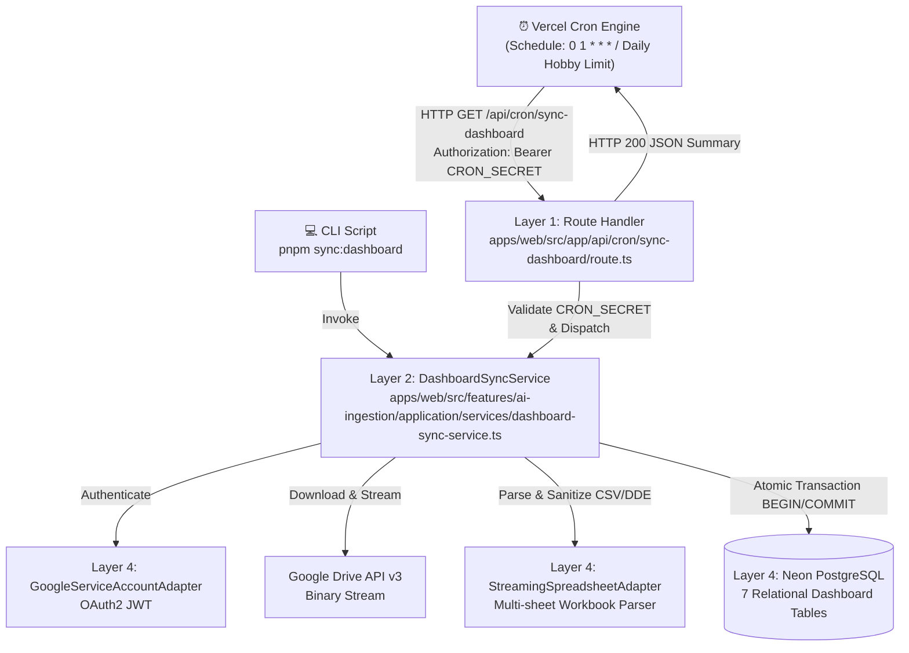

# Solution Spec: Vercel Cron Job for Dashboard Excel Synchronization (BBC-018)

## 1. Governance & Agent Assignment
- **Initiative Planner**: `planner`
- **Lead Implementation Specialist**: `api` (Next.js Route Handlers, cron endpoints, service integration)
- **Architect Gatekeeper**: `architect` (Gate 1 & Gate 2 - 4-Layer monorepo compliance)
- **Quality & Review**: `qa` & `reviewer`
- **Security Auditor**: `security` (Bearer Token / `CRON_SECRET` validation guard)

## 2. Solution Overview & 4-Layer Architecture
El sistema automatiza la ingesta periódica desde Google Drive hacia Neon PostgreSQL mediante una tarea programada en Vercel (Vercel Cron) que invoca un Route Handler seguro en Next.js. La lógica de negocio se extrae a un servicio reutilizable en la capa de Aplicación.



### Layer 1: Presentation (API Route Handlers)
- `apps/web/src/app/api/cron/sync-dashboard/route.ts`:
  - Expone método `GET`.
  - Configura `export const dynamic = 'force-dynamic'` y `export const maxDuration = 60`.
  - Comprueba la cabecera `Authorization: Bearer ${CRON_SECRET}`. Retorna `401 Unauthorized` si el token es incorrecto o ausente.
  - Ejecuta `dashboardSyncService.executeSync()` y retorna código `200 OK` con un payload JSON detallando el número de entidades sincronizadas y la duración de la operación.
  - Atrapa excepciones no controladas retornando `500 Internal Server Error` sin exponer trazas de base de datos sensibles.

### Layer 2: Application / Consumption (Services & DTOs)
- `apps/web/src/features/ai-ingestion/application/services/dashboard-sync-service.ts`:
  - Servicio que orquesta el flujo de sincronización de punta a punta.
  - Recibe por inyección de dependencias `IGoogleAuthPort`, `ISpreadsheetParserPort` y la instancia de conexión `Pool` / `DatabaseExecutor`.
  - Descarga el libro `DASH-BOARD-Blue-Brick-Panel-Administracion.xlsx` usando `DASHBOARD_FILE_ID = "1MToOPlgJnmrLk8kDYooyQeCrTqT3HtGl"`.
  - Parsea las 7 hojas y realiza el upsert atómico en Neon PostgreSQL dentro de una transacción (`BEGIN` / `COMMIT` / `ROLLBACK`).
  - Retorna un `DashboardSyncResultDto` estructurado.

### Layer 3: Domain / Pipelines / Contracts
- `apps/web/src/features/ai-ingestion/domain/models/dashboard-sync-models.ts`:
  - Define las interfaces `DashboardSyncResultDto`, `DashboardSyncMetrics` y contratos de validación de secretos de autorización.
- Invariantes de seguridad:
  - Sanitización de fórmulas CSV/DDE en todas las celdas de texto.
  - Rechazo inmediato de peticiones no autorizadas sin consultar base de datos ni Google APIs.

### Layer 4: Infrastructure & External Integrations
- `vercel.json`: Declaración de la directiva `crons`:
  ```json
  "crons": [
    {
      "path": "/api/cron/sync-dashboard",
      "schedule": "0 */2 * * *"
    }
  ]
  ```
- `scripts/sync-dashboard-excel.ts`: Refactorizado para delegar en `DashboardSyncService`, garantizando DRY entre el entorno local y productivo.
- Componentes de infraestructura existentes reutilizados:
  - `GoogleServiceAccountAdapter`
  - `StreamingSpreadsheetAdapter`
  - Neon PostgreSQL Pool (`getDatabasePool()`)

## 3. Atomic Slices & Logical Sequence
- **SPEC-1 (Core Service Extraction & Domain Models)**:
  - Definir interfaces de dominio en `domain/models/dashboard-sync-models.ts`.
  - Crear `DashboardSyncService` en `application/services/dashboard-sync-service.ts` aislando la lógica de descarga, parseo y upsert transaccional.
  - Crear suite de pruebas unitarias con mocks (`tests/unit/dashboard-sync-service.test.ts`).
- **SPEC-2 (Route Handler, Vercel Cron Config & CLI Refactor)**:
  - Implementar `apps/web/src/app/api/cron/sync-dashboard/route.ts` con protección `CRON_SECRET`.
  - Añadir configuración `crons` en `vercel.json`.
  - Refactorizar `scripts/sync-dashboard-excel.ts` para usar el nuevo servicio.
  - Crear pruebas unitarias del Route Handler (`tests/unit/api-cron-sync-dashboard.test.ts`).

## 4. TDD (Test-Driven Development) Strategy
### Unit/Integration Tests (Fase RED)
- **Test File Paths**:
  - `tests/unit/dashboard-sync-service.test.ts`: Valida que el servicio autentica con Google, parsea el buffer, ejecuta las 7 consultas transaccionales de upsert y maneja rollback ante fallos.
  - `tests/unit/api-cron-sync-dashboard.test.ts`: Valida que la ruta `/api/cron/sync-dashboard`:
    1. Rechaza peticiones sin cabecera de autorización (401).
    2. Rechaza peticiones con token inválido (401).
    3. Retorna 200 y JSON con métricas cuando `Authorization` coincide con `CRON_SECRET`.
    4. Maneja fallos del servicio retornando 500.
- **Command**: `pnpm test`
- **Assertion Goals**:
  - 100% de aserciones pasando tanto para casos de éxito como para ramas de error y seguridad.

## 5. Local Definition of Done (DoD)
- [ ] La fase actual del tracker de estado es `PHASE_8_HUMAN_MERGE_APPROVED`.
- [ ] La suite de pruebas unitarias pasa al 100% (verde).
- [ ] `pnpm validate` se ejecuta con 0 errores y 0 warnings.
- [ ] La ruta `/api/cron/sync-dashboard` y `vercel.json` cumplen con la política de arquitectura y gobernanza.
- [ ] Aprobación explícita del humano registrada antes de merge a `develop`.

## 6. Spec Artifact Traceability
- **Problem Spec**: [feature-jaymusicmachine-BBC-018-cron-job-dashboard-sync.md](file:///Users/jaymusicmachine/Documents/Desarrollo/bluebrick-app/knowledge/features/feature-jaymusicmachine-BBC-018-cron-job-dashboard-sync.md)
- **Solution Spec**: [feature-jaymusicmachine-BBC-018-cron-job-dashboard-sync-implementation.md](file:///Users/jaymusicmachine/Documents/Desarrollo/bluebrick-app/knowledge/features/feature-jaymusicmachine-BBC-018-cron-job-dashboard-sync-implementation.md)
- **Linear Issue**: N/A (Linear sync omitido por instrucción explícita del usuario: "SKIP LINEAR sync").

## 7. SPEC Development History
### SPEC-1: `SPEC/jaymusicmachine-BBC-018-s01-dashboard-sync-service`
- **Scope**: Extracción modular del servicio de aplicación `DashboardSyncService` y modelos de dominio `dashboard-sync-models.ts` dentro de la rebanada FDD `apps/web/src/features/ai-ingestion/`.
- **Patterns**: Inyección de dependencias (`IGoogleAuthProviderPort`, `ISpreadsheetParserPort`, `IDashboardDbPool`), transacciones atómicas de 7 tablas (`BEGIN` / `COMMIT` / `ROLLBACK`), verificación de tokens en tiempo constante (`constantTimeCompare`), y exportación pública vía barrel `index.ts`.
- **Testing**: 6 tests unitarios con TDD RED-GREEN en `tests/unit/dashboard-sync-service.test.ts`.
- **Verification**: `pnpm validate` ejecutado con 62 archivos y 391 tests pasando.
- **Status**: Stable & Verified. Integrated into parent feature branch.

### SPEC-2: `SPEC/jaymusicmachine-BBC-018-s02-cron-route-and-vercel-config`
- **Scope**: Implementación del Route Handler `apps/web/src/app/api/cron/sync-dashboard/route.ts` con protección `CRON_SECRET`, directiva de crons en `vercel.json` (`0 1 * * *` ajustada al límite diario de Vercel Hobby), refactorización del script CLI `scripts/sync-dashboard-excel.ts` eliminando 240+ líneas duplicadas, y suite de pruebas unitarias/integración.
- **Patterns**: Autenticación criptográfica en tiempo constante (`verifyCronAuthorization`), Serverless route config (`dynamic = "force-dynamic"`, `maxDuration = 60`), desacoplamiento en 4 capas (Layer 1 solo invoca Layer 2 sin tocar DB directamente).
- **Testing**: 4 tests unitarios/integración en `tests/unit/api-cron-sync-dashboard.test.ts` cubriendo 401 (sin header/token inválido), 200 (éxito con payload JSON) y 500 (manejo resiliente de errores).
- **Status**: Stable & Verified. Integrated into parent feature branch.


