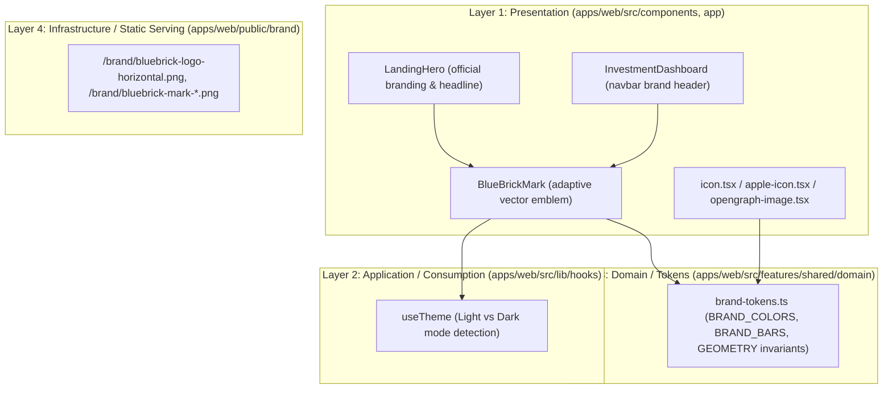

# Solution Spec: brand-visual-identity-redesign Implementation (BBC-019)

## 1. Governance & Agent Assignment
- **Initiative Planner**: `planner`
- **Lead Implementation Specialist**: `frontend`
- **Architect Gatekeeper**: `architect` (Gate 1 & Gate 2)
- **Quality & Review**: `qa` & `reviewer`

## 2. Solution Overview & 4-Layer Architecture

The brand visual identity integration strictly honors the 4-layer architecture across presentation, domain, and static infrastructure:

### Layer Breakdown
- **Layer 1 (Presentation)**:
  - `apps/web/src/components/dashboard/blue-brick-mark.tsx`: Vector SVG implementation of the 4 angled stadium capsule bars with exact proportions, -24° angle, and theme-adaptive fills (`#04283C` in light mode, `#FFFFFF` in dark mode, `#FC040C` accent).
  - `apps/web/src/components/landing/landing-hero.tsx`: Updates typography and incorporates the official vector mark.
  - `apps/web/src/app/icon.tsx`, `apple-icon.tsx`, `opengraph-image.tsx`: Dynamic Next.js App Router metadata generators updated to use official brand tokens.
- **Layer 2 (Application / Consumption)**:
  - `useTheme()` consumer hook to dynamically toggle between dark and light variants of the emblem.
- **Layer 3 (Domain / Brand Tokens)**:
  - Immutable brand token contracts defining hex values and bar proportions, eliminating hardcoded magic values.
- **Layer 4 (Infrastructure & Static Delivery)**:
  - Static asset distribution under `apps/web/public/brand/` for direct Next.js static serving without symlinks.

## 3. Atomic Slices & Logical Sequence

- **SPEC-1**: `SPEC/jaymusicmachine-BBC-019-s01-brand-components-and-assets`
  - **RED Phase**: Create comprehensive failing unit tests in `tests/unit/blue-brick-brand.test.tsx` verifying brand token definitions, vector mark structure, theme switching, and web discovery output.
  - **GREEN Phase**: Implement vector `BlueBrickMark`, align `LandingHero`, `icon.tsx`, `apple-icon.tsx`, and `opengraph-image.tsx` with official tokens.
  - **REFACTOR Phase**: Execute clean-code audit, ensuring 100% in-code commentary, zero dead code, and verify `pnpm validate`.

## 4. TDD (Test-Driven Development) Strategy

### Unit/Integration Tests (Fase RED)
- **Test File Path**: `tests/unit/blue-brick-brand.test.tsx`
- **Command**: `pnpm test tests/unit/blue-brick-brand.test.tsx`
- **Assertion Goals**:
  1. `BlueBrickMark` renders 4 path/span capsule bars with correct heights and rounding.
  2. `BlueBrickMark` renders `#04283C` (Deep Navy) for structural bars in Light Mode and `#FC040C` for accent bar.
  3. `BlueBrickMark` renders `#FFFFFF` (Pure White) for structural bars in Dark Mode and `#FC040C` for accent bar.
  4. Brand asset files exist in `apps/web/public/brand/` with valid headers.

## 5. Local Definition of Done (DoD)
- [ ] La fase actual del tracker de estado es `PHASE_8_HUMAN_MERGE_APPROVED`.
- [ ] Pruebas unitarias de marca en `tests/unit/blue-brick-brand.test.tsx` pasan al 100%.
- [ ] `pnpm validate` ejecuta con 0 errores (lint, typecheck, licencias, arquitectura, gobernanza).
- [ ] Las imágenes públicas y transparentes están accesibles en `apps/web/public/brand/`.
- [ ] Aprobación explícita del humano registrada.

## 6. Spec Artifact Traceability
- **Problem Spec**: [feature-jaymusicmachine-BBC-019-brand-visual-identity-redesign.md](file:///Users/jaymusicmachine/Documents/Desarrollo/bluebrick-app/knowledge/features/feature-jaymusicmachine-BBC-019-brand-visual-identity-redesign.md)
- **Solution Spec**: [feature-jaymusicmachine-BBC-019-brand-visual-identity-redesign-implementation.md](file:///Users/jaymusicmachine/Documents/Desarrollo/bluebrick-app/knowledge/features/feature-jaymusicmachine-BBC-019-brand-visual-identity-redesign-implementation.md)
- **Linear Issue**: BBC-019
