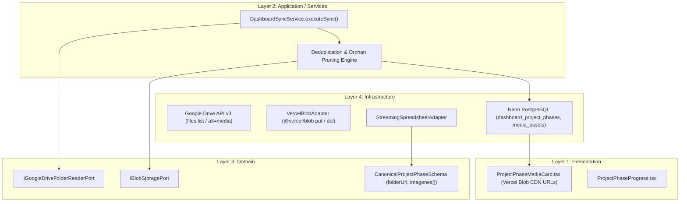

# Solution Spec: images-drive-folder-ingestion Implementation (BBC-8)

## 1. Governance & Agent Assignment
- **Initiative Planner**: `planner`
- **Lead Implementation Specialist**: `api` & `db`
- **Architect Gatekeeper**: `architect` (Gate 1 & Gate 2)
- **Quality & Review**: `qa` & `reviewer`
- **Security Auditor**: `security`

## 2. Solution Overview & 4-Layer Architecture



### Layer 1: Presentation Layer
- [`ProjectPhaseMediaCard.tsx`](file:///Users/jaymusicmachine/Documents/Desarrollo/bluebrick-app/apps/web/src/components/dashboard/project-phase-media-card.tsx):
  - Consume `images: readonly string[]` que contienen URLs públicas y seguras del CDN de Vercel Blob (`*.public.blob.vercel-storage.com`).
  - Mantiene intacta la experiencia de usuario: carrusel interactivo, transiciones con Motion, indicadores de paginación y fallback si la lista está vacía.
  - Cero código de integración o tokens de Google Drive en el cliente.

### Layer 2: Application / Services Layer
- [`DashboardSyncService.ts`](file:///Users/jaymusicmachine/Documents/Desarrollo/bluebrick-app/apps/web/src/features/ai-ingestion/application/services/dashboard-sync-service.ts):
  - Orquesta el ciclo de sincronización ampliado para fases de obra:
    1. Si `phase.folderUrl` está presente, llama a `folderReader.listImagesInFolder(folderId)`.
    2. Consulta `media_assets` para evaluar qué `drive_file_id` ya existen y si su firma o `modifiedTime` ha variado.
    3. Para archivos no existentes o modificados: descarga el binario desde Drive, valida magic bytes y sube a Vercel Blob mediante `VercelBlobAdapter`.
    4. Registra/actualiza el mapeo en `media_assets`.
    5. Detecta imágenes eliminadas de la carpeta en Drive y ejecuta `del(orphanUrl)` en Vercel Blob (mantenimiento de almacenamiento).
    6. Persiste el conjunto ordenado de URLs en `dashboard_project_phases.imagenes`.

### Layer 3: Domain Layer
- [`canonical-dashboard-schema.ts`](file:///Users/jaymusicmachine/Documents/Desarrollo/bluebrick-app/apps/web/src/features/ai-ingestion/domain/schemas/canonical-dashboard-schema.ts):
  - Extiende `CanonicalProjectPhaseSchema` con `folderUrl: z.string().nullable().optional()` e `imagenes: z.array(z.string().url()).default([])`.
- Puerto `IGoogleDriveFolderReaderPort`:
  - Contrato tipado con método `listImageFiles(folderId: string): Promise<DriveImageFileInfo[]>`.

### Layer 4: Infrastructure Layer
- **Migración DDL**:
  - `apps/web/src/features/shared/infrastructure/db/migrations/005_phase_folder_and_images_array.sql`:
    ```sql
    ALTER TABLE dashboard_project_phases
      ADD COLUMN IF NOT EXISTS folder_url TEXT,
      ADD COLUMN IF NOT EXISTS imagenes TEXT[] DEFAULT '{}';
    ```
- **Lector de Carpetas de Google Drive**:
  - Implementación de `GoogleDriveFolderReaderAdapter` o extensión segura en infraestructura utilizando la Service Account existente (`GoogleServiceAccountAdapter`).
- **Almacenamiento Perimetral Vercel Blob**:
  - Reutilización de [`VercelBlobAdapter`](file:///Users/jaymusicmachine/Documents/Desarrollo/bluebrick-app/apps/web/src/features/ai-ingestion/infrastructure/vercel-blob-adapter.ts) con soporte para borrado atómico (`delBlob`).
- **Repositorio de Inversiones**:
  - [`investment-repository.ts`](file:///Users/jaymusicmachine/Documents/Desarrollo/bluebrick-app/apps/web/src/lib/infrastructure/db/repositories/investment-repository.ts):
    - `enrichItemsWithProjectPhases` lee prioritariamente `row.imagenes`. Si viene vacío, hace fallback retrocompatible a `[row.imagen_url_1, row.imagen_url_2, row.imagen_url_3]`.

## 3. Atomic Slices & Logical Sequence

- **SPEC-1**: Detección de Carpeta de Google Drive en Spreadsheet, Extensión del Esquema Canónico y Migración DDL
  - **Rama**: `SPEC/jaymusicmachine-BBC-8-s01-folder-detection-and-schema`
  - **Alcance**:
    - Detector y normalizador de URLs de carpetas de Drive (`extractDriveFolderId()`) en `streaming-spreadsheet-adapter.ts`.
    - Actualización de `CanonicalProjectPhaseSchema` con `folderUrl` e `imagenes`.
    - Creación de migración `005_phase_folder_and_images_array.sql` y actualización de tipos en `db.ts`.
  - **Ciclo TDD**: RED (tests de detección y parsing de folder) ➔ GREEN ➔ REFACTOR.

- **SPEC-2**: Lector de Carpetas Drive API v3, Ingesta a Vercel Blob y Deduplicación en `DashboardSyncService`
  - **Rama**: `SPEC/jaymusicmachine-BBC-8-s02-drive-blob-sync-and-deduplication`
  - **Alcance**:
    - Implementación de consulta a Drive API v3 (`files.list` filtrando por carpeta y tipos mime de imagen).
    - Descarga binaria de imágenes y subida vía `VercelBlobAdapter`.
    - Deduplicación con `media_assets`: reutiliza `blob_url` si el `drive_file_id` ya existe sin cambios.
    - Persistencia en `dashboard_project_phases` (`folder_url` e `imagenes`).
  - **Ciclo TDD**: RED (tests unitarios con mock de Drive y Blob) ➔ GREEN ➔ REFACTOR.

- **SPEC-3**: Poda de Huérfanos de Vercel Blob, Reconciliación de Consumo en Repositorio y Verificación End-to-End
  - **Rama**: `SPEC/jaymusicmachine-BBC-8-s03-blob-prune-and-repository-enrichment`
  - **Alcance**:
    - Limpieza automática de blobs eliminados de la carpeta (`@vercel/blob del`).
    - Actualización de `InvestmentRepository.ts` para enriquecer con `row.imagenes`.
    - Verificación visual y de renderizado en `ProjectPhaseMediaCard.tsx`.
  - **Ciclo TDD**: RED (tests de poda de huérfanos y repositorio) ➔ GREEN ➔ REFACTOR.

## 4. TDD (Test-Driven Development) Strategy

### Unit/Integration Tests (Fase RED)
- **Test File Path**:
  - `tests/unit/drive-folder-detection.test.ts` (SPEC-1)
  - `tests/unit/drive-blob-sync-dedup.test.ts` (SPEC-2)
  - `tests/unit/blob-orphan-pruning.test.ts` (SPEC-3)
- **Command**: `pnpm vitest run tests/unit/drive-folder-detection.test.ts`
- **Assertion Goals**:
  1. Extraer con precisión el `folderId` desde strings directos, enlaces `drive.google.com/drive/folders/{id}` y celdas con parámetros query.
  2. Verificar que cuando una fase tiene `folderUrl`, el sync descargue únicamente imágenes válidas y las suba a Vercel Blob.
  3. Comprobar que archivos ya presentes en `media_assets` no se vuelvan a subir (deduplicación comprobada por número de llamadas HTTP a Blob).
  4. Comprobar que archivos que desaparecen de la carpeta de Drive provoquen la llamada a `del()` en Vercel Blob.
  5. Asegurar que `investment-repository` retorne el array completo de URLs de Vercel Blob a la tarjeta multimedia.

## 5. Local Definition of Done (DoD)
- [ ] La fase actual del tracker de estado es `PHASE_8_HUMAN_MERGE_APPROVED`.
- [ ] La suite de pruebas de regresión pasa al 100% (verde).
- [ ] `pnpm validate` se ejecuta con 0 errores y 0 warnings.
- [ ] La documentación de arquitectura local y de base de datos está actualizada.
- [ ] Aprobación explícita del humano registrada.

## 6. Spec Artifact Traceability
- **Problem Spec**: [feature-jaymusicmachine-BBC-8-images-drive-folder-ingestion.md](file:///Users/jaymusicmachine/Documents/Desarrollo/bluebrick-app/knowledge/features/feature-jaymusicmachine-BBC-8-images-drive-folder-ingestion.md)
- **Solution Spec**: [feature-jaymusicmachine-BBC-8-images-drive-folder-ingestion-implementation.md](file:///Users/jaymusicmachine/Documents/Desarrollo/bluebrick-app/knowledge/features/feature-jaymusicmachine-BBC-8-images-drive-folder-ingestion-implementation.md)
- **Linear Issue**: [Linear Ticket BBC-8](https://linear.app/brids-app/issue/BBC-8)

