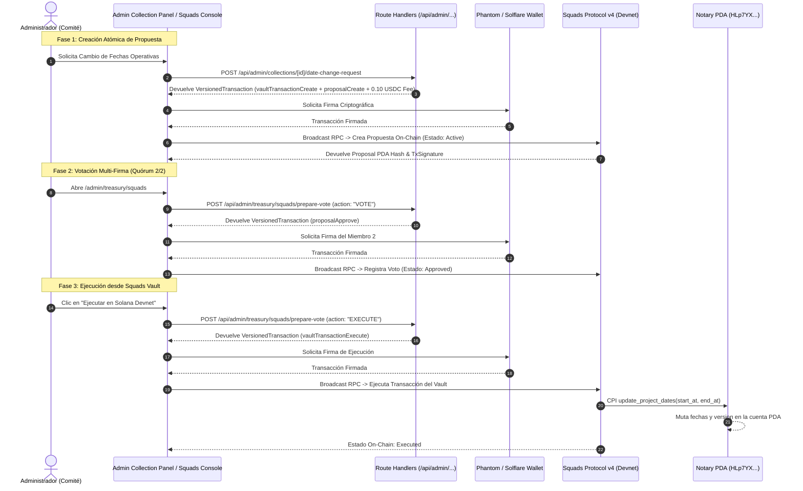

# Canonical Architecture: Squads Protocol v4 & On-Chain Notary PDA Governance (BRI-8)

## 1. Executive Summary

This document establishes the canonical architecture and runtime specifications for the **Squads Protocol v4 On-Chain Governance** integration and the **Project Config Notary PDA Program** on Solana Devnet, as implemented under `BRI-8` (`SPEC-10` & `SPEC-11`).

All simulated, memo-based, or off-chain quorum schemes have been completely eliminated. All governance operations execute as real, atomic, cryptographically signed transactions against `@sqds/multisig` and the unified Anchor program.

---

## 2. On-Chain Contracts & Account Topology

| Entity | Solana Devnet Address / Seeds | Role |
|---|---|---|
| **Squads v4 Program** | `SQDS4ep65T869zMMBKyuUq6aD6EgTu8psMjkvj52pCf` | Canonical Multisig Engine |
| **BRIDS Multisig PDA** | `rVKwqnxyq2RuU4sTBdXhifrZB9oY9mGoqw5oA6EHKaD` | 2-of-4 Governance Council |
| **BRIDS Vault PDA (Index 0)** | `D9i1XNftRpB68WTYrpCau5fEYYS2eiJa8Q738N5idSXB` | Authority holding CPI privileges |
| **Unified Anchor Program** | `HLp7YXKZZ8uPuzwN3CtuDxtgYoWhc5Fb1FHj5bHEe9zE` | Notary PDA & Payout Settlement |
| **Notary PDA (`ProjectConfigNotary`)** | Seeds: `[b"project_config", collection_pubkey]` | 134-byte immutable dates account |

---

## 3. End-to-End Governance Lifecycle

---

## 4. 4-Layer Architectural Implementation

### Layer 1: Presentation Layer
* [`AdminCollectionNotaryDatesPanel`](file:///Users/jaymusicmachine/Documents/Desarrollo/brids/apps/web/src/features/admin/presentation/admin-collection-notary-dates-panel.tsx):
  * Displays live on-chain notarized operating dates read directly from Solana RPC.
  * Form for proposing date changes with calendar inputs, 0.10 USDC platform fee badge, and mandatory wallet signature.
  * Banner for pending proposals displaying **Proposal PDA Hash**, **Creation TX Hash**, and direct 1-click button to vote in Squads.
* [`SquadsMultisigConsole`](file:///Users/jaymusicmachine/Documents/Desarrollo/brids/apps/web/src/features/admin/presentation/squads-multisig-console.tsx):
  * Dynamic multi-proposal switcher prioritizing active and approved proposals over historic executed ones.
  * Real-time state machine: `Active` (0/2, 1/2) ➔ `Approved` (2/2) ➔ `Executed`.
  * Single unified action button triggering `proposalApprove` or `vaultTransactionExecute`.

### Layer 2: Application / API Layer
* [`POST /api/admin/collections/[id]/date-change-request`](file:///Users/jaymusicmachine/Documents/Desarrollo/brids/apps/web/src/app/api/admin/collections/%5Bid%5D/date-change-request/route.ts): Prepares atomic `VersionedTransaction` with `vaultTransactionCreate` + `proposalCreate`.
* [`GET /api/admin/treasury/squads/proposals`](file:///Users/jaymusicmachine/Documents/Desarrollo/brids/apps/web/src/app/api/admin/treasury/squads/proposals/route.ts): Queries on-chain `multisig.accounts.Proposal` accounts from Solana Devnet RPC.
* [`POST /api/admin/treasury/squads/prepare-vote`](file:///Users/jaymusicmachine/Documents/Desarrollo/brids/apps/web/src/app/api/admin/treasury/squads/prepare-vote/route.ts): Prepares unsigned transactions for either `proposalApprove` or `vaultTransactionExecute` based on proposal state.
* [`POST /api/admin/treasury/squads/vote`](file:///Users/jaymusicmachine/Documents/Desarrollo/brids/apps/web/src/app/api/admin/treasury/squads/vote/route.ts): Broadcasts signed transactions to Solana Devnet RPC and updates transitory UI cache.

### Layer 3: Domain Layer
* [`apps/web/src/features/admin/domain/squads-multisig-types.ts`](file:///Users/jaymusicmachine/Documents/Desarrollo/brids/apps/web/src/features/admin/domain/squads-multisig-types.ts):
  * Pure domain models: `SquadsProposalDTO`, `UnifiedMultisigAction`.
  * Pure evaluators: `evaluateDateAuditWarning`, `evaluateQuorumStatus`, `evaluateUnifiedMultisigAction`.

### Layer 4: Infrastructure Layer
* [`apps/web/src/lib/solana-kit/compat/squads-v4-client.ts`](file:///Users/jaymusicmachine/Documents/Desarrollo/brids/apps/web/src/lib/solana-kit/compat/squads-v4-client.ts):
  * Native `@sqds/multisig` SDK integration.
  * PDA derivation helpers: `deriveSquadsProposalPda`, `deriveSquadsVaultPda`, `deriveSquadsVaultTxPda`.
  * Transaction compilers: `prepareSquadsDateChangeProposalTransaction`, `prepareSquadsProposalApproveTransaction`, `prepareSquadsVaultTransactionExecute`.
* [`programs/project_config_notary`](file:///Users/jaymusicmachine/Documents/Desarrollo/brids/programs/project_config_notary):
  * Unified Anchor smart contract holding on-chain project notary state.

---

## 5. Security & Invariant Rules

1. **Devnet Only Constraint**: All blockchain operations target Solana Devnet exclusively. Mocks, simulated transactions, or localnet fallbacks are strictly prohibited.
2. **Authority Boundary**: Only the Squads Vault PDA (`D9i1XNft...`) can invoke `update_project_dates` or `initialize_project_config` on the Notary Program. Direct calls by unverified wallets are rejected by Anchor with `UnauthorizedNotaryAuthority`.
3. **Deterministic Merkle & PDA Derivation**: All account addresses and leaves are calculated deterministically using canonical seeds without client-side malleability.
4. **Idempotency & Replay Protection**: Each transaction index in Squads Protocol v4 can only be executed once, guaranteeing strict once-and-only-once execution semantics.
