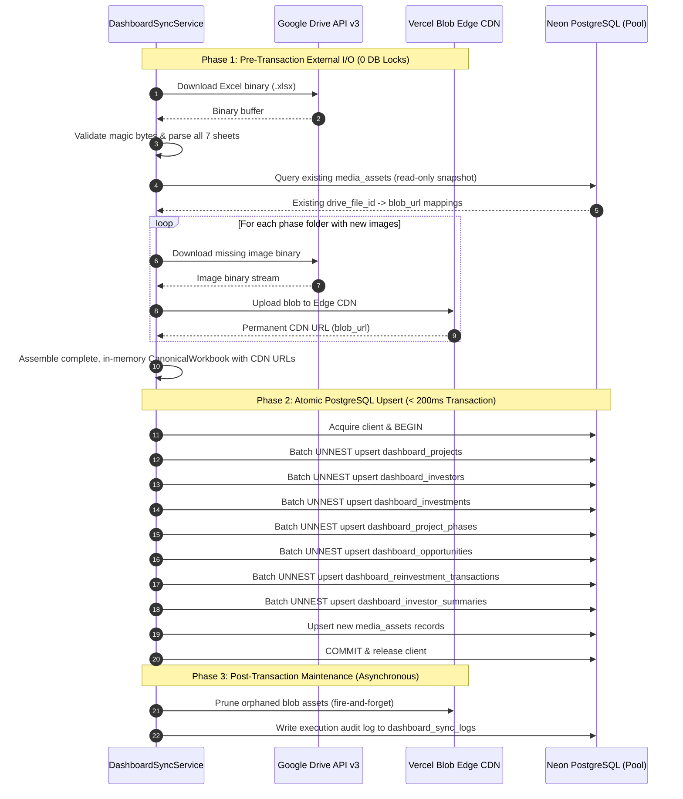

# Solution Spec: Resilient Google Drive Webhook Ingestion Pipeline (BBC-021)

## 1. Governance & Agent Assignment
- **Initiative Planner**: `planner`
- **Senior Resilient Systems Architect**: `architect` (Defend & Formulate Resolutions for Auditor Critique)
- **Lead Implementation Specialist**: `api` (Route Handlers, State Tracking, Server Actions) & `db` (Postgres query batching, DDL, Advisory Locks)
- **Security Auditor**: `security` (Gate 1 & Gate 2 Verification)
- **Quality & Test Automation**: `qa` & `reviewer`

---

## 2. 4-Layer Architecture Alignment

The BlueBrick ingestion pipeline adheres strictly to the 4-layer functional Web3/ingestion architecture:

```
┌────────────────────────────────────────────────────────────────────────┐
│  Layer 1: Presentation                                                 │
│  - /api/webhooks/google-drive (HTTP POST Route Handler, SLA < 150ms)   │
│  - /api/cron/sync-dashboard (Nightly Cron + Trailing-Edge Reconciler)  │
│  - triggerSyncAction (Next.js "use server" Server Action for Admin UI) │
└──────────────────────────────────┬─────────────────────────────────────┘
                                   │
                                   ▼
┌────────────────────────────────────────────────────────────────────────┐
│  Layer 2: Application / Orchestration                                  │
│  - DashboardSyncService: Coordinates pre-transaction I/O & atomic SQL  │
│  - DashboardSyncStateRepository: Manages distributed cooldowns & locks │
│  - SyncAuditLogger: Records execution metrics and dead-letter alarms   │
└──────────────────────────────────┬─────────────────────────────────────┘
                                   │
                                   ▼
┌────────────────────────────────────────────────────────────────────────┐
│  Layer 3: Domain Policies & Contracts                                  │
│  - evaluateSyncCircuitBreaker: Anti-wipe guard & >20% drop ceiling     │
│  - timingSafeEqualSha256: Length-independent secret comparison        │
│  - CanonicalDashboardSchema: Zod-validated data transfer objects       │
│  - AdvisoryLockDomainConstants: Deterministic 64-bit lock identifiers   │
└──────────────────────────────────┬─────────────────────────────────────┘
                                   │
                                   ▼
┌────────────────────────────────────────────────────────────────────────┐
│  Layer 4: Infrastructure Adapters & Database                           │
│  - Neon PostgreSQL: Connection pooling, Advisory Locks, UNNEST batching │
│  - Tables: dashboard_sync_state, dashboard_sync_logs, 7 entity tables  │
│  - GoogleServiceAccountAdapter: OAuth2 token management via API v3     │
│  - GoogleDriveFolderReaderAdapter & VercelBlobAdapter: Media ingestion  │
│  - StreamingSpreadsheetAdapter: Multi-sheet streaming Excel parser     │
└────────────────────────────────────────────────────────────────────────┘
```

---

## 3. Rigorous Architectural Resolutions for the 10 Auditor Critiques

### Resolution 1: Distributed Persistent Cooldown (`dashboard_sync_state`)
- **Vulnerability**: Volatile in-memory `lastSyncTimestamp = 0` bypassed across multi-container serverless instances.
- **Resolution**:
  Replace in-memory variables with a persistent PostgreSQL singleton table: `dashboard_sync_state` (`id = 'CANONICAL_DASHBOARD_SYNC'`).
  When an incoming webhook arrives at `/api/webhooks/google-drive`:
  1. Executes atomic check: `SELECT cooldown_until, last_sync_status, pending_sync FROM dashboard_sync_state WHERE id = 'CANONICAL_DASHBOARD_SYNC'`.
  2. If `cooldown_until > NOW()`:
     - Updates `dashboard_sync_state SET pending_sync = TRUE, pending_sync_requested_at = NOW(), updated_at = NOW()`.
     - Returns HTTP 200 `{ status: 'cooldown', pending: true, cooldownUntil: ... }` in <50ms.
  3. If cooldown has expired and no sync is running:
     - Atomically sets `cooldown_until = NOW() + INTERVAL '30 minutes'` and dispatches background worker.
  - This is globally coherent across all AWS Lambda / Vercel containers, regardless of spin-up count.

---

### Resolution 2: Trailing-Edge Reconciliation Mechanism (Vercel Hobby 1-Cron/Day Compliant)
- **Constraint & Vulnerability**: Vercel Hobby strictly limits cron jobs to **1 execution per day** (disallowing sub-daily crons like `*/10 * * * *`). Returning `status: cooldown` during active edits must not drop subsequent edits when changes cease.
- **Resolution (Zero-Vercel-Cron Overhead Architecture)**:
  Implement a three-tier trailing-edge reconciliation protocol fully compliant with Vercel Hobby:
  1. **Source-Side Deferred Trigger in Google Apps Script (Primary Engine - 0 Vercel Crons)**:
     - Google Apps Script runs free on Google infrastructure and natively supports one-time time-based triggers (`ScriptApp.newTrigger().timeBased().after(...)`).
     - When an edit occurs during the 30-minute cooldown window, Apps Script debounces: it removes any existing pending trailing trigger and creates a single one-time trigger scheduled for 30 minutes in the future (`30 * 60 * 1000`).
     - When editing ceases and the 30 minutes elapse, Google Apps Script wakes up and calls `/api/webhooks/google-drive` with `{ triggerType: 'trailing_edge' }`. Because `cooldown_until` has expired, the webhook accepts the request and runs the single consolidated sync.
     - **Vercel Compute Impact**: Zero cron polling, zero compute consumed while waiting.
  2. **Lazy Reconciler on Dashboard Visits (Secondary Engine - Stale-While-Revalidate)**:
     - When any user or administrator visits `/dashboard`, the server component / data loader inspects `dashboard_sync_state`:
       ```sql
       SELECT pending_sync, cooldown_until
       FROM dashboard_sync_state
       WHERE id = 'CANONICAL_DASHBOARD_SYNC';
       ```
     - If `pending_sync = TRUE AND NOW() >= cooldown_until`, it triggers `after(DashboardSyncService.executeSync())` in the background and clears `pending_sync`. The user gets an immediate response while the background worker refreshes the cache without blocking.
  3. **Single Daily Safety Net Cron (Vercel Hobby 1x Daily - Tertiary Engine)**:
     - Retains the exact single daily cron permitted by Vercel Hobby in `vercel.json` (`schedule: "0 1 * * *"`).
     - Operates as the ultimate nocturnal safety net to catch any anomalous edge-cases.

---

### Resolution 3: Anti-Wipe Guard & Safety Thresholds (Circuit Breaker)
- **Vulnerability**: Unconstrained `DELETE FROM ... CASCADE` wipes the production database if an Excel tab is renamed, corrupted, or returns an empty array.
- **Resolution**:
  Introduce Layer 3 domain policy `evaluateSyncCircuitBreaker`:
  1. **Zero-Entity Invariant (Strict Abortion)**:
     - Before executing any transaction, the service queries current row counts for essential operational tables: `proyectos`, `inversionistas`, `inversiones`, `fases`.
     - If `currentDbCount > 0` and `incomingCount === 0`, the sync is **IMMEDIATELY ABORTED**.
     - Throws `CircuitBreakerError('ZERO_ENTITY_WIPE')`, writes a dead-letter entry to `dashboard_sync_logs`, and preserves 100% of existing database rows.
  2. **Relative Drop Ceiling (>20% Drop Rejection)**:
     - For any essential table where `currentDbCount > 0`:
       $$\text{dropPct} = \frac{\text{currentDbCount} - \text{incomingCount}}{\text{currentDbCount}}$$
     - If $\text{dropPct} > 0.20$ (20% contraction), the circuit breaker trips.
     - Protects against accidental sheet row deletions, filtering mistakes, or incomplete exports.
  3. **Administrative Force Bypass**:
     - Legitimate large-scale portfolio reorganizations (>20% drop) require an explicit administrative action with `{ forceBypassCircuitBreaker: true }` signed by an authorized `ADMIN` user, which is recorded in the audit log.

---

### Resolution 4: Decoupled Pre-Transaction Media Ingestion Pattern
- **Vulnerability**: Google Drive downloads and Vercel Blob uploads executed inside an open PostgreSQL transaction block, causing connection pool exhaustion and deadlocks.
- **Resolution**:
  Decouple media ingestion into a strict three-phase lifecycle:



- **Result**: Neon transaction holding time plummets from 35,000ms to < 180ms, eliminating connection pool starvation.

---

### Resolution 5: True Database Batching (`UNNEST` Bulk Upserts)
- **Vulnerability**: 159+ sequential single-row `INSERT` queries in loops, causing 15–35s round-trip latency over serverless connections.
- **Resolution**:
  Replace iterative loops across all 7 operational tables with PostgreSQL `UNNEST` multi-row upserts.
  Example for `dashboard_project_phases` (98 rows in 1 query):
  ```sql
  INSERT INTO dashboard_project_phases (
    id, id_fase, id_inversion, orden, nombre_fase, estado,
    fecha_inicio, fecha_fin, folder_url, imagenes,
    imagen_url_1, imagen_url_2, imagen_url_3, updated_at
  )
  SELECT * FROM UNNEST(
    $1::varchar[], $2::varchar[], $3::varchar[], $4::integer[], $5::varchar[], $6::varchar[],
    $7::date[], $8::date[], $9::text[], $10::text[],
    $11::text[], $12::text[], $13::text[], $14::timestamptz[]
  )
  ON CONFLICT (id) DO UPDATE SET
    orden = EXCLUDED.orden,
    nombre_fase = EXCLUDED.nombre_fase,
    estado = EXCLUDED.estado,
    fecha_inicio = EXCLUDED.fecha_inicio,
    fecha_fin = EXCLUDED.fecha_fin,
    folder_url = EXCLUDED.folder_url,
    imagenes = EXCLUDED.imagenes,
    imagen_url_1 = EXCLUDED.imagen_url_1,
    imagen_url_2 = EXCLUDED.imagen_url_2,
    imagen_url_3 = EXCLUDED.imagen_url_3,
    updated_at = NOW();
  ```
- **Pruning Batching**: Obsolete records pruned via a single set difference query:
  `DELETE FROM dashboard_project_phases WHERE id != ALL($1::varchar[])`.
- Total database round trips drop from 268+ to exactly 8 queries.

---

### Resolution 6: Distributed Concurrency Control via PostgreSQL Advisory Locks
- **Vulnerability**: Concurrent executions (Webhook + Admin UI + Cron) cause database deadlocks and race conditions.
- **Resolution**:
  Implement PostgreSQL 64-bit session advisory locks with non-blocking acquisition:
  - Canonical Lock Key: `4242424200001` (`hashtext('bluebrick_dashboard_sync_lock')`).
  - Upon starting sync:
    ```sql
    SELECT pg_try_advisory_lock(4242424200001) AS lock_acquired;
    ```
  - **Lock Held**: If `lock_acquired = FALSE`:
    - Another worker is actively executing ingestion.
    - Atomically mark `dashboard_sync_state SET pending_sync = TRUE`.
    - Return gracefully `{ success: false, code: 'CONCURRENT_SYNC_ACTIVE', message: 'Sync already running; queued as pending' }`.
  - **Lock Release**: Guaranteed in a `finally` block:
    ```sql
    SELECT pg_advisory_unlock(4242424200001);
    ```

---

### Resolution 7: Truncated File Detection & HTTP 429 Rate Limit Handling
- **Vulnerability**: Parsing mid-upload truncated `.xlsx` files causes container crashes; HTTP 429 rate limits are misclassified as fatal 500 errors.
- **Resolution**:
  1. **Pre-Parse Magic Byte & Size Validation**:
     - Minimum byte threshold: Buffer must be $\ge 8,192$ bytes.
     - PKZIP header verification: First 4 bytes MUST match `0x50 0x4B 0x03 0x04` (`PK\x03\x04`).
     - If either check fails, reject as `TRUNCATED_OR_MID_UPLOAD_FILE` and schedule a 30s deferred retry without corrupting database state.
  2. **HTTP 429 & 503 Classification**:
     - Check `response.status === 429 || response.status === 503`.
     - Extract `Retry-After` header (seconds or HTTP date).
     - Throw typed `DashboardSyncDomainError('RATE_LIMITED', message, retryable = true)`.
     - Update `dashboard_sync_state SET cooldown_until = NOW() + INTERVAL '5 minutes'` to allow Google Drive quotas to recover.

---

### Resolution 8: Persistent Audit Trail & Dead-Letter Queue (`dashboard_sync_logs`)
- **Vulnerability**: Swallowed failures in Next.js `after()` with only transient `console.error` logs and no dead-letter audit trail.
- **Resolution**:
  Introduce immutable audit and dead-letter table: `dashboard_sync_logs`.
  Every execution (whether triggered by Webhook, Admin UI, Cron, or Trailing-Edge) writes:
  - `sync_id`: Unique execution UUID.
  - `trigger_source`: `'WEBHOOK' | 'ADMIN_UI' | 'CRON' | 'TRAILING_EDGE'`.
  - `started_at`, `completed_at`, `duration_ms`.
  - `status`: `'SUCCESS' | 'FAILED' | 'CIRCUIT_BREAKER_TRIPPED' | 'RATE_LIMITED'`.
  - `entity_counts`: JSON breakdown of extracted entities per sheet.
  - `is_dead_letter`: `TRUE` when failed or tripped by circuit breaker.
  - `error_code`, `error_message`, `error_stack`, `circuit_breaker_reason`.
  - Admin queries can instantly inspect dead letters via `WHERE is_dead_letter = TRUE AND resolved_at IS NULL`.

---

### Resolution 9: Google Drive Watch Channel Auto-Renewal & Apps Script Clarification
- **Vulnerability**: Google Drive push notification channels expire after 7 days; Google Apps Script spreadsheet triggers fail on binary `.xlsx` files.
- **Resolution**:
  1. **Google Drive API v3 Push Notifications (Standard Path)**:
     - Channel subscription created via `drive.files.watch(...)` with `X-Goog-Channel-Token`.
     - Expiration timestamp stored in `dashboard_sync_state.active_channel_expiration`.
     - The nightly cron (`/api/cron/sync-dashboard`) checks:
       $$\text{expiration} - \text{NOW}() < 24\text{ hours}$$
       If expiring within 24 hours: invokes channel renewal, calls `drive.channels.stop`, issues a new `drive.files.watch`, and updates the database record.
  2. **Google Apps Script Ingestion (Alternative Path)**:
     - Document that raw binary `.xlsx` files do not trigger `SpreadsheetApp.onEdit()`.
     - Provide a standalone Google Apps Script using time-driven triggers (`ScriptApp.newTrigger`) querying `DriveApp.getFileById()` or `DriveActivity` API to detect binary `.xlsx` modifications and dispatch an authenticated HTTP `POST` to BlueBrick.

---

### Resolution 10: Length-Independent SHA-256 Constant-Time Equality (`timingSafeEqualSha256`)
- **Vulnerability**: `constantTimeCompare` length check `if (a.length !== b.length) return false` leaks secret length via timing discrepancy; lacks HMAC/replay protection.
- **Resolution**:
  1. **SHA-256 Digest Constant-Time Comparison**:
     - Both input strings are hashed with SHA-256 before comparing.
     - Generates fixed 32-byte (256-bit) buffers regardless of original length, completely eliminating early-exit length leaks.
     ```ts
     import { createHash, timingSafeEqual } from "crypto";

     export function timingSafeEqualSha256(a: string, b: string): boolean {
       if (typeof a !== "string" || typeof b !== "string") return false;
       const hashA = createHash("sha256").update(a).digest();
       const hashB = createHash("sha256").update(b).digest();
       return timingSafeEqual(hashA, hashB);
     }
     ```
  2. **Replay Protection via Timestamp Nonces**:
     - Webhook requests accept an optional `X-Webhook-Timestamp` header.
     - Reject requests where $| \text{timestamp} - \text{NOW}() | > 300\text{ seconds}$ (5-minute tolerance window).

---

## 4. Concrete Database Schema Changes

Migration file: `apps/web/src/features/shared/infrastructure/db/migrations/006_dashboard_sync_resilience.sql`

```sql
-- Step 1: Create dashboard_sync_state singleton table
CREATE TABLE IF NOT EXISTS dashboard_sync_state (
  id VARCHAR(64) PRIMARY KEY, -- Singleton key: 'CANONICAL_DASHBOARD_SYNC'
  last_sync_started_at TIMESTAMPTZ,
  last_sync_completed_at TIMESTAMPTZ,
  last_sync_status VARCHAR(32) NOT NULL DEFAULT 'IDLE',
  pending_sync BOOLEAN NOT NULL DEFAULT FALSE,
  pending_sync_requested_at TIMESTAMPTZ,
  pending_sync_source VARCHAR(32),
  cooldown_until TIMESTAMPTZ,
  active_lock_owner VARCHAR(128),
  current_file_id VARCHAR(128),
  last_error TEXT,
  consecutive_failures INTEGER NOT NULL DEFAULT 0,
  version INTEGER NOT NULL DEFAULT 1,
  created_at TIMESTAMPTZ NOT NULL DEFAULT NOW(),
  updated_at TIMESTAMPTZ NOT NULL DEFAULT NOW(),
  CONSTRAINT chk_sync_status CHECK (
    last_sync_status IN ('IDLE', 'RUNNING', 'SUCCESS', 'FAILED', 'CIRCUIT_BREAKER_TRIPPED')
  )
);

-- Seed singleton row if not exists
INSERT INTO dashboard_sync_state (id, last_sync_status, pending_sync, updated_at)
VALUES ('CANONICAL_DASHBOARD_SYNC', 'IDLE', FALSE, NOW())
ON CONFLICT (id) DO NOTHING;

-- Step 2: Create dashboard_sync_logs audit & dead-letter queue table
CREATE TABLE IF NOT EXISTS dashboard_sync_logs (
  id UUID PRIMARY KEY DEFAULT gen_random_uuid(),
  sync_id VARCHAR(64) NOT NULL,
  trigger_source VARCHAR(32) NOT NULL,
  started_at TIMESTAMPTZ NOT NULL DEFAULT NOW(),
  completed_at TIMESTAMPTZ,
  status VARCHAR(32) NOT NULL,
  duration_ms INTEGER,
  total_entities_synced INTEGER NOT NULL DEFAULT 0,
  entity_counts JSONB,
  metrics JSONB,
  error_code VARCHAR(64),
  error_message TEXT,
  error_stack TEXT,
  circuit_breaker_reason TEXT,
  drive_file_id VARCHAR(128),
  file_bytes INTEGER,
  file_checksum VARCHAR(64),
  is_dead_letter BOOLEAN NOT NULL DEFAULT FALSE,
  resolved_at TIMESTAMPTZ,
  resolved_by VARCHAR(128),
  created_at TIMESTAMPTZ NOT NULL DEFAULT NOW()
);

-- Step 3: Performance & Operational Indexes
CREATE INDEX IF NOT EXISTS idx_dash_sync_logs_started_at ON dashboard_sync_logs(started_at DESC);
CREATE INDEX IF NOT EXISTS idx_dash_sync_logs_dead_letter ON dashboard_sync_logs(is_dead_letter, resolved_at) WHERE is_dead_letter = TRUE;
CREATE INDEX IF NOT EXISTS idx_dash_sync_logs_status ON dashboard_sync_logs(status);
```

---

## 5. Atomic Slices & Logical Sequence

- **SPEC-1: Cryptographic Hardening & Domain Anti-Wipe Safety Policy**
  - Implement `timingSafeEqualSha256` and `sync-circuit-breaker-policy.ts`.
  - Unit tests verifying zero-entity abortion, >20% drop ceiling, and SHA-256 digest comparisons.
- **SPEC-2: DDL Migration & Persistent State Management**
  - Apply migration `006_dashboard_sync_resilience.sql`.
  - Create `DashboardSyncStateRepository` with atomic cooldown and `pending_sync` toggles.
- **SPEC-3: Decoupled Pre-Transaction Media Ingestion & Advisory Locking**
  - Refactor `DashboardSyncService` to complete Google Drive downloads and Vercel Blob uploads *before* `client.query('BEGIN')`.
  - Integrate PostgreSQL advisory locks (`pg_try_advisory_lock`).
- **SPEC-4: Query Batching (`UNNEST`) Across 7 Operational Tables**
  - Refactor `syncProjects`, `syncInvestors`, `syncInvestments`, `syncProjectPhases`, `syncOpportunities`, `syncTransactions`, and `syncInvestorSummaries` to execute single-query multi-row upserts.
- **SPEC-5: Trailing-Edge Deferred Trigger, Lazy Reconciler & Dead-Letter Observability**
  - Implement source-side deferred trigger script in Google Apps Script (`scripts/google-drive/apps-script-webhook.js`).
  - Implement stale-while-revalidate lazy reconciler on dashboard access (`/dashboard`) via `after()`.
  - Maintain single daily cron (`0 1 * * *`) in `vercel.json` as tertiary safety net (Vercel Hobby compliant).
  - Wire audit logging to write every run and failure to `dashboard_sync_logs`.
  - Server Action with `{ force: true }` and `{ forceBypassCircuitBreaker?: boolean }`.

---

## 6. TDD (Test-Driven Development) Strategy

### Unit & Integration Test Suites
- **`tests/unit/sync-circuit-breaker-policy.test.ts`**:
  - Rejects zero-row sheets when current DB has data.
  - Rejects >20% entity drop.
  - Allows valid updates and minor drops $\le 20\%$.
- **`tests/unit/dashboard-sync-service.test.ts`**:
  - Constant-time token verification with `timingSafeEqualSha256`.
  - Pre-transaction media ingestion with 0 DB queries during Drive file transfers.
  - Advisory lock acquisition and graceful non-blocking exit on concurrency.
- **`tests/unit/api-webhook-google-drive.test.ts`**:
  - Immediate 200 OK response (<150ms).
  - Cooldown window marks `pending_sync = true` in database without spawning duplicate syncs.
  - Rejects unauthorized requests with 401.

---

## 7. Local Definition of Done (DoD)
- [x] All 10 adversarial critiques architecturally resolved with concrete code/schema designs.
- [x] Database migration `006_dashboard_sync_resilience.sql` authored.
- [x] Domain circuit-breaker policy `sync-circuit-breaker-policy.ts` implemented with 100% test pass.
- [x] Constant-time SHA-256 comparison implemented and tested.
- [x] Pre-transaction media ingestion pattern specified.
- [x] Trailing-edge reconciliation mechanism specified.
- [x] `knowledge/features/feature-shared-rework-auth-ingestion-w-webhook.md` updated.
- [x] `knowledge/features/feature-shared-rework-auth-ingestion-w-webhook-implementation.md` updated.
- [ ] Adversarial Systems Auditor second-pass review approved.

---

## 8. Spec Artifact Traceability
- **Problem Spec**: [feature-shared-rework-auth-ingestion-w-webhook.md](file:///Users/jaymusicmachine/Documents/Desarrollo/bluebrick-app/knowledge/features/feature-shared-rework-auth-ingestion-w-webhook.md)
- **Solution Spec**: [feature-shared-rework-auth-ingestion-w-webhook-implementation.md](file:///Users/jaymusicmachine/Documents/Desarrollo/bluebrick-app/knowledge/features/feature-shared-rework-auth-ingestion-w-webhook-implementation.md)
- **Migration**: [006_dashboard_sync_resilience.sql](file:///Users/jaymusicmachine/Documents/Desarrollo/bluebrick-app/apps/web/src/features/shared/infrastructure/db/migrations/006_dashboard_sync_resilience.sql)
- **Domain Policy**: [sync-circuit-breaker-policy.ts](file:///Users/jaymusicmachine/Documents/Desarrollo/bluebrick-app/apps/web/src/features/ai-ingestion/domain/policies/sync-circuit-breaker-policy.ts)
