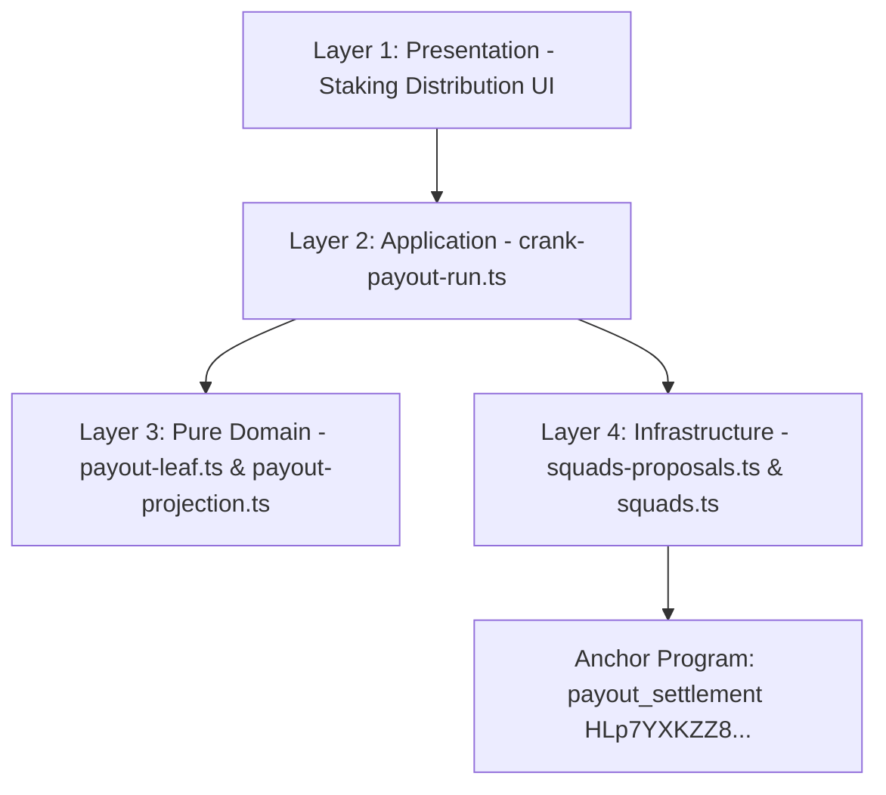

# Feature Implementation: Squads v4 Treasury Claims & Delegated Allowance Settlement (Solution Document)

## 1. Architecture & Component Decomposition

The implementation strictly follows the 4-Layer Feature-Driven Design (FDD) architecture established in PR #327:

### Layer 1 — Presentation
* Distribution dashboards and governance views (`apps/web/src/features/staking-distribution/presentation/`).

### Layer 2 — Application / Orchestration
* [`crank-payout-run.ts`](file:///Users/jaymusicmachine/Documents/Desarrollo/brids/apps/web/src/features/staking-distribution/application/crank-payout-run.ts): Encodes `settle_claim` instructions and plans batch execution with idempotency checks.

### Layer 3 — Pure Domain
* [`payout-leaf.ts`](file:///Users/jaymusicmachine/Documents/Desarrollo/brids/apps/web/src/features/staking-distribution/domain/payout-leaf.ts): 191-byte leaf encoding, Keccak-256 hashing, directional Merkle verification.
* [`payout-projection.ts`](file:///Users/jaymusicmachine/Documents/Desarrollo/brids/apps/web/src/features/staking-distribution/domain/payout-projection.ts): Progress metric calculations, $O(1)$ set filtering, and transaction-safe batching.

### Layer 4 — Infrastructure & On-Chain Runtime
* [`squads-proposals.ts`](file:///Users/jaymusicmachine/Documents/Desarrollo/brids/apps/web/src/features/staking-distribution/infrastructure/squads-proposals.ts): Squads v4 PDA derivation and CPI proposal builders.
* [`programs/payout_settlement/`](file:///Users/jaymusicmachine/Documents/Desarrollo/brids/programs/payout_settlement/src/lib.rs): Anchor program deployed on Solana Devnet (`HLp7YXKZZ8uPuzwN3CtuDxtgYoWhc5Fb1FHj5bHEe9zE`).

## 2. On-Chain Invariants & Proofs

* **Deployed Program ID:** `HLp7YXKZZ8uPuzwN3CtuDxtgYoWhc5Fb1FHj5bHEe9zE` (Slot `486180563`).
* **Test Suite Coverage:** 59 unit/integration tests + 4,500 property-based fuzzing runs across Enfoques A, B y C.
* **Audit Report:** [`QA-AND-FUZZING-REPORT.md`](file:///Users/jaymusicmachine/Documents/Desarrollo/brids/knowledge/rfcs/EPIC-015-squads-v4-treasury-claims/QA-AND-FUZZING-REPORT.md).
