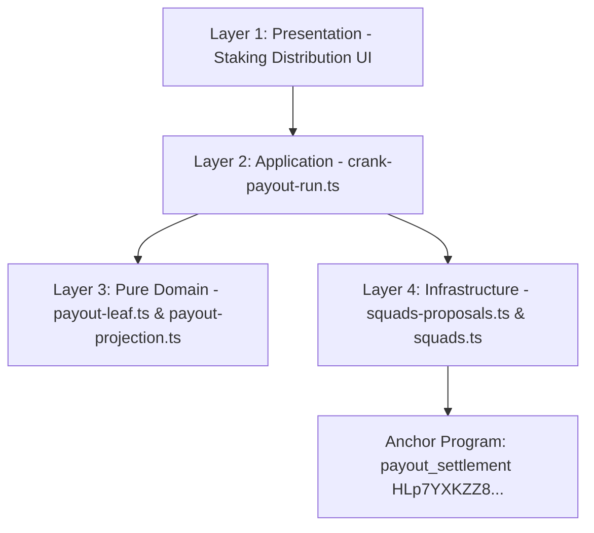

# Feature Implementation: Squads v4 Treasury Claims & Delegated Allowance Settlement (Solution Document)

## 1. Architecture & Component Decomposition

The implementation strictly follows the 4-Layer Feature-Driven Design (FDD) architecture established in PR #327:

### Layer 1 — Presentation
* Distribution dashboards and governance views (`apps/web/src/features/staking-distribution/presentation/`).

### Layer 2 — Application / Orchestration
* [`crank-payout-run.ts`](file:///Users/jaymusicmachine/Documents/Desarrollo/brids/apps/web/src/features/staking-distribution/application/crank-payout-run.ts): Encodes `settle_claim` instructions and plans batch execution with idempotency checks.

### Layer 3 — Pure Domain
* [`payout-leaf.ts`](file:///Users/jaymusicmachine/Documents/Desarrollo/brids/apps/web/src/features/staking-distribution/domain/payout-leaf.ts): 191-byte leaf encoding, Keccak-256 hashing, directional Merkle verification.
* [`payout-projection.ts`](file:///Users/jaymusicmachine/Documents/Desarrollo/brids/apps/web/src/features/staking-distribution/domain/payout-projection.ts): Progress metric calculations, $O(1)$ set filtering, and transaction-safe batching.

### Layer 4 — Infrastructure & On-Chain Runtime
* [`squads-proposals.ts`](file:///Users/jaymusicmachine/Documents/Desarrollo/brids/apps/web/src/features/staking-distribution/infrastructure/squads-proposals.ts): Squads v4 PDA derivation and CPI proposal builders.
* [`programs/payout_settlement/`](file:///Users/jaymusicmachine/Documents/Desarrollo/brids/programs/payout_settlement/src/lib.rs): Anchor program deployed on Solana Devnet (`HLp7YXKZZ8uPuzwN3CtuDxtgYoWhc5Fb1FHj5bHEe9zE`).

## 3. SPEC-11: Unified Anchor Program Architecture & On-Chain Notary PDA Upgrade

### Canonical Unified Program Details
* **Canonical Program ID:** `HLp7YXKZZ8uPuzwN3CtuDxtgYoWhc5Fb1FHj5bHEe9zE` (Devnet)
* **Upgrade Authority:** `3tW8Jp3QAMqY2KM27KgddizUyS7rvc7hEsbwCU8siATd`
* **Unified Instructions:**
  1. `initialize_policy`: Sets up Squads v4 multisig binding and dual attester keys for payouts.
  2. `update_policy`: Updates payout attesters or emergency pause authority.
  3. `initialize_run`: Creates draft payout run and escrow ATA.
  4. `seal_run`: Verifies exact escrow funding and activates payout run.
  5. `settle_claim`: Settles individual Merkle proof claims with ClaimReceipt PDA.
  6. `initialize_project_config`: Initializes `[b"project_config", collection_address]` PDA with `start_at` and `end_at` dates and binds Squads v4 Vault.
  7. `update_project_dates`: Updates notarized project dates via Squads v4 Vault CPI.
  8. `ping`: Health check instruction.

### On-Chain PDA & Security Invariants
* **PDA Seed Layout:** `[b"project_config", collection_address.as_ref()]`
* **Account Size:** 134 bytes (8 discriminator + 32 authority_vault + 32 multisig + 1 vault_index + 32 collection_address + 8 start_at + 8 end_at + 4 version + 8 updated_at + 1 bump)
* **3-Layer Squads Vault Authentication:**
  - Layer 1: Signer check (`authority_vault.is_signer == true`).
  - Layer 2: Mathematical PDA re-derivation against Squads v4 (`[b"multisig", multisig.key().as_ref(), b"vault", &[vault_index]]`).
  - Layer 3: Multisig program owner check (`multisig.owner == SQDS4ep65T869zMMBKyuUq6aD6EgTu8psMjkvj52pCf`).
* **Range Invariant:** `start_at <= end_at` enforced on initialization and updates.

