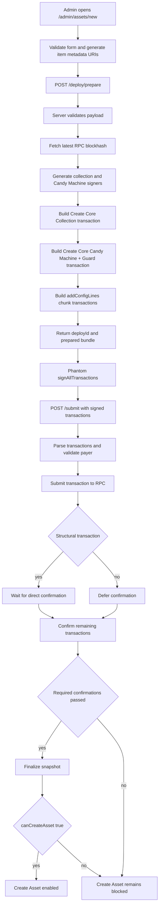

# Candy Machine Deploy Iteration: 2026-06-07

## Purpose

This is the first implementation snapshot for the `/admin/assets/new` Candy Machine deploy system.

It records the module state after restoring the deploy behavior to the PR `#286` baseline while preserving PRs `#290` and `#292`, then adding detailed diagnostics without changing deploy semantics.

## Iteration Metadata

- Date: 2026-06-07
- Branch: `codex/fix-admin-cm-deploy-detailed-logs`
- Base branch: `develop` after PR `#293`
- PR: `#294`
- Final merged PR: `#294`
- Related issue: no Linear issue assigned yet
- Human acceptance: approved by user in Codex thread on 2026-06-07
- Runtime target: devnet
- Scope: observability for `/admin/assets/new` Core Candy Machine deploy

## Functional Baseline

The deploy flow creates a Core Collection, creates a Core Candy Machine with guard configuration, loads config lines, waits for confirmation, finalizes a server-side snapshot, and enables Create Asset only when the snapshot returns `canCreateAsset: true`.

This iteration does not add retry, recovery, background deploy records, or relaxed snapshot gating.

## Implementation Snapshot

Frontend:

- File: `components/admin/core-candy-machine-panel.tsx`
- Responsibility: admin deploy state, wallet signing boundary, submit request, status polling, snapshot finalization, and Create Asset gate display.
- Notable state transitions: prepare request, wallet signing, submit request, confirmation wait, snapshot finalization, gate enabled or blocked.

Prepare route:

- File: `app/api/admin/core-candy-machine/deploy/prepare/route.ts`
- Responsibility: receives the deploy payload and asks the server deploy service to build prepared transactions.
- Output: deploy id, collection address, Candy Machine address, prepared transaction bundle, and transaction metadata.

Submit route:

- File: `app/api/admin/core-candy-machine/submit/route.ts`
- Responsibility: receives signed transactions, forwards the deploy id for trace correlation, and calls the server submit pipeline.
- Security note: `deployId` is correlation only; it does not authorize or verify the deploy.

Core deploy service:

- File: `lib/core-candy-machine-admin.ts`
- Responsibility: validates deploy input, builds transactions, chunks config lines, submits signed transactions to RPC, and confirms signatures.
- Important functions: `prepareCoreCandyMachineDeploy`, `submitCoreCandyMachineSignedTransactions`, `sendRawTransactionWithRetry`, `waitForConfirmedSignature`.

Snapshot/finalize:

- File: `lib/core-candy-machine-snapshot-service.ts`
- Responsibility: reads Candy Machine state and decides whether Create Asset can be enabled.
- Gate condition: Create Asset remains blocked unless the server snapshot returns `canCreateAsset: true`.

Observability:

- Files: `lib/core-candy-machine-admin.ts`, `components/admin/core-candy-machine-panel.tsx`, `lib/observability/store.ts`
- Runtime log location: structured JSON in server console, browser console, and operability logs.
- Markdown memory location: `docs/knowledge/inbox/2026-06/KNOW-2026-06-001-admin-candy-machine-module-worklog.md`

## Flow Diagram



## Transaction Assembly

Deploy transaction order:

1. Create Core Collection.
2. Create Core Candy Machine and Guard.
3. Load config lines in chunks.

Create Core Collection:

- Expected account after confirmation: Core Collection account.
- Failure meaning: the deploy has not reached Candy Machine creation, so config-line recovery cannot work.
- Confirmation stance: structural transaction; confirm directly.

Create Core Candy Machine and Guard:

- Expected account after confirmation: Core Candy Machine account and guard configuration.
- Failure meaning: there is no Candy Machine account to load or snapshot.
- Confirmation stance: structural transaction; confirm directly.

Load config lines:

- Expected account effect: Candy Machine `itemsLoaded` advances toward configured quantity.
- Failure meaning: Candy Machine may exist, but item loading is incomplete.
- Confirmation stance: can be confirmed after structural transactions because the Candy Machine already exists.

## Metaplex Core Plugins

PermanentFreezeDelegate:

- Level: collection-level permanent plugin.
- Creation point: collection or asset creation path, depending on the target authority model.
- Authority model: permanent freeze authority configured at creation.
- Why it exists: collection-level freeze control.
- Security concern: should not be confused with owner-managed asset freeze behavior.

PermanentTransferDelegate:

- Level: collection-level permanent plugin.
- Creation point: collection or asset creation path.
- Authority model: permanent transfer authority.
- Why it exists: controlled transfer authority.
- Security concern: must be intentionally configured because it changes transfer authority semantics.

FreezeDelegate:

- Level: asset-level plugin.
- Creation point: after a specific asset exists.
- Authority model: owner-managed asset freeze authority when used for Stake and Unstake semantics.
- Why it exists: supports asset-level freeze behavior.
- Security concern: cannot be applied to non-existent assets during Candy Machine deploy.

AppData external plugin adapter:

- Level: asset-level external plugin adapter.
- Creation point: after mint or asset creation.
- Authority model: application-controlled data writes.
- Why it exists: attaches economic or marketplace data to a Core asset.
- Security concern: app data must be verified server-side before marketplace activation.

## Security Contract

Allowed diagnostics:

- public keys
- signatures
- transaction kind and index
- serialized byte length
- signer count
- instruction count
- RPC host
- blockhash and last valid block height
- confirmation status and error summary

Forbidden diagnostics:

- private keys
- wallet secrets
- auth headers
- cookies
- request bodies
- full signed transaction payloads
- full transaction base64

Client-provided correlation ids must not authorize, verify, or unblock Create Asset.

## What Changed In This Iteration

- Added detailed deploy trace events for prepare, signing, submit, RPC send, confirmation, timeout, and snapshot finalization boundaries.
- Added `deployId` propagation from prepare to submit for log correlation.
- Added a focused API test proving submit forwards `deployId` to the server pipeline.
- Added lightweight enforcement in `validate:knowledge` so Candy Machine deploy path changes require a branch-level iteration file.
- Updated canonical NFT/auth/session docs with the deploy logging contract.

## What Did Not Work

Longer snapshot retry/wait direction:

- Result: made the UI appear stuck and did not address transaction submission lifecycle failures.
- Why it failed: the main failure can happen before snapshot finalization, especially while waiting for RPC confirmation.
- Future guidance: distinguish transaction submission, confirmation, config-line loading, and snapshot read failures before adding waits.

Config-line recovery after collection-only success:

- Result: failed when the Candy Machine account did not exist.
- Why it failed: config lines can only be loaded into an existing Candy Machine.
- Future guidance: recovery must first prove which on-chain accounts exist before choosing a recovery action.

Client-driven recovery:

- Result: rejected as a security risk.
- Why it failed: the client cannot decide that Create Asset is verified.
- Future guidance: all recovery can be user-triggered, but verification must remain server-side against RPC.

## Manual Test Record

No manual deploy test has been recorded for this logging iteration yet.

```text
Date:
Wallet:
Quantity:
RPC host:
Deploy id:
Collection:
Candy Machine:
Signatures:
Final UI message:
Last successful log event:
First failing log event:
Conclusion:
Next action:
```

## Open Questions

- Which exact event appears before the next production timeout?
- Does the timeout happen before RPC acceptance, after RPC acceptance, or during status visibility?
- Are failures correlated with quantity, chunk count, RPC host, blockhash age, or wallet signing delay?
- Should future iterations introduce a server-side pending deploy record after the logging evidence proves the failure boundary?
