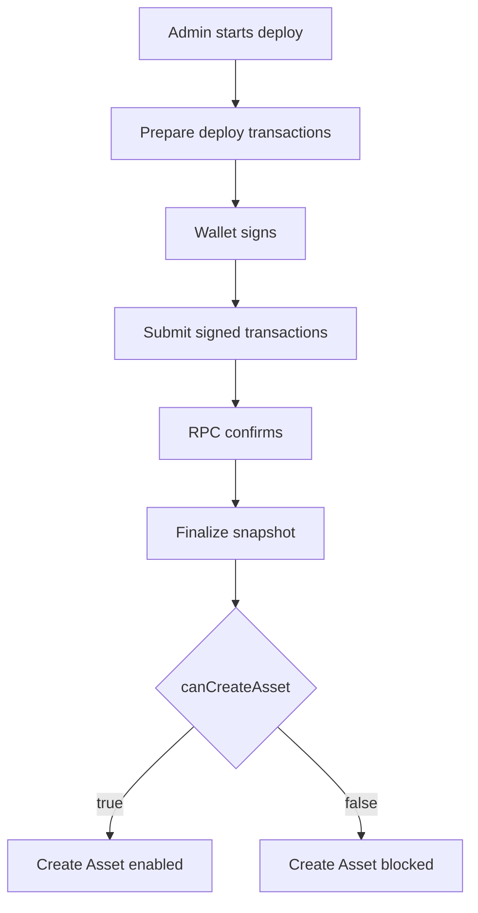

# Candy Machine Deploy Iteration: 2026-06-11

## Purpose

Capture the current `/admin/assets/new` Core Candy Machine deploy system while the branch-policy and preflight merge is being normalized.

This iteration records the deploy flow as it exists on the current branch, the merge conflict resolution state, and the follow-up validation work needed to keep the Create Asset gate trustworthy.

## Iteration Metadata

- Date: 2026-06-11
- Branch: `refactor/czambrano-BRI-173-branching-policy-preflight`
- Base branch: `develop`
- PR: `#284`
- Final merged PR: pending
- Related issue: `BRI-173`
- Human acceptance: pending
- Runtime target: devnet
- Scope: branch-policy-preflight plus Core Candy Machine deploy validation

## Functional Baseline

The current system prepares deploy transactions on the server, asks Phantom to sign them, submits the signed transactions to the backend, confirms the resulting signatures, and finalizes a server-side snapshot before enabling Create Asset.

This branch merge does not change the deploy shape itself. It mainly reconciles governance text, PR gating, and knowledge artifacts around the deploy flow so that the existing system stays observable and auditable.

## Implementation Snapshot

Frontend:

- File: `components/admin/core-candy-machine-panel.tsx`
- Responsibility: render the admin deploy flow and show the snapshot / Create Asset gate state
- Notable state transitions: deploy prepared -> wallet signed -> submit confirmed -> snapshot finalized or recoverable

Prepare route:

- File: `app/api/admin/core-candy-machine/deploy/prepare/route.ts`
- Responsibility: assemble deploy transactions for the admin flow
- Inputs: deploy form state, collection data, config lines
- Outputs: signed-transaction payload and deploy metadata

Submit route:

- File: `app/api/admin/core-candy-machine/submit/route.ts`
- Responsibility: accept signed deploy transactions and submit them to the RPC
- Inputs: signed transactions, deploy identifiers, correlation data
- Outputs: submitted signatures and confirmation status

Core deploy service:

- File: `lib/core-candy-machine-admin.ts`
- Responsibility: coordinate deploy preparation, submission, and post-submit state
- Important functions: deploy assembly, retry-safe submission, and snapshot handoff

Snapshot/finalize:

- File: `lib/core-candy-machine-snapshot-service.ts`
- Responsibility: evaluate whether the on-chain state is ready to unlock Create Asset
- Gate condition: `canCreateAsset` only becomes true when the server can verify the expected deploy state

Observability:

- Files: `docs/knowledge/inbox/2026-06/*.md`, `docs/knowledge/README.md`
- Runtime log location: server logs and admin monitoring endpoints
- Markdown memory location: `docs/knowledge/inbox/2026-06/`

## Flow Diagram



## Transaction Assembly

Deploy transaction order:

1. Create Core Collection.
2. Create Core Candy Machine and Guard.
3. Load config lines in chunks.

For each transaction type, record:

- builder function
- required signers
- structural or deferred confirmation
- expected on-chain account after confirmation
- failure meaning

## Metaplex Core Plugins

Record only plugins relevant to this iteration.

Plugin:

- Level: collection, asset, external adapter, or guard-adjacent
- Creation point:
- Authority model:
- Why it exists:
- Security concern:

## Security Contract

Allowed diagnostics:

- public keys
- signatures
- transaction kind and index
- serialized byte length
- signer count
- instruction count
- RPC host
- blockhash and last valid block height
- confirmation status and error summary

Forbidden diagnostics:

- private keys
- wallet secrets
- auth headers
- cookies
- request bodies
- full signed transaction payloads
- full transaction base64

Client-provided correlation ids must not authorize, verify, or unblock Create Asset.

## What Changed In This Iteration

- Change: reconciled the merge state for branch-policy and preflight governance.
- Reason: the branch needed to align with current develop rules without dropping Human Acceptance.
- Files: `AGENTS.md`, `.codex/*`, governance docs, PR scripts, and knowledge index files.
- Expected effect: the repo can validate its merge gates and preserve the existing deploy verification contract.

## What Did Not Work

- Attempt: run `npm run validate` before refreshing generated knowledge.
- Result: validation stopped because `docs/knowledge/README.md` was stale and the candy-machine iteration file was missing.
- Why it failed: new Candy Machine-related files require an iteration record for branch-level validation.
- What future fixes should avoid: merging deploy-adjacent changes without updating the knowledge index and iteration note in the same pass.

## Manual Test Record

```text
Date: 2026-06-11
Wallet: n/a
Quantity: n/a
RPC host: n/a
Deploy id: n/a
Collection: n/a
Candy Machine: n/a
Signatures: n/a
Final UI message: n/a
Last successful log event: merge conflict resolution completed
First failing log event: candy machine iteration validation missing
Conclusion: merge needs knowledge artifact refresh before final validation
Next action: rerun validation after this file is committed
```

## Open Questions

- Question: should this merge branch inherit a dedicated Candy Machine iteration guide or only an observed record?
- Evidence needed: a completed manual verification pass on the admin deploy flow.
- Owner: codex
