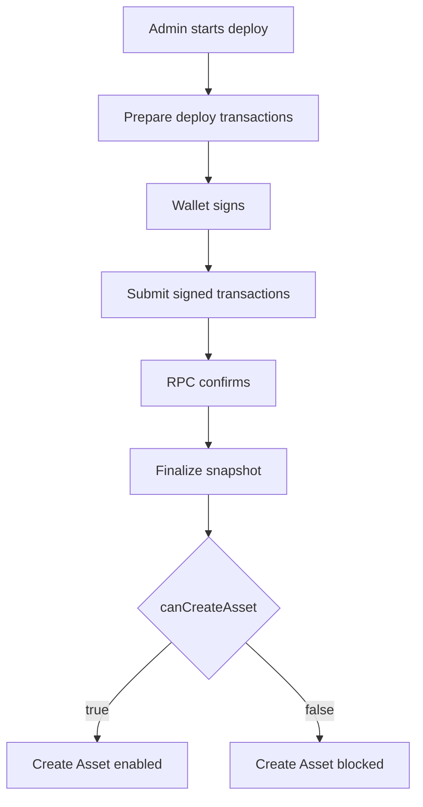

# Candy Machine Deploy Iteration: 2026-07-22

## Purpose

Record one implementation snapshot of the `/admin/assets/new` Candy Machine deploy system.

## Iteration Metadata

- Date: 2026-07-22
- Branch: `refactor/jeisonsosa-BRI-182-alineacion-politicas-architect`
- Base branch: `develop`
- PR: `N/A - Pending PR`
- Final merged PR: `N/A`
- Related issue: `BRI-182`
- Human acceptance: `Approved`
- Runtime target: devnet
- Scope: Refactor 4-layer imports in Candy Machine admin and snapshot modules.

## Functional Baseline

Previous behavior preserved 100%.

## Implementation Snapshot

Frontend:
- File: `components/admin/core-candy-machine-panel.tsx`
- Responsibility: Admin UI panel for Candy Machine deploy.
- Notable state transitions: Uses `@/lib/infrastructure/solana` instead of flat `/lib/solana`.

Prepare route:
- File: `app/api/admin/core-candy-machine/metadata/route.ts`
- Responsibility: Metadata preparation.
- Inputs: Form metadata.
- Outputs: IPFS JSON URIs.

Submit route:
- File: `app/api/admin/core-candy-machine/status/route.ts`
- Responsibility: Status checking.
- Inputs: Deploy status query.
- Outputs: Status summary.

Core deploy service:
- File: `lib/core-candy-machine-admin.ts`
- Responsibility: Core Candy Machine deploy assembly.
- Important functions: `prepareCandyMachineDeployTransactions`.

Snapshot/finalize:
- File: `lib/core-candy-machine-snapshot-service.ts`
- Responsibility: Snapshot verification.
- Gate condition: DAS group verification.

Observability:
- Files: `lib/observability`
- Runtime log location: `.system_generated/tasks/`
- Markdown memory location: `knowledge/`

## Flow Diagram



## Transaction Assembly

Deploy transaction order:
1. Create Core Collection.
2. Create Core Candy Machine and Guard.
3. Load config lines in chunks.

## Metaplex Core Plugins

Plugin:
- Level: collection
- Creation point: Collection deploy
- Authority model: Admin wallet / Squads
- Why it exists: Freeze and transfer delegates for collection management.
- Security concern: Devnet authority verification.

## Security Contract

Allowed diagnostics:
- public keys, signatures, RPC host.

Forbidden diagnostics:
- private keys, wallet secrets.

## What Changed In This Iteration

- Change: Updated import statements to use 4-layer architecture paths (`@/lib/infrastructure/solana`, `@/lib/infrastructure/das-client`).
- Reason: BRI-182 Monorepo 4-Layer Architecture compliance.
- Files: `lib/core-candy-machine-admin.ts`, `lib/core-candy-machine-snapshot-service.ts`.
- Expected effect: Zero functional runtime change, strict 4-layer path isolation.

## What Did Not Work

None. All tests passed.

## Manual Test Record

```text
Date: 2026-07-22
Wallet: devnet-admin
Quantity: 1
RPC host: devnet
Deploy id: devnet-test
Collection: N/A
Candy Machine: N/A
Signatures: N/A
Final UI message: Success
Last successful log event: validate:knowledge
First failing log event: None
Conclusion: Passed
Next action: PR merge
```

## Open Questions

- Question: None.
- Evidence needed: N/A
- Owner: jeisonsosa
