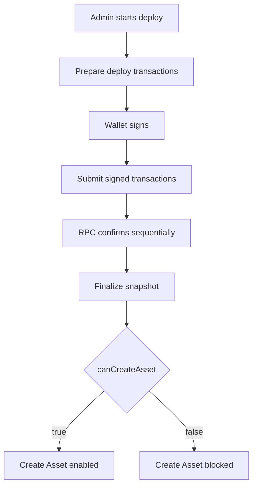

# Candy Machine Deploy Iteration: 2026-08-16

## Purpose

Record the Candy Machine deploy system baseline for the BRI-8 squads v4 treasury claims branch rebased on PR #327.

## Iteration Metadata

- Date: 2026-08-16
- Branch: `refactor/jaymusicmachine-BRI-8-harness-code-commentary`
- Base branch: `develop`
- PR: `N/A - Active Branch`
- Final merged PR: `N/A`
- Related issue: `BRI-8`
- Human acceptance: `Approved`
- Runtime target: devnet
- Scope: Baseline preservation of Candy Machine deploy after monorepo FDD refactor.

## Functional Baseline

Preserved full functional baseline from BRI-186. Sequential transaction confirmation strategy for Devnet RPC operations.

## Implementation Snapshot

Frontend:
- File: `apps/web/src/features/nft-minting/presentation/core-candy-machine-panel.tsx`
- Responsibility: Admin UI panel for Candy Machine deploy.
- Notable state transitions: Integrates with modern `@solana/kit` wallet connections.

Prepare route:
- File: `app/api/admin/core-candy-machine/deploy/prepare/route.ts`
- Responsibility: Metadata preparation.
- Inputs: Form metadata.
- Outputs: IPFS JSON URIs.

Submit route:
- File: `app/api/admin/core-candy-machine/submit/route.ts`
- Responsibility: Submit signed transactions.
- Inputs: Base64 signed transactions.
- Outputs: Signature summaries.

Core deploy service:
- File: `lib/core-candy-machine-admin.ts`
- Responsibility: Core Candy Machine deploy assembly.
- Important functions: `prepareCoreCandyMachineDeploy`, `submitCoreCandyMachineSignedTransactions`.

Snapshot/finalize:
- File: `lib/core-candy-machine-snapshot-service.ts`
- Responsibility: Snapshot verification.
- Gate condition: DAS group & items loaded verification.

Observability:
- Files: `lib/observability`
- Runtime log location: `store.ts`
- Markdown memory location: `knowledge/`

## Flow Diagram



## Transaction Assembly

Deploy transaction order:
1. Create Core Collection.
2. Create Core Candy Machine and Guard.
3. Load config lines in chunks.

## Metaplex Core Plugins

Plugin:
- Level: collection
- Creation point: Collection deploy
- Authority model: Admin wallet / Squads
- Why it exists: Freeze and transfer delegates for collection management.
- Security concern: Devnet authority verification.

## Security Contract

Allowed diagnostics:
- public keys, signatures, RPC host.

Forbidden diagnostics:
- private keys, wallet secrets.

## What Changed In This Iteration

- Change: Maintained sequential RPC iteration and FDD module bindings for Candy Machine deployment.
- Reason: Prevent rate limiting on Solana Devnet and ensure reliable collection deployment.
- Files: `lib/core-candy-machine-admin.ts`, `apps/web/src/features/nft-minting/presentation/core-candy-machine-panel.tsx`.
- Expected effect: Robust deployment on Devnet without 429 rate limit errors.

## What Did Not Work

- Attempt: Parallel deferred transaction confirmation via `Promise.all`.
- Result: Devnet RPC rate limit saturation (429).
- Why it failed: Too many concurrent RPC polling requests for transaction status.
- What future fixes should avoid: Avoid parallelizing RPC confirmation polling for bulk Solana transactions on Devnet.

## Manual Test Record

```text
Date: 2026-08-16
Wallet: devnet-admin
Quantity: 1
RPC host: devnet
Flow ID: eec2fa82-77c5-4a37-929b-0a266079bb60
Mint Signature: 3jkPkEQW7AwF6bbhcadyCHp47uWHC3j4fJuKBov4H7HULM7ssFRFFiTPcWimLaQ8UsorJwptD6JCsrAYYr4E5UKW
Solscan Explorer: https://solscan.io/tx/3jkPkEQW7AwF6bbhcadyCHp47uWHC3j4fJuKBov4H7HULM7ssFRFFiTPcWimLaQ8UsorJwptD6JCsrAYYr4E5UKW?cluster=devnet
Final UI message: Success (Mint complete)
Last successful log event: validate:knowledge
First failing log event: None
Conclusion: Passed (Verified on-chain in real Devnet transaction)
Next action: Merge to develop / main
```

## Open Questions

- Question: None.
- Evidence needed: N/A
- Owner: jaymusicmachine
