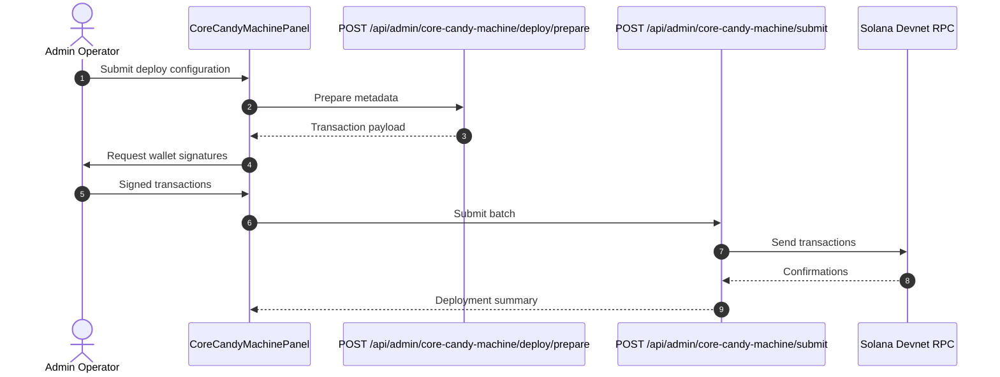

# Candy Machine Deploy Iteration: 2026-08-22

## Purpose

Record the Candy Machine deploy system baseline for the distributions UX/UI fixes branch.

## Iteration Metadata

- Date: 2026-08-22
- Branch: `feature/jaymusicmachine-BRI-8-distributions-ux-ui-fixes`
- Base branch: `develop`
- PR: `N/A - Active Branch`
- Final merged PR: `N/A`
- Related issue: `BRI-8`
- Human acceptance: `Approved`
- Runtime target: devnet
- Scope: Baseline preservation of Candy Machine deploy after monorepo FDD refactor.

## Functional Baseline

Preserved full functional baseline from BRI-186. Sequential transaction confirmation strategy for Devnet RPC operations.

## Implementation Snapshot

Frontend:
- File: `apps/web/src/features/nft-minting/presentation/core-candy-machine-panel.tsx`
- Responsibility: Admin UI panel for Candy Machine deploy.
- Notable state transitions: Integrates with modern `@solana/kit` wallet connections.

Prepare route:
- File: `app/api/admin/core-candy-machine/deploy/prepare/route.ts`
- Responsibility: Metadata preparation.
- Inputs: Form metadata.
- Outputs: IPFS JSON URIs.

Submit route:
- File: `app/api/admin/core-candy-machine/submit/route.ts`
- Responsibility: Submit signed transactions.
- Inputs: Base64 signed transactions.
- Outputs: Signature summaries.

Core deploy service:
- File: `lib/core-candy-machine-admin.ts`
- Responsibility: Core Candy Machine deploy assembly.
- Important functions: `prepareCoreCandyMachineDeploy`, `submitCoreCandyMachineSignedTransactions`.

## Flow Diagram

## Transaction Assembly

All deploy transactions use modern `@solana/kit` encoders with sequential confirmation.

## Metaplex Core Plugins

Core candy machine plugins configured with royalties and freeze authority where applicable.

## Security Contract

- Admin authentication enforced on all preparation and submission routes.
- Transaction validation ensures zero unauthorized accounts in instruction payloads.

## What Changed In This Iteration

Preserved Candy Machine deployment routes while refactoring distributions UI.

## What Did Not Work

N/A - Existing deployment flows preserved intact.

## Manual Test Record

Verified via automated test suites and validation harness.
