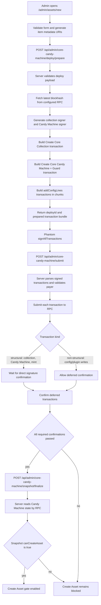

# Admin Candy Machine Module Worklog

## Purpose

This document is the living memory for the `/admin/assets/new` Candy Machine module.

It is not tied to one fix. Use it before and after future changes to record:

- how the module works at a specific point in time
- how the deploy, snapshot, and Create Asset gate are assembled
- which Metaplex Core plugins participate in the flow
- which changes were tried
- what did not work and why
- how to interpret logs during future debugging

Runtime logs stay in structured JSON through console output and operability logs. This Markdown file is the human-readable memory of the module evolution.

## How To Use This File

This file is the module index. Each implementation state should be captured as a separate iteration file using:

- `docs/knowledge/templates/CANDY_MACHINE_DEPLOY_ITERATION.template.md`

Before changing the module, create a new iteration file under `docs/knowledge/inbox/YYYY-MM/` with the branch, PR baseline, expected behavior, and known risks.

After testing, append a manual test note to that iteration with the deploy id, public addresses, public signatures, final UI state, and conclusion from logs.

When a proposed recovery or retry strategy fails, keep the note here. Do not erase failed approaches; future fixes need to know why they were rejected.

## Iteration Registry

- `2026-06-07`: `docs/knowledge/inbox/2026-06/KNOW-2026-06-002-candy-machine-deploy-iteration-2026-06-07.md`
- `2026-06-07 current-system branch`: `docs/knowledge/inbox/2026-06/KNOW-2026-06-003-candy-machine-deploy-iteration-current-system-branch.md`

## Module Snapshot: 2026-06-07

- Route: `/admin/assets/new`
- Branch under investigation: `codex/fix-admin-cm-deploy-detailed-logs`
- Base state: `develop` after PR `#293`
- Functional baseline: equivalent to PR `#286`, while preserving PR `#290` and PR `#292`
- Current change shape: observability only
- Current security stance: Create Asset remains blocked until the server verifies the Candy Machine snapshot
- Current deploy stance: keep `signAllTransactions`; do not add recovery, retry semantics, or relaxed snapshot gating in this logging slice

## Module Assembly

Frontend:

- `components/admin/core-candy-machine-panel.tsx`
- Owns the admin deploy UI state, Phantom signing boundary, submit call, status polling, snapshot finalization call, and Create Asset gate display.

Prepare route:

- `app/api/admin/core-candy-machine/deploy/prepare/route.ts`
- Receives the admin deploy payload and calls the server builder.

Submit route:

- `app/api/admin/core-candy-machine/submit/route.ts`
- Receives signed transactions from the wallet, forwards `deployId` for correlation, and calls the server submit pipeline.

Snapshot finalize route:

- `app/api/admin/core-candy-machine/snapshot/finalize/route.ts`
- Asks the server to read the deployed Candy Machine state and decide whether Create Asset can be enabled.

Core deploy service:

- `lib/core-candy-machine-admin.ts`
- Builds Core Collection, Core Candy Machine, guard, config-line transactions, submits signed transactions, and confirms signatures.

Snapshot service:

- `lib/core-candy-machine-snapshot-service.ts`
- Reads Candy Machine state after deploy and produces the snapshot gate result.

Observability:

- `lib/observability/store.ts`
- `app/api/admin/monitoring/logs/route.ts`
- Stores structured operability events for admin diagnostics.

## Current Deploy Flow



## Metaplex Core Concepts In This Module

Core Collection:

- Created during deploy with Metaplex Core.
- It is the parent collection for assets minted later by the Candy Machine.
- Collection-level permanent plugins must be decided at creation time because permanent plugins are not intended to be added later.

Core Candy Machine:

- Created during deploy with the Core Candy Machine package.
- It owns the configured item list and guard setup.
- It does not create every final marketplace asset during deploy. Deploy loads config lines; actual purchasable assets are produced later during mint.

Config lines:

- Loaded in chunks after the Candy Machine exists.
- Each config line maps an item name and metadata URI into the Candy Machine.
- If only the collection transaction confirms and the Candy Machine transaction does not exist, config-line recovery cannot work because there is no Candy Machine account to load.

Guards:

- Used to enforce sale conditions for mint.
- Current module paths include sale start, token payment, and third-party signer concepts.
- Guard configuration is server-built; the client does not decide server verification outcomes.

Snapshot gate:

- The snapshot is server-side proof that the Candy Machine state is readable and matches the expected deploy.
- Create Asset is enabled only when the server returns `canCreateAsset: true`.
- Client-provided fields may help correlate logs, but they must never authorize the gate.

## Metaplex Core Plugins Used Or Relevant

PermanentFreezeDelegate:

- Collection-level permanent plugin.
- It allows freeze control to be established at creation time.
- It is not the same thing as an owner-managed per-asset freeze control.

PermanentTransferDelegate:

- Collection-level permanent transfer authority.
- It is configured at creation time when controlled transfer authority is required.

FreezeDelegate:

- Asset-level plugin.
- Relevant for Stake and Unstake behavior when the authority model needs owner-managed asset freezing.
- This is a separate concern from collection-level permanent freeze delegation.

AppData external plugin adapter:

- Used to attach application-specific economic data to Core assets.
- This belongs to minted asset enrichment, not to Candy Machine config-line loading.

Important assembly rule:

- Collection-level permanent plugins belong in collection or asset creation paths.
- Per-asset plugins belong after a specific asset exists.
- Candy Machine deploy should not pretend minted assets already exist; it only prepares the Candy Machine and config lines.

## Current Transaction Set

Deploy phase:

1. Create Core Collection.
2. Create Core Candy Machine and Guard.
3. Load config lines in one or more chunked transactions.

Mint or post-mint enrichment phase:

1. Mint from the Candy Machine.
2. Add asset-level plugins if required.
3. Write app data or economic metadata if required.
4. Run any server verification that gates marketplace activation.

## Debug Log Security Contract

Allowed in logs:

- `deployId`
- public wallet and account addresses
- public transaction signatures
- transaction kind and index
- serialized transaction byte length
- signer count
- instruction count
- RPC host
- blockhash and `lastValidBlockHeight`
- confirmation status, slot, elapsed time, and RPC error summaries

Forbidden in logs:

- full `transactionBase64`
- full signed transaction payloads
- private keys
- cookies
- auth headers
- request bodies
- wallet secrets
- client-provided values used as authority decisions

Client-provided `deployId` is only a correlation id. It must never authorize, verify, or unblock Create Asset.

## Log Event Map

Prepare phase:

- `core_candy_machine.deploy.prepare_start`
- `core_candy_machine.deploy.prepare_blockhash`
- `core_candy_machine.deploy.prepare_accounts`
- `core_candy_machine.deploy.config_line_plan`
- `core_candy_machine.deploy.config_line_chunk_candidate`
- `core_candy_machine.deploy.config_line_chunk_too_large`
- `core_candy_machine.deploy.config_line_chunk_error`
- `core_candy_machine.deploy.transaction_prepared`
- `core_candy_machine.deploy.prepare_complete`

Client and wallet phase:

- `core_candy_machine.deploy.client.prepare_request`
- `core_candy_machine.deploy.client.prepare_response`
- `core_candy_machine.deploy.client.sign_start`
- `core_candy_machine.deploy.client.sign_single_complete`
- `core_candy_machine.deploy.client.sign_complete`
- `core_candy_machine.deploy.client.submit_request`
- `core_candy_machine.deploy.client.submit_response`
- `core_candy_machine.deploy.client.submit_timeout`
- `core_candy_machine.deploy.client.submit_error`
- `core_candy_machine.deploy.client.status_poll_complete`
- `core_candy_machine.deploy.client.snapshot_finalize_response`
- `core_candy_machine.deploy.client.flow_error`

Submit and RPC phase:

- `core_candy_machine.deploy.submit_start`
- `core_candy_machine.deploy.tx_parse_start`
- `core_candy_machine.deploy.tx_parsed`
- `core_candy_machine.deploy.tx_send_attempt`
- `core_candy_machine.deploy.tx_send_accepted`
- `core_candy_machine.deploy.tx_send_retry_wait`
- `core_candy_machine.deploy.tx_send_blockhash_expired`
- `core_candy_machine.deploy.tx_send_error`
- `core_candy_machine.deploy.tx_confirmation_strategy`
- `core_candy_machine.deploy.deferred_confirm_start`
- `core_candy_machine.deploy.submit_complete`

Confirmation phase:

- `core_candy_machine.deploy.tx_confirm_start`
- `core_candy_machine.deploy.tx_confirm_status`
- `core_candy_machine.deploy.tx_confirm_transient_error`
- `core_candy_machine.deploy.tx_confirm_error`
- `core_candy_machine.deploy.tx_confirm_failed`
- `core_candy_machine.deploy.tx_confirm_ok`
- `core_candy_machine.deploy.tx_confirm_history_status`
- `core_candy_machine.deploy.tx_confirm_history_error`
- `core_candy_machine.deploy.tx_confirm_history_transient_error`
- `core_candy_machine.deploy.tx_confirm_transaction_found`
- `core_candy_machine.deploy.tx_confirm_transaction_failed`
- `core_candy_machine.deploy.tx_confirm_transaction_lookup_error`
- `core_candy_machine.deploy.tx_confirm_tx_lookup_transient`
- `core_candy_machine.deploy.tx_confirm_timeout`

## How To Read A Failure

If the log has `client.sign_start` but no `client.sign_complete`, the wallet signing step did not finish.

If the log has `client.sign_complete` but no `submit_start`, the browser did not reach the backend submit route.

If the log has `submit_start` and `tx_parse_start` but no `tx_send_attempt`, the backend failed before RPC submission.

If the log has `tx_send_attempt` but no `tx_send_accepted`, RPC did not accept the signed transaction.

If the log has `tx_send_accepted`, the transaction reached RPC and has a public signature.

If only transaction `1/N` reaches `tx_confirm_ok`, and transaction `2/N` never reaches `tx_send_attempt`, the deploy stopped after the first transaction. The next on-chain object was probably never created.

If `create-candy-machine` reaches `tx_confirm_ok` but later `add-config-lines` fails, the Candy Machine exists and the problem is config-line loading or confirmation.

If a transaction has `tx_send_accepted` followed by repeated `tx_confirm_status` with `statusFound=false`, the network or RPC has not surfaced status for that signature yet.

If a transaction ends with `tx_confirm_timeout`, it may still confirm later, but the current backend request stopped waiting.

If snapshot finalization fails after all deploy transactions confirm, the failure is no longer transaction submission. Investigate Candy Machine account reads, config-line count, expected quantity, authority, collection mint, and RPC consistency.

## Known Failed Or Reverted Approaches

PR `#287`:

- Attempted a snapshot finalization recovery path.
- Reverted by PR `#288`.
- Lesson: recovery that changes gate timing must prove server-side state and avoid letting the client imply verification.

PR `#291`:

- Attempted longer snapshot finalization wait/retry behavior.
- Removed by PR `#293`.
- Lesson: longer waits can make the UI appear stuck and can collide with transaction lifecycle timing if the submit path is still waiting inside one request.

Config-line recovery button idea:

- Useful only after the Candy Machine account exists.
- It does not help when only the collection transaction confirmed and the Candy Machine was never created.
- Future recovery must first prove which on-chain account exists before choosing a recovery action.

## Manual Test Log Template

Copy this block when recording a real deploy:

```text
Date:
Branch:
Wallet:
Quantity:
RPC host:
Deploy id:
Collection:
Candy Machine:
Signatures:
Final UI message:
Last successful log event:
First failing log event:
Conclusion:
Next action:
```

## Change Log

### 2026-06-07

- PR `#293` restored the module after reverting the unwanted retry/recovery direction from PRs `#287`, `#288`, `#291`, while preserving PRs `#290` and `#292`.
- Started detailed deploy observability branch `codex/fix-admin-cm-deploy-detailed-logs`.
- Added this module-level worklog so future fixes can reason from the same deploy flow and history.

## Open Questions For Future Fixes

- When the next deploy fails, which exact `deployId` appears in both client and server logs?
- Did the failure happen before signing, before backend submit, before RPC acceptance, or during confirmation?
- Did the Candy Machine transaction itself reach `tx_send_accepted`?
- Did config-line loading begin?
- Did snapshot finalization run after all confirmations?
- Is the failure caused by transaction lifecycle timing, RPC visibility, wallet signing behavior, or an actual missing on-chain account?
