# Language Policy

Canonical language: English.
Support language: Spanish, for team understanding.

ES:

Idioma canonico: Ingles.
Idioma de apoyo: Espanol, para facilitar la comprension del equipo.

# Signal

This draft captures the current working idea for the BRIDS Stake / Unstake, project eligibility window, distribution snapshot, Squads treasury, claim/payout, and auditability system.

This is an uncommitted thinking document. It is not yet a final RFC, ADR, implementation artifact, or governance decision.

ES:

Este draft captura la idea actual de trabajo para el sistema BRIDS de Stake / Unstake, ventana elegible del proyecto, snapshot de distribucion, tesoreria en Squads, claim/payout y auditoria.

Este es un documento de pensamiento sin commit. Todavia no es un RFC final, ADR, artifact de implementacion ni decision de governance.

# Core Idea

BRIDS needs a system that can answer a simple but high-stakes question:

> How much should BRIDS send this user for the amount of time they kept eligible assets staked?

The calculation starts from the available treasury earnings for a scoped project eligibility window. Those earnings are distributed across the investor pool according to time-weighted eligible participation.

If the user kept an eligible NFT frozen during the project's eligible window, the system must determine:

- how much of that project window counts,
- what portion of the investor pool the user represented,
- what scope made the NFT eligible,
- what distribution pool applies,
- what fee policy applies,
- and what net amount the user can claim.

The answer must be explainable from:

- real `freeze / unfreeze` actions on Solana,
- wallet ownership, approved Candy Machine eligibility, and collection context,
- validated profile stake history,
- the project eligibility window,
- a distribution snapshot,
- the user's counted frozen time inside that project eligibility window,
- the investor pool composition for that scope and project eligibility window,
- the available treasury earnings selected for distribution,
- the min/max project offer used for projections,
- KYC/compliance state,
- claim fee policy,
- user-facing earning projections,
- treasury availability,
- Squads approval/execution evidence,
- and immutable audit logs.

The audit question remains important, but it becomes the proof behind the calculation:

> Can BRIDS prove why this user was owed this amount, why this fee was applied, and which transaction paid it?

ES:

BRIDS necesita un sistema que pueda responder una pregunta simple pero delicada:

> Cuanto debe enviar BRIDS a este usuario por la cantidad de tiempo que mantuvo sus assets elegibles en stake?

El calculo empieza con las ganancias disponibles en tesoreria para una ventana elegible del proyecto. Esas ganancias se distribuyen entre el pool de inversores segun participacion elegible ponderada por tiempo.

Si el usuario mantuvo un NFT elegible congelado durante la ventana elegible del proyecto, el sistema debe determinar:

- cuanto tiempo de esa ventana cuenta,
- que porcion del pool representaba el usuario,
- que scope hizo elegible al NFT,
- que pool de distribucion aplica,
- que politica de fee aplica,
- y que monto neto puede reclamar el usuario.

La respuesta debe poder explicarse desde acciones reales de `freeze / unfreeze` en Solana, ownership del wallet, elegibilidad por Candy Machine aprobada, contexto de collection, historial validado de stake, ventana elegible del proyecto, snapshot de distribucion, tiempo congelado contado, composicion del pool, ganancias disponibles de tesoreria, KYC/compliance, fee policy, proyecciones de UI, evidencia de Squads y audit logs inmutables.

La pregunta de auditoria sigue siendo importante, pero se vuelve la prueba detras del calculo:

> Puede BRIDS probar por que este usuario tenia derecho a este monto, por que se aplico este fee y que transaccion lo pago?

# Business Context And Partner Risk Boundary

Working business meaning:

- One real estate project should be presented to the user as one investable opportunity.
- For the BRIDS v1 financial module, one real estate project is scoped by one approved Candy Machine.
- The official collection remains attached to that Candy Machine, but it is not a financial scope.
- Users invest money into a project and receive economic rights to yield or returns depending on the project's investment model.
- Real estate developers are BRIDS partners, but they are separate businesses. Their operational powers must be constrained because project issuance controls financial rights.

Investment model families:

- `fix_flip`: acquire, renovate, and sell for short or medium-term capital growth. The developer defines the deal period, typically 6 to 12 months. Distribution is tied to completion of the sale/flip event and realized distributable capital.
- `fix_hold`: buy, renovate, rent, and refinance for recurring income and long-term appreciation. After renovation is completed, the project may generate monthly passive income. Distributions may be monthly or periodic.
- `real_estate_dev`: structure, develop, and commercialize real estate projects from scratch. The period is usually longer than one year. Distribution occurs only after the project is completed and distributable capital is known.

Partner risk:

- BRIDS must not let a partner expand the financial pool outside the approved Candy Machine.
- Assets minted outside the approved Candy Machine are not BRIDS project assets for this distribution module, even if they are visually or technically related to the same property or collection.
- This removes collection-based dilution from the financial model: the investor pool is bounded by the approved Candy Machine inventory only.
- The result is a stricter trust boundary for users, BRIDS, and treasury operations.

Design boundary:

- The approved Candy Machine is the only financial eligibility scope for v1.
- Collection membership is supporting metadata / verification context, not a distribution scope.
- For v1, an asset is distribution-eligible only if it was minted from the approved Candy Machine for the BRIDS project: `project_id + approved_candy_machine_address`.
- The v1 financial `project_id` should resolve to exactly one approved Candy Machine.
- The approved Candy Machine is the primary economic boundary for v1 because it is the BRIDS-controlled issuance point.
- A second Candy Machine for the same collection is a separate issuance and must not participate in the same v1 distribution scope.
- Any additional Candy Machine or tranche must be modeled as a separate economic offering with its own distribution logic, not merged into the existing project's v1 Candy Machine scope.
- The real estate developer wallet is provenance evidence, not financial eligibility by itself.
- The collection update authority should still be controlled carefully, but collection membership does not define financial eligibility in this module.

Candy Machine as primary economic boundary:

- The Candy Machine is where BRIDS can bind the offering to an authorized supply, collection, mint rules, sale window, payment destination, and deploy evidence.
- The collection remains useful for user-facing grouping, branding, property identity, and on-chain asset organization.
- The collection must never be the financial denominator for v1.
- The distribution engine must use `scope_type = candy_machine` for v1.
- For v1 projects, `distribution_runs.scope_address = approved_candy_machine_address`.
- `project_origin_set` is out of scope for this v1 design.
- If the project later needs a second tranche, that tranche should be treated as a separate economic offering, with its own Candy Machine, economics, dates, authorized supply, and audit evidence.

Resolved v1 business logic:

- Each official Candy Machine represents one economic offering.
- Every NFT minted from the same official Candy Machine has the same economic weight.
- Earning starts at the later of:
  - the project start time,
  - the asset's validated freeze/stake time.
- Earning ends at the earlier of:
  - the project end time,
  - the asset's validated unfreeze/unstake time.
- Freeze/stake is a continuous earning requirement. No frozen time means no earning time.
- The project does not start until a configured minimum sold count or funding threshold is reached.
- If the project starts before all Candy Machine inventory is sold, unsold inventory does not dilute sold investors.
- `unsold_inventory_policy = exclude_unsold`.
- Unsold inventory earns nothing until it is sold/minted and later satisfies the user freeze/stake requirement.
- The real estate developer does not receive distribution for unsold inventory.
- The Candy Machine's authorized supply must be captured at approval/deploy time.
- BRIDS should not increase the economic supply of an active project by adding more NFTs to the same Candy Machine after launch.
- On Core Candy Machine, items can be inserted into the preconfigured `itemsAvailable` capacity before minting, and unminted item slots can be overwritten. However, `itemsAvailable` is locked once minting has started, and config-line based machines require all slots to be loaded before minting can begin.
- For BRIDS business policy, any supply expansion after project approval should be a separate economic offering with its own Candy Machine / tranche, not an in-place supply change and not part of the existing v1 distribution scope.
- Project min/max returns are projections only, not binding payout promises.

Working v1 earning interval:

```text
earning_start_at = max(project_start_at, freeze_confirmed_at)
earning_end_at = min(project_end_at, unfreeze_confirmed_at ?? project_end_at)
earning_seconds = max(0, earning_end_at - earning_start_at)
```

Unsold inventory treatment:

```text
unsold_inventory_time_weight = 0
eligible_pool = sold_or_minted_assets_with_validated_freeze_time
```

ES:

Significado de negocio:

- Un proyecto inmobiliario debe presentarse al usuario como una oportunidad invertible.
- Para el modulo financiero BRIDS v1, un proyecto inmobiliario queda scopeado por una Candy Machine aprobada.
- La collection oficial queda asociada a esa Candy Machine, pero no es un scope financiero.
- Los usuarios invierten dinero en un proyecto y reciben derechos economicos a rendimientos segun el tipo de proyecto.
- Los desarrolladores inmobiliarios son partners de BRIDS, pero son negocios separados. Sus poderes operativos deben limitarse porque la emision del proyecto controla derechos economicos.

Familias de modelo de inversion:

- `fix_flip`: comprar, renovar y vender para crecimiento de capital en ciclos cortos o medianos. El desarrollador define el periodo del negocio, normalmente 6 a 12 meses. La distribucion se ata a completar venta/flip y conocer capital distribuible.
- `fix_hold`: comprar, renovar, rentar y refinanciar para ingreso recurrente y apreciacion. Despues de completar la renovacion, el proyecto puede generar ingreso pasivo mensual. La distribucion puede ser mensual o periodica.
- `real_estate_dev`: estructurar, desarrollar y comercializar proyectos desde cero. El periodo normalmente es mayor a un ano. La distribucion ocurre solo despues de completar el proyecto y conocer capital distribuible.

Riesgo del partner:

- BRIDS no debe permitir que un partner expanda el pool financiero por fuera de la Candy Machine aprobada.
- Assets minteados por fuera de la Candy Machine aprobada no son assets del proyecto BRIDS para este modulo de distribucion, aunque visual o tecnicamente parezcan relacionados con el mismo property o collection.
- Esto elimina la dilucion por collection del modelo financiero: el investor pool queda limitado solo al inventario de la Candy Machine aprobada.
- El resultado es una frontera de confianza mas estricta para usuarios, BRIDS y operaciones de tesoreria.

Limite de diseno:

- La Candy Machine aprobada es el unico scope de elegibilidad financiera para v1.
- La collection es metadata/contexto de verificacion, no scope de distribucion.
- Para v1, un asset es elegible solo si fue minteado desde la Candy Machine aprobada del proyecto BRIDS: `project_id + approved_candy_machine_address`.
- El `project_id` financiero v1 debe resolver a exactamente una Candy Machine aprobada.
- La Candy Machine aprobada es la frontera economica primaria para v1 porque es el punto de emision controlado por BRIDS.
- Una segunda Candy Machine para la misma collection es una emision separada y no participa en el mismo scope de distribucion v1.
- Cualquier Candy Machine adicional o tranche debe modelarse como oferta economica separada con su propia logica de distribucion, no mezclarse en el scope v1 de la Candy Machine existente.
- La wallet del desarrollador es evidencia de provenance, no elegibilidad financiera por si sola.
- La update authority de la collection debe seguir controlandose cuidadosamente, pero la membresia en collection no define elegibilidad financiera en este modulo.

Candy Machine como frontera economica primaria:

- La Candy Machine es donde BRIDS puede amarrar la oferta a supply autorizado, collection, reglas de mint, ventana de venta, destino de pagos y evidencia de deploy.
- La collection sigue siendo util para agrupacion visual, marca, identidad del property y organizacion on-chain.
- La collection nunca debe ser el denominador financiero para v1.
- El distribution engine debe usar `scope_type = candy_machine` en v1.
- Para proyectos v1, `distribution_runs.scope_address = approved_candy_machine_address`.
- `project_origin_set` queda fuera de scope para este diseno v1.
- Si el proyecto necesita un segundo tranche, ese tranche debe tratarse como una oferta economica separada, con su propia Candy Machine, reglas economicas, fechas, supply autorizado y evidencia de auditoria.

Logica de negocio v1 resuelta:

- Cada Candy Machine oficial representa una oferta economica.
- Cada NFT minteado desde la misma Candy Machine oficial tiene el mismo peso economico.
- El earning empieza en lo ultimo que ocurra entre:
  - inicio del proyecto,
  - freeze/stake validado del asset.
- El earning termina en lo primero que ocurra entre:
  - fin del proyecto,
  - unfreeze/unstake validado del asset.
- Freeze/stake es requisito continuo para ganar. Sin tiempo frozen no hay tiempo de earning.
- El proyecto no empieza hasta que se alcance una cantidad minima vendida o funding threshold configurado.
- Si el proyecto inicia antes de vender todo el inventario de la Candy Machine, el inventario no vendido no diluye a los inversionistas que si compraron.
- `unsold_inventory_policy = exclude_unsold`.
- El inventario no vendido no gana nada hasta que se venda/mintee y luego cumpla el requisito de freeze/stake del usuario.
- El desarrollador inmobiliario no recibe distribucion por inventario no vendido.
- El supply autorizado de la Candy Machine debe capturarse en approval/deploy.
- BRIDS no debe aumentar el supply economico de un proyecto activo agregando mas NFTs a la misma Candy Machine despues del launch.
- En Core Candy Machine, se pueden insertar items dentro de la capacidad preconfigurada `itemsAvailable` antes del mint, y se pueden sobrescribir slots no minteados. Pero `itemsAvailable` queda bloqueado cuando empieza el mint, y las maquinas con config lines requieren que todos los slots esten cargados antes de permitir mint.
- Para politica de negocio BRIDS, cualquier expansion de supply despues de aprobar el proyecto debe ser una oferta economica separada con su propia Candy Machine / tranche, no un cambio in-place ni parte del scope de distribucion v1 existente.
- Los retornos min/max del proyecto son solo proyecciones, no promesas vinculantes de payout.

Intervalo de earning v1:

```text
earning_start_at = max(project_start_at, freeze_confirmed_at)
earning_end_at = min(project_end_at, unfreeze_confirmed_at ?? project_end_at)
earning_seconds = max(0, earning_end_at - earning_start_at)
```

Tratamiento de inventario no vendido:

```text
unsold_inventory_time_weight = 0
eligible_pool = sold_or_minted_assets_with_validated_freeze_time
```

# Current Product Meaning

- `Stake` means MPL Core `freeze`.
- `Unstake` means MPL Core `thaw / unfreeze`.
- The blockchain transaction is the source of truth for the act.
- Helius is an observer/indexer for partial UI and projections, not the final distribution authority.
- BRIDS persists a derived profile history only after canonical reconciliation.
- The approved Candy Machine is the only financial distribution scope.
- Collection membership is supporting context only; it must not define the distribution pool.
- The official BRIDS project origin is `project_id + approved_candy_machine_address`.
- A current Metaplex Core asset read can verify current asset state, owner, collection/update authority, metadata fields, and plugin state, but it does not natively expose the Candy Machine that minted the asset.
- Candy Machine provenance must be proven from mint transaction evidence or from BRIDS provenance captured at mint/deploy/reconciliation time.
- BRIDS must not infer Candy Machine eligibility from collection membership alone.
- Final distribution eligibility must be checked from canonical RPC account reads before the distribution snapshot is finalized.
- For v1, this design should not reopen a dependency on a custom Anchor notary program unless a later decision explicitly changes scope.

ES:

- `Stake` significa MPL Core `freeze`.
- `Unstake` significa MPL Core `thaw / unfreeze`.
- La transaccion blockchain es la fuente de verdad del acto.
- Helius es observador/indexer para UI parcial y proyecciones, no autoridad final para distribuir dinero.
- BRIDS persiste historial derivado de perfil solo despues de reconciliacion canonica.
- La Candy Machine aprobada es el unico scope financiero de distribucion.
- La membresia en collection es solo contexto de soporte; no define el pool de distribucion.
- El origen oficial BRIDS del proyecto es `project_id + approved_candy_machine_address`.
- Una lectura actual de un asset Metaplex Core puede verificar estado actual, owner, collection/update authority, metadata y plugins, pero no expone nativamente la Candy Machine que minteo el asset.
- La provenance de Candy Machine debe probarse desde evidencia de la transaccion de mint o desde provenance capturada por BRIDS en mint/deploy/reconciliacion.
- BRIDS no debe inferir elegibilidad por Candy Machine usando solo membership de collection.
- La elegibilidad final de distribucion debe verificarse con lecturas canonicas RPC antes de finalizar el snapshot.
- Para v1, este diseno no debe reabrir dependencia en un programa Anchor notary custom, salvo que una decision futura cambie el scope.

# Working Architecture

The diagram is canonical in English because it maps directly to implementation names.

ES:

El diagrama queda canonico en ingles porque mapea directamente a nombres de implementacion.

```mermaid
flowchart LR
  Wallet["User wallet"] --> StakeUI["Stake / Unstake UI"]
  StakeUI --> Prepare["Prepare freeze / unfreeze"]
  Prepare --> Sign["Wallet signs"]
  Sign --> Submit["Submit signed tx"]
  Submit --> Solana["Solana confirmed tx"]
  Solana --> Helius["Helius observes"]
  Submit --> Attempts["stake_action_attempts"]
  Helius --> RawWebhook["webhook_events"]
  RawWebhook --> Reconcile["Canonical RPC reconciliation"]
  Attempts --> Reconcile
  Reconcile --> ProfileEvents["user_profile_stake_events"]
  ProfileEvents --> Projection["Dashboard earning projection"]
  ProfileEvents --> PeriodRun["Distribution run"]
  Compliance["KYC / compliance snapshot"] --> PeriodRun
  Treasury["Squads treasury snapshot"] --> PeriodRun
  PeriodRun --> Items["distribution_items"]
  Items --> Claimable["claimable balance"]
  FeePolicy["claim fee policy"] --> Claimable
  Claimable --> ClaimButton["User claim button"]
  ClaimButton --> Proposal["Squads claim / payout execution"]
  Proposal --> PaymentEvidence["claim payment evidence"]
  PaymentEvidence --> Audit["audit trail"]
```



# System Layers

## 1. Stake / Unstake Event Layer

Purpose:

- Record when a user freezes or unfreezes a BRIDS NFT.
- Preserve signature, slot, block time, asset, wallet, collection, Candy Machine, and property context.

Current repo anchors:

- `stake_action_attempts`
- `user_profile_stake_events`
- `/api/protected/stake/assets`
- `/api/protected/stake/prepare`
- `/api/protected/stake/submit`
- `/api/webhooks/helius/stake`

Important rule:

- The UI may show useful partial information while sync is pending, but it must not treat derived DB state as stronger than current on-chain state.
- Webhook/indexer events can power partial distribution estimates and user feedback, but they must not finalize a financial distribution by themselves.

ES:

Proposito:

- Registrar cuando un usuario congela o descongela un NFT BRIDS.
- Preservar signature, slot, block time, asset, wallet, collection, Candy Machine y contexto de property.

Regla importante:

- La UI puede mostrar informacion parcial mientras el sync esta pendiente, pero no debe tratar el estado derivado de DB como mas fuerte que el estado on-chain actual.
- Webhooks/indexers pueden alimentar estimados parciales y feedback al usuario, pero no pueden finalizar una distribucion financiera por si solos.

## 1.1 Mint Provenance / Project Origin Layer

Purpose:

- Preserve the evidence that connects each eligible asset to the approved BRIDS project origin.
- Prevent a collection-only interpretation from including assets minted from an unapproved Candy Machine.
- Give Portfolio, Rentas / Yield, History, and distribution runs a stable origin record to reference.

Important rule:

- Reading the current asset account is not enough to prove Candy Machine origin.
- The blockchain can prove Candy Machine origin through transaction history when the asset creation/mint transaction is available.
- The mint instruction includes the Candy Machine, asset, and collection accounts; therefore the strongest proof is the confirmed mint transaction or a BRIDS-captured mint record tied to that transaction.
- A provenance reconciliation job can start from `asset_address`, fetch finalized signatures that reference that address, fetch transaction details, find the Core Candy Machine mint instruction or Candy Guard wrapper, decode its account list, and persist the `candy_machine_address`.
- This requires archival/indexed transaction access and a Metaplex-aware parser. If the mint transaction is unavailable, pruned, or cannot be decoded, the asset origin should become `needs_review`, not automatically eligible.
- If provenance is reconstructed later, it must be supported by parsed transaction evidence, not by collection membership alone.
- An optional on-chain attribute such as `brids_candy_machine = <address>` may help indexing and UI display, but it is not the financial source of truth unless its authority and mutation rules are governed by BRIDS/Squads and it is still backed by mint evidence.

Operational decision:

- Distribution finalization should not crawl full transaction history for every candidate asset as the normal money-moving path.
- Candy Machine provenance reconciliation is a prerequisite to distribution calculation.
- By the time a distribution run becomes `ready_for_calculation`, every candidate asset must already have a validated `asset_project_origins` record or a reviewed exception.
- During `The Final Calculation`, the engine should consume validated provenance and blockchain/RPC evidence for historical stake intervals, current owner, collection/update authority context, freeze/plugin state, and account validity.
- If an asset has missing, stale, or disputed provenance, the distribution run should either block finalization or exclude that asset with an explicit reconciliation exception, depending on policy.
- Transaction-history crawling belongs in mint capture, backfill, gap repair, exception review, and external audit challenge workflows.

Minimum provenance record:

```text
asset_address
project_id
collection_address
candy_machine_address
candy_guard_address
mint_signature
mint_slot
mint_block_time
minter_wallet
sale_or_payment_evidence
provenance_source: captured_at_mint | parsed_transaction | admin_backfill
provenance_status: validated | needs_review | rejected
```

ES:

Proposito:

- Preservar la evidencia que conecta cada asset elegible con el origen aprobado del proyecto BRIDS.
- Evitar que una lectura solo por collection incluya assets minteados desde una Candy Machine no aprobada.
- Darle a Portfolio, Rentas / Yield, History y distribution runs un registro estable de origen.

Regla importante:

- Leer la cuenta actual del asset no basta para probar origen Candy Machine.
- La blockchain si puede probar el origen Candy Machine mediante historial de transacciones cuando la transaccion de creacion/mint del asset esta disponible.
- La instruccion de mint incluye las cuentas Candy Machine, asset y collection; por eso la prueba mas fuerte es la transaccion de mint confirmada o un registro BRIDS capturado en mint y conectado a esa transaccion.
- Un job de reconciliacion de provenance puede empezar desde `asset_address`, pedir signatures finalized que referencian esa direccion, pedir detalles de transaccion, encontrar la instruccion de mint de Core Candy Machine o el wrapper de Candy Guard, decodificar su lista de cuentas y persistir `candy_machine_address`.
- Esto requiere acceso archival/indexado a transacciones y un parser consciente de Metaplex. Si la transaccion de mint no esta disponible, fue podada, o no se puede decodificar, el origen del asset debe quedar `needs_review`, no automaticamente elegible.
- Si la provenance se reconstruye despues, debe estar respaldada por evidencia de transaccion parseada, no por membership de collection solamente.
- Un atributo on-chain opcional como `brids_candy_machine = <address>` puede ayudar a indexar y mostrar en UI, pero no debe ser la fuente financiera de verdad salvo que su autoridad y reglas de mutacion esten gobernadas por BRIDS/Squads y siga respaldado por evidencia de mint.

Decision operativa:

- La finalizacion de una distribucion no debe hacer crawling completo de historial para cada asset candidato como camino normal de movimiento de dinero.
- La reconciliacion de provenance por Candy Machine es precondicion para calcular la distribucion.
- Cuando un distribution run pasa a `ready_for_calculation`, cada asset candidato ya debe tener un registro `asset_project_origins` validado o una excepcion revisada.
- Durante `The Final Calculation`, el engine debe consumir provenance validada y evidencia blockchain/RPC para intervalos historicos de stake, owner actual, contexto de collection/update authority, freeze/plugin state y validez de cuenta.
- Si un asset tiene provenance faltante, stale o disputada, el run debe bloquear finalizacion o excluir ese asset con una excepcion explicita, segun politica.
- El crawling de historial pertenece a flujos de mint capture, backfill, reparacion de gaps, revision de excepciones y auditoria externa.

## 2. User Timeline Layer

Purpose:

- Give the user partial and understandable information:
  - when they staked,
  - when they unstaked,
  - current state,
  - sync status,
  - last transaction signature.

Example visible model:

```text
Asset: BRIDS #117
Collection: ...
Candy Machine: ...
Current state: Frozen
Frozen since: 2026-06-05 00:07 America/Bogota
Current project accumulated time: 12 days, 4 hours
Last tx: ...
Sync: validated / sync_pending
```

This layer is informational. It does not calculate final payouts by itself.

ES:

Proposito:

- Darle al usuario informacion parcial y entendible:
  - cuando hizo stake,
  - cuando hizo unstake,
  - estado actual,
  - estado de sync,
  - ultima transaccion.

Esta capa es informativa. No calcula payouts finales por si sola.

## 2.1 Project Eligibility Window

Purpose:

- Define the period of time in which the project is active for distribution rights.
- Give users a clear rule for when stake time creates beneficiary rights.
- Separate the business eligibility window from UI projections, treasury execution, and claim timing.

Working meaning:

- The project has an eligible start and end date.
- Only owned-and-frozen time inside that window can generate distribution rights.
- Time before the project starts does not count.
- Time after the project ends does not count.
- Claim can happen later, but the right to claim comes from eligible participation during the project window.

Example:

```text
Project eligibility window:
2026-01-01 00:00:00 -> 2026-09-30 00:00:00

This means calendar days 2026-01-01 through 2026-09-29 are eligible.
```

Important rule:

- A wallet becomes a beneficiary only for the intervals where it owned an eligible asset and that asset was frozen/staked inside the project eligibility window.
- The final distribution snapshot should calculate benefits from this eligible project window, not from the claim date.

ES:

Proposito:

- Definir el periodo de tiempo en el que el proyecto esta activo para derechos de distribucion.
- Dar a los usuarios una regla clara de cuando el tiempo en stake crea derechos de beneficiario.
- Separar la ventana elegible de negocio de las proyecciones UI, ejecucion de tesoreria y momento del claim.

Significado de trabajo:

- El proyecto tiene fecha elegible de inicio y fin.
- Solo el tiempo owned-and-frozen dentro de esa ventana genera derechos de distribucion.
- El tiempo antes del inicio del proyecto no cuenta.
- El tiempo despues del fin del proyecto no cuenta.
- El claim puede ocurrir despues, pero el derecho nace de la participacion elegible durante la ventana del proyecto.

Regla importante:

- Un wallet se vuelve beneficiario solo por los intervalos donde tuvo un asset elegible y ese asset estuvo frozen/staked dentro de la ventana elegible.
- El snapshot final de distribucion debe calcular beneficios desde esa ventana elegible, no desde la fecha de claim.

## 3. Dashboard Earning Projection Layer

Purpose:

- Show the user an understandable estimate of possible earnings before a distribution is finalized.
- Use current freeze time plus the developer's projected minimum and maximum project gain range.
- Derive the user's estimate from the project pool projection and known time-weighted participation.
- Make clear that the estimate is a projection, not a guaranteed payout.

The dashboard area can show this information, but the detailed financial surface belongs to `Rentas / Yield`, not to the operational `Stake / Unstake` screen.

The financial view should be able to show:

- current frozen time,
- eligible NFTs by approved Candy Machine, with collection/property labels for context,
- projected minimum earning,
- projected maximum earning,
- developer-provided project min/max range,
- current project eligibility window,
- claim fee preview when the fee policy is known,
- estimated net amount after fee.

Example visible model:

```text
Current project window: June 2026
Frozen time: 12 days, 4 hours
Project range: min 8 USDC / max 14 USDC
Estimated earning: 3.24 USDC - 5.67 USDC
Withdrawal fee: 0.25 USDC
Estimated net: 2.99 USDC - 5.42 USDC
```

Important rule:

- The projection must not be presented as final. Final distribution depends on the distribution snapshot, other eligible wallets, compliance state, treasury amount, and final distribution run.
- The UI must not present the developer min/max as a fixed per-NFT payout. It is a project pool projection that becomes user-specific only after time-weighted participation is applied.

ES:

Proposito:

- Mostrar al usuario un estimado entendible de posibles ganancias antes de finalizar una distribucion.
- Usar el tiempo actual congelado mas el rango minimo y maximo de ganancia proyectada ofrecido por el desarrollador para el proyecto.
- Derivar el estimado del usuario desde la proyeccion del pool del proyecto y la participacion ponderada por tiempo conocida.
- Dejar claro que el estimado es una proyeccion, no un payout garantizado.

El dashboard puede mostrar una senal resumida, pero la superficie financiera detallada pertenece a `Rentas / Yield`, no a `Stake / Unstake`.

La vista financiera debe poder mostrar tiempo congelado, NFTs elegibles por Candy Machine aprobada, labels de collection/property como contexto, proyeccion minima y maxima, ventana elegible actual, fee preview y monto neto estimado.

Regla importante:

- La proyeccion no debe presentarse como final. La distribucion final depende del snapshot, otros wallets elegibles, compliance, tesoreria y distribution run final.
- La UI no debe presentar el min/max del desarrollador como payout fijo por NFT. Es una proyeccion del pool del proyecto que solo se vuelve especifica para el usuario despues de aplicar participacion ponderada por tiempo.

## 3.1 Protected Dashboard UI Boundaries

Current product decision:

- `Overview` remains a general portfolio summary.
- `Portfolio` remains the detailed composition view of the user's investments across projects and the corresponding NFTs held for each project.
- `Rentas / Yield` becomes visible when the distribution and claim module is implemented.
- `Stake / Unstake` should only expose the action to freeze or unfreeze an eligible NFT and the current actionable state.
- `History` should show the user's historical record: stake dates, unstake dates, distribution events, claim events, fees, payout evidence, and related transaction state.

ES:

Decision actual de producto:

- `Overview` queda como resumen general del portafolio.
- `Portfolio` queda como vista detallada de la inversion del usuario en los distintos proyectos y los NFTs correspondientes que tiene en cada proyecto.
- `Rentas / Yield` se muestra cuando se implemente el modulo de distribucion y claim.
- `Stake / Unstake` solo debe exponer la accion de congelar o descongelar un NFT elegible y su estado accionable actual.
- `History` debe mostrar el historial del usuario: fechas de stake, unstake, distribuciones, claims, fees, payout evidence y estado de transacciones.

### Overview

Purpose:

- Give the user a high-level understanding of portfolio composition.
- Summarize the user's investment composition across BRIDS projects, the NFTs held per project, project/property exposure, and general account state.
- Optionally show a compact financial signal once `Rentas / Yield` is enabled, but not become the detailed claim or distribution workspace.

Should not own:

- freeze/unfreeze controls,
- claim execution,
- detailed fee quote,
- detailed distribution history,
- detailed audit trail.

ES:

Proposito:

- Dar al usuario una vista general de la composicion de su portafolio.
- Resumir la composicion de inversion del usuario en proyectos BRIDS, los NFTs que tiene por proyecto, exposicion por project/property y estado general de la cuenta.
- Puede mostrar una senal financiera compacta cuando `Rentas / Yield` este activo, pero no debe convertirse en el workspace detallado de claim o distribucion.

No debe poseer controles de freeze/unfreeze, ejecucion de claim, fee quote detallado, historial detallado de distribucion ni audit trail.

### Portfolio

Purpose:

- Give the user a more detailed view of portfolio composition than `Overview`.
- Group the user's investment positions by project/property.
- Show the corresponding NFTs held for each project.
- Expose the approved Candy Machine origin for each project so the user understands which NFTs belong to each distribution scope.

May show:

- project/property exposure,
- NFT count per project,
- NFT list or identifiers per project,
- collection label as visual context,
- approved Candy Machine origin,
- Candy Machine eligibility labels,
- high-level yield metadata already attached to the project.

Should not own:

- claim execution,
- claim fee quote,
- net claimable amount,
- detailed min/max earning calculation,
- payout reconciliation.

Important rule:

- `Portfolio` explains the user's investment composition across projects and NFTs. `Rentas / Yield` explains what those project NFTs may earn or have earned.

ES:

Proposito:

- Dar al usuario una vista mas detallada de composicion que `Overview`.
- Agrupar las posiciones de inversion del usuario por project/property.
- Mostrar los NFTs correspondientes que el usuario tiene en cada proyecto.
- Exponer el origen Candy Machine aprobado de cada proyecto para que el usuario entienda que NFTs pertenecen a cada scope de distribucion.

Puede mostrar exposicion por project/property, cantidad de NFTs por proyecto, lista o identificadores de NFTs por proyecto, label de collection como contexto visual, origen Candy Machine aprobado, labels de elegibilidad por Candy Machine y metadata high-level de yield del proyecto.

No debe poseer claim execution, claim fee quote, net claimable amount, calculo min/max detallado ni payout reconciliation.

Regla importante:

- `Portfolio` explica la composicion de inversion del usuario entre proyectos y NFTs. `Rentas / Yield` explica que pueden ganar o que han ganado esos NFTs de proyecto.

### Stake / Unstake

Purpose:

- Let the user freeze or unfreeze eligible BRIDS NFTs.
- Show the current actionable state of each NFT.
- Show pending/sync/error states needed to safely complete the action.

Should not own:

- earnings projections,
- distribution tables,
- claim history,
- payout reconciliation.

ES:

Proposito:

- Permitir que el usuario congele o descongele NFTs BRIDS elegibles.
- Mostrar el estado accionable actual de cada NFT.
- Mostrar estados pending/sync/error necesarios para completar la accion de forma segura.

No debe poseer proyecciones de ganancias, tablas de distribucion, historial de claim ni payout reconciliation.

### Rentas / Yield

Purpose:

- Own the financial user workflow once implemented.
- Show claimable amounts, gross amount, withdrawal fee, net amount, min/max earning projection, project window details, and the `Claim` button.
- Show distribution status by project window and approved Candy Machine.

Should not be shown as a fake production surface while it still uses fixture data.

ES:

Proposito:

- Poseer el flujo financiero del usuario cuando se implemente.
- Mostrar claimable amounts, gross amount, withdrawal fee, net amount, proyeccion min/max, detalles de ventana del proyecto y boton `Claim`.
- Mostrar estado de distribucion por ventana del proyecto y Candy Machine aprobada.

No debe mostrarse como superficie productiva falsa mientras use fixture data.

### History

Purpose:

- Show a chronological user ledger across stake, unstake, distribution, and claim events.
- Include dates, transaction signatures, validation status, approved Candy Machine scope, collection label, distribution window, fee applied, claim status, and payout evidence.
- Help the user understand what happened without needing admin access.

Important rule:

- `History` is informational and audit-facing. It should not execute stake, unstake, or claim actions.

ES:

Proposito:

- Mostrar un ledger cronologico del usuario con stake, unstake, distribuciones y claims.
- Incluir fechas, signatures, validation status, scope Candy Machine aprobado, label de collection, ventana de distribucion, fee aplicado, claim status y payout evidence.
- Ayudar al usuario a entender que paso sin acceso admin.

Regla importante:

- `History` es informativo y orientado a auditoria. No debe ejecutar stake, unstake ni claim.

## 4. Distribution Snapshot Layer

Purpose:

- Produce the evidence package for `The Final Calculation`.
- Determine from blockchain/RPC evidence who was frozen during the project eligibility window, for how long, which investor pool composition applied, and within the approved Candy Machine scope.
- Prepare the committee-reviewable dispersion package before treasury execution.

The admin or service must choose:

- `project_id`
- `project_eligibility_start_at`
- `project_eligibility_end_at`
- `distribution_snapshot_at`
- `scope_type`: `candy_machine`
- `scope_address`
- `collection_address`
- `approved_candy_machine_address`
- `authorized_supply_count`
- `candy_machine_nft_price_minor`
- `minimum_sold_count`
- `funding_threshold_met_at`
- `unsold_inventory_policy`
- `property_id`
- `investment_model`: `fix_flip`, `fix_hold`, or `real_estate_dev`
- `token_mint`
- `treasury_vault`
- `available_treasury_earnings_minor`
- `distribution_pool_amount_minor`
- `pool_composition_basis`: `equal_eligible_nft_count`
- `final_rpc_commitment`
- `final_rpc_context_slot`
- `final_rpc_snapshot_at`
- `committee_review_status`
- `committee_reviewed_at`
- `committee_approval_evidence`

Important rule:

- This layer is not only a current-state snapshot. It is the evidence package for `The Final Calculation`.
- It deterministically interprets blockchain stake/unstake/freeze/thaw and ownership events that affect the project eligibility window, including events that opened state before the window and events that changed state inside the window.
- The distribution amount must come from available treasury earnings selected for that project eligibility window and scope, not from an arbitrary user-specific amount.
- The distribution pool must be built from assets minted by the approved Candy Machine only.
- Collection membership must not include an asset in the financial pool.
- Assets without validated approved Candy Machine provenance should be excluded from distribution and surfaced as reconciliation exceptions.
- The final blockchain/RPC run is the calculation authority. It should use finalized commitment, record the context slot, reject stale RPC responses, and persist the exact evidence used for the run.
- A current RPC account read proves current state. Historical duration must be calculated from blockchain transaction/event evidence.
- If Candy Machine provenance or stake history is missing at calculation time, the run should return to reconciliation/backfill before committee review.

Final calculation policy:

- Reconstruct or verify eligible freeze/thaw, ownership, and transfer intervals from blockchain/RPC transaction evidence.
- Read eligible asset accounts with `commitment = finalized`.
- Record the RPC endpoint identity, commitment, context slot, read timestamp, asset owner, collection address, approved Candy Machine origin, project id, and `FreezeDelegate.frozen` state.
- Use `minContextSlot` or an equivalent freshness guard when re-reading after a known checkpoint slot.
- Block or return the run to draft if RPC evidence is stale, if any candidate asset cannot be decoded with the expected owner/program/schema, or if historical stake intervals cannot be reconstructed.
- Do not use collection `currentSize`, `numMinted`, or indexed collection membership as the pool denominator. The denominator is the approved Candy Machine inventory that satisfies sale/mint and freeze eligibility.
- Store the final calculation evidence with the distribution run so the committee and auditors can independently review it.

ES:

Proposito:

- Producir el paquete de evidencia para `The Final Calculation`.
- Determinar desde evidencia blockchain/RPC quien estuvo frozen durante la ventana elegible del proyecto, por cuanto tiempo, que composicion del investor pool aplico y dentro del scope Candy Machine aprobado.
- Preparar el paquete de dispersion revisable por comite antes de ejecutar tesoreria.

El admin o servicio debe escoger fechas de ventana elegible, snapshot time, scope, property, token, treasury vault, ganancias disponibles, monto del pool, basis de composicion y evidencia RPC final.

Regla importante:

- Esta capa no es solo un snapshot de estado actual. Es el paquete de evidencia para `The Final Calculation`.
- Interpreta deterministicamente eventos blockchain de stake/unstake/freeze/thaw y ownership que afectan la ventana elegible.
- El monto distribuido debe venir de ganancias disponibles en tesoreria seleccionadas para esa ventana y scope.
- El pool de distribucion debe construirse solo con assets minteados por la Candy Machine aprobada.
- La membresia en collection no debe incluir un asset en el pool financiero.
- Assets sin provenance validada de la Candy Machine aprobada deben excluirse de la distribucion y mostrarse como excepciones de reconciliacion.
- El run final blockchain/RPC es la autoridad de calculo. Debe usar finalized commitment, guardar context slot, rechazar respuestas stale y persistir evidencia.
- Un read RPC actual prueba estado actual. La duracion historica debe calcularse desde evidencia blockchain de transacciones/eventos.
- Si falta provenance de Candy Machine o historial de stake al momento del calculo, el run debe volver a reconciliacion/backfill antes de revision de comite.

Politica de calculo final:

- Reconstruir o verificar intervalos elegibles de freeze/thaw, ownership y transfers desde evidencia blockchain/RPC.
- Leer assets elegibles con commitment finalized.
- Guardar endpoint, commitment, context slot, timestamp, owner, collection, Candy Machine aprobada, project id y frozen state.
- Usar freshness guard como `minContextSlot` cuando sea posible.
- Bloquear o devolver el run a draft si la evidencia RPC esta stale, si algun asset no se puede decodificar con owner/program/schema esperado, o si los intervalos historicos de stake no se pueden reconstruir.
- No usar `currentSize`, `numMinted` ni membership indexada de collection como denominador del pool. El denominador es el inventario de la Candy Machine aprobada que cumple venta/mint y freeze eligibility.

## 5. Distribution Calculation Layer

Purpose:

- Calculate how much each eligible wallet should receive.
- Distribute available treasury earnings across the eligible investor pool using time-weighted participation.

Working v1 formula:

- Count validated frozen seconds per eligible asset or position inside the project eligibility window.
- Use equal NFT weight for all NFTs minted from the same official Candy Machine in v1.
- Use `earning_start_at = max(project_start_at, freeze_confirmed_at)`.
- Use `earning_end_at = min(project_end_at, unfreeze_confirmed_at ?? project_end_at)`.
- Use `The Final Calculation` to reconstruct or verify historical stake/freeze intervals from blockchain/RPC evidence after the project closes.
- Determine each wallet's eligible pool participation for the approved Candy Machine.
- Build a time-weighted participation score.
- Group by wallet.
- Exclude wallets that are not fully verified by KYC/compliance.
- Allocate with integer math:

```text
// Step 1: Calculate time weight across all disjoint freeze intervals
asset_time_weight = SUM_i ( max(0, min(project_end_at, unfreeze_i_confirmed_at ?? project_end_at) - max(project_start_at, freeze_i_confirmed_at)) )
wallet_time_weight = sum(asset_time_weight for all wallet assets)
pool_time_weight = sum(all_eligible_wallet_time_weight)

// Step 2: Largest-Remainder Method (Hamilton) - First Pass
wallet_exact_amount = distribution_pool_amount_minor * wallet_time_weight / pool_time_weight
wallet_gross_amount = floor(wallet_exact_amount)
wallet_fractional_remainder = wallet_exact_amount - wallet_gross_amount

// Step 3: Largest-Remainder Method - Second Pass
remainder_pool = distribution_pool_amount_minor - sum(all wallet_gross_amount)
Sort all wallets by `wallet_fractional_remainder` DESC.
Add 1 minor unit to `wallet_gross_amount` for the top `remainder_pool` wallets.
```

After gross allocation:

```text
wallet_fee_amount = apply_fee_policy(wallet_gross_amount)
wallet_net_claimable = wallet_gross_amount - wallet_fee_amount
```

Important rule:

- No floating point for money.
- Rounding remainder must be recorded.
- Events in `pending` or `reconcile_pending` may block finalization.
- The v1 `wallet_pool_participation` unit is equal NFT count for the approved Candy Machine.
- The project must not start until `minimum_sold_count` or the configured funding threshold is reached.
- If project start occurs before the Candy Machine is sold out, unsold inventory must be excluded from `pool_time_weight`.
- Unsold inventory has `time_weight = 0` until it is sold/minted and the buyer satisfies freeze/stake eligibility.
- `The Final Calculation` is the definitive calculation used to close the project window, compute wallet weights, and produce the committee-reviewable dispersion package.

ES:

Proposito:

- Calcular cuanto debe recibir cada wallet elegible.
- Distribuir ganancias disponibles de tesoreria entre el pool elegible usando participacion ponderada por tiempo.

Formula v1:

- Contar segundos frozen validados por asset o posicion elegible dentro de la ventana del proyecto.
- Usar peso igual por NFT para todos los NFTs minteados desde la misma Candy Machine oficial.
- Usar `earning_start_at = max(project_start_at, freeze_confirmed_at)`.
- Usar `earning_end_at = min(project_end_at, unfreeze_confirmed_at ?? project_end_at)`.
- Usar `The Final Calculation` para reconstruir o verificar intervalos historicos stake/freeze desde evidencia blockchain/RPC despues del cierre del proyecto.
- Determinar la participacion del wallet en el pool.
- Construir score ponderado por tiempo.
- Agrupar por wallet.
- Excluir wallets que no esten fully verified por KYC/compliance.
- Calcular con integer math.

Regla importante:

- No usar floating point para dinero.
- Registrar rounding remainder.
- Eventos `pending` o `reconcile_pending` pueden bloquear finalizacion.
- En v1, la unidad `wallet_pool_participation` es conteo de NFTs con peso igual para la Candy Machine aprobada.
- El proyecto no debe iniciar hasta alcanzar `minimum_sold_count` o funding threshold configurado.
- Si el proyecto inicia antes de vender todo el inventario de la Candy Machine, el inventario no vendido debe excluirse de `pool_time_weight`.
- El inventario no vendido tiene `time_weight = 0` hasta que se venda/mintee y el comprador cumpla la elegibilidad de freeze/stake.
- `The Final Calculation` es el calculo definitivo para cerrar la ventana del proyecto, calcular pesos por wallet y producir el paquete de dispersion revisable por comite.

## 5.1 Distribution Case Examples

These examples define the business rule before implementation.

Example assumptions:

- Project period starts on `2026-01-01`.
- Project period ends after the full calendar day `2026-09-29`, represented as an exclusive boundary at `2026-09-30 00:00:00`.
- Production calculations use exact timestamps and seconds; this example uses full calendar days for readability.
- Total available treasury earnings selected for distribution: `10.00`.
- Fee is ignored in the example so the table shows gross distribution.
- Every participant has the same pool participation weight: `1 eligible NFT`.
- "Retains" means the asset remains owned by that wallet and frozen/staked during the interval.
- Rounding uses integer minor units plus deterministic largest-remainder assignment.

Recommended policy:

- Accrued distribution rights follow the wallet that owned and kept the asset frozen during each validated interval.
- Mere ownership without freeze/stake does not earn distribution time.
- `The Final Calculation` reconstructs and verifies eligible historical intervals from blockchain/RPC evidence, closes the project window, and calculates the final wallet weights.

ES:

Estos ejemplos definen la regla de negocio antes de implementar.

Supuestos:

- El proyecto inicia el `2026-01-01`.
- El proyecto termina despues del dia calendario completo `2026-09-29`, representado como boundary exclusivo `2026-09-30 00:00:00`.
- Produccion usa timestamps y segundos exactos; el ejemplo usa dias completos para legibilidad.
- Ganancias disponibles seleccionadas para distribuir: `10.00`.
- El fee se ignora para mostrar gross distribution.
- Todos tienen el mismo peso de pool: `1 eligible NFT`.
- "Retains" significa que el asset permanece owned por ese wallet y frozen/staked durante el intervalo.
- Rounding usa minor units enteros y deterministic largest-remainder assignment.

Politica recomendada:

- Los derechos acumulados siguen al wallet que tuvo y mantuvo el asset frozen durante cada intervalo validado.
- Ownership sin freeze/stake no genera tiempo de distribucion.
- `The Final Calculation` reconstruye y verifica intervalos historicos elegibles desde evidencia blockchain/RPC, cierra la ventana del proyecto y calcula los pesos finales por wallet.

### Case A: Time-Weighted Wallet Accrual

Scenario:

- Alice buys and stakes on `2026-01-01`; she remains staked through `2026-09-29`.
- Bob buys and stakes on `2026-05-15`; he remains staked through `2026-09-29`.
- Charlie buys and stakes on `2026-02-01`; he remains staked through `2026-05-14`, then unstakes and transfers the NFT.
- Dave receives/buys the NFT and stakes from `2026-05-15` through `2026-09-29`.

ES:

Escenario:

- Alice compra y hace stake el `2026-01-01`; permanece en stake hasta `2026-09-29`.
- Bob compra y hace stake el `2026-05-15`; permanece en stake hasta `2026-09-29`.
- Charlie compra y hace stake el `2026-02-01`; permanece en stake hasta `2026-05-14`, luego hace unstake y transfiere el NFT.
- Dave recibe/compra el NFT y hace stake desde `2026-05-15` hasta `2026-09-29`.

Time weights:

```text
Alice   2026-01-01 -> 2026-09-30 = 272 days
Bob     2026-05-15 -> 2026-09-30 = 138 days
Charlie 2026-02-01 -> 2026-05-15 = 103 days
Dave    2026-05-15 -> 2026-09-30 = 138 days

total_pool_time_weight = 651 days
```

Gross allocation before claim fee:

```text
Alice   10.00 * 272 / 651 = 4.178187...
Bob     10.00 * 138 / 651 = 2.119816...
Charlie 10.00 * 103 / 651 = 1.582181...
Dave    10.00 * 138 / 651 = 2.119816...
```

With cent rounding and deterministic remainder assignment, one valid final result is:

```text
Alice   4.18
Bob     2.12
Charlie 1.58
Dave    2.12
Total  10.00
```

Interpretation:

- Alice receives the largest amount because she contributed the longest eligible stake time.
- Bob and Dave receive the same amount because they have the same eligible stake duration and same pool participation weight.
- Charlie still receives a distribution because he had a validated historical stake interval before transferring the NFT.

ES:

Interpretacion:

- Alice recibe el monto mayor porque aporto el mayor tiempo elegible en stake.
- Bob y Dave reciben lo mismo porque tienen la misma duracion elegible y el mismo peso en el pool.
- Charlie recibe distribucion porque tuvo un intervalo historico validado antes de transferir el NFT.

## 6. Squads Treasury Layer

Purpose:

- Hold and distribute capital from a controlled treasury, not from an unsafe hot wallet.

Working v1 direction:

- BRIDS prepares deterministic claim/payout execution evidence from finalized distribution items.
- BRIDS prepares a committee-reviewable dispersion package before treasury execution.
- User-initiated claims should be backed by Squads treasury controls and reconciled on-chain.
- BRIDS stores the Squads proposal/execution evidence after reconciliation.

Important rule:

- The app should not silently send user payments from a hot wallet.
- Committee review and Squads approval are part of the financial control and audit trail.
- The committee reviews the dispersion package before funds move because the approved run is final and definitive.

ES:

Proposito:

- Mantener y distribuir capital desde una tesoreria controlada, no desde un hot wallet inseguro.

Direccion v1:

- BRIDS prepara evidencia deterministica de claim/payout desde `distribution_items` finalizados.
- BRIDS prepara un paquete de dispersion revisable por comite antes de ejecucion de tesoreria.
- Claims iniciados por usuario deben estar respaldados por controles de tesoreria Squads y reconciliados on-chain.
- BRIDS guarda evidencia de proposal/execution de Squads despues de reconciliacion.

Regla importante:

- La app no debe enviar pagos silenciosamente desde un hot wallet.
- La revision de comite y aprobacion en Squads son parte del control financiero y audit trail.
- El comite revisa el paquete de dispersion antes de mover fondos porque el run aprobado es final y definitivo.

## 7. Claim Lifecycle Layer

Decision:

- The user claims earnings from the interface through a `Claim` button.
- The claim flow includes a configurable withdrawal fee.
- The UI must show gross claimable amount, fee, and net amount before the user confirms.

Fee policy:

- The fee must be parametrizable.
- The fee policy should support global, project, or Candy Machine scope. Collection is not a financial fee scope for v1.
- The fee policy should support token-aware integer values.
- The exact formula remains open:
  - flat fee,
  - percentage fee,
  - hybrid fee,
  - minimum fee,
  - maximum fee.

Potential states:

```text
not_claimable
claimable
claim_requested
fee_quoted
committee_review
approved_for_dispersion
submitted
executed
failed
disputed
```

Important rule:

- A claim cannot be final only because the button was clicked. It becomes final after payment execution is reconciled with transaction evidence.
- The claim fee must be recorded as part of the claim evidence.
- The beneficiary wallet is the wallet that earned through eligible stake time.
- The payout wallet normally equals the beneficiary wallet.
- A different payout wallet is allowed only for exceptional, later-arising circumstances requested by the user, documented, and approved by the committee before dispersion.
- A payout-wallet override changes payment destination only. It does not change who earned the distribution.

ES:

Decision:

- El usuario reclama ganancias desde la interfaz con un boton `Claim`.
- El flujo incluye un withdrawal fee configurable.
- La UI debe mostrar gross claimable amount, fee y net amount antes de confirmar.

Fee policy:

- El fee debe ser parametrizable.
- Debe soportar scope global, project o Candy Machine. Collection no es scope financiero de fee para v1.
- Debe soportar valores enteros aware del token.
- Formula abierta: flat, percentage, hybrid, minimum, maximum.

Regla importante:

- Un claim no es final solo porque el boton fue presionado. Es final despues de reconciliar payment execution con evidencia de transaccion.
- El claim fee debe registrarse como parte de la evidencia.
- El beneficiary wallet es la wallet que gano por tiempo elegible de stake.
- El payout wallet normalmente es igual al beneficiary wallet.
- Un payout wallet diferente solo se permite por circunstancias excepcionales y sobrevinientes, solicitadas por el usuario, documentadas y aprobadas por comite antes de la dispersion.
- Un override de payout wallet cambia solo el destino de pago. No cambia quien gano la distribucion.

## 8. Traceability / Audit Layer

Purpose:

- Allow BRIDS to reconstruct why a wallet received a payment, why it was excluded, or why a payout was disputed.

Minimum audit questions:

- Which NFT was frozen?
- Which wallet owned it?
- Which approved Candy Machine made it eligible?
- What project eligibility window was used?
- How many seconds counted?
- Was the wallet KYC eligible?
- Which treasury/vault funded the run?
- Which fee policy was applied?
- Which claim request or Squads execution paid the user?
- Which transaction proves the result?
- Was there any pre-dispersion committee exception or post-execution dispute?

ES:

Proposito:

- Permitir que BRIDS reconstruya por que un wallet recibio un pago, por que fue excluido o por que un payout fue disputado.

Preguntas minimas de auditoria:

- Que NFT estuvo frozen?
- Que wallet lo tenia?
- Que Candy Machine aprobada lo hizo elegible?
- Que ventana elegible del proyecto se uso?
- Cuantos segundos contaron?
- El wallet era KYC eligible?
- Que treasury/vault financio el run?
- Que fee policy se aplico?
- Que claim request o Squads execution pago al usuario?
- Que transaccion prueba el resultado?
- Hubo excepcion de comite antes de dispersion o disputa post-ejecucion?

# Proposed Data Concepts

Existing or already partially implemented:

- `stake_action_attempts`
- `user_profile_stake_events`
- `distribution_runs`
- `distribution_items`
- `distribution_audit_events`

Likely future concepts:

- `project_candy_machine_sources`
- `asset_project_origins`
- `asset_origin_exceptions`
- `treasury_snapshots`
- `squads_payout_proposals`
- `distribution_committee_reviews`
- `distribution_payout_overrides`
- `claim_fee_policies`
- `distribution_claims`
- `distribution_payment_items`
- `claim_or_payout_events`
- `project_yield_offer_ranges`
- expanded `audit_logs` or a richer audit-event vocabulary

Suggested future `claim_fee_policies` fields:

- `id`
- `scope_type`: `global`, `project`, `candy_machine`
- `scope_address`
- `token_mint`
- `fee_mode`: `flat`, `percentage`, `hybrid`
- `flat_fee_minor`
- `fee_bps`
- `minimum_fee_minor`
- `maximum_fee_minor`
- `effective_from`
- `effective_to`
- `created_by`
- `created_at`

Suggested future projection fields:

- `project_id`
- `investment_model`
- `property_id`
- `collection_address`
- `candy_machine_address`
- `origin_approval_status`
- `authorized_supply_count`
- `candy_machine_nft_price_minor`
- `minimum_sold_count`
- `sold_count_at_project_start`
- `funding_threshold_met_at`
- `unsold_inventory_policy`
- `pool_composition_basis`: `equal_eligible_nft_count`
- `period_key`
- `minimum_offered_amount_minor`
- `maximum_offered_amount_minor`
- `offer_basis`: `project_pool_projection`
- `offer_binding_type`: `projection_only`
- `distribution_cadence`: `completion`, `monthly_income`, `milestone`, or `custom`
- `distribution_trigger_event`: `sale_completed`, `renovation_completed_income_period`, `development_completed`, or `custom`
- `token_mint`
- `effective_from`
- `effective_to`

Suggested future distribution item / payout fields:

- `distribution_run_id`
- `beneficiary_wallet`
- `payout_wallet`
- `payout_wallet_source`: `beneficiary_wallet` or `committee_approved_override`
- `payout_wallet_override_id`
- `gross_amount_minor`
- `fee_amount_minor`
- `net_amount_minor`
- `wallet_time_weight`
- `pool_time_weight`
- `committee_review_status`
- `committee_reviewed_at`
- `committee_approval_evidence`

Suggested future `distribution_payout_overrides` fields:

- `id`
- `distribution_run_id`
- `beneficiary_wallet`
- `requested_payout_wallet`
- `request_reason`
- `exception_type`
- `supporting_evidence_uri`
- `requested_by_user_at`
- `committee_status`: `pending`, `approved`, or `rejected`
- `committee_decision_at`
- `committee_decision_evidence`

ES:

Estos conceptos de datos son canonicamente nombrados en ingles porque mapearan a tablas, columnas o DTOs.

Ya existen o estan parcialmente implementados: `stake_action_attempts`, `user_profile_stake_events`, `distribution_runs`, `distribution_items`, `distribution_audit_events`.

Conceptos futuros probables: treasury snapshots, proposals de Squads, committee reviews, payout overrides excepcionales, policies de claim fee, claims de distribucion, payment items, eventos de claim/payout, offer ranges y audit logs mas ricos.

Tambien se necesitan conceptos para prevenir dilucion: `project_candy_machine_sources` para registrar la Candy Machine aprobada de cada proyecto, `asset_project_origins` para guardar provenance de cada asset, y `asset_origin_exceptions` para revisar assets sin provenance valida de la Candy Machine aprobada.

# BRI Mapping

- `BRI-5`: Stake / Unstake as real wallet-driven `freeze / unfreeze`, plus derived profile history.
- `BRI-6`: Distribution preparation from validated stake events.
- `BRI-7`: Traceability and audit architecture across treasury, eligibility, distributions, and claims/payouts.
- `BRI-8`: Distribution microservice and claim/payout lifecycle.

ES:

- `BRI-5`: Stake / Unstake como `freeze / unfreeze` real manejado por wallet, mas historial derivado de perfil.
- `BRI-6`: Preparacion de distribucion desde eventos de stake validados.
- `BRI-7`: Arquitectura de trazabilidad y auditoria sobre treasury, elegibilidad, distribuciones y claims/payouts.
- `BRI-8`: Microservicio de distribucion y lifecycle de claim/payout.

# Current Working Decisions

- Use Candy Machine scope only; never distribute by collection or globally by accident.
- For v1, one real estate project is financially scoped by exactly one approved Candy Machine.
- The official collection is supporting context, not a financial scope.
- Collection membership is not distribution eligibility.
- A second Candy Machine attached to the same collection is a separate economic offering and not part of the existing v1 distribution scope.
- Distribution eligibility is based on the approved BRIDS project origin, not on the partner/developer wallet alone.
- The collection update authority should not remain under unilateral partner control when it can affect asset organization, branding, or future issuance confusion.
- Keep blockchain truth first, DB projection second.
- Keep user timeline separate from financial finalization.
- The project eligibility window defines when stake time creates beneficiary rights.
- Claim timing is separate from earning eligibility; a user may claim later for benefits earned during the project window.
- Use webhooks/indexers for partial UI and projections only. They create previews, not final payout amounts.
- Use `The Final Calculation` after project close as the definitive blockchain/RPC calculation of stake duration, wallet weights, and final distribution amounts.
- Use blockchain/RPC evidence to reconstruct or verify stake/unstake/freeze/thaw history for the final calculation.
- Distribute available treasury earnings by time-weighted participation in the investor pool.
- For v1, accrued distribution rights follow the wallet that owned and kept the asset frozen during each validated interval.
- NFT transfer ends the seller's earning interval; the buyer starts earning only after owning and freezing/staking the asset.
- Mere ownership without freeze/stake does not earn distribution time.
- A committee must review the dispersion package before treasury execution.
- After committee approval and treasury execution, the distribution run is final and immutable.
- There is no normal second distribution run for the same project window.
- Post-execution issues are exceptional disputes/audit matters, not routine recalculation runs.
- Squads should own treasury execution control.
- v1 uses a user-initiated `Claim` button in the interface.
- Claim withdrawal fees are configurable and must be shown before confirmation.
- A payout wallet can differ from the beneficiary wallet only under exceptional, user-requested, committee-approved circumstances.
- `Overview` remains a portfolio composition summary.
- `Portfolio` owns detailed investment composition by project/property and corresponding NFTs per project.
- `Rentas / Yield` owns claimable balance, fee quote, net claim, distributions, and min/max earning projections.
- `Stake / Unstake` owns only freeze/unfreeze actions and current actionable state.
- `History` owns historical visibility for stake dates, unstake dates, distribution events, claim events, fees, and payout evidence.
- Dashboard financial projections show possible min/max earnings using freeze time and the project's configured min/max offer, but detailed projection UX belongs to `Rentas / Yield`.

ES:

- Usar solo scope Candy Machine; nunca distribuir por collection ni globalmente por accidente.
- Para v1, un proyecto inmobiliario queda scopeado financieramente por exactamente una Candy Machine aprobada.
- La collection oficial es contexto de soporte, no scope financiero.
- La membresia en collection no es elegibilidad de distribucion.
- Una segunda Candy Machine asociada a la misma collection es una oferta economica separada y no parte del scope de distribucion v1 existente.
- La elegibilidad se basa en el origen BRIDS aprobado del proyecto, no solo en la wallet del partner/desarrollador.
- La update authority de la collection no debe quedar bajo control unilateral del partner cuando puede afectar organizacion de assets, branding o confusion sobre emisiones futuras.
- Blockchain truth primero, DB projection segundo.
- Separar user timeline de financial finalization.
- La ventana elegible del proyecto define cuando el stake time crea derechos de beneficiario.
- El momento de claim es separado de la elegibilidad de earning.
- Webhooks/indexers son solo para UI parcial y proyecciones. Crean previews, no montos finales de payout.
- Usar `The Final Calculation` despues del cierre del proyecto como calculo definitivo blockchain/RPC de duracion de stake, pesos por wallet y montos finales.
- Usar evidencia blockchain/RPC para reconstruir o verificar historial stake/unstake/freeze/thaw en el calculo final.
- Distribuir ganancias disponibles de tesoreria por participacion ponderada por tiempo en el pool.
- En v1, derechos acumulados siguen al wallet que owned y mantuvo frozen el asset durante cada intervalo validado.
- Transfer del NFT cierra intervalo del vendedor; comprador gana solo despues de owning y freezing/staking.
- Ownership sin freeze/stake no genera tiempo de distribucion.
- Un comite debe revisar el paquete de dispersion antes de ejecucion de tesoreria.
- Despues de aprobacion del comite y ejecucion de tesoreria, el distribution run es final e inmutable.
- No existe un segundo distribution run normal para la misma ventana de proyecto.
- Problemas post-ejecucion son disputas/auditoria excepcionales, no recalculos rutinarios.
- Squads controla ejecucion de tesoreria.
- v1 usa boton `Claim` iniciado por usuario.
- Fees de retiro son configurables y visibles antes de confirmar.
- Un payout wallet puede diferir del beneficiary wallet solo por circunstancias excepcionales solicitadas por el usuario y aprobadas por comite.
- `Overview` resume composicion de portafolio.
- `Portfolio` posee composicion detallada de inversion por project/property y NFTs correspondientes por proyecto.
- `Rentas / Yield` posee claimable balance, fee quote, net claim, distributions y min/max projections.
- `Stake / Unstake` solo posee acciones freeze/unfreeze y estado accionable actual.
- `History` posee visibilidad historica de stake, unstake, distributions, claims, fees y payout evidence.

# Open Questions

Canonical language: English.
Support language: Spanish, for team understanding.

These are not abstract questions. Each one decides what the system is allowed to trust when money is distributed.

Estas no son preguntas abstractas. Cada una decide que puede confiar el sistema cuando se distribuye dinero.

Imagine a scale that pays users from the treasury. The asset freeze events are the weights, the investor pool is the plate, and the RPC snapshot is the moment we verify the scale before paying. If we choose the wrong unit, the scale can still move, but it will not measure the thing we meant to measure.

Imaginemos una balanza que paga a los usuarios desde la tesoreria. Los eventos de freeze son los pesos, el pool de inversores es el plato, y el snapshot RPC es el momento en que verificamos la balanza antes de pagar. Si escogemos la unidad equivocada, la balanza se mueve, pero no mide lo que queriamos medir.

## 1. Resolved Eligibility Scope: Candy Machine Only

Resolved decision:

- For BRIDS v1, `candy_machine` is the only financial distribution scope.
- `distribution_runs.scope_type = candy_machine`.
- `distribution_runs.scope_address = approved_candy_machine_address`.
- Collection is not a financial scope and must not be used as the distribution denominator.
- `project_origin_set` is out of scope for this v1 design.

What this means:

- One real estate project maps to one approved Candy Machine.
- Every asset that participates in the distribution must have validated provenance from that Candy Machine.
- Assets that do not have validated provenance from the approved Candy Machine are not part of the project pool.
- A second Candy Machine, even if related to the same property or collection, is a separate economic offering and cannot enter the same v1 distribution run.

Why this matters:

- The approved Candy Machine is the strongest business control point because it binds supply, mint rules, sale window, payment route, collection, and deploy evidence.
- This avoids collection-level dilution because the distribution engine does not ask "what is in this collection?" It asks "what was minted from this approved Candy Machine?"
- The developer wallet and collection membership are supporting evidence only. They do not create distribution eligibility by themselves.

Solana / NFT consequence:

- Metaplex Core Candy Machine creation uses an existing Core Collection address, and minted assets are assigned to that collection.
- A Core asset account can verify current owner, update authority / collection context, metadata, and plugin state.
- The Core asset account does not natively expose the Candy Machine that minted it.
- Candy Machine provenance must therefore be captured at mint time or reconstructed from the mint transaction history before the distribution run is calculated.
- `The Final Calculation` verifies blockchain/RPC state and history against already validated Candy Machine provenance; it does not discover financial scope from collection membership.

Design consequence:

- `asset_project_origins` must store `project_id`, `asset_address`, `approved_candy_machine_address`, `collection_address`, `mint_signature`, `mint_slot`, `mint_block_time`, and `provenance_status`.
- `project_candy_machine_sources` should map each v1 `project_id` to exactly one approved Candy Machine.
- Portfolio groups the user's investments by project/property and shows the corresponding NFTs per project. Collection label may appear only as visual context; the financial scope label must be the approved Candy Machine.
- Rentas / Yield and History must show the Candy Machine scope used for calculations and audit.
- Distribution calculation must never infer eligibility from collection membership or developer wallet alone.

ES:

- Decision resuelta: Para BRIDS v1, `candy_machine` es el unico scope financiero de distribucion.
- `distribution_runs.scope_type = candy_machine`.
- `distribution_runs.scope_address = approved_candy_machine_address`.
- Collection no es scope financiero y no debe usarse como denominador de distribucion.
- `project_origin_set` queda fuera de scope para este diseno v1.
- Un proyecto inmobiliario mapea a una Candy Machine aprobada.
- Todo asset que participa en la distribucion debe tener provenance validada desde esa Candy Machine.
- Assets sin provenance validada de la Candy Machine aprobada no son parte del pool del proyecto.
- Una segunda Candy Machine, incluso si esta relacionada con el mismo property o collection, es una oferta economica separada y no puede entrar en el mismo distribution run v1.
- Por que importa: La Candy Machine aprobada es el punto de control de negocio mas fuerte porque amarra supply, reglas de mint, ventana de venta, ruta de pago, collection y evidencia de deploy.
- Consecuencia Solana / NFT: El asset Core puede verificar owner actual, contexto de update authority / collection, metadata y plugins, pero no expone nativamente la Candy Machine que lo minteo.
- Por eso la provenance de Candy Machine debe capturarse al mint o reconstruirse desde historial de transacciones antes de calcular el distribution run.
- `The Final Calculation` verifica estado e historial blockchain/RPC contra provenance de Candy Machine ya validada; no descubre scope financiero desde membership de collection.
- Consecuencia de diseno: `asset_project_origins` debe guardar `project_id`, `asset_address`, `approved_candy_machine_address`, `collection_address`, `mint_signature`, `mint_slot`, `mint_block_time` y `provenance_status`.
- `project_candy_machine_sources` debe mapear cada `project_id` v1 a exactamente una Candy Machine aprobada.
- Portfolio agrupa las inversiones del usuario por project/property y muestra los NFTs correspondientes por proyecto. El label de collection puede aparecer solo como contexto visual; el label financiero debe ser la Candy Machine aprobada.
- Rentas / Yield e History deben mostrar el scope Candy Machine usado para calculos y auditoria.
- La distribucion nunca debe inferir elegibilidad desde membership de collection ni wallet del desarrollador.

### Business Logic Questions For Candy-Machine-Scoped V1

These questions should be resolved before implementation because they decide how the Candy Machine becomes an economic contract boundary, not only an NFT minting tool.

1. Is each official Candy Machine always one economic offering?
   - Resolved v1 answer: Yes.
   - Why: This decides whether `candy_machine_address` can be the default `distribution_runs.scope_address`.
   - Design consequence: If yes, every distribution can start from the Candy Machine. If no, BRIDS needs another internal subdivision inside the same Candy Machine.

2. Does one minted NFT represent the same economic weight as every other NFT from the same Candy Machine?
   - Resolved answer: Yes. Every NFT minted from the same official Candy Machine has the same economic weight.
   - Why: The NFT price is configured in the Candy Machine. The NFT is the investment unit for this distribution design.
   - Design consequence: `wallet_pool_participation` uses equal eligible NFT count. An investor increases participation by buying more NFTs, not by holding a higher-value NFT tier.

3. When does an investor start earning: purchase time, mint confirmation, stake/freeze time, project start, or funding close?
   - Resolved v1 answer: The investor starts earning at the later of project start or validated freeze/stake time.
   - Why: The earning start rule changes every time-weighted calculation.
   - Design consequence: The distribution engine uses `earning_start_at = max(project_start_at, freeze_confirmed_at)`.

4. Is freeze/stake a continuous earning requirement or only an eligibility gate?
   - Resolved v1 answer: Continuous requirement. Without freeze, there is no earning.
   - Why: If continuous, every unstake gap reduces payout. If gate-only, the user may earn even without being frozen every day.
   - Design consequence: The current `frozen_seconds` formula is the right v1 financial model.

5. What happens to unsold Candy Machine inventory?
   - Resolved v1 answer: The project starts only after a configured minimum sold count or funding threshold. If it starts before sellout, unsold inventory does not dilute investors and does not pay the developer.
   - Why: Unsold inventory has not been purchased by a user and cannot satisfy the user freeze/stake requirement.
   - Design consequence: The engine must store `authorized_supply_count`, `minimum_sold_count`, `sold_count_at_project_start`, and `unsold_inventory_policy`.
   - v1 policy value: `unsold_inventory_policy = exclude_unsold`.

6. Can BRIDS approve a second Candy Machine for the same v1 project scope?
   - Resolved v1 answer: No.
   - Technical note: Core Candy Machine can load items within preconfigured `itemsAvailable`, but the total count is locked once minting starts. Config-line machines require all slots loaded before minting. BRIDS should treat post-approval supply expansion as disallowed in-place.
   - Why: The v1 project scope is the approved Candy Machine. A second issuance changes the economic pool and must not be merged into the same distribution denominator.
   - Design consequence: Any later tranche must be a separate economic offering with a separate Candy Machine, dates, supply, treasury accounting, projection, and distribution run.

7. Are economic rights attached to the wallet interval or to the NFT when transferred?
   - Resolved v1 answer: Rights accrue to the wallet that owned and froze/staked during each validated interval.
   - Why: Secondary transfers can split ownership and stake history across multiple wallets.
   - Design consequence: Transfer closes the seller's earning interval. The buyer earns only after owning and freezing/staking.

8. How does the investment model affect distribution cadence?
   - Why: `fix_flip`, `fix_hold`, and `real_estate_dev` generate returns in different rhythms.
   - Design consequence: The module may need distribution schedules: one-time exit distribution, recurring rent distribution, milestone distribution, or hybrid.

9. What is the source of distributable capital?
   - Why: Treasury money may come from rent, sale proceeds, refinance, partner deposit, or platform-managed reserves.
   - Design consequence: Each distribution run must point to the treasury snapshot and business event that made funds distributable.

10. Are min/max returns binding, projected, capped, or purely informational?
    - Resolved v1 answer: Projection only.
    - Why: The dashboard will show min/max values to users, and that language can create expectations.
    - Design consequence: `project_yield_offer_ranges.offer_binding_type = projection_only`, and UI copy must not present min/max as guaranteed payout.

11. Who controls collection and Candy Machine authorities after deploy?
    - Why: Authority determines who can change sensitive settings, add/update collection relationships, or affect future issuance.
    - Design consequence: BRIDS should prefer Squads or governed co-control when authority can affect financial eligibility.

12. What should happen when collection membership contains assets outside the approved Candy Machine?
    - Resolved v1 answer: Those assets are outside the BRIDS project pool.
    - Why: Collection membership is not financial scope. The approved Candy Machine is the scope.
    - Design consequence: The distribution run ignores them financially. They may create an operational/security review item, but they do not expand or shrink the Candy Machine denominator.

ES:

Estas preguntas deben resolverse antes de implementar porque definen como la Candy Machine se vuelve frontera economica, no solo herramienta de mint.

1. Cada Candy Machine oficial es siempre una oferta economica?
   - Respuesta v1: Si.
   - Por que: Define si `candy_machine_address` puede ser el `scope_address` por defecto del distribution run.
   - Consecuencia: Si si, toda distribucion empieza desde Candy Machine. Si no, BRIDS necesita otra subdivision interna dentro de la misma Candy Machine.

2. Cada NFT minteado representa el mismo peso economico?
   - Respuesta resuelta: Si. Cada NFT de la misma Candy Machine oficial tiene el mismo peso economico.
   - Por que: El precio del NFT se configura en la Candy Machine. El NFT es la unidad de inversion para este diseno de distribucion.
   - Consecuencia: `wallet_pool_participation` usa conteo de NFTs elegibles con peso igual. El inversionista aumenta su participacion comprando mas NFTs, no teniendo un tier de NFT con mayor valor.

3. Cuando empieza a ganar el inversionista: compra, confirmacion de mint, stake/freeze, inicio del proyecto o cierre de funding?
   - Respuesta v1: Empieza en lo ultimo que ocurra entre inicio del proyecto y freeze/stake validado.
   - Por que: La regla de inicio cambia todo calculo ponderado por tiempo.
   - Consecuencia: El engine usa `earning_start_at = max(project_start_at, freeze_confirmed_at)`.

4. Freeze/stake es requisito continuo para ganar o solo gate de elegibilidad?
   - Respuesta v1: Requisito continuo. Sin freeze no hay ganancia.
   - Por que: Si es continuo, cada unstake gap reduce payout. Si es solo gate, el usuario podria ganar sin estar frozen cada dia.
   - Consecuencia: La formula de `frozen_seconds` es el modelo financiero correcto para v1.

5. Que pasa con inventario no vendido de la Candy Machine?
   - Respuesta v1: El proyecto inicia solo al alcanzar `minimum_sold_count` o funding threshold. Si inicia antes del sellout, el inventario no vendido no diluye a inversionistas y no paga al desarrollador.
   - Por que: El inventario no vendido no fue comprado por un usuario y no puede cumplir el requisito de freeze/stake del usuario.
   - Consecuencia: El engine debe guardar `authorized_supply_count`, `minimum_sold_count`, `sold_count_at_project_start` y `unsold_inventory_policy`.
   - Valor de politica v1: `unsold_inventory_policy = exclude_unsold`.
   - Sigue abierto: Donde queda la porcion diluida/no vendida hasta que se venda o termine el proyecto?

6. BRIDS puede aprobar una segunda Candy Machine para el mismo scope de proyecto v1?
   - Respuesta v1: No.
   - Nota tecnica: Core Candy Machine puede cargar items dentro de `itemsAvailable`, pero el total queda bloqueado cuando empieza el mint. Con config lines, todos los slots deben estar cargados antes de permitir mint. BRIDS debe tratar expansion de supply post-approval como no permitida in-place.
   - Por que: El scope del proyecto v1 es la Candy Machine aprobada. Una segunda emision cambia el pool economico y no debe mezclarse en el mismo denominador de distribucion.
   - Consecuencia: Cualquier tranche posterior debe ser una oferta economica separada con otra Candy Machine, fechas, supply, tesoreria, proyeccion y distribution run.

7. Los derechos economicos siguen al wallet por intervalo o al NFT cuando se transfiere?
   - Respuesta v1: Acumulan para el wallet que owned y froze/staked durante cada intervalo validado.
   - Por que: Transfers secundarios pueden dividir ownership y stake history entre wallets.
   - Consecuencia: Transfer cierra intervalo del vendedor. El comprador gana solo despues de owning y freezing/staking.

8. Como afecta el modelo de inversion la cadencia de distribucion?
   - Por que: `fix_flip`, `fix_hold` y `real_estate_dev` producen retornos con ritmos distintos.
   - Consecuencia: El modulo puede necesitar distribucion por salida unica, renta periodica, hitos o modelo hibrido.

9. Cual es la fuente del capital distribuible?
   - Por que: Puede venir de rentas, venta, refinanciacion, deposito del partner o reservas gestionadas por plataforma.
   - Consecuencia: Cada run debe apuntar al treasury snapshot y business event que habilito esos fondos.

10. Los retornos min/max son vinculantes, proyectados, capped o solo informativos?
    - Respuesta v1: Solo proyeccion.
    - Por que: La UI mostrara min/max y ese lenguaje crea expectativas.
    - Consecuencia: `project_yield_offer_ranges.offer_binding_type = projection_only`, y la UI no debe presentar min/max como payout garantizado.

11. Quien controla authorities de collection y Candy Machine despues del deploy?
    - Por que: Authority define quien puede cambiar settings sensibles o afectar futuras emisiones.
    - Consecuencia: BRIDS deberia preferir Squads o co-control gobernado cuando authority afecta elegibilidad financiera.

12. Que pasa si la collection contiene assets por fuera de la Candy Machine aprobada?
    - Respuesta v1: Esos assets estan fuera del pool del proyecto BRIDS.
    - Por que: Membership de collection no es scope financiero. La Candy Machine aprobada es el scope.
    - Consecuencia: El distribution run los ignora financieramente. Pueden crear una revision operacional/security, pero no expanden ni reducen el denominador de la Candy Machine.

## 2. Resolved Project Offer Unit: Project-Level Pool Projection

Resolved decision:

- The min/max offer is the projected gain range for the project.
- This is the range offered by the real estate developer before the business is completed.
- The offer is not a guaranteed user payout.
- The actual final payout is calculated from the money available for distribution when the business event completes.
- The available distribution capital is allocated from the project pool according to time-weighted stake participation.

What this means:

- The projected min/max belongs to the project pool, not directly to each user and not directly to each NFT.
- A user-facing estimate can be derived from the project pool projection, the user's current frozen time, the project window, and current known pool composition.
- The final amount depends on:
  - the capital actually available for distribution,
  - how long the user's eligible NFT stayed frozen,
  - how long other investors' eligible NFTs stayed frozen,
  - the final validated pool composition,
  - compliance and claim fee rules.

Why this matters:

- A user who keeps capital staked for the full project should not receive the same share as a user who enters one month before closing.
- The developer can know the approximate min/max gain range for the project, but BRIDS must still divide the realized distribution pool by eligible time-weighted participation.
- The projection starts from the pool and is then personalized; it does not start as a fixed per-NFT promise.

Investment model timing:

- `fix_flip`: the offer window is the period configured by the developer for the deal, usually 6 to 12 months. Distribution is expected after the flip/sale event completes and distributable capital is known.
- `fix_hold`: after renovation is completed, the project can generate recurring monthly passive income. Distribution cadence may be monthly or periodic, using each income period as its own distribution window.
- `real_estate_dev`: the project window is longer, normally more than one year. Distribution occurs only after the project is completed and distributable capital is known.

Design consequence:

- `project_yield_offer_ranges.offer_basis = project_pool_projection`.
- `project_yield_offer_ranges.offer_binding_type = projection_only`.
- Each investment model must define a `distribution_cadence`: `completion`, `monthly_income`, `milestone`, or another explicit value.
- Each finalized distribution run must point to the actual `available_treasury_earnings_minor` selected for distribution.
- Rentas / Yield should show the developer's projected min/max range as a project projection and then show a personalized estimated range based on the user's current time-weighted participation.
- Tests must prove that min/max projections do not get confused with finalized treasury distributions.

ES:

- Decision resuelta: El min/max es la ganancia proyectada del proyecto.
- Es el rango ofrecido por el desarrollador inmobiliario antes de completar el negocio.
- No es un payout garantizado para cada usuario.
- El payout final real se calcula desde el dinero disponible para distribuir cuando se completa el evento de negocio.
- El capital disponible se reparte desde el pool del proyecto segun participacion ponderada por tiempo en stake.
- El min/max pertenece al pool del proyecto, no directamente a cada usuario ni directamente a cada NFT.
- La UI puede derivar un estimado personalizado usando la proyeccion del pool, el tiempo frozen del usuario, la ventana del proyecto y la composicion conocida del pool.
- El monto final depende del capital realmente disponible, cuanto tiempo estuvo frozen el NFT elegible del usuario, cuanto tiempo estuvieron frozen los NFTs de los demas inversionistas, la composicion final del pool, compliance y fees de claim.
- Por que importa: Quien dejo su capital todo el proyecto no debe recibir igual que quien invirtio un mes antes del cierre.
- `fix_flip`: la ventana es el periodo configurado por el desarrollador, normalmente 6 a 12 meses. La distribucion ocurre despues de completar la venta/flip y conocer el capital distribuible.
- `fix_hold`: despues de completar la renovacion puede generar ingreso pasivo mensual. La distribucion puede ser mensual o periodica, usando cada periodo de ingreso como su propia ventana.
- `real_estate_dev`: la ventana es mas larga, normalmente mas de un ano. La distribucion ocurre solo al completar el proyecto y conocer el capital distribuible.
- Consecuencia de diseno: `project_yield_offer_ranges.offer_basis = project_pool_projection`; `offer_binding_type = projection_only`; cada modelo debe definir `distribution_cadence`; cada run final debe apuntar a `available_treasury_earnings_minor`; Rentas / Yield debe mostrar el rango min/max del proyecto y un estimado personalizado por participacion ponderada por tiempo.

## 3. Resolved Pool Composition Basis: Equal Eligible NFT Count

Resolved decision:

- `pool_composition_basis = equal_eligible_nft_count`.
- The NFT is the base investment unit for this distribution design.
- Every NFT minted from the approved Candy Machine has the same economic weight.
- There will not be higher-value or lower-value NFT tiers inside the same Candy Machine distribution scope.
- The investor increases their economic participation by buying more NFTs.

What this means:

- Alice with 1 eligible NFT has one participation unit.
- Bob with 2 eligible NFTs has two participation units.
- If Alice and Bob stake for the same amount of time, Bob has twice Alice's pool weight.
- If Bob stakes for half the time, his larger NFT count and shorter time offset each other through the same formula.

Formula:

```text
asset_time_weight = 1 * asset_earning_seconds
wallet_pool_participation = count(eligible NFTs from approved Candy Machine)
wallet_time_weight = sum(asset_time_weight for each eligible NFT owned and frozen by the wallet)
pool_time_weight = sum(wallet_time_weight for all eligible wallets)
wallet_gross_amount = floor(distribution_pool_amount_minor * wallet_time_weight / pool_time_weight)
```

Why this matters:

- Time alone is not enough because one investor can buy more NFTs than another.
- Investment amount does not need a separate weighting field because the Candy Machine price defines the NFT as the investment unit.
- The app has one portfolio model: the user's composition across projects and the NFTs held for each project.
- The system should not use collection membership as the pool composition basis for this module.

Design consequence:

- Every finalized run must store `pool_composition_basis = equal_eligible_nft_count`.
- `wallet_pool_participation` is derived from validated eligible NFT count from the approved Candy Machine.
- The distribution engine must not accept per-NFT economic multipliers for this scope.
- Changing this would require a new financial design, not a UI change.

ES:

- Decision resuelta: `pool_composition_basis = equal_eligible_nft_count`.
- El NFT es la unidad base de inversion para este diseno de distribucion.
- Cada NFT minteado desde la Candy Machine aprobada tiene el mismo peso economico.
- No habra tiers de NFTs con mayor o menor valor dentro del mismo scope de distribucion de la Candy Machine.
- El inversionista aumenta su participacion economica comprando mas NFTs.
- Alice con 1 NFT elegible tiene una unidad de participacion.
- Bob con 2 NFTs elegibles tiene dos unidades de participacion.
- Si Alice y Bob hacen stake por el mismo tiempo, Bob tiene el doble de peso en el pool.
- Si Bob hace stake por la mitad del tiempo, su mayor cantidad de NFTs y menor tiempo se compensan en la misma formula.
- El tiempo solo no alcanza porque un inversionista puede comprar mas NFTs que otro.
- El monto invertido no necesita un campo de ponderacion separado porque el precio configurado en la Candy Machine define al NFT como unidad de inversion.
- La app tiene un solo modelo de portafolio: la composicion del usuario entre proyectos y los NFTs que tiene en cada proyecto.
- El sistema no debe usar membership de collection como base de composicion del pool para este modulo.
- Consecuencia de diseno: cada run final debe guardar `pool_composition_basis = equal_eligible_nft_count`; `wallet_pool_participation` se deriva del conteo validado de NFTs elegibles de la Candy Machine aprobada; el engine no debe aceptar multiplicadores economicos por NFT para este scope.

## 4. The Final Calculation: Blockchain / RPC Distribution Run

Resolved decision:

- During the project, the user only sees a preview / promise of what the investment could mean.
- That preview can be calculated from Helius webhooks/indexer data, current known frozen time, and project min/max projection.
- The preview is not the amount the user will receive.
- The final amount is calculated only after the project period ends and the business event produces distributable capital.
- At that point, BRIDS performs `The Final Calculation`: the blockchain/RPC distribution run that determines each wallet's weight in the pool.
- This is the calculation, not another preview and not only a verification step.
- After committee approval, this run is final and definitive; there is no normal second distribution run for the same project window.

What the final run must determine:

- Which NFTs belong to the approved Candy Machine.
- Which wallet owned and froze/staked each eligible NFT during the project eligibility window.
- The exact eligible frozen intervals per wallet/NFT.
- The time-weighted pool weight for each wallet.
- The final gross amount each wallet should receive from the actual distribution pool.
- The claim fee and net amount.
- The payout wallet, which normally equals the beneficiary wallet but may differ only under exceptional, documented, committee-approved circumstances.

Why this matters:

- A user who was frozen during the whole project and a user who entered one month before closing should not receive the same payout.
- The final payout depends on both stake duration and the actual capital available at the business close.
- Webhooks are useful for live previews, but final money movement must be based on canonical blockchain evidence.
- A current account read alone is not enough to calculate historical frozen time. The final run must reconstruct or verify the relevant blockchain history: freeze, thaw/unfreeze, transfers, ownership, and Candy Machine provenance.

Solana consequence:

- Use canonical RPC / transaction evidence for the final calculation, not Helius preview state alone.
- Use finalized commitment for final reads.
- Store transaction signatures, slots, block times, RPC context slots, decoded account state, and parsing evidence.
- Validate account owner/program/schema before trusting decoded data.
- Use `minContextSlot` or equivalent freshness checks when later reads must not go behind a known checkpoint.

Committee consequence:

- The final run should produce a dispersion package before funds move.
- A committee reviews the dispersion package: beneficiaries, payout wallets, amounts, fees, exceptions, evidence, and treasury availability.
- If the committee rejects the package, the run returns to draft/recalculation before execution.
- If the committee approves and the treasury dispersion executes, the run becomes final and immutable.

ES:

- Decision resuelta: Durante el proyecto, el usuario solo ve un preview / promesa de lo que podria significar su inversion.
- Ese preview puede calcularse con webhooks/indexer de Helius, tiempo frozen conocido y proyeccion min/max del proyecto.
- El preview no es la cantidad de dinero que el usuario recibira.
- El monto final solo se calcula despues de terminar el periodo del proyecto y cuando el cierre del negocio produce capital distribuible.
- En ese momento, BRIDS ejecuta `The Final Calculation`: el distribution run por blockchain/RPC que determina el peso de cada wallet en el pool.
- Este es el calculo, no otro preview y no solo un paso de verificacion.
- Despues de aprobacion del comite, este run es final y definitivo; no existe un segundo distribution run normal para la misma ventana del proyecto.
- El run final debe determinar: NFTs de la Candy Machine aprobada, que wallet owned y froze/staked cada NFT elegible durante la ventana del proyecto, intervalos frozen exactos por wallet/NFT, peso ponderado por tiempo, gross amount, fee, net amount y payout wallet.
- El payout wallet normalmente es el beneficiary wallet, pero puede diferir solo en circunstancias excepcionales, documentadas y aprobadas por comite.
- Por que importa: Quien estuvo frozen todo el proyecto no debe recibir igual que quien entro un mes antes del cierre. El payout final depende del tiempo en stake y del capital real disponible al cierre del negocio.
- Consecuencia Solana: Usar evidencia canonica RPC / transacciones para el calculo final, no solo estado preview de Helius. Un read actual de cuenta no basta para calcular duracion historica; el run debe reconstruir o verificar historial de freeze, thaw/unfreeze, transfers, ownership y provenance de Candy Machine.
- Consecuencia de comite: El run final produce un paquete de dispersion antes de mover fondos. El comite revisa beneficiarios, payout wallets, montos, fees, excepciones, evidencia y disponibilidad de tesoreria. Si rechaza, vuelve a draft/recalculo antes de ejecucion. Si aprueba y se ejecuta la dispersion, el run queda final e inmutable.

## 5. RPC Staleness And Slot Lag

Question:

- How fresh must the RPC evidence be before BRIDS is allowed to approve `The Final Calculation`?
- When should slot lag block the run instead of letting the committee review a possibly outdated dispersion package?

What we are deciding:

- Whether a Solana read is fresh enough to decide financial eligibility, wallet weights, and payout amounts.
- This is not a user eligibility decision. It is an evidence-quality decision.
- Solana is the source of truth. RPC providers are access paths to that truth, not separate authorities.
- Helius, Alchemy, and Solana public RPC may be used to compare reads, but provider agreement is only a confidence check that BRIDS is reading Solana correctly.

Why this matters:

- `finalized` protects against rollback, but it does not automatically prove that the RPC node is caught up to the latest finalized state needed by BRIDS.
- A stale RPC can produce an old account view, miss a recent freeze/thaw/transfer, or fail to prove that the historical evidence window is complete.
- If the system accepts stale evidence, it may close stake intervals incorrectly and assign money to the wrong wallet or amount.
- If the threshold is too strict, valid runs may fail during normal provider variance. That is operationally annoying, but safer than executing an irreversible treasury distribution from stale evidence.
- A correct Solana date alone is not enough. The final run must also prove slot coverage, transaction coverage, instruction decoding, asset provenance, and account-state consistency.

Solana consequence:

- RPC reads such as `getAccountInfo` return a `context.slot`; that slot is the chain position from which the node answered.
- Many RPC methods accept `commitment`, and final calculation reads should use `finalized`.
- Some RPC reads accept `minContextSlot`; this lets BRIDS say: do not answer this request unless your node has reached at least this checkpoint slot.
- Different providers can report different finalized slots. That difference is expected within a small operational range, but dangerous if one provider is materially behind.
- Historical transaction reconstruction also needs completeness. If the provider cannot return the transaction/signature history needed for the project window, the run is incomplete, not user-ineligible.
- Solana block time is useful to map business dates to chain evidence, but it should not be the only proof. `blockTime` can be nullable in transaction/signature responses, and `getBlockTime` returns an estimated block production time.
- The strong ordering evidence is slot + transaction signature + decoded instruction + finalized commitment. Date/time is used to place events inside the project window.

When can an RPC show the wrong photo?

- The provider is behind the checkpoint slot, so it cannot see a finalized event that already happened after its local view.
- The provider has partial historical coverage, so it returns current state but cannot return all signatures/transactions needed for freeze/thaw/transfer reconstruction.
- The query uses the wrong commitment or mixes commitments across reads.
- The parser decodes the wrong program/instruction shape, so the raw transaction exists but BRIDS interprets it incorrectly.
- The provider returns `null` for an old transaction that another archive-capable provider can return.
- The read is from the wrong cluster or endpoint configuration.

Design options:

1. Single provider with `finalized` only.
   - Consequence: Simple, but insufficient for a money movement that has no normal second run. The node can be finalized and still behind.
   - v1 posture: Not acceptable for final distribution.

2. `finalized` plus stored `context.slot`.
   - Consequence: Better audit trail, but still reactive. BRIDS can see later that a stale slot was used, but it may not prevent the mistake.
   - v1 posture: Useful for audit, not enough by itself.

3. `finalized` plus `minContextSlot` / checkpoint guard.
   - Consequence: The final run refuses reads from nodes that have not reached the required checkpoint.
   - v1 posture: Minimum acceptable control.

4. `finalized` plus checkpoint guard plus provider convergence.
   - Consequence: BRIDS compares at least two RPC providers or RPC paths before committee review. If the slots or decoded evidence disagree beyond policy, the run blocks and returns to evidence reconciliation.
   - v1 posture: Recommended for `The Final Calculation`.

Recommended v1 answer:

- `The Final Calculation` should use `commitment = finalized`.
- At run start, BRIDS should establish a `calculation_checkpoint_slot`.
- The project end should be converted into a chain boundary using finalized slot/block-time evidence. The final run must not execute until the checkpoint slot is at or after the project end boundary.
- Current-state reads should use `minContextSlot = calculation_checkpoint_slot` when the RPC method supports it.
- Each evidence read must store `rpc_provider`, `commitment`, `requested_min_context_slot`, `response_context_slot`, `read_at`, decoded value hash, transaction signatures, transaction slots, and parser version.
- The run should block before committee review if any required read returns below the checkpoint slot, if provider slot lag exceeds configured policy, if providers disagree on material evidence, or if historical transaction coverage is incomplete.
- Provider order: primary paid RPC such as Helius, secondary paid RPC such as Alchemy, and Solana public RPC only as a last-resort sanity fallback for lightweight checks. Public RPC should not be the final production dependency for historical completeness.
- Block reason should be explicit: `rpc_stale`, `provider_divergence`, `history_incomplete`, or `evidence_parse_mismatch`.
- A blocked run returns to reconciliation/backfill. It must not mark the user as ineligible and must not produce an executable Squads dispersion package.

ES:

- Pregunta: Que tan fresca debe ser la evidencia RPC antes de permitir aprobar `The Final Calculation`?
- Que decidimos: Si una lectura Solana es suficientemente fresca para decidir elegibilidad financiera, pesos por wallet y montos de payout. Esto no decide si el usuario merece o no merece; decide si la evidencia es confiable. Solana es la fuente de verdad; Helius, Alchemy y Solana public RPC son caminos para leer esa verdad, no autoridades separadas.
- Por que importa: `finalized` protege contra rollback, pero no prueba por si solo que el nodo RPC este al dia. Un RPC stale puede mostrar un estado viejo, perder un freeze/thaw/transfer reciente o no probar que el historial del proyecto esta completo. Una fecha correcta por si sola no basta; tambien hay que probar coverage de slots, transacciones, instrucciones, provenance y estado de cuentas.
- Consecuencia Solana: Reads como `getAccountInfo` devuelven `context.slot`; ese slot indica desde que posicion de la chain respondio el nodo. `commitment = finalized` debe usarse para el calculo final. `minContextSlot` permite rechazar nodos que no hayan llegado al checkpoint requerido. `blockTime` sirve para mapear fechas de negocio a evidencia de chain, pero no debe ser la unica prueba porque puede ser nullable y `getBlockTime` es una estimacion del tiempo de produccion del bloque.
- Cuando puede un RPC mostrar una foto equivocada: provider atrasado frente al checkpoint, historial incompleto, commitments mezclados, parser incorrecto, transaccion vieja no disponible en ese provider, o endpoint/cluster mal configurado.
- Opciones de diseno: Single provider con `finalized` no es aceptable para distribucion final. `finalized` + guardar `context.slot` ayuda auditoria pero no previene. `finalized` + `minContextSlot` es el control minimo. `finalized` + checkpoint + convergencia entre providers es la recomendacion v1.
- Respuesta v1 recomendada: `The Final Calculation` usa `commitment = finalized`; crea un `calculation_checkpoint_slot`; convierte el cierre del proyecto en una frontera de chain usando slot/block-time finalizados; usa `minContextSlot` cuando aplique; guarda provider, commitment, checkpoint solicitado, response slot, fecha de lectura, hash del valor decodificado, firmas, slots de transacciones y version del parser.
- El run debe bloquear antes de revision de comite si algun read requerido queda por debajo del checkpoint, si el slot lag supera la politica configurada, si providers discrepan en evidencia material o si la cobertura historica esta incompleta.
- Orden de providers: Helius como RPC primario pago, Alchemy como RPC secundario pago, y Solana public RPC solo como fallback extremo para sanity checks livianos. Public RPC no debe ser dependencia final de produccion para historial completo.
- Motivos de bloqueo: `rpc_stale`, `provider_divergence`, `history_incomplete`, `evidence_parse_mismatch`.
- Un run bloqueado vuelve a reconciliacion/backfill. No marca al usuario como inelegible y no genera un paquete ejecutable para Squads.

## 6. Resolved Transfer Treatment: Wallet Interval Accrual

Resolved decision:

- Economic rights accrue to the wallet that owned and froze/staked the eligible NFT during each validated interval.
- A transfer closes the seller's earning interval.
- The buyer starts earning only after owning the NFT and freezing/staking it inside the eligible project window.
- A later owner does not receive prior owner stake time.

What we are deciding:

- How `The Final Calculation` splits earning time when the same NFT is owned by multiple wallets during the same project window.

Why this matters:

- Transfers are normal in Solana.
- The seller and buyer may both interact with the same NFT during the project eligibility window.
- The system must not make the economic meaning of a transfer ambiguous.
- A wallet should not lose already earned stake time just because it sold/transferred the NFT later.
- A buyer should not receive economic benefit for stake time that happened before the buyer owned and froze/staked the NFT.

Solana / Metaplex consequence:

- Metaplex Core owner-managed plugin authorities can change on transfer.
- A transfer should close the seller's earning interval.
- The buyer should only start earning after owning and freezing/staking under the BRIDS rules.

Design consequence:

- History must show intervals by wallet, not only by asset.
- Distribution items must be wallet-time records, not just asset records.
- `distribution_items` should include `beneficiary_wallet`, `asset_address`, `interval_start_at`, `interval_end_at`, `earning_seconds`, `asset_time_weight`, and evidence references for ownership/freeze/transfer.
- A single NFT can produce multiple distribution items for different wallets if it changes owner during the project window.

Canonical example:

Assumptions:

- Project eligibility window starts at `2026-01-01`.
- The business period ends on `2026-09-29`.
- The calculation uses an end-exclusive boundary of `2026-09-30`, so the full day of `2026-09-29` is included.
- All listed NFTs come from the approved Candy Machine.
- Each listed NFT has equal economic weight.
- Total amount available for distribution is `10.00`.

Stake intervals:

```text
Alice   2026-01-01 -> 2026-09-30 = 272 days
Bob     2026-05-15 -> 2026-09-30 = 138 days
Charlie 2026-02-01 -> 2026-05-15 = 103 days
Dave    2026-05-15 -> 2026-09-30 = 138 days

total_pool_time_weight = 651 days
```

Gross allocation before claim fee:

```text
Alice   10.00 * 272 / 651 = 4.178187...
Bob     10.00 * 138 / 651 = 2.119816...
Charlie 10.00 * 103 / 651 = 1.582181...
Dave    10.00 * 138 / 651 = 2.119816...
```

With cent rounding and deterministic remainder assignment, one valid final result is:

```text
Alice   4.18
Bob     2.12
Charlie 1.58
Dave    2.12
Total  10.00
```

Interpretation:

- Alice receives the largest amount because she contributed the longest eligible stake time.
- Bob and Dave receive the same amount because they have the same eligible stake duration and the same pool participation weight.
- Charlie still receives a distribution because he had a validated historical stake interval before transferring the NFT.
- Dave receives only his own validated interval, not Charlie's prior interval.

ES:

- Decision resuelta: Los derechos economicos acumulan para el wallet que owned y froze/staked el NFT elegible durante cada intervalo validado.
- Una transferencia cierra el intervalo de ganancia del vendedor.
- El comprador empieza a ganar solo despues de poseer el NFT y hacer freeze/stake dentro de la ventana elegible del proyecto.
- Un owner posterior no recibe el tiempo de stake de owners anteriores.
- Que decidimos: Como `The Final Calculation` divide el tiempo de ganancia cuando el mismo NFT pertenece a varias wallets durante la misma ventana de proyecto.
- Por que importa: En Solana las transferencias son normales. Vendedor y comprador pueden interactuar con el mismo NFT dentro de la ventana elegible. El vendedor no debe perder tiempo ya ganado por vender despues; el comprador no debe recibir beneficio por tiempo anterior a su ownership/stake.
- Consecuencia Solana / Metaplex: En Metaplex Core, transferencias pueden cambiar authorities owner-managed de plugins. La transferencia debe cerrar el intervalo del vendedor; el comprador empieza a ganar solo cuando posee y congela/stakea bajo reglas BRIDS.
- Consecuencia de diseno: History debe mostrar intervalos por wallet; `distribution_items` deben representar wallet-time, no solo asset; una misma NFT puede producir items de distribucion para distintas wallets si cambia de owner durante la ventana del proyecto.
- Ejemplo canonico: El proyecto empieza `2026-01-01`, termina `2026-09-29`, y el calculo usa boundary end-exclusive `2026-09-30` para incluir todo el dia `2026-09-29`.
- Alice: `2026-01-01 -> 2026-09-30 = 272 days`.
- Bob: `2026-05-15 -> 2026-09-30 = 138 days`.
- Charlie: `2026-02-01 -> 2026-05-15 = 103 days`.
- Dave: `2026-05-15 -> 2026-09-30 = 138 days`.
- `total_pool_time_weight = 651 days`.
- Con `10.00` para distribuir antes de claim fee: Alice recibe `4.18`, Bob `2.12`, Charlie `1.58`, Dave `2.12`, total `10.00`.
- Interpretacion: Alice recibe mas por tener el mayor tiempo elegible; Bob y Dave reciben igual porque tienen la misma duracion y peso; Charlie recibe porque tuvo un intervalo historico validado antes de transferir; Dave recibe solo su intervalo, no el de Charlie.

## 7. Resolved Compliance Eligibility Snapshot

Resolved decision:

- The financial eligibility gate is the triple condition: `kyc_cases.kyc_status = verified` + `user_profiles.aml_status = clear` + `user_profiles.compliance_status = fully_verified`.
- Raw `kyc_status = verified` is necessary but not sufficient.
- Raw `aml_status = clear` is necessary but not sufficient.
- `compliance_status = fully_verified` is necessary but should be checked against the raw KYC/AML states during `The Final Calculation`.
- This prevents BRIDS from trusting a stale or inconsistent compliance projection when money is about to move.

Current project states:

- `kyc_cases.kyc_status`: `not_started`, `pending`, `verified`, `rejected`.
- `user_profiles.aml_status`: `not_started`, `pending`, `clear`, `flagged`.
- `user_profiles.compliance_status`: `pending_kyc`, `pending_aml`, `pending_review`, `fully_verified`, `restricted_aml`, `suspended`.

Current projector logic:

- `suspended` overrides every other state.
- If KYC is not `verified`, the projected status is `pending_kyc`.
- If KYC is `verified` and AML is `not_started`, the projected status is `pending_aml`.
- If KYC is `verified` and AML is `pending`, the projected status is `pending_review`.
- If KYC is `verified` and AML is `flagged`, the projected status is `restricted_aml`.
- Only KYC `verified` + AML `clear` + not suspended projects to `fully_verified`.

Why this matters:

- If BRIDS used only `kyc_status = verified`, a wallet with AML risk could receive funds.
- If BRIDS used only `aml_status = clear`, a wallet without completed KYC could receive funds.
- If BRIDS ignored suspension, an admin-blocked wallet could still claim.
- If BRIDS used only the projected `compliance_status`, a stale projection bug could become a financial bug.
- Therefore the distribution system should consume the projected `compliance_status` and assert that the raw KYC/AML inputs still match it.

Distribution consequence:

- `The Final Calculation` should include a wallet in the payable allocation set only when the compliance snapshot has `kyc_status = verified`, `aml_status = clear`, and `compliance_status = fully_verified`.
- Wallets in `pending_kyc`, `pending_aml`, `pending_review`, `restricted_aml`, or `suspended` are not claimable for that run and must appear in audit output.
- Existing BRI-6 logic and the current distribution engine already follow this shape with exclusion reason `wallet_not_fully_verified`.
- If BRIDS later wants to preserve a non-verified wallet's calculated amount for future verification, that is a different model: a withheld allocation bucket. That model changes the denominator and must be designed explicitly before implementation.

Claim consequence:

- The claim button should re-check current `kyc_status = verified`, `aml_status = clear`, and `compliance_status = fully_verified` immediately before payout.
- This claim-time check is a safety gate, not a recalculation of the distribution denominator.
- If a wallet was `fully_verified` during the final run but later becomes `restricted_aml` or `suspended`, claim must block and show a compliance-held state.

Audit consequence:

- Each finalized run must store `compliance_snapshot_at`, `compliance_policy_version`, each wallet's `kyc_status`, `aml_status`, `compliance_status`, and exclusion reason when applicable.
- History should explain that the claim is blocked by compliance state without exposing sensitive KYC/AML details.

ES:

- Decision resuelta: El gate financiero es la triple condicion `kyc_cases.kyc_status = verified` + `user_profiles.aml_status = clear` + `user_profiles.compliance_status = fully_verified`.
- `kyc_status = verified` es necesario, pero no suficiente.
- `aml_status = clear` es necesario, pero no suficiente.
- `compliance_status = fully_verified` tambien es necesario, pero durante `The Final Calculation` debe validarse contra los estados raw de KYC/AML.
- Esto evita que BRIDS confie en una proyeccion stale o inconsistente cuando se va a mover dinero.
- Estados actuales del proyecto:
  - `kyc_cases.kyc_status`: `not_started`, `pending`, `verified`, `rejected`.
  - `user_profiles.aml_status`: `not_started`, `pending`, `clear`, `flagged`.
  - `user_profiles.compliance_status`: `pending_kyc`, `pending_aml`, `pending_review`, `fully_verified`, `restricted_aml`, `suspended`.
- Logica actual del projector: `suspended` manda sobre todo; si KYC no es `verified`, queda `pending_kyc`; si KYC es `verified` y AML no inicio, queda `pending_aml`; si AML esta pendiente, queda `pending_review`; si AML esta flagged, queda `restricted_aml`; solo KYC `verified` + AML `clear` + no suspendido queda `fully_verified`.
- Por que importa: Si usamos solo KYC, una wallet con AML flagged podria recibir dinero. Si usamos solo AML, una wallet sin KYC completo podria recibir dinero. Si ignoramos suspension, una wallet bloqueada por admin podria reclamar. Si usamos solo `compliance_status`, un bug de proyeccion stale podria convertirse en bug financiero.
- Consecuencia de distribucion: `The Final Calculation` incluye una wallet en el set payable solo si el snapshot tiene `kyc_status = verified`, `aml_status = clear` y `compliance_status = fully_verified`. Wallets `pending_kyc`, `pending_aml`, `pending_review`, `restricted_aml` o `suspended` no son claimable para ese run y deben aparecer en auditoria.
- La logica existente de BRI-6 y el engine actual ya siguen esta forma con exclusion reason `wallet_not_fully_verified`.
- Si BRIDS quiere preservar el monto calculado de una wallet no verificada para verificacion futura, eso seria otro modelo: withheld allocation bucket. Cambia el denominador y debe disenarse explicitamente.
- Consecuencia de claim: El boton de claim debe revalidar `kyc_status = verified`, `aml_status = clear` y `compliance_status = fully_verified` justo antes del payout. Este check protege el pago, pero no recalcula el denominador.
- Auditoria: Cada run final debe guardar `compliance_snapshot_at`, `compliance_policy_version`, `kyc_status`, `aml_status`, `compliance_status` por wallet y exclusion reason cuando aplique. History debe explicar bloqueo por compliance sin exponer detalles sensibles KYC/AML.

## 8. Resolved Claim Fee Model: Versioned Configurable Withdrawal Fee

Resolved decision:

- Claims must include a configurable fee.
- The fee is applied after the gross distribution amount is calculated.
- The fee must not change the pool denominator, wallet time weight, or the gross amount earned by the user.
- The fee policy can be configured per project / approved Candy Machine.
- The fee mode must support either `percentage` or `flat`.
- The fee policy is a versioned withdrawal/claim policy selected before committee approval and locked to the run/claim quote.
- The exact fee numbers are business configuration, not hard-coded calculation logic.

What we are deciding:

- How BRIDS converts `gross_amount_minor` into `net_claimable_minor`.
- Whether the user sees the fee before claiming.
- Whether fee changes can affect already finalized distributions.

Why this matters:

- `The Final Calculation` answers: how much did this wallet earn from the pool?
- The claim fee answers a different question: how much does BRIDS charge to process the withdrawal/claim?
- If those two ideas are mixed, the system becomes hard to audit.
- A percentage fee behaves differently from a flat fee for small claims.
- A flat minimum fee can consume a small claim unless the policy protects the user with caps or a minimum-claim threshold.
- If BRIDS changes fees after a run is finalized, users may see a different net than the one reviewed by committee. That creates trust and audit problems.

Solana / token consequence:

- SPL Token and Token-2022 assets can have different token program behavior and decimal precision.
- Fee math must use integer minor units, never floating point.
- The claim fee should be calculated in the same token minor unit as the distribution token.
- Network execution costs and BRIDS claim fee should be separated in audit. If BRIDS later passes network cost to the user, it must be explicit and quoted separately.

Design options:

1. Flat fee only.
   - Consequence: Easy to explain, but unfair for small claims because the same fee can consume a larger percentage of a small payout.
   - v1 posture: Useful only if BRIDS also sets a minimum claim threshold.

2. Percentage fee only.
   - Consequence: Scales naturally with payout size and is easier for users to understand.
   - v1 posture: Good default if BRIDS wants the simplest fair model.

3. Hybrid fee: flat + percentage, with optional cap.
   - Consequence: Covers operational overhead and scales with payout size, but requires more disclosure and testing.
   - v1 posture: Not the default decision unless BRIDS explicitly wants both fees at the same time. The schema can support it later, but v1 business configuration should choose either percentage or flat.

4. Project-specific fee.
   - Consequence: Gives business flexibility by project, token, investment model, or approved Candy Machine, but can confuse users if not disclosed before claim.
   - v1 posture: Required. Each project / approved Candy Machine may have its own fee policy.

Recommended v1 answer:

- Use a versioned `claim_fee_policies` model that supports at least `percentage` and `flat`.
- Configure the policy per project / approved Candy Machine.
- For each policy, BRIDS must choose one active fee mode: `percentage` or `flat`.
- Select the fee policy before committee approval of `The Final Calculation`.
- Store the applied `claim_fee_policy_id` and `claim_fee_policy_version` in the run or claimable item.
- Claim quotes must show `gross_amount_minor`, `fee_amount_minor`, and `net_claimable_minor`.
- The claim button must show gross, fee, and net before the user confirms.
- Fee calculations must be reproducible from stored policy inputs.

Formula:

```text
gross_amount_minor = distribution_item.amount_minor
percentage_fee_minor = floor(gross_amount_minor * percentage_bps / 10_000)

if fee_mode = flat:
  raw_fee_minor = flat_fee_minor

if fee_mode = percentage:
  raw_fee_minor = percentage_fee_minor

capped_fee_minor = apply_optional_min_max_caps(raw_fee_minor)
fee_amount_minor = min(capped_fee_minor, gross_amount_minor)
net_claimable_minor = gross_amount_minor - fee_amount_minor
```

Design consequence:

- Add `claim_fee_policies` with `scope_type`, `scope_id`, `approved_candy_machine_address`, `token_mint`, `fee_mode`, `flat_fee_minor`, `percentage_bps`, optional `min_fee_minor`, optional `max_fee_minor`, `effective_from`, `effective_to`, and `version`.
- `scope_type` for this module should support `project` and `candy_machine`; v1 distribution scope should resolve the policy from the approved Candy Machine whenever possible.
- Add claim-level records that store the quoted and applied fee values.
- `distribution_items.amount_minor` remains gross.
- `distribution_claims.gross_amount_minor`, `fee_amount_minor`, and `net_amount_minor` represent the user-facing claim quote and execution values.
- History must show gross, fee, net, fee policy version, claim status, and payout evidence.
- Tests must cover integer rounding, caps, small-claim behavior, policy version locking, and fee-policy changes after run finalization.

ES:

- Decision resuelta: Los claims deben incluir un fee configurable.
- El fee se aplica despues de calcular el monto bruto de distribucion.
- El fee no cambia el denominador del pool, el peso por tiempo de la wallet, ni el gross amount ganado por el usuario.
- La policy de fee puede configurarse por proyecto / Candy Machine aprobada.
- El modo de fee debe soportar `percentage` o `flat`.
- La policy de fee es versionada, se selecciona antes de aprobacion del comite y queda bloqueada para el run/claim quote.
- Los numeros exactos del fee son configuracion de negocio, no logica hard-coded.
- Que decidimos: Como BRIDS convierte `gross_amount_minor` en `net_claimable_minor`, si el usuario ve el fee antes de reclamar, y si cambios de fee pueden afectar distribuciones ya finalizadas.
- Por que importa: `The Final Calculation` responde cuanto gano la wallet dentro del pool. El claim fee responde cuanto cobra BRIDS por procesar el retiro/claim. Si mezclamos esas dos ideas, el sistema se vuelve dificil de auditar.
- Un fee porcentual y uno fijo se comportan distinto en claims pequenos. Un fee minimo fijo puede comerse un claim pequeno si no existe cap o minimum-claim threshold.
- Consecuencia Solana / token: SPL Token y Token-2022 pueden tener precision y comportamiento distintos; el fee se calcula en minor units enteros, nunca floats. El fee de BRIDS y el costo de red/ejecucion deben separarse en auditoria.
- Opciones de diseno: Flat-only es simple pero duro para claims pequenos; percentage-only escala mejor; hybrid permite cobrar ambos, pero no debe ser default salvo decision explicita; project/Candy-Machine-specific es requerido por este modulo.
- Respuesta v1 recomendada: Crear `claim_fee_policies` versionada que soporte al menos `percentage` y `flat`; configurar la policy por proyecto / Candy Machine aprobada; y elegir un solo modo activo por policy: `percentage` o `flat`.
- La policy se selecciona antes de aprobacion del comite de `The Final Calculation`; el claim guarda `claim_fee_policy_id`, `claim_fee_policy_version`, gross, fee y net.
- Formula: `gross_amount_minor = distribution_item.amount_minor`; `percentage_fee_minor = floor(gross_amount_minor * percentage_bps / 10_000)`; `fee_amount_minor = min(apply_optional_min_max_caps(raw_fee_minor), gross_amount_minor)`; `net_claimable_minor = gross_amount_minor - fee_amount_minor`.
- Consecuencia de diseno: `claim_fee_policies` debe incluir `scope_type`, `scope_id`, `approved_candy_machine_address`, `token_mint`, `fee_mode`, `flat_fee_minor`, `percentage_bps`, caps opcionales, fechas efectivas y version. `distribution_items.amount_minor` permanece como gross; `distribution_claims.gross_amount_minor`, `fee_amount_minor` y `net_amount_minor` representan la quote y ejecucion del claim.
- History debe mostrar gross, fee, net, fee policy version, claim status y payout evidence.
- Tests deben cubrir rounding entero, caps, small claims, policy locking y cambios de policy despues de finalizado el run.

## 9. Resolved Squads Execution Model: User Claim Request, Treasury Batch Execution

Resolved decision:

- The user's `Claim` button does not directly execute a treasury transfer.
- The user's `Claim` button creates a claim request with a locked quote: gross, fee, net, payout wallet, compliance state, and distribution item reference.
- BRIDS queues approved claim requests for treasury execution through Squads.
- Default v1 execution should be batched by project / approved Candy Machine, distribution run, token mint, fee policy, and treasury vault.
- Each user claim must remain individually traceable inside the batch.
- Individual one-claim Squads proposals are allowed only as an exception path, not the default operating model.

What we are deciding:

- How the user action becomes treasury movement without bypassing committee and Squads controls.
- How BRIDS preserves a user-level claim record even when the treasury executes many claims together.

Why this matters:

- The user needs agency: the claim button should mean "I want to receive my available net amount."
- The treasury needs control: money should not leave the vault only because a user clicked a button.
- The committee needs review: the final dispersion package and the payout queue must match before execution.
- Squads needs operational efficiency: one proposal per user claim creates avoidable load and signer fatigue.
- Audit needs granularity: batch execution must not hide which wallet received which claim.

Solana / Squads consequence:

- Squads manages Solana treasury assets through multisig-controlled vaults.
- Vault transactions can wrap arbitrary Solana transfer instructions for multisig execution.
- Squads proposals are tied to transactions and are required for voting and execution.
- Squads batch accounts can group vault transactions for voting/execution with fewer operational steps.
- BRIDS must still store each recipient transfer as a claim-level item with its instruction index, amount, token mint, payout wallet, and execution signature.
- Solana transaction size and instruction limits may force a large payout queue into several Squads proposals/batches. That is normal and must be modeled explicitly.

Squads capability boundary:

- Squads can control the treasury vault through multisig rules, members, thresholds, and execution permissions.
- Squads can create vault transactions that store Solana instructions to be voted on and executed from the vault.
- Squads can create proposals that track voting status and approvers/rejecters for a transaction.
- Squads can execute approved vault transactions from the multisig vault.
- Squads can create batches that group multiple vault transactions under one proposal/execution workflow.
- Squads can provide on-chain proposal, transaction, batch, approval, and execution evidence.
- The BRIDS modules defined in sections 1-8 produce the financial input for Squads: Candy Machine scope, stake intervals, wallet weights, KYC/AML/compliance eligibility, claim fee, payout wallet, and locked user claim quote.
- Squads does not recompute or reinterpret that BRIDS financial logic. It receives prepared payout instructions from BRIDS.
- Squads does not create the BRIDS user-facing claim lifecycle by itself.
- BRIDS must persist the off-chain claim ledger, batch mapping, committee review, quote locking, and reconciliation.
- BRIDS must also respect Solana transaction/message limits. A payout queue may need multiple vault transactions or multiple batches.

Section 9 input / output:

- Input to this section: finalized `distribution_items`, validated claim fee policy, claim button UX, claim-time compliance check, and confirmed user claim request.
- Output of this section: Squads payout batch/proposal, treasury execution evidence, per-claim reconciliation, and final History entries.

Design options:

1. User claim executes immediate treasury transfer.
   - Consequence: Simple UX, but unsafe. It bypasses the intended Squads/multisig control or requires automated treasury authority that BRIDS should not expose for this flow.
   - v1 posture: Not acceptable.

2. One Squads proposal per user claim.
   - Consequence: Very easy to trace per user, but expensive operationally and creates signer fatigue when many users claim.
   - v1 posture: Exception path only.

3. User claim request + Squads batch execution.
   - Consequence: Preserves user intent and per-claim audit while allowing treasury operators to execute many claims through one controlled batch.
   - v1 posture: Recommended default.

Recommended v1 flow:

1. `The Final Calculation` finalizes gross distribution items.
2. User opens Rentas / Yield and requests `Claim`.
3. BRIDS creates a claim quote using the locked distribution item, fee policy, payout wallet, and current compliance check.
4. User confirms the quote.
5. BRIDS creates `distribution_claims.status = claim_requested`.
6. Backoffice groups claim requests into a `squads_payout_batch`.
7. Committee/treasury review checks batch totals against the finalized run, available vault balance, fee policy, compliance, payout wallets, and exceptions.
8. Squads proposal/batch is created for the payout instructions.
9. Squads signers approve and execute.
10. BRIDS reconciles the on-chain execution, marks each claim `executed` or `failed`, and stores payout evidence.

User-facing states:

- `claimable`: user can request claim.
- `quote_created`: gross/fee/net quote has been calculated but not confirmed.
- `claim_requested`: user confirmed the claim.
- `queued_for_payout`: claim is waiting for treasury batch creation.
- `squads_proposed`: claim is included in a Squads proposal/batch.
- `approved_for_execution`: Squads proposal has enough approvals or treasury has cleared it for execution.
- `executed`: payout confirmed on-chain.
- `failed`: transfer failed or reconciliation failed.
- `canceled`: claim was canceled before execution.
- `compliance_hold`: claim cannot execute because claim-time compliance failed.

Design consequence:

- Add `distribution_claims` for user-level claim lifecycle.
- Add `squads_payout_batches` for treasury batch lifecycle.
- Add `squads_payout_batch_items` to map each claim to its batch instruction and on-chain evidence.
- `distribution_claims` should store `run_id`, `distribution_item_id`, `beneficiary_wallet`, `payout_wallet`, `gross_amount_minor`, `fee_amount_minor`, `net_amount_minor`, `claim_fee_policy_id`, `claim_fee_policy_version`, `status`, and compliance snapshot.
- `squads_payout_batches` should store `project_id`, `approved_candy_machine_address`, `run_id`, `token_mint`, `treasury_vault`, `squads_multisig_pda`, `squads_vault_pda`, `proposal_pda`, `batch_pda`, `transaction_index`, `status`, totals, creator, approvers, executor, signatures, and reconciliation status.
- `squads_payout_batch_items` should store `claim_id`, `instruction_index`, `recipient_token_account`, `amount_minor`, `transfer_signature`, `execution_slot`, `execution_block_time`, and item status.
- Backoffice must support batch creation, proposal link, approval tracking, execution reconciliation, partial failure handling, and retry batches.
- History must show the user-level claim state and the Squads execution evidence without forcing the user to understand the full batch internals.

ES:

- Decision resuelta: El boton `Claim` del usuario no ejecuta directamente una transferencia de tesoreria.
- El boton crea una solicitud de claim con quote bloqueada: gross, fee, net, payout wallet, estado compliance y referencia al distribution item.
- BRIDS encola claims aprobados para ejecucion de tesoreria por Squads.
- La ejecucion v1 por defecto debe agruparse por proyecto / Candy Machine aprobada, distribution run, token mint, fee policy y treasury vault.
- Cada claim de usuario debe permanecer individualmente trazable dentro del batch.
- Proposals Squads de un solo claim quedan como camino excepcional, no como modelo operativo por defecto.
- Que decidimos: Como una accion del usuario se convierte en movimiento de tesoreria sin saltarse comite ni controles Squads.
- Por que importa: El usuario necesita agencia; el boton significa "quiero recibir mi net amount disponible". La tesoreria necesita control; el dinero no debe salir solo porque alguien hizo click. El comite necesita revisar; el payout queue debe coincidir con el paquete final. Squads necesita eficiencia; una proposal por claim genera carga y cansancio de firmantes. Auditoria necesita granularidad; un batch no puede ocultar que wallet recibio que claim.
- Consecuencia Solana / Squads: Squads administra assets de tesoreria por vaults controladas por multisig. Vault transactions pueden envolver instrucciones Solana de transferencia. Las proposals estan ligadas a transactions y son necesarias para votar/ejecutar. Los batches pueden agrupar vault transactions para operar con menos pasos.
- BRIDS debe guardar cada transferencia recipient-level con instruction index, amount, token mint, payout wallet y execution signature. Si el payout queue es grande, limits de transaccion/instrucciones pueden partirlo en varias proposals/batches.
- Limite de capacidad Squads: Squads puede controlar la vault por multisig, crear vault transactions con instrucciones Solana, crear proposals para votar/ejecutar, ejecutar transactions aprobadas, crear batches y dar evidencia on-chain. Los modulos BRIDS definidos en las secciones 1-8 producen el input financiero para Squads: scope por Candy Machine, intervalos de stake, pesos por wallet, KYC/AML/compliance, fee de claim, payout wallet y quote bloqueada. Squads no recalcula ni reinterpreta esa logica; recibe instrucciones de payout preparadas por BRIDS.
- Input de esta seccion: `distribution_items` finalizados, fee policy validada, UX del boton Claim, compliance check al momento de claim y solicitud confirmada por el usuario. Output de esta seccion: payout batch/proposal en Squads, evidencia de ejecucion de tesoreria, reconciliacion por claim e History final.
- Opciones: ejecucion inmediata desde el boton no es aceptable; una proposal por claim es trazable pero costosa y solo debe ser excepcion; claim request + Squads batch execution es el default v1 recomendado.
- Flujo v1: `The Final Calculation` finaliza gross items; usuario confirma claim en Rentas / Yield; BRIDS crea quote y luego `distribution_claims.status = claim_requested`; backoffice agrupa en `squads_payout_batch`; comite/tesoreria revisa totales, vault balance, fee policy, compliance, payout wallets y excepciones; Squads crea proposal/batch; signers aprueban/ejecutan; BRIDS reconcilia on-chain y marca cada claim `executed` o `failed`.
- Estados UI: `claimable`, `quote_created`, `claim_requested`, `queued_for_payout`, `squads_proposed`, `approved_for_execution`, `executed`, `failed`, `canceled`, `compliance_hold`.
- Consecuencia de diseno: Crear `distribution_claims`, `squads_payout_batches` y `squads_payout_batch_items`. History muestra estado de claim y evidencia Squads sin obligar al usuario a entender todo el batch interno.

## 10. Multi-Vault And Multi-Token Scope

Question:

- Should v1 support one treasury vault/token, or should multi-vault and multi-token distributions be first-class from the beginning?

What we are deciding:

- Whether a distribution run is funded by one token source or may draw from several vaults/tokens.

Why this matters:

- One vault and one token is simpler and easier to audit.
- Multi-token support affects fee policy, token decimals, associated token accounts, claim UX, and treasury reconciliation.

Solana / token consequence:

- Each payout must validate token mint, token program, recipient token account, and vault authority.
- Token-2022 support can introduce extensions that need explicit handling.

Design consequence:

- V1 can be simpler if it requires one `treasury_vault`, one `token_mint`, and one `token_program_id` per run.
- If multi-token is required, claimable balances and fee quotes become token-bucketed.

ES:

- Pregunta: V1 soporta un solo treasury vault/token, o multi-vault y multi-token desde el inicio?
- Que decidimos: Si un distribution run se financia desde una sola fuente o desde varias vaults/tokens.
- Por que importa: Un vault/un token es mas simple y auditable. Multi-token afecta fee policy, decimals, ATAs, UX de claim y conciliacion.
- Consecuencia Solana / token: Cada payout debe validar mint, token program, recipient token account y autoridad de vault. Token-2022 puede traer extensiones que requieren manejo explicito.
- Consecuencia de diseno: V1 puede requerir un `treasury_vault`, un `token_mint` y un `token_program_id` por run; si hay multi-token, claimable balances y fee quotes deben agruparse por token.

## 11. External Audit Evidence

Question:

- What exact evidence must be stored so an external reviewer can reconstruct a distribution?

What we are deciding:

- The minimum proof package for "why did this wallet receive this amount?"

Why this matters:

- A correct calculation is not enough if it cannot be replayed or explained.
- The auditor needs to see the source inputs, not only the final amount.

Solana consequence:

- Evidence should include transaction signatures, slots, block times, RPC context slots, decoded asset state, owner, approved Candy Machine scope, collection label/context, and Squads proposal/execution identifiers.

Design consequence:

- Finalized runs should be immutable.
- Audit exports should be deterministic.
- Corrections should be new records, not edits to old records.

ES:

- Pregunta: Que evidencia exacta debemos guardar para que un auditor externo reconstruya una distribucion?
- Que decidimos: El paquete minimo de prueba para responder "por que este wallet recibio este monto?"
- Por que importa: Un calculo correcto no basta si no se puede reproducir o explicar.
- Consecuencia Solana: La evidencia debe incluir tx signatures, slots, block times, RPC context slots, decoded asset state, owner, scope Candy Machine aprobado, label/contexto de collection e identificadores de Squads proposal/execution.
- Consecuencia de diseno: Runs finalizados deben ser inmutables; exports de auditoria deben ser deterministicos; correcciones deben ser nuevos records, no ediciones.

## 12. Finality And Committee Review Before Dispersion

Resolved decision:

- `The Final Calculation` produces the definitive dispersion package.
- The package must be reviewed by a committee before treasury execution.
- The committee review is the control point for catching errors before money moves.
- If the committee rejects the package, the run returns to draft/recalculation before execution.
- If the committee approves the package and treasury execution happens, the distribution run is final and immutable.
- There is no normal second distribution run for the same project eligibility window.

What the committee reviews:

- Approved Candy Machine scope.
- Eligible NFTs and provenance.
- Stake/freeze intervals reconstructed from blockchain/RPC evidence.
- Beneficiary wallets.
- Exceptional payout-wallet overrides.
- Gross amounts, fees, net amounts, and rounding.
- Treasury amount available for dispersion.
- Squads proposal/execution payload.
- Evidence package and unresolved exceptions.

Why this matters:

- Solana transfers are not reversed by editing the database.
- The safest place to catch errors is before dispersion, not after.
- The product promise to investors should be that the final run is reviewed and definitive, not that BRIDS may recalculate after payment.

Design consequence:

- Distribution runs need pre-execution states such as `draft`, `calculated`, `committee_review`, `committee_rejected`, `approved_for_dispersion`, `executed`, and `final`.
- Committee rejection sends the run back to draft/recalculation before execution.
- After execution, the run is immutable. Post-execution issues become exceptional dispute/audit matters, not routine second runs.

ES:

- Decision resuelta: `The Final Calculation` produce el paquete definitivo de dispersion.
- El paquete debe ser revisado por un comite antes de ejecutar tesoreria.
- La revision del comite es el punto de control para detectar errores antes de mover dinero.
- Si el comite rechaza el paquete, el run vuelve a draft/recalculo antes de ejecucion.
- Si el comite aprueba el paquete y la tesoreria ejecuta, el distribution run queda final e inmutable.
- No existe un segundo distribution run normal para la misma ventana elegible del proyecto.
- El comite revisa: scope Candy Machine aprobado, NFTs elegibles y provenance, intervalos stake/freeze reconstruidos desde blockchain/RPC, beneficiary wallets, overrides excepcionales de payout wallet, gross amounts, fees, net amounts, rounding, treasury disponible, payload de Squads, evidencia y excepciones no resueltas.
- Por que importa: En Solana, un transfer no se revierte editando la base de datos. El mejor lugar para detectar errores es antes de la dispersion, no despues. La promesa de producto debe ser que el run final fue revisado y es definitivo, no que BRIDS recalculara despues de pagar.
- Consecuencia de diseno: Los runs necesitan estados pre-ejecucion como `draft`, `calculated`, `committee_review`, `committee_rejected`, `approved_for_dispersion`, `executed` y `final`. Despues de ejecucion, el run es inmutable. Problemas post-ejecucion son disputas/auditoria excepcionales, no segundos runs rutinarios.

## 13. Unresolved Stake Events

Question:

- Should a project eligibility window with unresolved stake events be blocked, or allowed only as a degraded draft?

What we are deciding:

- Whether uncertainty can coexist with financial finalization.

Why this matters:

- Pending webhook events, missing RPC confirmations, or conflicting ownership state can change frozen seconds.
- Even one unresolved transfer/freeze event can change the pool denominator.

Design consequence:

- Finalization should block when unresolved events affect the selected scope and window.
- Draft runs can be generated for admin review but must not create claimable balances.
- The system needs clear reconciliation reasons, not a generic failure state.

ES:

- Pregunta: Una ventana elegible con eventos stake unresolved debe bloquearse o permitirse solo como draft degradado?
- Que decidimos: Si la incertidumbre puede coexistir con finalizacion financiera.
- Por que importa: Webhooks pendientes, RPC confirmations faltantes o conflictos de ownership pueden cambiar frozen seconds. Un solo evento puede cambiar el denominador del pool.
- Consecuencia de diseno: La finalizacion debe bloquearse cuando eventos unresolved afecten scope y ventana; drafts pueden existir para revision admin, pero no crear claimable balances; el sistema necesita razones claras de reconciliacion.

## 14. User UI Latency

Question:

- What latency should the user UI tolerate between on-chain freeze and profile timeline sync?

What we are deciding:

- How long the UI can show `sync_pending` or partial projections before the experience feels broken.

Why this matters:

- Users expect immediate feedback after signing.
- Webhooks and RPC reconciliation may arrive at different times.
- The UI must be honest: fast feedback is not the same as final financial eligibility.

Design consequence:

- Stake / Unstake should show action state and sync state separately.
- Rentas / Yield should label projections as partial until reconciliation is complete.
- History should eventually show the validated event, timestamp, signature, and status.

ES:

- Pregunta: Que latencia debe tolerar la UI entre el freeze on-chain y el sync del profile timeline?
- Que decidimos: Cuanto tiempo puede mostrarse `sync_pending` o una proyeccion parcial antes de que la experiencia parezca rota.
- Por que importa: El usuario espera feedback inmediato despues de firmar. Webhooks y reconciliacion RPC no siempre llegan al mismo tiempo.
- Consecuencia de diseno: Stake / Unstake debe separar action state de sync state; Rentas / Yield debe marcar proyecciones como parciales hasta reconciliacion; History debe terminar mostrando evento validado, timestamp, signature y status.

# Next Action

Turn this draft into one of:

- a Knowledge guide for the current system picture,
- an ADR for distribution/treasury/claim architecture,
- or a feature artifact pair for `BRI-7` / `BRI-8`.

Before implementation, resolve the exact fee formula, projection unit, Squads claim execution contract, pool composition basis, RPC freshness policy, and compliance snapshot rule.

ES:

Convertir este draft en uno de estos artifacts:

- una Knowledge guide del sistema actual,
- un ADR de arquitectura de distribution/treasury/claim,
- o un par de feature artifacts para `BRI-7` / `BRI-8`.

Antes de implementar, resolver formula exacta del fee, unidad de proyeccion, contrato de Squads claim execution, pool composition basis, politica de frescura RPC y regla de compliance snapshot.
