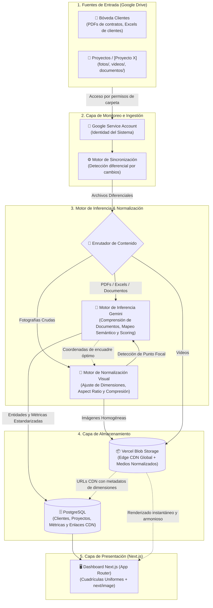
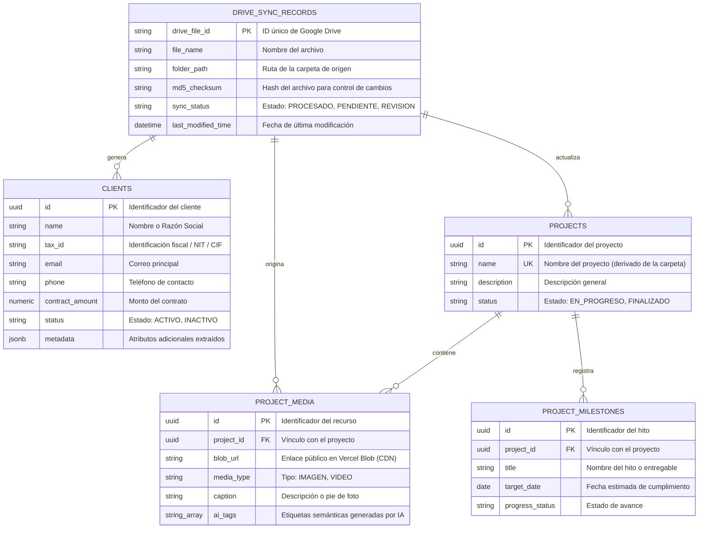

# EPIC-001-ai-augmented-ingestion-pipeline

## Metadata
- Epic ID: `EPIC-001`
- Title: `AI-Augmented Ingestion Pipeline & Schema Alignment`
- Status: `draft`
- Owner: `jaymusicmachine`
- Spec owner slice: `epic/001-ai-augmented-ingestion-pipeline`
- Created: `2026-08-25`
- Last Updated: `2026-08-25`

---

## Scope

### Problem Statement
Los equipos operativos y comerciales gestionan información clave de clientes y proyectos inmobiliarios (contratos en PDF, planillas Excel, fotografías de avance de obra y videos) dispersa en carpetas de Google Drive. La carga manual en el Dashboard corporativo es propensa a errores, genera fricción operativa para usuarios no técnicos y suele romper la consistencia visual por imágenes desalineadas, con relaciones de aspecto heterogéneas o recortes defectuosos.

### Business Goal
- **Zero-Friction Operativo:** Eliminar formularios de carga manual; el equipo trabaja exclusivamente en Google Drive ("Bóveda de Clientes" y "Proyectos").
- **Automatización Integral:** Clasificación, normalización visual, inferencia semántica y publicación automática en el Dashboard.
- **Eficiencia de Costos:** Sincronización diferencial inteligente basada en hashes (`md5Checksum`) y tokens de cambio (`pageToken`) sin descargas redundantes (Costo $0 en archivos sin cambios).

### Technical Goal
- Implementar un pipeline desacoplado en 4 capas funcionales (Presentation, Application, Domain, Infrastructure).
- Conectar **Google Drive API (Changes.list)** mediante Google Service Account sin intervención de sesión de usuario.
- Normalizar multimedia con **Quality Gate** en servidor (aspect ratios 16:9, 4:3, 1:1, auto-rotación EXIF, Smart Focal Cropping asistido por IA) y alojar en **Vercel Blob Storage** sobre Edge CDN global.
- Inferencia multimodal con **Google Gemini / Antigravity SDK** para extracción estructurada, normalización de fechas/montos/NITs y cálculo de puntaje de confianza (*Confidence Scoring*).
- Persistencia relacional idempotente en **PostgreSQL** (`UPSERT` determinista con `drive_file_id`).
- Renderizado de alto rendimiento en **Next.js App Router (Server Components + `next/image`)** con panel de validación asistida *Human-in-the-Loop* para registros con confianza < 90%.

### Out of Scope
- Edición bidireccional hacia Google Drive (el flujo es unidireccional: Drive -> Ingestion -> Dashboard).
- Soporte para streaming de video en vivo (los videos se alojan como archivos MP4/WebM estáticos en Vercel Blob).
- Acceso multi-tenant a múltiples cuentas de Google Workspace en esta primera versión (se utiliza una Service Account centralizada del sistema).

---

## Success Criteria
- [ ] Conexión y sincronización diferencial vía Google Drive Changes API validada sin requerir login de usuario.
- [ ] Pipeline de normalización visual estandarizando dimensiones (máx 2048px) y relaciones de aspecto (16:9, 4:3, 1:1) con recorte focal guiado por IA.
- [ ] Inferencia de Gemini extrayendo entidades canónicas (clientes, proyectos, hitos) con validación Zod estricta y confidence scoring.
- [ ] Persistencia idempotente en PostgreSQL evitando duplicados ante re-ejecuciones sobre el mismo hash.
- [ ] Vistas de Dashboard Next.js consumiendo Server Components y `next/image` con carga instantánea y galería simétrica.
- [ ] Panel Human-in-the-Loop operativo para confirmar o corregir registros con scoring < 90%.
- [ ] Suite de pruebas automatizadas completa (unitarias, integración y de contrato) pasando con `pnpm validate`.

---

## Global System Architecture

---

## Connectivity Matrix

| Origen | Destino | ¿Por qué? (Justificación) | ¿Cómo? (Mecanismo de Conexión) |
| :--- | :--- | :--- | :--- |
| **Google Drive** | **Motor de Sincronización** | Permitir que el sistema lea archivos sin exigir a los usuarios iniciar sesión ni cambiar sus hábitos. | Google Service Account autorizada en las carpetas. Consulta a *Changes API* para recibir modificaciones recientes. |
| **Motor de Sincronización** | **Motor de Inferencia Gemini** | Interpretar contenido de PDFs y Excels dispares, normalizando campos a formato canónico. | API multimodal de Gemini con prompts estructurados y validación Zod estricta. |
| **Enrutador de Contenido** | **Motor de Normalización Visual** | Garantizar que las fotos respeten proporciones y tamaños antes de guardarse permanentemente. | Procesamiento en memoria en servidor (ajuste de dimensiones, EXIF y Smart Focal Crop guiado por IA). |
| **Motor de Normalización** | **Vercel Blob Storage** | Alojar imágenes y videos normalizados en almacenamiento optimizado para entrega web rápida global. | Transferencia directa al bucket de Vercel Blob mediante token de servidor (`@vercel/blob`). |
| **Enrutador / Inferencia / Blob** | **PostgreSQL** | Mantener integridad relacional de clientes, proyectos, avances y enlaces CDN. | Operaciones `UPSERT` en tablas relacionales asociando UUIDs y `drive_file_id`. |
| **PostgreSQL & Vercel Blob** | **Dashboard Next.js** | Visualizar métricas consolidadas, fichas y galerías con estética simétrica. | Server Components y componente `next/image` sobre cuadrículas simétricas. |

---

## Conceptual Data Model

---

## Story Index

| Story ID | Title | RFC File | Status | PR | Notes |
| :--- | :--- | :--- | :--- | :--- | :--- |
| STORY-001-01 | Google Service Account Auth & Token Handler | `STORY-001-01-service-account-auth.md` | `approved` | `TBD` | JWT auth, Server-only credentials, Google Drive readonly scope |
| STORY-001-02 | Canonical Domain Contracts & Zod Validation Gate | `STORY-001-02-schema-alignment-contracts.md` | `approved` | `TBD` | Single Source of Truth Zod schemas, zero implicit any |
| STORY-001-03 | Google Drive Changes API & Differential Polling Engine | `STORY-001-03-drive-changes-polling.md` | `approved` | `TBD` | startPageToken management, delta polling, md5Checksum filtering |
| STORY-001-04 | Vercel Blob Storage Connector & Edge Delivery | `STORY-001-04-blob-storage-connector.md` | `approved` | `TBD` | @vercel/blob client, stream uploads, public CDN delivery |
| STORY-001-05 | Image Quality Gate & Dimension Sanitizer | `STORY-001-05-image-quality-gate.md` | `approved` | `TBD` | Min 400px, Max 2048px, EXIF auto-rotation, WebP conversion |
| STORY-001-06 | AI-Assisted Smart Focal Point Detection & Cropping | `STORY-001-06-smart-focal-crop.md` | `approved` | `TBD` | Gemini Vision focal coordinates, 16:9, 4:3, 1:1 bounding box |
| STORY-001-07 | Video Ingestion & Metadata Tagging | `STORY-001-07-video-ingestion-tagging.md` | `approved` | `TBD` | MP4/WebM validation, direct stream upload, AI progress tags |
| STORY-001-08 | PDF Contracts & Legal Docs Ingestion | `STORY-001-08-pdf-contracts-ingestion.md` | `approved` | `TBD` | Gemini multimodal extraction (NIT, amounts, names, terms) |
| STORY-001-09 | Excel / CSV Spreadsheets Parser & Normalizer | `STORY-001-09-excel-spreadsheets-ingestion.md` | `approved` | `TBD` | Multi-sheet parsing, column schema mapping, tabular extraction |
| STORY-001-10 | Confidence Scoring & Anomaly Flagging Engine | `STORY-001-10-confidence-scoring-engine.md` | `approved` | `TBD` | 0-100% scoring, auto-approve >=90%, NEEDS_REVIEW <90% |
| STORY-001-11 | PostgreSQL Relational DDL & Migrations | `STORY-001-11-db-schemas-migrations.md` | `approved` | `TBD` | SQL migration 003, indexes, FKs, constraints, timestamps |
| STORY-001-12 | Deterministic Repositories & UPSERT Idempotency Guard | `STORY-001-12-idempotency-upsert-repositories.md` | `approved` | `TBD` | ACID transactions, ON CONFLICT DO UPDATE, drive_file_id guard |
| STORY-001-13 | Dashboard Server Components & Responsive Media Galleries | `STORY-001-13-dashboard-server-views.md` | `approved` | `TBD` | Next.js 16 RSC, streaming, next/image, symmetric grids |
| STORY-001-14 | Human-in-the-Loop (HITL) Review Panel & Quick Actions | `STORY-001-14-hitl-review-panel.md` | `approved` | `TBD` | Split-view original vs AI data, Server Actions approve/reject |

---

## Decision Log
| Date | Story | Decision | Owner | Link |
| :--- | :--- | :--- | :--- | :--- |
| 2026-08-25 | EPIC-001 | Selección de Service Account centralizada sobre OAuth de usuario para cero fricción. | jaymusicmachine | [EPIC-README.md](file:///Users/jaymusicmachine/Documents/Desarrollo/bluebrick-app/knowledge/rfcs/EPIC-001-ai-augmented-ingestion-pipeline/README.md) |
| 2026-08-25 | EPIC-001 | Vercel Blob Storage como CDN primario de medios normalizados en lugar de servir desde Drive. | jaymusicmachine | [EPIC-README.md](file:///Users/jaymusicmachine/Documents/Desarrollo/bluebrick-app/knowledge/rfcs/EPIC-001-ai-augmented-ingestion-pipeline/README.md) |
| 2026-08-25 | EPIC-001 | Umbral del 90% en Confidence Scoring de Gemini para auto-publicación vs derivación a HITL. | jaymusicmachine | [EPIC-README.md](file:///Users/jaymusicmachine/Documents/Desarrollo/bluebrick-app/knowledge/rfcs/EPIC-001-ai-augmented-ingestion-pipeline/README.md) |

---

## Risks and Dependencies
- **Risks:**
  - Google Drive API Rate Limits en carpetas con miles de archivos en el primer escaneo.
  - Variabilidad extrema en formatos de contratos PDF escaneados con baja resolución.
  - Latencia en el procesamiento de video e imágenes de gran tamaño.
- **Dependencies:**
  - Credenciales de Google Service Account (`GOOGLE_SERVICE_ACCOUNT_EMAIL`, `GOOGLE_PRIVATE_KEY`).
  - Google Gemini API Key (`GEMINI_API_KEY`).
  - Vercel Blob Read/Write Token (`BLOB_READ_WRITE_TOKEN`).
  - Conexión a PostgreSQL Neon (`DATABASE_URL`).
- **Mitigations:**
  - Sincronización diferencial con `pageToken` y verificación de `md5Checksum` antes de cualquier descarga o procesamiento de IA.
  - Quality Gate que rechaza imágenes < 400px y las marca como `NEEDS_REVIEW` inmediatamente.
  - Cola de trabajo asíncrona con reintentos exponenciales y validación Zod estricta en cada etapa.

---

## Open Questions
- [ ] ¿Se requiere webhook push de Google Drive (Push Notifications via Cloud Pub/Sub) en el futuro o basta con cron recurrente / polling diferencial cada N minutos?
- [ ] ¿Cuál es el tamaño máximo de video permitido para subida directa a Vercel Blob (ej. 100MB / 500MB)?

---

## Traceability
- Issue(s): `EPIC-001`
- PR(s): `TBD`
- Final commit hash(es): `TBD`
