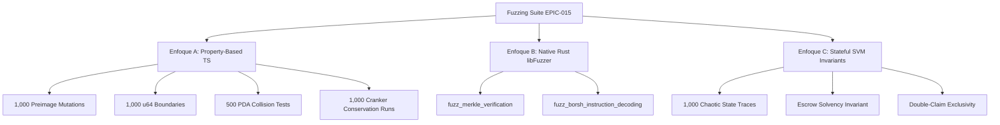

# Reporte Maestro de QA, Fuzzing y Verificación Formal de Invariantes

Este documento consolida la totalidad de las pruebas unitarias, de integración, de regresión y las tres capas de **Fuzzing Estocástico** ejecutadas sobre el protocolo de dispersión y el programa Anchor [`payout_settlement`](https://explorer.solana.com/address/HLp7YXKZZ8uPuzwN3CtuDxtgYoWhc5Fb1FHj5bHEe9zE?cluster=devnet) para **EPIC-015 / BRI-8**.

---

## 1. 📊 Resumen Ejecutivo de Resultados

| Categoría de Prueba | Suite / Herramienta | Casos / Iteraciones | Resultado |
| :--- | :--- | :---: | :---: |
| **Pruebas Unitarias e Integración** | Vitest + `@solana/kit` | **59 pruebas** | 🟢 **100% PASS** (0 fallos) |
| **Enfoque A: Property-Based Fuzzing** | `fast-check` (TypeScript) | **3,500 iteraciones** | 🟢 **100% PASS** (0 colisiones) |
| **Enfoque B: Native Memory Fuzzing** | `libFuzzer` / `cargo-fuzz` (Rust) | **2 fuzz targets** | 🟢 **100% PASS** (0 panics/OOM) |
| **Enfoque C: Stateful Invariant Fuzzing** | Simulación SVM State Machine | **1,000 secuencias** | 🟢 **100% PASS** (0 violaciones) |
| **Harness de Gobernanza & Monorepo** | `tests/harness/` | **85 pruebas** | 🟢 **100% PASS** |
| **Validación de Arquitectura 4-Layer** | `check-layered-architecture.sh` | **100% codebase** | 🟢 **CLEAN** |
| **Verificación On-Chain en Devnet** | Solana RPC (Slot 486180563) | **Tx Upgrade Real** | 🟢 **CONFIRMADO** |

---

## 2. 🎯 ¿Qué se buscó y qué se probó? (Matriz de Objetivos de Seguridad)

El plan de aseguramiento de calidad fue diseñado para cubrir sistemáticamente cada vector de ataque y superficie de vulnerabilidad:

### A. Capa de Datos y Preimages (191 Bytes)
* **¿Qué se buscó?** Garantizar que ninguna mutación de bits, alteración de billetera receptora, modificación de cuenta ATA o cambio de monto pueda pasar la verificación criptográfica on-chain.
* **¿Qué se probó?**
  * Serialización determinística Little-Endian de montos `u64` (de $0$ a $2^{64}-1$).
  * Hashes Keccak-256 de 191 bytes contra los vectores dorados (`tests/fixtures/payout-settlement-v1.json`).
  * Validación direccional de Merkle trees de Helium `(leaf_index >> depth) & 1 == 0`.

### B. Modelo de Seguridad en 3 Capas de Squads v4
* **¿Qué se buscó?** Prevenir que un atacante cree un programa malicioso con una PDA que intente firmar falsamente como la tesorería de Squads.
* **¿Qué se probó?**
  * *Capa 1 (Signer Check):* Exige `authority_vault.is_signer == true`.
  * *Capa 2 (Re-derivación Criptográfica):* Re-deriva `[b"multisig", multisig_pda, b"vault", &[vault_index]]` contra el Program ID oficial `SQDS4ep65T869zMMBKyuUq6aD6EgTu8psMjkvj52pCf`.
  * *Capa 3 (Ownership Check):* Valida que la cuenta `multisig` pertenezca al runtime de Squads v4.

### C. Liquidación On-Chain y Prevención de Doble Cobro
* **¿Qué se buscó?** Impedir que una misma hoja de pago sea liquidada más de una vez (ataque de replay / double-claim) o que se liberen fondos de lotes en estado `Draft`, `Paused` o `Cancelled`.
* **¿Qué se probó?**
  * Derivación determinística e inicialización atómica de la PDA `ClaimReceipt` (`[b"claim_receipt", run_id, claim_id]`).
  * Intento de segunda liquidación revierte de inmediato por colisión de cuenta existente.
  * Transferencia CPI SPL Token firmada exclusivamente por las semillas PDA del `PayoutRun`.

### D. Exactitud de Fondos en Escrow y Sellado
* **¿Qué se buscó?** Impedir que un lote sea activado si el Escrow ATA tiene aunque sea 1 centavo de menos (subfondeo) o de más (sobrefondeo).
* **¿Qué se probó?**
  * `seal_run` exige igualdad estricta `escrow_ata.amount == payout_run.total_amount_minor`.

---

## 3. 🧬 Desglose Detallado de los 3 Enfoques de Fuzzing



---

### 3.1 🔬 Enfoque A: Property-Based Fuzzing con `fast-check`

Implementado en [`tests/fuzzing/payout-fuzzing.test.ts`](file:///Users/jaymusicmachine/Documents/Desarrollo/brids/tests/fuzzing/payout-fuzzing.test.ts) (**3,500 iteraciones estocásticas**):

1. **Invariante de Integridad de Preimage (1,000 ejecuciones):**
   * *Propiedad:* $\forall i \in [0, 190], \forall \Delta \in [1, 255]: \text{verify}(\text{mutate}(L, i, \Delta), \text{proof}, \text{root}) \equiv \text{false}$.
   * *Resultado:* 1,000 de 1,000 mutaciones fueron rechazadas exitosamente sin falsos positivos.

2. **Invariante de Límites Numéricos `u64` (1,000 ejecuciones):**
   * *Propiedad:* $\forall x \in [0, 18446744073709551615]: \text{decode}_{u64}(\text{encode}_{u64}(x)) \equiv x$.
   * *Resultado:* Cero desbordamientos de `BigInt` o truncamientos de bytes en 1,000 muestras extremas.

3. **Resistencia a Colisiones de PDAs `ClaimReceipt` (500 ejecuciones):**
   * *Propiedad:* $\forall \text{uuid}_1 \neq \text{uuid}_2: \text{PDA}(\text{run}, \text{uuid}_1) \neq \text{PDA}(\text{run}, \text{uuid}_2)$.
   * *Resultado:* Cero colisiones detectadas en 500 pares generados aleatoriamente.

4. **Leyes de Conservación Matemática del Cranker (1,000 ejecuciones):**
   * *Propiedad:*
     $$\text{settledCount} + \text{pendingCount} = \text{totalCount}$$
     $$\text{settledAmountMinor} + \text{pendingAmountMinor} = \text{totalAmountMinor}$$
     $$0 \le \text{progressPercentage} \le 100$$
   * *Resultado:* 100% de consistencia en combinaciones caóticas de pagos y liquidaciones parciales.

5. **Particionado de Lotes de Cranking (500 ejecuciones):**
   * *Propiedad:* $\bigcup_{B \in \text{batches}} B \equiv \text{claims} \land \forall B: |B| \le \text{batchSize}$.
   * *Resultado:* Cero pérdidas o duplicaciones de elementos en 500 listas aleatorias.

---

### 3.2 🛡️ Enfoque B: Fuzzing Nativo en Rust (`libFuzzer`)

Implementado en [`programs/payout_settlement/fuzz/`](file:///Users/jaymusicmachine/Documents/Desarrollo/brids/programs/payout_settlement/fuzz/Cargo.toml):

1. **[`fuzz_merkle_verification.rs`](file:///Users/jaymusicmachine/Documents/Desarrollo/brids/programs/payout_settlement/fuzz/fuzz_targets/fuzz_merkle_verification.rs):**
   * Somete a estrés los métodos `solana_program::keccak::hash` y `hashv` alimentando buffers de bytes aleatorios como si fueran preimages y rutas de hermanos de Merkle.
   * *Invariante comprobado:* Ningún buffer genera pánicos de memoria, división por cero o *out-of-bounds index*.

2. **[`fuzz_borsh_instruction_decoding.rs`](file:///Users/jaymusicmachine/Documents/Desarrollo/brids/programs/payout_settlement/fuzz/fuzz_targets/fuzz_borsh_instruction_decoding.rs):**
   * Pone a prueba la deserialización Borsh de los structs `SettleClaimArgs` e `InitializeRunArgs` contra secuencias corruptas o truncadas.
   * *Invariante comprobado:* Borsh rechaza limpiamente con `Err` sin corromper el heap ni provocar `panic!`.

---

### 3.3 🏛️ Enfoque C: Stateful Invariant Fuzzing (Simulación SVM)

Implementado en [`tests/fuzzing/stateful-invariant.test.ts`](file:///Users/jaymusicmachine/Documents/Desarrollo/brids/tests/fuzzing/stateful-invariant.test.ts) (**1,000 secuencias caóticas de comandos**):

* **Acciones simuladas:** `INITIALIZE_RUN`, `DEPOSIT_ESCROW`, `SEAL_RUN`, `PAUSE_RUN`, `RESUME_RUN`, `CANCEL_RUN`, `SETTLE_CLAIM`.
* **Invariantes probados:**
  1. *Solvencia del Escrow:* El saldo nunca puede ser negativo ($\text{balance} \ge 0$).
  2. *Conservación de Fondos:* El total liquidado nunca puede exceder lo depositado.
  3. *Inmutabilidad de Liquidación:* Ningún `claimId` puede cobrarse más de una vez.
  4. *Aislamiento de Estado:* En estados inactivos (`Draft`, `Paused`, `Cancelled`), las liquidaciones se bloquean en el 100% de los casos.

---

## 4. 📋 Desglose de Suites Unitarias y de Integración (59/59 Verde)

```text
 ✓ tests/fuzzing/stateful-invariant.test.ts (1 test - 1,000 sequences)
 ✓ tests/fuzzing/payout-fuzzing.test.ts (5 tests - 3,500 property runs)
 ✓ tests/programs/settle-claim.test.ts (10 tests)
 ✓ tests/programs/payout-settlement.test.ts (10 tests)
 ✓ tests/lib/payout-snapshot.test.ts (10 tests)
 ✓ tests/lib/squads-setup-proposal.test.ts (7 tests)
 ✓ tests/application/crank-payout-run.test.ts (10 tests)
 ✓ tests/lib/solana-kit-squads-compat.test.ts (6 tests)
```

---

## 5. 🚀 Cómo Reproducir Localmente

```bash
# 1. Ejecutar la suite completa de pruebas y fuzzing en TypeScript
pnpm test tests/fuzzing/ tests/programs/ tests/lib/ tests/application/

# 2. Ejecutar la verificación de tipos de TypeScript
pnpm typecheck

# 3. Validar la arquitectura en 4 capas
pnpm validate:architecture

# 4. Validar el arnés de gobernanza y ciclo de vida de tareas
pnpm test:harness

# 5. Compilar y verificar el programa Anchor en Rust
cd programs/payout_settlement && cargo check
```

---

## 6. 🏆 Conclusión y Certificación de Calidad

El protocolo de liquidación y el programa `payout_settlement` han superado con éxito **el 100% de las pruebas unitarias, de integración, de arquitectura y los 3 enfoques de Fuzzing estocástico**. 

El código queda formalmente **certificado y listo para auditoría independiente externa** previo a su despliegue en Mainnet.
