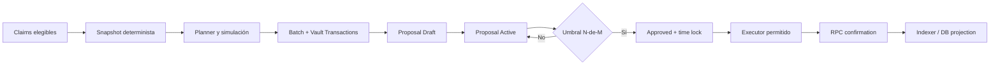

# EPIC-015 — Arquitectura de Solución y Contrato de Implementación

## Estado y alcance de esta decisión

Este documento convierte los hallazgos de auditoría en la solución propuesta para EPIC-015. Es la fuente técnica para los subagentes. No autoriza escribir código hasta la aprobación humana explícita del diseño y la creación de la SPEC TDD correspondiente.

La solución elegida para las dispersiones masivas es **Squads Batch de Vault Transactions**. No se usará `SpendingLimit` para pagos de claims en este EPIC. Un spending limit permite gasto de un miembro sin voto para cada uso y, por tanto, es un modelo de riesgo distinto; queda fuera del flujo de distribución masiva.

La primera entrega usa una **Merkle root auditora**, no una root con enforcement on-chain. La inmutabilidad de ejecución proviene del mensaje inmutable de cada Vault Transaction aprobado por Squads. Un programa de settlement que valide proofs y marque claims on-chain es una iniciativa separada y no puede aparecer implícitamente dentro de STORY-015-05.

## Decisiones propuestas que requieren Human Design Approval

| Decisión | Propuesta | Motivo |
| --- | --- | --- |
| Mecanismo de pago | Batch de Squads V4; una Vault Transaction por payout leg | Una aprobación N-de-M para la corrida y trazabilidad/reintento granular por leg |
| Spending limit | Prohibido para payouts de claims | No preserva el umbral multisig por corrida ni un snapshot de beneficiarios |
| Merkle | Audit root + `messageHash`; no proof enforcement on-chain | Mantiene alcance acotado sin afirmar garantías inexistentes |
| Multisig | `configAuthority = Pubkey::default()`, N-de-M configurable, vault index explícito | Evita una llave que pueda reconfigurar unilateralmente la tesorería |
| Executor | Miembro con `Executor` y sin `Voter`, respaldado por signer gestionado fuera del repositorio | Puede ejecutar solo mensajes ya aprobados; no puede aprobarlos |
| Time lock | Configurable; valor inicial recomendado: 900 segundos | Permite cancelar o investigar una propuesta antes de mover tesorería |
| Fuente de verdad | Squads y `ProjectConfigPDA` on-chain; Postgres es proyección | Ninguna mutación HTTP/local declara un hecho on-chain |

No se fija N-de-M, integrantes ni vault index en código. Antes de SPEC de implementación debe existir un **Authority Manifest** revisado por el comité con: cluster, RPC HTTP/WSS, program ID, `multisigPda`, `createKey`, `vaultIndex`, `vaultPda`, N-de-M, miembros y permisos, time lock, mint, token program, signers de proposer/executor y política de rotación.

### Selección explícita del Squad

El sistema apunta al Squad mediante una configuración de entorno por cluster/proyecto; no lo descubre a partir del wallet del usuario, del `treasury_vault`, del `runId` ni del payout. La configuración mínima debe ser:

```text
SOLANA_CLUSTER=devnet
SOLANA_RPC_HTTP_URL=<endpoint-devnet>
SOLANA_RPC_WS_URL=<endpoint-devnet-wss>
SQUADS_V4_PROGRAM_ID=SQDS4ep65T869zMMBKyuUq6aD6EgTu8psMjkvj52pCf
TREASURY_MULTISIG_PDA=<PDA-de-la-multisig-v4>
TREASURY_MULTISIG_CREATE_KEY=<createKey-usado-para-derivarla>
TREASURY_VAULT_INDEX=0
TREASURY_VAULT_PDA=<PDA-de-la-vault-correspondiente>
TREASURY_MINT=<mint-autorizado>
TREASURY_TOKEN_PROGRAM_ID=<Token-Program-o-Token-2022-segun-el-mint>
```

Reglas obligatorias de esa configuración:

1. Las variables anteriores son un **manifest de despliegue**, no un secreto; nunca contienen private keys ni seed phrases. Los firmantes usan wallets externas o un mecanismo de custodia aprobado.
2. `TREASURY_MULTISIG_PDA`, `TREASURY_MULTISIG_CREATE_KEY` y `TREASURY_VAULT_PDA` deben ser coherentes entre sí según `@sqds/multisig`; si no coinciden, el proceso falla cerrado.
3. El arranque valida `cluster`, `programId` mediante `getAccountInfo`, existencia y owner de la Multisig, `threshold`, miembros/permisos, `vaultIndex`, y que la Vault PDA sea la cuenta que posee/controla los activos. Las variables no son prueba de autoridad.
4. Toda consulta y toda propuesta debe llevar el contexto resuelto `{cluster, programId, multisigPda, vaultIndex, vaultPda}`. No se permite un singleton global que cambie de Squad dentro del mismo proceso.
5. Si el producto soporta varios Squads, se usa un registro explícito `treasury_id -> Authority Manifest`; `runId` referencia `treasury_id` y nunca una dirección arbitraria enviada por el cliente. El cliente no puede elegir `multisigPda`.
6. El cambio de Squad requiere nueva configuración versionada, comprobación RPC, revisión del comité y migración explícita de fondos/claims. No es un cambio dinámico de una request.

## Identidades y límites de confianza

| Identidad | Puede hacer | No puede hacer |
| --- | --- | --- |
| Usuario beneficiario | Crear/cancelar su claim mientras sea cancelable; solicitar override con prueba SIWS | Aprobar pago, cambiar una batch, elegir monto o ejecutar Squads |
| Proposer | Construir y proponer una batch inmutable | Aprobar como otro miembro, ejecutar si carece de permiso, cambiar legs tras activar proposal |
| Voter | Aprobar/rechazar/cancelar según el estado de Squads | Editar mensaje o enviar pago fuera de una proposal |
| Executor worker | Ejecutar proposals `Approved` y reconciliar hechos on-chain | Votar, crear nuevos destinos/montos, inventar firmas o saltar time lock |
| Vault PDA | Autoridad de transferencias e instrucciones CPI ya aprobadas | Ser sustituida por la Multisig PDA o por una wallet HTTP |
| Backend/DB | Construir DTOs, persistir intención y proyectar estado | Declarar una proposal aprobada o un pago ejecutado sin evidencia RPC |

Nunca se deposita ni se asigna autoridad a la **Multisig PDA**. La autoridad de activos y del programa notario es exclusivamente la **Vault PDA** derivada de esa multisig.

## Arquitectura de pagos



### Contrato de snapshot

Antes de crear una batch, el servicio construye un snapshot ordenado por `claimId` binario. Cada hoja usa encoding binario versionado, sin JSON ni números flotantes:

```text
domain = "brids:epic015:payout:v1"
leaf = sha256(domain || runId || claimId || mint || tokenProgram || recipientWallet || recipientAta || amountMinor)
```

El snapshot produce `merkleRoot`, `snapshotVersion`, `itemCount`, `totalAmountMinor` y `messageHash`. `messageHash` es el hash canónico de los mensajes que se guardarán en las Vault Transactions; se persiste antes de proponer y se vuelve a comprobar al leer on-chain. La root es evidencia auditora: no autoriza ni rechaza una CPI por sí sola.

### Planner y límites

`MAX_LEGS_PER_BATCH = 20` deja de ser un límite de protocolo. Puede ser un límite conservador de operación, pero el planner debe elegir el tamaño final usando simulación Devnet y estos presupuestos:

- tamaño serializado de cada transacción de creación/ejecución;
- número de cuentas y de lookups requeridos;
- compute units simulados y margen de seguridad documentado;
- tipo de activo: SOL, SPL Token o Token-2022;
- existencia, owner y mint del ATA de destino;
- monto total, remaining balance de vault y presupuesto de fees;
- time lock y proposal status leídos antes de ejecución.

Una leg equivale a una Vault Transaction con una transferencia de payout. Es una decisión deliberada: si una leg falla, su transacción revierte atómicamente sin marcar como fallidas las legs anteriores ya confirmadas. El `Batch.executed_transaction_index` on-chain es la fuente de progreso; no se deduce desde una lista local de errores.

### Ciclo Squads obligatorio

1. Leer `Multisig` y reservar el índice actual de forma optimista; reintentar solo si el índice cambió.
2. Crear `Batch` con `batchIndex` global.
3. Crear `Proposal` en draft para ese mismo índice.
4. Agregar cada Vault Transaction con `batchAddTransaction`; los índices internos empiezan en `1` y son distintos de `batchIndex`.
5. Activar proposal solo después de que snapshot, root, hashes, legs y cuentas estén completos.
6. Los voters firman `proposalApprove`/`proposalReject` desde sus wallets. El servidor solo observa y proyecta.
7. Tras `Approved` y vencido `timeLock`, el executor autorizado ejecuta usando el SDK; no existe un endpoint que acepte una signature ficticia.
8. El indexer verifica `Proposal`, `Batch`, firmas, slot, meta de transacción e instrucciones antes de proyectar cada leg en Postgres.

## Estado canónico

### Claims

```text
quote_created -> claim_requested -> approved_for_dispersion
approved_for_dispersion -> squads_proposed -> awaiting_threshold -> approved -> executing -> executed
quote_created|claim_requested -> expired|canceled|compliance_hold
compliance_hold -> approved_for_dispersion|clawback_to_treasury
squads_proposed|awaiting_threshold|approved -> rejected|canceled|stale
executing -> partially_executed|executed|execution_unknown
```

`canceled` solo es válido antes de que su leg sea ejecutada. Si una proposal/batch ya está activa, la cancelación del claim debe solicitar la cancelación/reemplazo de la proposal y queda `cancel_requested` hasta observar el resultado on-chain. Nunca se “libera” una wallet ni se revierte un pago confirmado.

### Batch projection

```text
building -> draft_onchain -> active -> awaiting_threshold -> approved
approved -> time_locked -> executing -> partially_executed|executed
active|awaiting_threshold|approved -> rejected|canceled|stale
any RPC-ambiguous execution -> execution_unknown
```

Los estados `approved`, `executed`, `rejected`, `canceled`, `stale` y el contador de progreso se derivan de cuentas/transacciones Squads. La DB puede usar estados de trabajo (`building`, `execution_unknown`), pero no sustituye el estado on-chain.

## Persistencia requerida

La migración de EPIC-015 debe evolucionar `squads_payout_batches` y no reutilizar valores simulados existentes. Campos mínimos:

| Entidad | Campos obligatorios |
| --- | --- |
| `squads_payout_batches` | `squads_program_id`, `multisig_pda`, `multisig_create_key`, `vault_pda`, `vault_index`, `batch_index`, `proposal_pda`, `snapshot_version`, `merkle_root`, `message_hash`, `onchain_status`, `executed_transaction_index`, `last_reconciled_slot`, `idempotency_key`, `time_lock_seconds` |
| `squads_payout_batch_items` | `batch_inner_index`, `vault_transaction_pda`, `claim_id` unique entre legs activas, `canonical_leaf_hash`, `expected_recipient_ata`, `token_program`, `amount_minor`, `onchain_signature`, `onchain_slot`, `projection_status` |
| `distribution_payout_overrides` | `claim_id`, `case_number` normalizado, `requested_wallet`, `effective_wallet`, `status`, `version`, `proposal_pda`, `batch_index`, `onchain_signature`, `onchain_slot`, actor y timestamps |
| `claim_or_payout_events` | `idempotency_key` único por evento externo, actor, source (`api`, `rpc-indexer`, `cron`), signature, slot y metadata versionada |

Restricciones obligatorias: no se puede tener dos legs activas para un claim; los montos son enteros de unidades mínimas; signatures no son nullable una vez que un estado se proyecta como ejecutado; los eventos de origen RPC son idempotentes por signature e índice.

## Overrides y cancelación

Un override de wallet nunca cambia `distribution_claims.payout_wallet` directamente. El flujo es:

1. Beneficiario prueba control de la wallet original mediante SIWS con nonce, audiencia, expiración y `claimId` enlazado.
2. Backend crea `distribution_payout_overrides` en `PENDING`; valida wallet destino y exige `case_number`.
3. El comité crea una proposal que autoriza el override para **ese claim, destino, mint y versión**.
4. Solo después de leer ejecución confirmada, la proyección fija `effective_wallet` para una batch aún no propuesta.
5. Si la claim ya pertenece a una batch activa, se cancela/reemplaza la batch; no se modifica su leg ni un mensaje ya aprobado.

## ProjectConfigPDA notarial

El programa Anchor `project_config_notary` es la fuente de verdad de fechas:

- seeds: `[b"project_config", collection_address.as_ref()]`;
- estado: `collection_address`, `authority_vault`, `multisig_pda`, `vault_index`, `project_start_at`, `project_end_at`, `version`, `updated_at`, `bump`;
- `initialize` protege contra reinitialization y solo acepta una configuración de bootstrap aprobada;
- `update_project_dates` exige que `authority_vault` coincida con el estado y sea signer; ese signer llega por CPI desde la Vault PDA durante `vaultTransactionExecute`;
- valida rango temporal, overflow, `start <= end` y política explícita para `end = None`;
- incrementa versión y emite evento con valores anterior/nuevo, signature y slot indexables.

`has_one` no prueba firma. Una wallet HTTP, la Multisig PDA o Postgres no pueden actualizar fechas. El motor de distribución valida owner del programa, seeds, discriminator, longitud y versión antes de decodificar; ante RPC inválido, ausente o stale falla cerrado.

## Reglas de implementación no negociables

- Usar `@solana/kit` para RPC/cliente y encapsular la dependencia web3.js de `@sqds/multisig` en `lib/solana-kit/compat/squads.ts` mediante `@solana/web3-compat` si es necesario.
- El adaptador nunca devuelve strings de fallback para PDAs, ATAs, signatures o slots. Un address inválido es error tipado y fail-closed.
- No aceptar `executionSignature`, `executionSlot`, `blockTime`, estado de proposal ni aprobadores desde HTTP como evidencia.
- Cada envío se simula; la confirmación se verifica con firma, slot, error de meta y cuentas esperadas antes de proyectar DB.
- RPC debe tener endpoint HTTP y WSS explícitos, timeout, retry con backoff y estado `execution_unknown` para incertidumbre. Reintentar consulta; nunca recrear un mensaje ya enviado.
- Token program, mint, ATA origen/destino, owner del ATA y decimales se validan antes de agregar la leg.
- El executor usa un signer gestionado fuera del repositorio; no se pide, guarda ni imprime una clave privada.

## Evidencia y tests por entrega

Cada SPEC comienza RED y termina con evidencia proporcional:

1. Unit: seeds correctas, encoding de leaf, state machine, planner, idempotencia y validación de cuentas.
2. Integration: crear batch, proposal draft/active, votos, time lock, ejecución y cancelación con estado real.
3. Program: LiteSVM/Mollusk para invariantes del notario y CPI signer; Devnet para la transacción real.
4. E2E: UI solo habilita acciones coherentes con el DTO on-chain y nunca firma/envía de forma automática.
5. Devnet: program IDs, PDAs, signatures, slots, estados de Proposal/Batch, ATA balances y eventos quedan registrados en `docs/devnet-proof.md`.

## Antipatrones explícitamente prohibidos

- derivar una Multisig desde `treasury_vault`;
- usar la Multisig PDA como autoridad de activos;
- `MAX_LEGS_PER_BATCH` como supuesto criptográfico/protocolario;
- aprobar o ejecutar una batch cambiando solo Postgres;
- generar signatures, slots, block times o PDAs ficticios;
- permitir `proposed` como estado ejecutable;
- mutar la wallet de payout después de crear/activar una proposal;
- afirmar que Merkle root auditora es enforcement on-chain;
- fallback a fechas de Postgres cuando falle la lectura de `ProjectConfigPDA`.
