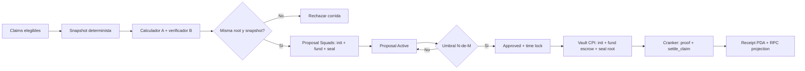

# EPIC-015 — Arquitectura de Solución y Contrato de Implementación

## Estado y alcance de esta decisión

Este documento convierte los hallazgos de auditoría en la solución propuesta para EPIC-015. Es la fuente técnica para los subagentes. No autoriza escribir código hasta la aprobación humana explícita del diseño y la creación de la SPEC TDD correspondiente.

La solución elegida para las dispersiones masivas es un **programa `payout_settlement` con escrow PDA y Merkle proof enforcement on-chain**. Squads V4 no paga una leg por claim: una Vault Transaction aprobada por el comité inicializa, fondea y sella un `PayoutRun`. Después, cualquier cranker puede solicitar `settle_claim`, pero el programa sólo transfiere exactamente una leaf incluida en la raíz sellada. No se usará `SpendingLimit` para pagos de claims en este EPIC.

Esta es una decisión que reemplaza explícitamente la alternativa anterior de "Merkle root auditora" y el modelo de "Batch + una Vault Transaction por leg". Ambos son insuficientes frente a un agente de despacho malicioso: el primero no impone nada on-chain y el segundo entrega al executor un conjunto de transferencias que no se verifica por proof en el momento de liquidar.

## Justificación Arquitectónica y Análisis Comparativo de Alternativas (ADR)

### 1. Evaluación de Alternativas de Dispersión de Tesorería en Solana

| Criterio | Alternativa A: Sublotes Squads (20 legs/tx) | Alternativa B: Squads Spending Limits | Alternativa C (Seleccionada): **Squads + Anchor Merkle Settlement Program** |
| :--- | :--- | :--- | :--- |
| **Carga Operacional del Comité** | ❌ **Inviable a escala:** Requiere aprobar ~500 a 1,000 propuestas de lotes para 10,000–20,000 inversores. | ✅ 1 sola firma para fijar el límite periódico. | ✅ **Óptima (1 Firma):** El comité aprueba 1 única propuesta de setup para $N$ beneficiarios. |
| **Modelo de Confianza / Seguridad** | ⚠️ **Vulnerable:** Un worker off-chain podría ensamblar o alterar transferencias tras la aprobación general. | ❌ **Peligro Crítico:** La llave del worker tiene discreción total de transferir fondos a cualquier wallet arbitraria. | 🛡️ **Zero-Trust Criptográfico:** Los fondos van a una **Escrow PDA** y solo se liberan si la **Merkle Proof** valida la hoja sellada. |
| **Límites Físicos de Solana (MTU ~1232 bytes)** | ❌ Cada transferencia SPL Token añade ~150–200 bytes, saturando el límite de 1232 bytes por transacción. | ❌ Mismo cuello de botella de MTU en las transacciones del worker. | ✅ **Sin Límite de Escala:** Cada liquidación se procesa de forma individual o en minilotes concurrentes. |
| **Prevención de Doble Cobro / Replay** | ⚠️ Dependiente exclusivamente de locking y base de datos off-chain. | ⚠️ Dependiente de base de datos off-chain. | 🛡️ **Enforcement Nativo On-Chain:** Se crea un **`ClaimReceipt` PDA** único; Solana revierte ante cualquier colisión de cuenta. |
| **Rol y Autoridad del Cranker / Worker** | ⚠️ Requiere privilegios elevados de ejecución en Squads. | ⚠️ Requiere custodiar la clave privada del spending limit. | 🛡️ **Completamente Permissionless:** El cranker solo aporta gas; no puede alterar beneficiarios, montos ni robar fondos. |

### 2. Por qué los Contratos Anchor son Estrictamente Necesarios en el Alcance

1. **`programs/payout_settlement` (Liquidación Criptográfica y Custodia Escrow PDA):**
   - Squads v4 es un protocolo de gobernanza y tesorería multisig general, no un motor de validación de árboles de Merkle.
   - Permite que el comité apruebe atómicamente:
     1. La creación del `PayoutRun` con la `merkleRoot` inmutable.
     2. La transferencia del saldo total comprometido desde la Vault PDA al **Escrow PDA**.
     3. El sellado del run (`seal_run`).
   - El contrato garantiza matemáticamente que **ningún actor intermedio (worker, base de datos, hacker)** pueda desviar un solo centavo de la distribución aprobada.
   - La creación de la PDA `[b"receipt", run_pda, claim_id]` proporciona una barrera criptográfica irrevocable contra el doble gasto a nivel del runtime de Solana.

2. **`programs/project_config_notary` (PDA Notario On-Chain de Parámetros y Fechas):**
   - **Amenaza Mitigada:** Almacenar fechas críticas de cálculo de rendimientos (`project_start_at`, `project_end_at`) exclusivamente en Postgres permite que un atacante con acceso a la base de datos o mediante inyección SQL manipule los periodos y reclame rendimientos ilícitos.
   - **Garantía On-Chain:** La PDA Notario `[b"project_config", collection_address]` reside en Solana y su instrucción `update_project_dates` exige que `authority_vault` sea signer, que su clave coincida con la almacenada en el estado, y que la Vault PDA se re-derive contra el program ID de Squads v4 (`SQDS4ep65T869zMMBKyuUq6aD6EgTu8psMjkvj52pCf`). Como las PDAs carecen de clave privada, dicha firma solo puede originarse mediante **CPI desde la Vault PDA de Squads v4** cuando el comité vota y ejecuta la propuesta.
   - El motor de distribución (`distribution-engine.ts`) lee directamente del RPC de Solana mediante `@solana/kit`, degradando a Postgres al rol de caché informativo de solo lectura.

### 3. Base Canónica de Referencia de Código & Análisis Legal de Licencias por Contrato

Para el diseño e implementación de los dos contratos Anchor del monorepo, se definen formalmente sus bases canónicas de referencia y su marco de licenciamiento:

| Contrato Anchor en Monorepo | Base Canónica de Referencia | Licencia | Rol y Justificación Técnica |
| :--- | :--- | :--- | :--- |
| **`programs/payout_settlement`** | **Helium Network (`helium-program-library / lazy-distributor` & `circuit-breaker`)** | **Apache-2.0** | 🏆 **Base Canónica:** Custodia en Escrow PDA, validación de Merkle Proofs y Freno de Emergencia (Circuit Breaker) para pausar corridas anómalas. |
| **`programs/project_config_notary`** | **Patrón idiomático de Anchor (`init` + `has_one` + PDA seeds)** — No es un repositorio independiente; es la combinación estándar de constraints del framework [`coral-xyz/anchor`](https://github.com/coral-xyz/anchor) documentada en [Account Constraints](https://www.anchor-lang.com/docs/references/account-constraints) y [PDA Accounts](https://solana.com/docs/core/pda/pda-accounts). | **MIT OR Apache-2.0** (licencia del framework Anchor) | 🏛️ **Patrón Idiomático:** Contrato de gobernanza atómico (~60 líneas Rust) para fechas inmutables con firma CPI de la Vault de Squads v4. No requiere circuit breaker ni dependencia externa más allá de `anchor-lang` y `anchor-spl`. |

#### 3.1 Desglose de Primitivas Técnicas de Helium Network (Commit Pinneado)

- **Repositorio Canónico Pinneado:** `https://github.com/helium/helium-program-library`
- **Release / Tag Pinneado:** [`program-lazy-distributor-0.3.8`](https://github.com/helium/helium-program-library/tree/program-lazy-distributor-0.3.8) (Anchor `0.31.1` / Rust 2021).
- **Commit inmutable de referencia:** [`f3070dc43d7f76263e8e75631c812b5a61a31794`](https://github.com/helium/helium-program-library/commit/f3070dc43d7f76263e8e75631c812b5a61a31794). Todo análisis, atribución y comparación de divergencias debe usar este SHA; el tag sólo aporta legibilidad humana.
- **Manifests de Referencia:**
  - `programs/lazy-distributor/Cargo.toml`
  - `programs/circuit-breaker/Cargo.toml`

Dado que `lazy-distributor` es un distribuidor especializado para oráculos y compresión de NFTs de Helium, BRIDS **no importa la librería como caja negra**, sino que adopta de forma quirúrgica sus primitivas matemáticas y de seguridad mediante una **implementación Clean-Room bajo Apache-2.0 / MIT**:

```
┌───────────────────────────────────────────────────────────────────────────────────────┐
│              PRIMITIVAS ADOPTADAS VS. EXCLUIDAS DE HELIUM LAZY-DISTRIBUTOR            │
├───────────────────────────────────────────┬───────────────────────────────────────────┤
│ ✅ Primitivas EXACTAS Adoptadas           │ ❌ Componentes y Dependencias Excluidos   │
├───────────────────────────────────────────┼───────────────────────────────────────────┤
│ 1. Verificación de Merkle Proofs en Rust  │ 1. Red de Oráculos en Vivo (Oracle Signs) │
│    usando solana_program::keccak::hashv   │    -> Sustituido por Doble Attestation    │
│    para combinar hashes de hojas y nodos. │    Ed25519 con verificación en sysvar.    │
├───────────────────────────────────────────┼───────────────────────────────────────────┤
│ 2. Custodia de Tokens en Escrow PDA       │ 2. Compressed NFTs & Bubblegum            │
│    con transferencias SPL Token /         │    (spl-account-compression, mpl-bubblegum│
│    Token-2022 mediante CPI firmado por    │    -> BRIDS liquida hojas estándar        │
│    las seeds de la PDA del PayoutRun.     │    (claim_id, wallet, ata, amount, mint). │
├───────────────────────────────────────────┼───────────────────────────────────────────┤
│ 3. Recibo Único de Liquidación            │ 3. Ventanas de Recompensa Acumulativas    │
│    (ClaimReceipt PDA) para prevenir       │    -> BRIDS usa corridas cerradas (runId) │
│    atómicamente doble cobro y reentrancy. │    con total y hojas fijas inmutables.    │
├───────────────────────────────────────────┼───────────────────────────────────────────┤
│ 4. Patrón de Circuit Breaker              │ 4. Tokenomics de subDAOs (HNT/MOBILE/IOT) │
│    (Emergency Pause / Unpause) gobernado  │    -> BRIDS V1 opera sólo con USDC Devnet │
│    por la Vault PDA de Squads v4.         │    vía SPL Token clásico.                 │
└───────────────────────────────────────────┴───────────────────────────────────────────┘
```

#### Comparativa Legal de Alternativas Abiertas (Merkle Distributors):

| Proyecto / Repositorio | Licencia | Evaluación Legal & Compatibilidad Comercial | Veredicto para BRIDS |
| :--- | :--- | :--- | :--- |
| **Helium Network (`lazy-distributor` & `circuit-breaker`)** | **Apache-2.0** | ✅ **Permisiva y Comercial:** Permite uso libre, comercial y desarrollo propietario sin copyleft ni exigencia de apertura de código backend. | 🏆 **BASE CANÓNICA SELECCIONADA** |
| **Goki Protocol (`merkle-distributor`)** | **AGPL-3.0** | ❌ **Copyleft Viral (Sección 13):** Obligaría por ley a publicar el código fuente completo del backend, APIs privadas y servicios de BRIDS a cualquier usuario que interactúe por red. | 🚫 **RECHAZADO (Prohibido por `license-policy.json`)** |
| **Saber HQ / Jito (`merkle-distributor`)** | **GPL-3.0** | ❌ **Copyleft Fuerte:** Prohibida en la política de licencias del monorepo por incompatibilidad con software comercial y SaaS. | 🚫 **RECHAZADO (Prohibido por `license-policy.json`)** |

> [!IMPORTANT]
> **Estrategia Clean-Room & Declaración de Estado de Auditoría:**
> - **Clasificación Formal:** Helium Network (`lazy-distributor` / `circuit-breaker`) se adopta estrictamente como **referencia open-source permisiva (Apache-2.0)**, **NO como contrato auditado** aplicable al alcance de BRIDS.
> - **Sin Prueba de Alcance de Auditoría Externa:** No existe un informe de auditoría independiente que cubra el commit específico de Helium en relación con la arquitectura de BRIDS, ni mucho menos el futuro código de `payout_settlement`.
> - **Requisitos Normativos para Calificar como "Auditado":** Para que un contrato sea catalogado como auditado en la gobernanza de BRIDS, se debe adjuntar el informe técnico formal que contenga:
>   1. **Firma / Auditor:** Entidad de seguridad independiente reconocida.
>   2. **Fecha & Commit Pinneado:** SHA exacto auditado.
>   3. **Alcance (Scope):** Lista exhaustiva de contratos e instrucciones evaluadas.
>   4. **Findings & Resolución:** Vulnerabilidades detectadas y prueba de fix.
>   5. **Matriz de Diferencias:** Desglose de cambios entre el código auditado y la implementación en producción.
> - **Garantía para BRIDS:** Tanto `programs/payout_settlement` como `programs/project_config_notary` son desarrollos clean-room bajo Apache-2.0 / MIT que deberán someterse a auditoría estricta previa a cualquier despliegue en Mainnet.

## Decisiones propuestas que requieren Human Design Approval

| Decisión | Propuesta | Motivo |
| --- | --- | --- |
| Mecanismo de pago | `payout_settlement` + escrow PDA; Squads crea, fondea y sella el run | El programa sólo libera una leaf incluida en la raíz aprobada y sólo una vez |
| Spending limit | Prohibido para payouts de claims | No preserva el umbral multisig por corrida ni un snapshot de beneficiarios |
| Merkle | Root, snapshot hash y reglas guardadas en `PayoutRun`; proof enforcement on-chain | Vincula criptográficamente cada pago a la corrida aprobada y bloquea doble pago |
| Multisig | `configAuthority = Pubkey::default()`, N-de-M configurable, vault index explícito | Evita una llave que pueda reconfigurar unilateralmente la tesorería |
| Cranker de settlement | Cuenta no privilegiada; puede presentar proof, nunca elegir una leaf válida | La autorización de fondos procede del escrow y de la raíz aprobada, no del cranker |
| Time lock | Configurable; valor inicial recomendado: 900 segundos | Permite cancelar o investigar una propuesta antes de mover tesorería |
| Fuente de verdad | Squads y `ProjectConfigPDA` on-chain; Postgres es proyección | Ninguna mutación HTTP/local declara un hecho on-chain |

No se fija N-de-M, integrantes ni vault index por inferencia del wallet conectado. La implementación consume un **Authority Manifest** versionado por cluster/proyecto. El manifest de Devnet V1 queda registrado abajo con los valores ya definidos por el Squad creado y con los campos que siguen pendientes de lectura RPC o de aprobación explícita.

### Authority Manifest Devnet V1

> [!NOTE]
> **Verificación RPC On-Chain (2026-08-20):** Los valores marcados ✅ RPC fueron confirmados mediante `getAccountInfo` contra `https://api.devnet.solana.com` (slot ~485810685) y decodificación binaria del account data de la Multisig PDA. Las derivaciones de PDA (Multisig y Vault) fueron verificadas criptográficamente (SHA-256 con bumps confirmados). Documento de referencia operativa: [`squads-devnet-multisig.md`](file:///Users/jaymusicmachine/Documents/Desarrollo/brids/knowledge/operations/squads-devnet-multisig.md). Transacción de creación: [`418eESq3...`](https://explorer.solana.com/tx/418eESq3jDrz4M7cFKUKoSN1qG9M2Gt22Jqk7RsphnCb2XTmR42ngW1PV9KiSnpTech6Jo9hy2K2LwHeg4YfZVvP?cluster=devnet).

| Campo | Valor | Estado |
| --- | --- | --- |
| `treasury_id` | `brids-devnet-gov-treasury` | ✅ Definido |
| Nombre Squads | `BRIDS Devnet Gov and Treasury` | ✅ Definido |
| Descripción | `Governance, Treasury and rewards distribution for BRIDS project.` | ✅ Definido |
| Cluster | `devnet` | ✅ Definido |
| Squads V4 Program ID | `SQDS4ep65T869zMMBKyuUq6aD6EgTu8psMjkvj52pCf` | ✅ RPC confirmado (`owner` del account Multisig) |
| Multisig PDA | `rVKwqnxyq2RuU4sTBdXhifrZB9oY9mGoqw5oA6EHKaD` | ✅ RPC confirmado (264 bytes, 2728320 lamports) |
| Multisig `create_key` | `AZGhDBuomd6cRf1LZoUNfk4fWn6HpoZjmp8dzZibZK7c` | ✅ RPC decodificado + re-derivación verificada (bump=253) |
| Multisig `config_authority` | `null` (Pubkey::default — 32 zero bytes) | ✅ RPC confirmado — Squad solo se reconfigura por sí mismo |
| Vault index | `0` | ✅ Definido |
| Vault PDA | `D9i1XNftRpB68WTYrpCau5fEYYS2eiJa8Q738N5idSXB` | ✅ Re-derivación verificada (bump=250) |
| Threshold | `2` de `4` miembros | ✅ RPC decodificado (u16 LE = 2) |
| `time_lock` | **`0` segundos** (ejecución inmediata tras quórum) | ✅ RPC decodificado (u32 LE = 0) |
| `transaction_index` | `0` (ninguna propuesta creada aún) | ✅ RPC decodificado |
| Member 1 | `3tW8Jp3QAMqY2KM27KgddizUyS7rvc7hEsbwCU8siATd` — CLI Wallet Dev | ✅ RPC confirmado: permisos `7` (Propose \| Vote \| Execute) |
| Member 2 | `AdNNTBSMy4yndiSNVmgEBTkJJuXLBrb7PKFWCdEf8Kxi` — Firmante Gobernanza 1 | ✅ RPC confirmado: permisos `7` (Propose \| Vote \| Execute) |
| Member 3 | `D4gcC27mX7qMqMGaszHdEjMLE3poC4jcpxm5nsGKPpRF` — Firmante Gobernanza 2 | ✅ RPC confirmado: permisos `7` (Propose \| Vote \| Execute) |
| Member 4 | `DhJ5pUo513rUARqDTy9W7AXaG4ET9ryX78iHxUP4YBgU` — Phantom Operador/Admin | ✅ RPC confirmado: permisos `7` (Propose \| Vote \| Execute) |
| Mint autorizado V1 | `4zMMC9srt5Ri5X14GAgXhaHii3GnPAEERYPJgZJDncDU` (USDC Devnet) | ✅ Definido |
| Token Program autorizado V1 | `TokenkegQfeZyiNwAJbNbGKPFXCWuBvf9Ss623VQ5DA` (SPL Token clásico) | ✅ Definido |
| Tokens adicionales | Ninguno | ✅ Definido; SOL y Token-2022 quedan prohibidos en V1 |
| `PAYOUT_SETTLEMENT_PROGRAM_ID` | `HLp7YXKZZ8uPuzwN3CtuDxtgYoWhc5Fb1FHj5bHEe9zE` | ✅ **DESPLEGADO EN DEVNET** |
| `TREASURY_POLICY_PDA` | Derivable: `[b"treasury_policy", multisig_pda]` | 🟢 Listo para inicialización en propuesta Squads (SPEC-06) |
| Clave pública Attester A | `3tW8Jp3QAMqY2KM27KgddizUyS7rvc7hEsbwCU8siATd` (Wallet CLI / Attestation Signer A) | 🟢 Configurada |
| Clave pública Attester B | `AdNNTBSMy4yndiSNVmgEBTkJJuXLBrb7PKFWCdEf8Kxi` (Attestation Signer B independiente) | 🟢 Configurada |
| Emergency Pause Authority | `3tW8Jp3QAMqY2KM27KgddizUyS7rvc7hEsbwCU8siATd` (Rotable por Squads Vault) | 🟢 Configurada |

### 2.1.1 📋 Evidencia On-Chain del Despliegue de `payout_settlement` (Devnet)

| Atributo On-Chain | Valor Verificado en RPC |
| :--- | :--- |
| **Cluster** | `Solana Devnet` |
| **Program ID** | [`HLp7YXKZZ8uPuzwN3CtuDxtgYoWhc5Fb1FHj5bHEe9zE`](https://explorer.solana.com/address/HLp7YXKZZ8uPuzwN3CtuDxtgYoWhc5Fb1FHj5bHEe9zE?cluster=devnet) |
| **ProgramData Address** | `Bay3rtZ9nhDR6CgpiHKnSdCiksuFUHz7ttuzQpF1D71K` |
| **Program Owner** | `BPFLoaderUpgradeab1e11111111111111111111111` |
| **Upgrade Authority** | `3tW8Jp3QAMqY2KM27KgddizUyS7rvc7hEsbwCU8siATd` (CLI Wallet) |
| **Slot de Despliegue Inicial** | `486049609` (Sig: `spygfgaiCNA...`) |
| **Slot de Upgrade (settle_claim)** | `486180563` |
| **Firma de Upgrade Tx** | `3yyqJKc73VaFHX45wAH9vuo2eX7LX1eGNTsY2f4LNwzVXX5t6eVeoz9iN29r8AEzwyySLbTB1de5pweWXgx3SEgu` |
| **Tamaño del Bytecode** | `297,768 bytes` (~290 KB) |
| **Rent-Exemption Bloqueado** | `2.07366936 SOL` |

### 2.2 Secuencia de Despliegue e Inicialización Canónica

> 1. ✅ **Completado**: Squads Multisig v4 configurado en Devnet (`rVKwqnxyq2RuU4sTBdXhifrZB9oY9mGoqw5oA6EHKaD`, Vault `D9i1XNftRpB68WTYrpCau5fEYYS2eiJa8Q738N5idSXB`).
> 2. ✅ **Completado**: Desplegar `payout_settlement` en Devnet — `HLp7YXKZZ8uPuzwN3CtuDxtgYoWhc5Fb1FHj5bHEe9zE` (Slot 486049609).
> 3. **SPEC-06**: Crear propuesta Squads `initialize_policy` ejecutada por la Vault `D9i1XNftRpB68WTYrpCau5fEYYS2eiJa8Q738N5idSXB` (índice 0).
> 4. **SPEC-06**: Crear y fondear ATA de la Vault para USDC Devnet (`4zMMC9srt5Ri5X14GAgXhaHii3GnPAEERYPJgZJDncDU`).

```env
# Variables de entorno verificadas para Devnet
SQUADS_PROGRAM_ID=SQDS4ep65T869zMMBKyuUq6aD6EgTu8psMjkvj52pCf
SQUADS_CREATE_KEY=AZGhDBuomd6cRf1LZoUNfk4fWn6HpoZjmp8dzZibZK7c
SQUADS_MULTISIG_PDA=rVKwqnxyq2RuU4sTBdXhifrZB9oY9mGoqw5oA6EHKaD
SQUADS_VAULT_PDA=D9i1XNftRpB68WTYrpCau5fEYYS2eiJa8Q738N5idSXB
PAYOUT_SETTLEMENT_PROGRAM_ID=HLp7YXKZZ8uPuzwN3CtuDxtgYoWhc5Fb1FHj5bHEe9zE
PAYOUT_USDC_MINT=4zMMC9srt5Ri5X14GAgXhaHii3GnPAEERYPJgZJDncDU
PAYOUT_TOKEN_PROGRAM=TokenkegQfeZyiNwAJbNbGKPFXCWuBvf9Ss623VQ5DA
```

> [!WARNING]
> **Timelock actual = 0 segundos.** El multisig Devnet no tiene time lock configurado. Para el EPIC-015 de treasury claims, el target de diseño es `900` segundos (15 min) para propuestas de tesorería, lo cual requiere una propuesta Squads de reconfiguración (`configTransactionCreate` con `changeTimeLock`) antes de operar runs en producción Devnet. Para los primeros SPECs de TDD y desarrollo, `time_lock=0` es aceptable; la activación del timelock se documenta como prerequisito de la etapa de integración E2E.

> [!IMPORTANT]
> **Secuencia de desbloqueo de los valores pendientes:**
> 1. **Generar keypairs de attesters y pause authority** — `solana-keygen grind` × 3 (attester_a, attester_b, emergency_pause). Las public keys se registran; las private keys se custodian fuera del repositorio.
> 2. **Desplegar `payout_settlement`** en Devnet — `anchor deploy --provider.cluster devnet`. El `PAYOUT_SETTLEMENT_PROGRAM_ID` resultante se registra aquí.
> 3. **Ejecutar `initialize_policy`** como propuesta Squads (2/4 aprobaciones) — crea la `TREASURY_POLICY_PDA` con vault, mint, token program, attesters y pause authority.
> 4. **Activar timelock a 900s** (opcional para Devnet TDD, obligatorio para E2E/Mainnet) — propuesta Squads de reconfiguración.
> 5. **Registrar todos los valores** en este manifest y en la configuración de entorno.
>
> Los SPECs de TDD (SPEC-01) pueden avanzar con los valores ya confirmados y PDA derivables; el deploy y policy initialization son prerequisitos de SPEC-04+.

Regla de seguridad: las direcciones anteriores son públicas. Ningún subagente debe solicitar, copiar ni registrar private keys, seed phrases o keypair files. La clave de emergencia sólo firma mensajes de pausa de TTL corto; no puede reanudar, cancelar, retirar fondos, actualizar policy ni ejecutar propuestas Squads.

### Selección explícita del Squad

El sistema apunta al Squad mediante una configuración de entorno por cluster/proyecto; no lo descubre a partir del wallet del usuario, del `treasury_vault`, del `runId` ni del payout. La configuración mínima debe ser:

```text
SOLANA_CLUSTER=devnet
SOLANA_RPC_HTTP_URL=<endpoint-devnet>
SOLANA_RPC_WS_URL=<endpoint-devnet-wss>
SQUADS_V4_PROGRAM_ID=SQDS4ep65T869zMMBKyuUq6aD6EgTu8psMjkvj52pCf
TREASURY_ID=brids-devnet-gov-treasury
TREASURY_MULTISIG_PDA=rVKwqnxyq2RuU4sTBdXhifrZB9oY9mGoqw5oA6EHKaD
TREASURY_MULTISIG_CREATE_KEY=AZGhDBuomd6cRf1LZoUNfk4fWn6HpoZjmp8dzZibZK7c
TREASURY_VAULT_INDEX=0
TREASURY_VAULT_PDA=D9i1XNftRpB68WTYrpCau5fEYYS2eiJa8Q738N5idSXB
TREASURY_POLICY_PDA=<pendiente-de-initialize_policy>
TREASURY_MINT=4zMMC9srt5Ri5X14GAgXhaHii3GnPAEERYPJgZJDncDU
TREASURY_TOKEN_PROGRAM_ID=TokenkegQfeZyiNwAJbNbGKPFXCWuBvf9Ss623VQ5DA
PAYOUT_SETTLEMENT_PROGRAM_ID=<pendiente-de-deploy>
PAYOUT_ATTESTER_A_PUBKEY=<pendiente-de-keygen>
PAYOUT_ATTESTER_B_PUBKEY=<pendiente-de-keygen>
EMERGENCY_PAUSE_AUTHORITY_PUBKEY=<pendiente-de-keygen-y-policy>
```

Reglas obligatorias de esa configuración:

1. Las variables anteriores son un **manifest de despliegue**, no un secreto; nunca contienen private keys ni seed phrases. Los firmantes usan wallets externas o un mecanismo de custodia aprobado.
2. `TREASURY_MULTISIG_PDA`, `TREASURY_MULTISIG_CREATE_KEY` y `TREASURY_VAULT_PDA` deben ser coherentes entre sí según `@sqds/multisig`; si no coinciden, el proceso falla cerrado.
3. El arranque valida `cluster`, `programId` mediante `getAccountInfo`, existencia y owner de la Multisig, `threshold=2`, `memberCount=4`, miembros/permisos, `vaultIndex=0`, y que la Vault PDA sea la cuenta que posee/controla los activos. Las variables no son prueba de autoridad.
4. Toda consulta y toda propuesta debe llevar el contexto resuelto `{cluster, programId, multisigPda, vaultIndex, vaultPda}`. No se permite un singleton global que cambie de Squad dentro del mismo proceso.
5. La configuración debe incluir `TREASURY_POLICY_PDA`. El arranque comprueba que owner, seeds, Vault, mint, token program y claves de attestation de esa cuenta on-chain coinciden con el manifest. El backend nunca entrega las claves de attestation como parámetros de `initialize_run`.
6. Si el producto soporta varios Squads, se usa un registro explícito `treasury_id -> Authority Manifest`; `runId` referencia `treasury_id` y nunca una dirección arbitraria enviada por el cliente. El cliente no puede elegir `multisigPda`.
7. `PAYOUT_ATTESTER_A_PUBKEY` y `PAYOUT_ATTESTER_B_PUBKEY` pertenecen a identidades y custodias separadas; no pueden apuntar a la misma clave ni a una clave controlada por el worker/cranker. Son valores de la `TreasuryPolicy` PDA, no inputs de una request.
8. El cambio de Squad o de attesters requiere un `update_policy` firmado por la Vault dentro de una nueva propuesta Squads, configuración versionada, comprobación RPC, revisión del comité y migración explícita de fondos/claims. No es un cambio dinámico de una request.

## Identidades y límites de confianza

| Identidad | Puede hacer | No puede hacer |
| --- | --- | --- |
| Usuario beneficiario | Crear/cancelar su claim mientras sea cancelable; solicitar override con prueba SIWS | Aprobar pago, cambiar un payout run, elegir monto o ejecutar Squads |
| Proposer | Construir y proponer el setup inmutable del payout run | Aprobar como otro miembro, ejecutar si carece de permiso, cambiar root o leaves tras activar proposal |
| Voter | Aprobar/rechazar/cancelar según el estado de Squads | Editar mensaje o enviar pago fuera de una proposal |
| Executor worker | Ejecutar proposals `Approved` y reconciliar hechos on-chain | Votar, crear nuevos destinos/montos, inventar firmas o saltar time lock |
| Vault PDA | Autoridad de transferencias e instrucciones CPI ya aprobadas | Ser sustituida por la Multisig PDA o por una wallet HTTP |
| Backend/DB | Construir DTOs, persistir intención y proyectar estado | Declarar una proposal aprobada o un pago ejecutado sin evidencia RPC |

Nunca se deposita ni se asigna autoridad a la **Multisig PDA**. La autoridad de activos y del programa notario es exclusivamente la **Vault PDA** derivada de esa multisig.

## Arquitectura de pagos



### Contrato de snapshot y doble verificación

Antes de crear una propuesta, el servicio construye un snapshot ordenado por `claimId` binario. Cada hoja usa encoding binario versionado, sin JSON ni números flotantes:

```text
leaf = keccak256(LEAF_DOMAIN || runId || claimId || mint || tokenProgram || recipientWallet || recipientAta || amountMinor)
```

> [!IMPORTANT]
> **Codec Canónico Único (P0 — Especificación Completa e Implementable)**
>
> #### A. Encoding binario de cada campo (orden estricto de concatenación)
>
> | # | Campo | Tipo | Encoding | Bytes |
> |---|---|---|---|---|
> | 1 | `LEAF_DOMAIN` | bytes literal | ASCII exacto `brids:epic015:payout:v1` **sin NUL ni prefijo de longitud** | 23 |
> | 2 | `runId` | UUID v4 | 16 bytes big-endian (RFC 4122 binary, sin guiones) | 16 |
> | 3 | `claimId` | UUID v4 | 16 bytes big-endian (RFC 4122 binary, sin guiones) | 16 |
> | 4 | `mint` | Pubkey | 32 bytes raw (Solana Pubkey) | 32 |
> | 5 | `tokenProgram` | Pubkey | 32 bytes raw (SPL Token o Token-2022 program ID) | 32 |
> | 6 | `recipientWallet` | Pubkey | 32 bytes raw | 32 |
> | 7 | `recipientAta` | Pubkey | 32 bytes raw (ATA derivada) | 32 |
> | 8 | `amountMinor` | u64 | 8 bytes **little-endian** (`u64::to_le_bytes()`) | 8 |
> | | **Total por leaf** | | | **191** |
>
> `runId` y `claimId` deben ser UUID RFC-4122 en forma canónica: 36 caracteres ASCII, minúsculas y guiones `8-4-4-4-12`. Se rechaza cualquier otro string; se elimina el guion y se decodifican exactamente 16 bytes en el orden textual hexadecimal. No se aplica normalización Unicode, parseo permisivo ni serialización JSON.
>
> La leaf hash es: `keccak256(buffer_191_bytes)` → `[u8; 32]`.
> Implementación Rust: `solana_program::keccak::hashv(&[&buffer])`.
> Implementación TypeScript: `keccak_256(buffer)` de `@noble/hashes/sha3` (o `@ethersproject/keccak256`).
>
> #### B. Reglas del árbol de Merkle (Helium `lazy-transactions` pattern)
>
> | Regla | Especificación | Referencia |
> |---|---|---|
> | **Hash function** | `solana_program::keccak::hashv` (Keccak-256) | Helium `merkle_proof.rs` |
> | **Nodos internos** | `keccak256(left_child || right_child)` — ambos inputs son exactamente 32 bytes; **sin prefijo de dominio**. | Helium `hash_to_parent()` |
> | **Proof direction** | **Index-based directional** (NO sorted-pair). `is_left = (index >> depth) & 1 == 0`. Si la leaf está en posición par (bit=0), va a la izquierda; si impar (bit=1), va a la derecha. | Helium `recompute()` |
> | **Hojas impares** | Se completa el nivel de hojas hasta la siguiente potencia de 2 con `EMPTY = [0u8; 32]`. Los nodos `EMPTY` participan después como cualquier hijo; no se duplican hojas reales. Para `itemCount = 1`, la root es `keccak256(leaf || EMPTY)`, no la leaf. | BRIDS — regla cerrada |
> | **Ordenamiento de hojas** | Por `claimId` binario (16 bytes big-endian, comparación lexicográfica). El index de cada leaf en el array ordenado determina su posición en el árbol. | Diseño BRIDS |
> | **Profundidad y límites** | `treeDepth = max(1, ceil(log2(next_power_of_two(itemCount))))`; `itemCount` debe estar en `[1, 2^20]`, por lo que proof tiene exactamente `treeDepth` hermanos y máximo 20. Para una leaf, el único hermano es `EMPTY`. Proof con otra longitud, índice `>= itemCount`, duplicado de `claimId` o leaf duplicada: revert. | BRIDS — defensa DoS |
> | **Verificación on-chain** | `settle_claim` reconstruye la leaf desde los parámetros, la hashea, ejecuta `recompute(leaf_hash, proof, index)` y compara contra `merkle_root` almacenada en `PayoutRun`. | — |
>
> #### C. Vectores de prueba normativos (hex)
>
> Los valores ilustrativos o direcciones inventadas no son vectores. Antes de implementar production code, SPEC-01 debe incorporar el artefacto versionado `tests/fixtures/payout-settlement-v1.json`: entradas completas, sin placeholders, preimage hex de 191 bytes, `leafHash`, root, proof, index, `snapshotHash` y el PDA esperado. Su contenido se calcula una sola vez mediante un generador revisado por `security`, se revisa en PR y queda inmutable; Rust y TypeScript lo leen, no lo reescriben. Mientras ese fixture no exista con hashes concretos, el RFC permanece bloqueado.
>
> ```yaml
> # Esquema obligatorio del fixture; cada campo debe tener hex/valores concretos.
> domain: "brids:epic015:payout:v1"
> runId:            "550e8400-e29b-41d4-a716-446655440000"
> runId_bytes:      550e8400e29b41d4a716446655440000
>
> schemaVersion: 1
> leaves: [{claimId, preimageHex, leafHash, index, proofHex[]}]
> merkleRoot: <64 hex chars>
> snapshotHash: <64 hex chars>
> claimReceipt: { payoutRunPda, leafHash, expectedPda }
> ```
>
> > **Implementación obligatoria:** El primer SPEC de TDD DEBE incluir: árbol de 1 leaf (padding `EMPTY`), 2 leaves, 3 leaves (padding), proof con dirección invertida, proof con longitud errónea y UUID no canónico. Tanto Rust (`#[test]`) como TypeScript (`vitest`) deben reproducir el fixture byte a byte.
>
> #### D. Construcción de `snapshotHash`
>
> ```text
> snapshotHash = keccak256(
>   "brids:snapshot:v1"            // ASCII exacto, 17 bytes, sin NUL
>   || snapshotVersion             // u32 LE, 4 bytes
>   || runId                       // 16 bytes (UUID binary)
>   || merkleRoot                  // 32 bytes
>   || totalAmountMinor            // 8 bytes LE
>   || itemCount                   // 4 bytes LE (u32)
>   || rulesVersion                // 2 bytes LE (u16)
>   || mint                        // 32 bytes
>   || tokenProgram                // 32 bytes
> )
> ```
> Total: 147 bytes. Este hash es lo que firman los attesters en la attestation canónica.

El snapshot produce `merkleRoot`, `snapshotHash`, `snapshotVersion`, `rulesVersion`, `itemCount` y `totalAmountMinor`. `runId` siempre se serializa como los mismos 16 bytes UUID usados por la leaf y la PDA; no existe un segundo concepto ambiguo llamado `run_id_hash`. El calculador de pagos y un verificador independiente deben consumir el mismo snapshot inmutable, por identidades de ejecución distintas, y emitir exactamente ese conjunto.

El mensaje de attestation es binario y sin JSON: `ATTESTATION_DOMAIN` (ASCII exacto `brids:epic015:attestation:v1`, sin NUL) || `snapshotVersion:u32_le` || `runId[16]` || `snapshotHash[32]` || `merkleRoot[32]` || `totalAmountMinor:u64_le` || `itemCount:u32_le` || `rulesVersion:u16_le` || `mint[32]` || `tokenProgram[32]` || `expiry:i64_le` || `treasuryPolicy[32]` || `payoutSettlementProgramId[32]`. Las dos firmas deben cubrir exactamente esos bytes; si difieren, usan otra identidad o están vencidas, no se puede construir la propuesta.

La propuesta Squads contiene las dos verificaciones Ed25519 y una instrucción `initialize_run` con esos compromisos; después, en la misma Vault Transaction, las instrucciones de transferencia desde la Vault ATA al escrow ATA y `seal_run`. `initialize_run` lee el sysvar de instrucciones y falla si no encuentra ambas verificaciones contra las public keys configuradas y el mensaje exacto. El programa no permite settlement hasta que esté sellado y comprueba que el escrow contiene exactamente `totalAmountMinor`. `merkleRoot` deja de ser evidencia auditora: es la condición criptográfica de autorización de cada transferencia.

### Contrato on-chain de `payout_settlement`

> [!CAUTION]
> **Validación de Vault PDA & Asimetría de Autoridad de Emergencia (P0 — Modelo de Seguridad):**
> 1. **Operaciones Críticas de Fondos y Gobernanza (`initialize_policy`, `update_policy`, `initialize_run`, `seal_run`, `resume_run`, `cancel_run`, `refund_unclaimed`):**
>    Exigen **estrictamente propuesta Squads N-de-M ejecutada por `authority_vault`**, validada en 3 capas:
>    - **Firma:** `authority_vault.is_signer == true` (Anchor `Signer<'info>`).
>    - **Re-derivación PDA:** `authority_vault.key() == get_vault_pda(multisig_pda, vault_index, SQDS4ep65T869zMMBKyuUq6aD6EgTu8psMjkvj52pCf)`.
>    - **Cuenta Multisig auténtica:** `multisig_account.key() == policy.multisig_pda`, `multisig_account.owner == SQDS4ep65T869zMMBKyuUq6aD6EgTu8psMjkvj52pCf`, discriminator/longitud válidos y su `create_key` re-deriva exactamente `multisig_pda`. No se decodifica ni se acepta una cuenta arbitraria aportada por el caller.
>    - **Vinculación inmutable:** `policy.authority_vault`, `policy.multisig_pda`, `policy.vault_index` y `policy.squads_program_id` se fijan al inicializar; `update_policy` no puede cambiar la identidad de Squads ni la Vault. Una migración de tesorería crea una policy nueva y requiere migración explícita N-de-M.
>
> 2. **Freno Rápido de Emergencia (`pause_run` — firma delegada por Squads, sin umbral):**
>    Squads configura en `TreasuryPolicy.emergency_pause_authority` una única clave pública Ed25519 mediante una propuesta N-de-M. Cualquier relayer puede enviar la transacción, pero solo una firma válida de esa clave puede pausarla. Una Vault PDA no tiene clave privada ni puede emitir una firma independiente: su firma solo existe dentro de `vaultTransactionExecute`, que sí exige el umbral. Por ello no se modela falsamente como “un miembro de Squads firma directamente”.
>    - La transacción debe contener, como segmento de autorización, `Ed25519Program.verify(signature, message, emergency_pause_authority)` inmediatamente seguido por `payout_settlement::pause_run`. Se permiten instrucciones de fee/compute fuera de ese segmento; no se acepta otra instrucción Ed25519 como sustituto. El programa lee `InstructionsSysvar` y valida offsets, public key, firma y mensaje de la instrucción inmediatamente anterior.
>    - Mensaje canónico: `b"brids:epic015:pause:v1" || payout_settlement_program_id[32] || treasury_policy[32] || payout_run[32] || emergency_pause_key_version:u64_le || pause_nonce:u64_le || expires_at:i64_le`.
>    - Valida: clave pública exacta de la policy, bytes del mensaje exactos, `Clock::unix_timestamp <= expires_at`, `expires_at - now <= MAX_PAUSE_SIGNATURE_TTL` (máximo 300 segundos), `pause_nonce == payout_run.pause_nonce` y estado `Active`. Al pausar incrementa `pause_nonce`, fija `status = Paused`, registra `paused_at`/`paused_by` y emite evento; así una firma no puede reproducirse tras una reanudación.
>    - **Asimetría estricta:** esta clave solo puede pausar. `resume_run`, `cancel_run`, `refund_unclaimed`, `initialize_policy`, `update_policy`, rotación de la clave y cualquier movimiento de fondos exigen `authority_vault` con N-de-M. El backend nunca guarda la clave privada; solo prepara el mensaje y retransmite una firma recibida.
>
> **Seeds exactos de Squads v4** (fuente: [`v4/sdk/rs/src/pda.rs`](https://github.com/Squads-Protocol/v4/blob/HEAD/sdk/rs/src/pda.rs)):
> - Vault PDA: `[b"multisig", multisig_pda.as_ref(), b"vault", &[vault_index]]` con program_id `SQDS4ep65T869zMMBKyuUq6aD6EgTu8psMjkvj52pCf`
> - Multisig PDA: `[b"multisig", b"multisig", create_key.as_ref()]` con el mismo program_id

`TreasuryPolicy` es una PDA derivada de `[b"treasury_policy", treasury_id_hash]`, inicializada y actualizable sólo por `authority_vault` validada arriba. Guarda `authority_vault`, `multisig_pda`, `multisig_create_key`, `vault_index`, `squads_program_id`, mint/token program permitidos, `attester_a`, `attester_b`, `emergency_pause_authority`, `emergency_pause_key_version`, `policy_version` y bump. La identidad de Squads/Vault es inmutable; la rotación de la clave de pausa es N-de-M y aumenta su versión. Es la ancla on-chain del Authority Manifest.

`PayoutRun` es una PDA por corrida, derivada de `[b"payout_run", run_id_bytes]`, donde `run_id_bytes` son los 16 bytes UUID canónicos. Almacena: `treasury_policy`, `policy_version`, `run_id_bytes`, `snapshot_version`, `authority_vault`, `multisig_pda`, `vault_index`, `mint`, `token_program`, `merkle_root`, `snapshot_hash`, `rules_version`, `total_amount_minor`, `item_count`, `expires_at`, `status`, `pause_nonce`, `paused_at`, `paused_by` y `escrow_ata`. El escrow es un ATA cuyo owner es la PDA del run.

La única secuencia que activa una corrida es una Vault Transaction de Squads, atómica y revisable:

1. Dos instrucciones Ed25519 verifican las attestationes canónicas antes de cualquier instrucción del programa.
2. `initialize_run`: exige `authority_vault` con las 3 capas de validación (signer + PDA re-derivation + multisig owner check), recibe la `TreasuryPolicy` PDA, verifica que `authority_vault == policy.authority_vault`, toma de ella las claves permitidas y comprueba ambas verificaciones en el instructions sysvar; crea el `PayoutRun` inmutable y el escrow ATA.
3. Transferencia desde la ATA de la Vault al escrow por exactamente `total_amount_minor`. En V1 sólo se acepta USDC Devnet con SPL Token clásico (`mint=4zMMC9srt5Ri5X14GAgXhaHii3GnPAEERYPJgZJDncDU`, `tokenProgram=TokenkegQfeZyiNwAJbNbGKPFXCWuBvf9Ss623VQ5DA`). SOL, otros SPL mints y Token-2022 se rechazan antes de crear la propuesta.
4. `seal_run`: exige la misma Vault signer (con re-derivación), verifica el balance exacto del escrow y cambia `status` a `Active`.

`settle_claim` recibe `leaf`, `proof`, índice, recipient ATA y amount. Recalcula la leaf con el encoding anterior, verifica la proof contra `merkle_root`, comprueba mint/token-program/ATA/owner/expiración/estado y crea `ClaimReceipt` PDA derivada de `[b"claim_receipt", payout_run, leaf_hash]`. Si el receipt ya existe, falla. Sólo después transfiere el monto exacto del escrow al ATA comprometido. El cranker no firma como Vault ni recibe un parámetro que pueda sustituir recipient, mint, amount o root.

`pause_run` puede ser retransmitida de inmediato por cualquiera que presente la firma Ed25519 vigente descrita arriba; no requiere firmas del umbral en ese momento. `resume_run`, `cancel_run` y `refund_unclaimed` exigen estrictamente `authority_vault` con las 3 capas de validación N-de-M. `refund_unclaimed` solo puede transferir al ATA canónico de la Vault, nunca a un destino indicado por el cranker. Ninguna operación revierte un receipt ni un pago ya confirmado.

> [!IMPORTANT]
> **Regla de Veto Pre-Seal Only (P0 — Decisión Cerrada):**
> El contrato `payout_settlement` **no incluye instrucción `revoke_leaf` ni PDA de revocación individual**. La `merkleRoot` es inmutable tras `seal_run`. El veto granular solo opera antes del sellado:
> 1. **Pre-seal:** Admin veta fila → se excluye del snapshot → se recalculan root + attestations → se crea nueva propuesta Squads. El ciclo completo (snapshot → attestation → proposal) se repite.
> 2. **Post-seal:** El mecanismo es: circuit breaker (detiene al cranker off-chain) → `pause_run` (firma de emergencia autorizada previamente por Squads, retransmitible por cualquiera y bloquea `settle_claim` on-chain) → `cancel_run` (propuesta Squads N-de-M) → `refund_unclaimed` → nuevo run excluyendo leaves vetadas + ya liquidadas.
> 3. **Post-ejecución:** Un `ClaimReceipt` es irrevocable. Solo aplica flujo de auditoría/disputa.
>
> Un `VETOED_BY_ADMIN` en Postgres sin `pause_run` on-chain **no impide** que un cranker con proof válida liquide la leaf. La defensa en profundidad es: DB flag → circuit breaker → `pause_run` on-chain.

**Límite de garantía honesto:** el programa garantiza que cada salida corresponde a una leaf del root N-de-M aprobado, doblemente attestada y que no se repite. No puede demostrar que una claim era legítima fuera de cadena. Para ello el snapshot se bloquea, se recalcula independientemente, sus firmantes están separados del cranker y se presenta al comité con `snapshotHash`, reglas versionadas, total y muestra/auditoría de hojas antes del voto.

### Planificación y ciclo Squads obligatorio

No existe `MAX_LEGS_PER_BATCH` ni un batch de payout legs. Sólo se planifica la transacción de setup del run (`initialize_run` + fund + `seal_run`), que se simula en Devnet con sus cuentas, tamaño serializado, compute units, mint y token program. Los payouts posteriores son una instrucción `settle_claim` por leaf; si la operación excede límites por proof o cuentas, se rechaza antes de envío y no se sustituye por un pago directo.

1. Bloquear el snapshot y obtener dos resultados independientes; persistir ambos hashes y el dictamen de coincidencia.
2. Leer `Multisig`, Vault y balances; reservar el índice de propuesta de forma optimista.
3. Construir una Vault Transaction inmutable con `initialize_run`, transferencia exacta al escrow y `seal_run`; incluir los compromisos de snapshot en `initialize_run`.
4. Crear y activar la propuesta Squads sólo después de simular y validar todas las cuentas.
5. Los voters firman desde sus wallets; el servidor sólo observa y proyecta el voto.
6. Tras `Approved` y vencido `timeLock`, un miembro `Executor` ejecuta el setup. El indexer comprueba signature, cuentas invocadas, logs, balance del escrow y estado `Active` antes de habilitar cranking.
7. El cranker procesa leaves en cualquier orden, siempre con proof. El indexer comprueba cada `ClaimReceipt` y movimiento token antes de proyectar `executed`.

## Estado canónico

### Claims

```text
quote_created -> claim_requested -> approved_for_dispersion
approved_for_dispersion -> run_proposed -> awaiting_threshold -> run_funded -> settling -> executed
quote_created|claim_requested -> expired|canceled|compliance_hold
compliance_hold -> approved_for_dispersion|clawback_to_treasury
run_proposed|awaiting_threshold -> rejected|canceled|stale
settling -> partially_executed|executed|execution_unknown
```

`canceled` de una claim solo es válido antes de que exista un `ClaimReceipt`. El estado terminal `canceled` del `PayoutRun` es distinto: después de sellado requiere pausa on-chain y propuesta Squads N-de-M; bloquea las leaves sin receipt y permite recuperar únicamente el saldo no liquidado al ATA canónico de la Vault. Nunca se revierte un pago confirmado.

### Payout run projection

```text
snapshot_verifying -> proposal_draft -> active -> awaiting_threshold -> approved
approved -> time_locked -> funding_confirmed -> settling -> partially_executed|executed
active|settling|partially_executed -> paused -> canceled
proposal_draft|active|awaiting_threshold|approved -> rejected|canceled|stale
any RPC-ambiguous execution -> execution_unknown
```

Los estados de propuesta se derivan de Squads; `funding_confirmed`, `settling`, los receipts y el progreso se derivan de `PayoutRun` y `ClaimReceipt`. La DB puede usar estados de trabajo (`snapshot_verifying`, `execution_unknown`), pero no sustituye evidencia on-chain.

## Persistencia requerida

La migración de EPIC-015 debe crear entidades de `PayoutRun`; no puede reutilizar valores simulados de batch. Campos mínimos:

| Entidad | Campos obligatorios |
| --- | --- |
| `payout_runs` | `run_id`, `run_id_bytes`, `payout_run_pda`, `escrow_ata`, `squads_program_id`, `multisig_pda`, `multisig_create_key`, `vault_pda`, `vault_index`, `proposal_pda`, `snapshot_hash`, `snapshot_version`, `rules_version`, `merkle_root`, `total_amount_minor`, `onchain_status`, `pause_nonce`, `paused_at`, `paused_by`, `funding_signature`, `funding_slot`, `last_reconciled_slot`, `idempotency_key`, `time_lock_seconds` |
| `payout_run_items` | `run_id`, `claim_id` unique entre items activas, `canonical_leaf_hash` único por run, `expected_recipient_ata`, `token_program`, `amount_minor`, `merkle_proof_ciphertext_or_uri`, `receipt_pda`, `settlement_signature`, `settlement_slot`, `projection_status` |
| `payout_snapshot_attestations` | `run_id`, `calculator_identity`, `snapshot_hash`, `merkle_root`, `total_amount_minor`, `item_count`, `rules_version`, `artifact_uri`, `verified_at`, `result` |
| `distribution_payout_overrides` | `claim_id`, `case_number` normalizado, `requested_wallet`, `effective_wallet`, `status`, `version`, `proposal_pda`, `run_id`, `onchain_signature`, `onchain_slot`, actor y timestamps |
| `claim_or_payout_events` | `idempotency_key` único por evento externo, actor, source (`api`, `rpc-indexer`, `cron`), signature, slot y metadata versionada |

Restricciones obligatorias: no se puede tener dos items activas para un claim; no se crea propuesta sin dos attestations coincidentes; los montos son enteros de unidades mínimas; receipt PDA y leaf son únicos; signatures no son nullable una vez que un estado se proyecta como ejecutado; los eventos de origen RPC son idempotentes por signature e índice.

## Overrides y cancelación

Un override de wallet nunca cambia `distribution_claims.payout_wallet` directamente. El flujo es:

1. Beneficiario prueba control de la wallet original mediante SIWS con nonce, audiencia, expiración y `claimId` enlazado.
2. Backend crea `distribution_payout_overrides` en `PENDING`; valida wallet destino y exige `case_number`.
3. El comité crea una proposal que autoriza el override para **ese claim, destino, mint y versión**.
4. Solo después de leer ejecución confirmada, la proyección fija `effective_wallet` para un snapshot aún no bloqueado.
5. Si la claim ya pertenece a un payout run sellado, no se modifica su leaf; se pausa/cancela el run mediante Squads cuando proceda y se crea una corrida de reemplazo para los no liquidados.

## ProjectConfigPDA notarial

El programa Anchor `project_config_notary` es la fuente de verdad de fechas on-chain. Usa el patrón idiomático de Anchor: `#[account(init)]` para creación con PDA seeds, `#[account(has_one = authority_vault)]` para validación de autoridad, y CPI signer seeds para actualizaciones. No se basa en un repositorio externo ni en un "estándar" con nombre propio; es la combinación documentada de constraints del framework [`coral-xyz/anchor`](https://github.com/coral-xyz/anchor) (licencia MIT OR Apache-2.0), referenciada en [Account Constraints](https://www.anchor-lang.com/docs/references/account-constraints) y [PDA Accounts](https://solana.com/docs/core/pda/pda-accounts). No requiere circuit breaker por tratarse de un estado de gobernanza inmutable:

- seeds: `[b"project_config", collection_address.as_ref()]`;
- estado: `collection_address`, `authority_vault`, `multisig_pda`, `vault_index`, `project_start_at`, `project_end_at`, `version`, `updated_at`, `bump`;
- `initialize` protege contra reinitialization y solo acepta una configuración de bootstrap aprobada;
- `update_project_dates` exige que `authority_vault` coincida con el estado y sea signer; ese signer llega por CPI desde la Vault PDA durante `vaultTransactionExecute`;
- valida rango temporal, overflow, `start <= end` y política explícita para `end = None`;
- incrementa versión y emite evento con valores anterior/nuevo, signature y slot indexables.

`has_one` no prueba firma. Una wallet HTTP, la Multisig PDA o Postgres no pueden actualizar fechas. El motor de distribución valida owner del programa, seeds, discriminator, longitud y versión antes de decodificar; ante RPC inválido, ausente o stale falla cerrado.

## Reglas de implementación no negociables

- Usar `@solana/kit` para RPC/cliente y encapsular la dependencia web3.js de `@sqds/multisig` en `apps/web/src/lib/solana-kit/compat/squads.ts` mediante `@solana/web3-compat` si es necesario.
- Estructuración estricta en el estándar **Monorepo Workspaces & 4-Layer Feature-Driven Design (FDD)** establecido en PR #327:
  * Presentación en `apps/web/src/features/{admin,staking-distribution}/presentation/`
  * Aplicación en `apps/web/src/app/api/` y `apps/web/src/features/staking-distribution/application/`
  * Dominio en `apps/web/src/features/staking-distribution/domain/` (0 dependencias externas)
  * Infraestructura en `apps/web/src/features/staking-distribution/infrastructure/`, `apps/web/src/lib/solana-kit/compat/`, `packages/solana-client` y `programs/`
- El adaptador nunca devuelve strings de fallback para PDAs, ATAs, signatures o slots. Un address inválido es error tipado y fail-closed.
- No aceptar `executionSignature`, `executionSlot`, `blockTime`, estado de proposal ni aprobadores desde HTTP como evidencia.
- Cada envío se simula; la confirmación se verifica con firma, slot, error de meta y cuentas esperadas antes de proyectar DB.
- RPC debe tener endpoint HTTP y WSS explícitos, timeout, retry con backoff y estado `execution_unknown` para incertidumbre. Reintentar consulta; nunca recrear un mensaje ya enviado.
- Token program, mint, ATA de escrow/destino, owner del ATA y decimales se validan antes de sellar el run y antes de cada settlement.
- El executor usa un signer gestionado fuera del repositorio; no se pide, guarda ni imprime una clave privada.

## Evidencia y tests por entrega

Cada SPEC comienza RED y termina con evidencia proporcional:

1. Unit: seeds correctas, encoding de leaf, state machine, planner, idempotencia y validación de cuentas.
2. Integration: bloquear snapshot, crear proposal Squads, votos, time lock, `initialize_run + fund + seal`, proof válida/inválida, receipt duplicado y cancelación con estado real.
3. Program: LiteSVM/Mollusk para invariantes de `payout_settlement` y del notario; Devnet para la transacción real.
4. E2E: UI solo habilita acciones coherentes con el DTO on-chain y nunca firma/envía de forma automática.
5. Devnet: program IDs, PDAs, signatures, slots, estados de Proposal/PayoutRun, escrow/ATA balances y events quedan registrados en `docs/devnet-proof.md`.

## Antipatrones explícitamente prohibidos

- derivar una Multisig desde `treasury_vault`;
- usar la Multisig PDA como autoridad de activos;
- `MAX_LEGS_PER_BATCH` o una transferencia directa por batch como mecanismo de seguridad;
- aprobar, fondear o ejecutar un payout cambiando solo Postgres;
- generar signatures, slots, block times o PDAs ficticios;
- permitir `proposed` como estado ejecutable;
- mutar la wallet de payout después de bloquear el snapshot;
- usar una Merkle root auditora sin `PayoutRun`, proof, escrow y receipt on-chain;
- permitir que un cranker elija recipient, amount, mint, token program, root o un leaf sin proof;
- fallback a fechas de Postgres cuando falle la lectura de `ProjectConfigPDA`;
- vetar una leaf post-seal usando solo un flag de Postgres (`VETOED_BY_ADMIN`) sin `pause_run` on-chain — una proof válida liquidaría la leaf igualmente;
- confiar en el circuit breaker local (flag DB/Redis) como garantía de detención de settlement — un cranker externo o comprometido puede llamar `settle_claim` directamente; `pause_run` on-chain es la única garantía autoritativa;
- validar `authority_vault` con solo `is_signer` sin re-derivar la Vault PDA contra el Squads v4 program ID (`SQDS4ep65T869zMMBKyuUq6aD6EgTu8psMjkvj52pCf`) y sin verificar `multisig.owner == SQUADS_V4_ID` — una PDA firmante de un programa atacante podría inicializar `TreasuryPolicy` antes que la tesorería legítima.
