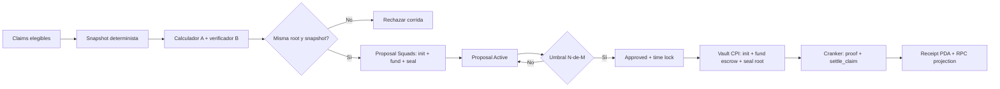

# EPIC-015 — Arquitectura de Solución y Contrato de Implementación

## Estado y alcance de esta decisión

Este documento convierte los hallazgos de auditoría en la solución propuesta para EPIC-015. Es la fuente técnica para los subagentes. No autoriza escribir código hasta la aprobación humana explícita del diseño y la creación de la SPEC TDD correspondiente.

La solución elegida para las dispersiones masivas es un **programa `payout_settlement` con escrow PDA y Merkle proof enforcement on-chain**. Squads V4 no paga una leg por claim: una Vault Transaction aprobada por el comité inicializa, fondea y sella un `PayoutRun`. Después, cualquier cranker puede solicitar `settle_claim`, pero el programa sólo transfiere exactamente una leaf incluida en la raíz sellada. No se usará `SpendingLimit` para pagos de claims en este EPIC.

Esta es una decisión que reemplaza explícitamente la alternativa anterior de "Merkle root auditora" y el modelo de "Batch + una Vault Transaction por leg". Ambos son insuficientes frente a un agente de despacho malicioso: el primero no impone nada on-chain y el segundo entrega al executor un conjunto de transferencias que no se verifica por proof en el momento de liquidar.

## Decisiones propuestas que requieren Human Design Approval

| Decisión | Propuesta | Motivo |
| --- | --- | --- |
| Mecanismo de pago | `payout_settlement` + escrow PDA; Squads crea, fondea y sella el run | El programa sólo libera una leaf incluida en la raíz aprobada y sólo una vez |
| Spending limit | Prohibido para payouts de claims | No preserva el umbral multisig por corrida ni un snapshot de beneficiarios |
| Merkle | Root, snapshot hash y reglas guardadas en `PayoutRun`; proof enforcement on-chain | Vincula criptográficamente cada pago a la corrida aprobada y bloquea doble pago |
| Multisig | `configAuthority = Pubkey::default()`, N-de-M configurable, vault index explícito | Evita una llave que pueda reconfigurar unilateralmente la tesorería |
| Cranker de settlement | Cuenta no privilegiada; puede presentar proof, nunca elegir una leaf válida | La autorización de fondos procede del escrow y de la raíz aprobada, no del cranker |
| Time lock | Configurable; valor inicial recomendado: 900 segundos | Permite cancelar o investigar una propuesta antes de mover tesorería |
| Fuente de verdad | Squads y `ProjectConfigPDA` on-chain; Postgres es proyección | Ninguna mutación HTTP/local declara un hecho on-chain |

No se fija N-de-M, integrantes ni vault index en código. Antes de SPEC de implementación debe existir un **Authority Manifest** revisado por el comité con: cluster, RPC HTTP/WSS, program ID, `multisigPda`, `createKey`, `vaultIndex`, `vaultPda`, N-de-M, miembros y permisos, time lock, mint, token program, signers de proposer/executor y política de rotación.

### Selección explícita del Squad

El sistema apunta al Squad mediante una configuración de entorno por cluster/proyecto; no lo descubre a partir del wallet del usuario, del `treasury_vault`, del `runId` ni del payout. La configuración mínima debe ser:

```text
SOLANA_CLUSTER=devnet
SOLANA_RPC_HTTP_URL=<endpoint-devnet>
SOLANA_RPC_WS_URL=<endpoint-devnet-wss>
SQUADS_V4_PROGRAM_ID=SQDS4ep65T869zMMBKyuUq6aD6EgTu8psMjkvj52pCf
TREASURY_MULTISIG_PDA=<PDA-de-la-multisig-v4>
TREASURY_MULTISIG_CREATE_KEY=<createKey-usado-para-derivarla>
TREASURY_VAULT_INDEX=0
TREASURY_VAULT_PDA=<PDA-de-la-vault-correspondiente>
TREASURY_POLICY_PDA=<PDA-de-politica-de-tesoreria>
TREASURY_MINT=<mint-autorizado>
TREASURY_TOKEN_PROGRAM_ID=<Token-Program-o-Token-2022-segun-el-mint>
PAYOUT_ATTESTER_A_PUBKEY=<clave-publica-calculador>
PAYOUT_ATTESTER_B_PUBKEY=<clave-publica-verificador-independiente>
```

Reglas obligatorias de esa configuración:

1. Las variables anteriores son un **manifest de despliegue**, no un secreto; nunca contienen private keys ni seed phrases. Los firmantes usan wallets externas o un mecanismo de custodia aprobado.
2. `TREASURY_MULTISIG_PDA`, `TREASURY_MULTISIG_CREATE_KEY` y `TREASURY_VAULT_PDA` deben ser coherentes entre sí según `@sqds/multisig`; si no coinciden, el proceso falla cerrado.
3. El arranque valida `cluster`, `programId` mediante `getAccountInfo`, existencia y owner de la Multisig, `threshold`, miembros/permisos, `vaultIndex`, y que la Vault PDA sea la cuenta que posee/controla los activos. Las variables no son prueba de autoridad.
4. Toda consulta y toda propuesta debe llevar el contexto resuelto `{cluster, programId, multisigPda, vaultIndex, vaultPda}`. No se permite un singleton global que cambie de Squad dentro del mismo proceso.
5. La configuración debe incluir `TREASURY_POLICY_PDA`. El arranque comprueba que owner, seeds, Vault, mint, token program y claves de attestation de esa cuenta on-chain coinciden con el manifest. El backend nunca entrega las claves de attestation como parámetros de `initialize_run`.
6. Si el producto soporta varios Squads, se usa un registro explícito `treasury_id -> Authority Manifest`; `runId` referencia `treasury_id` y nunca una dirección arbitraria enviada por el cliente. El cliente no puede elegir `multisigPda`.
7. `PAYOUT_ATTESTER_A_PUBKEY` y `PAYOUT_ATTESTER_B_PUBKEY` pertenecen a identidades y custodias separadas; no pueden apuntar a la misma clave ni a una clave controlada por el worker/cranker. Son valores de la `TreasuryPolicy` PDA, no inputs de una request.
8. El cambio de Squad o de attesters requiere un `update_policy` firmado por la Vault dentro de una nueva propuesta Squads, configuración versionada, comprobación RPC, revisión del comité y migración explícita de fondos/claims. No es un cambio dinámico de una request.

## Identidades y límites de confianza

| Identidad | Puede hacer | No puede hacer |
| --- | --- | --- |
| Usuario beneficiario | Crear/cancelar su claim mientras sea cancelable; solicitar override con prueba SIWS | Aprobar pago, cambiar un payout run, elegir monto o ejecutar Squads |
| Proposer | Construir y proponer el setup inmutable del payout run | Aprobar como otro miembro, ejecutar si carece de permiso, cambiar root o leaves tras activar proposal |
| Voter | Aprobar/rechazar/cancelar según el estado de Squads | Editar mensaje o enviar pago fuera de una proposal |
| Executor worker | Ejecutar proposals `Approved` y reconciliar hechos on-chain | Votar, crear nuevos destinos/montos, inventar firmas o saltar time lock |
| Vault PDA | Autoridad de transferencias e instrucciones CPI ya aprobadas | Ser sustituida por la Multisig PDA o por una wallet HTTP |
| Backend/DB | Construir DTOs, persistir intención y proyectar estado | Declarar una proposal aprobada o un pago ejecutado sin evidencia RPC |

Nunca se deposita ni se asigna autoridad a la **Multisig PDA**. La autoridad de activos y del programa notario es exclusivamente la **Vault PDA** derivada de esa multisig.

## Arquitectura de pagos



### Contrato de snapshot y doble verificación

Antes de crear una propuesta, el servicio construye un snapshot ordenado por `claimId` binario. Cada hoja usa encoding binario versionado, sin JSON ni números flotantes:

```text
domain = "brids:epic015:payout:v1"
leaf = sha256(domain || runId || claimId || mint || tokenProgram || recipientWallet || recipientAta || amountMinor)
```

El snapshot produce `merkleRoot`, `snapshotHash`, `snapshotVersion`, `rulesVersion`, `itemCount` y `totalAmountMinor`. El calculador de pagos y un verificador independiente deben consumir el mismo snapshot inmutable, por identidades de ejecución distintas, y emitir exactamente ese conjunto. Cada uno firma `payout-attestation:v1 || run_id_hash || snapshot_hash || merkle_root || total_amount_minor || item_count || rules_version || mint || token_program || expiry`. Si uno difiere, no se puede construir la propuesta.

La propuesta Squads contiene las dos verificaciones Ed25519 y una instrucción `initialize_run` con esos compromisos; después, en la misma Vault Transaction, las instrucciones de transferencia desde la Vault ATA al escrow ATA y `seal_run`. `initialize_run` lee el sysvar de instrucciones y falla si no encuentra ambas verificaciones contra las public keys configuradas y el mensaje exacto. El programa no permite settlement hasta que esté sellado y comprueba que el escrow contiene exactamente `totalAmountMinor`. `merkleRoot` deja de ser evidencia auditora: es la condición criptográfica de autorización de cada transferencia.

### Contrato on-chain de `payout_settlement`

`TreasuryPolicy` es una PDA derivada de `[b"treasury_policy", treasury_id_hash]`, inicializada y actualizable sólo por `authority_vault.is_signer` desde Squads. Guarda `authority_vault`, `multisig_pda`, `vault_index`, mint/token program permitidos, `attester_a`, `attester_b`, `policy_version`, `paused` y bump. Es la ancla on-chain del Authority Manifest.

`PayoutRun` es una PDA por corrida, derivada de `[b"payout_run", run_id_hash]`. Almacena: `treasury_policy`, `policy_version`, `authority_vault`, `multisig_pda`, `vault_index`, `mint`, `token_program`, `merkle_root`, `snapshot_hash`, `rules_version`, `total_amount_minor`, `item_count`, `expires_at`, `status`, `escrow_ata` y `bump`. El escrow es un ATA cuyo owner es la PDA del run.

La única secuencia que activa una corrida es una Vault Transaction de Squads, atómica y revisable:

1. Dos instrucciones Ed25519 verifican las attestationes canónicas antes de cualquier instrucción del programa.
2. `initialize_run`: exige `authority_vault.is_signer`, recibe la `TreasuryPolicy` PDA, toma de ella las claves permitidas y comprueba ambas verificaciones en el instructions sysvar; crea el `PayoutRun` inmutable y el escrow ATA.
3. Transferencia SPL/Token-2022 desde la ATA de la Vault al escrow por exactamente `total_amount_minor`.
4. `seal_run`: exige la misma Vault signer, verifica el balance exacto del escrow y cambia `status` a `Active`.

`settle_claim` recibe `leaf`, `proof`, recipient ATA y amount. Recalcula la leaf con el encoding anterior, verifica la proof contra `merkle_root`, comprueba mint/token-program/ATA/expiración/estado y crea `ClaimReceipt` PDA derivada de `[b"claim_receipt", payout_run, leaf_hash]`. Si el receipt ya existe, falla. Sólo después transfiere el monto exacto del escrow al ATA comprometido. El cranker no firma como Vault ni recibe un parámetro que pueda sustituir recipient, mint, amount o root.

`pause_run`, `cancel_run` y `refund_unclaimed` exigen `authority_vault.is_signer` y por ello sólo son invocables mediante otra propuesta Squads aprobada. Ninguna operación revierte un receipt ni un pago ya confirmado.

**Límite de garantía honesto:** el programa garantiza que cada salida corresponde a una leaf del root N-de-M aprobado, doblemente attestada y que no se repite. No puede demostrar que una claim era legítima fuera de cadena. Para ello el snapshot se bloquea, se recalcula independientemente, sus firmantes están separados del cranker y se presenta al comité con `snapshotHash`, reglas versionadas, total y muestra/auditoría de hojas antes del voto.

### Planificación y ciclo Squads obligatorio

No existe `MAX_LEGS_PER_BATCH` ni un batch de payout legs. Sólo se planifica la transacción de setup del run (`initialize_run` + fund + `seal_run`), que se simula en Devnet con sus cuentas, tamaño serializado, compute units, mint y token program. Los payouts posteriores son una instrucción `settle_claim` por leaf; si la operación excede límites por proof o cuentas, se rechaza antes de envío y no se sustituye por un pago directo.

1. Bloquear el snapshot y obtener dos resultados independientes; persistir ambos hashes y el dictamen de coincidencia.
2. Leer `Multisig`, Vault y balances; reservar el índice de propuesta de forma optimista.
3. Construir una Vault Transaction inmutable con `initialize_run`, transferencia exacta al escrow y `seal_run`; incluir los compromisos de snapshot en `initialize_run`.
4. Crear y activar la propuesta Squads sólo después de simular y validar todas las cuentas.
5. Los voters firman desde sus wallets; el servidor sólo observa y proyecta el voto.
6. Tras `Approved` y vencido `timeLock`, un miembro `Executor` ejecuta el setup. El indexer comprueba signature, cuentas invocadas, logs, balance del escrow y estado `Active` antes de habilitar cranking.
7. El cranker procesa leaves en cualquier orden, siempre con proof. El indexer comprueba cada `ClaimReceipt` y movimiento token antes de proyectar `executed`.

## Estado canónico

### Claims

```text
quote_created -> claim_requested -> approved_for_dispersion
approved_for_dispersion -> run_proposed -> awaiting_threshold -> run_funded -> settling -> executed
quote_created|claim_requested -> expired|canceled|compliance_hold
compliance_hold -> approved_for_dispersion|clawback_to_treasury
run_proposed|awaiting_threshold -> rejected|canceled|stale
settling -> partially_executed|executed|execution_unknown
```

`canceled` solo es válido antes de que exista un `ClaimReceipt`. Si el `PayoutRun` ya está sellado, la cancelación debe ser una propuesta Squads que pause/cancele el run; las leaves sin receipt no se pueden liquidar mientras esté pausado. Nunca se revierte un pago confirmado.

### Payout run projection

```text
snapshot_verifying -> proposal_draft -> active -> awaiting_threshold -> approved
approved -> time_locked -> funding_confirmed -> settling -> partially_executed|executed
proposal_draft|active|awaiting_threshold|approved -> rejected|canceled|stale
any RPC-ambiguous execution -> execution_unknown
```

Los estados de propuesta se derivan de Squads; `funding_confirmed`, `settling`, los receipts y el progreso se derivan de `PayoutRun` y `ClaimReceipt`. La DB puede usar estados de trabajo (`snapshot_verifying`, `execution_unknown`), pero no sustituye evidencia on-chain.

## Persistencia requerida

La migración de EPIC-015 debe crear entidades de `PayoutRun`; no puede reutilizar valores simulados de batch. Campos mínimos:

| Entidad | Campos obligatorios |
| --- | --- |
| `payout_runs` | `run_id`, `payout_run_pda`, `escrow_ata`, `squads_program_id`, `multisig_pda`, `multisig_create_key`, `vault_pda`, `vault_index`, `proposal_pda`, `snapshot_hash`, `snapshot_version`, `rules_version`, `merkle_root`, `total_amount_minor`, `onchain_status`, `funding_signature`, `funding_slot`, `last_reconciled_slot`, `idempotency_key`, `time_lock_seconds` |
| `payout_run_items` | `run_id`, `claim_id` unique entre items activas, `canonical_leaf_hash` único por run, `expected_recipient_ata`, `token_program`, `amount_minor`, `merkle_proof_ciphertext_or_uri`, `receipt_pda`, `settlement_signature`, `settlement_slot`, `projection_status` |
| `payout_snapshot_attestations` | `run_id`, `calculator_identity`, `snapshot_hash`, `merkle_root`, `total_amount_minor`, `item_count`, `rules_version`, `artifact_uri`, `verified_at`, `result` |
| `distribution_payout_overrides` | `claim_id`, `case_number` normalizado, `requested_wallet`, `effective_wallet`, `status`, `version`, `proposal_pda`, `run_id`, `onchain_signature`, `onchain_slot`, actor y timestamps |
| `claim_or_payout_events` | `idempotency_key` único por evento externo, actor, source (`api`, `rpc-indexer`, `cron`), signature, slot y metadata versionada |

Restricciones obligatorias: no se puede tener dos items activas para un claim; no se crea propuesta sin dos attestations coincidentes; los montos son enteros de unidades mínimas; receipt PDA y leaf son únicos; signatures no son nullable una vez que un estado se proyecta como ejecutado; los eventos de origen RPC son idempotentes por signature e índice.

## Overrides y cancelación

Un override de wallet nunca cambia `distribution_claims.payout_wallet` directamente. El flujo es:

1. Beneficiario prueba control de la wallet original mediante SIWS con nonce, audiencia, expiración y `claimId` enlazado.
2. Backend crea `distribution_payout_overrides` en `PENDING`; valida wallet destino y exige `case_number`.
3. El comité crea una proposal que autoriza el override para **ese claim, destino, mint y versión**.
4. Solo después de leer ejecución confirmada, la proyección fija `effective_wallet` para un snapshot aún no bloqueado.
5. Si la claim ya pertenece a un payout run sellado, no se modifica su leaf; se pausa/cancela el run mediante Squads cuando proceda y se crea una corrida de reemplazo para los no liquidados.

## ProjectConfigPDA notarial

El programa Anchor `project_config_notary` es la fuente de verdad de fechas:

- seeds: `[b"project_config", collection_address.as_ref()]`;
- estado: `collection_address`, `authority_vault`, `multisig_pda`, `vault_index`, `project_start_at`, `project_end_at`, `version`, `updated_at`, `bump`;
- `initialize` protege contra reinitialization y solo acepta una configuración de bootstrap aprobada;
- `update_project_dates` exige que `authority_vault` coincida con el estado y sea signer; ese signer llega por CPI desde la Vault PDA durante `vaultTransactionExecute`;
- valida rango temporal, overflow, `start <= end` y política explícita para `end = None`;
- incrementa versión y emite evento con valores anterior/nuevo, signature y slot indexables.

`has_one` no prueba firma. Una wallet HTTP, la Multisig PDA o Postgres no pueden actualizar fechas. El motor de distribución valida owner del programa, seeds, discriminator, longitud y versión antes de decodificar; ante RPC inválido, ausente o stale falla cerrado.

## Reglas de implementación no negociables

- Usar `@solana/kit` para RPC/cliente y encapsular la dependencia web3.js de `@sqds/multisig` en `lib/solana-kit/compat/squads.ts` mediante `@solana/web3-compat` si es necesario.
- El adaptador nunca devuelve strings de fallback para PDAs, ATAs, signatures o slots. Un address inválido es error tipado y fail-closed.
- No aceptar `executionSignature`, `executionSlot`, `blockTime`, estado de proposal ni aprobadores desde HTTP como evidencia.
- Cada envío se simula; la confirmación se verifica con firma, slot, error de meta y cuentas esperadas antes de proyectar DB.
- RPC debe tener endpoint HTTP y WSS explícitos, timeout, retry con backoff y estado `execution_unknown` para incertidumbre. Reintentar consulta; nunca recrear un mensaje ya enviado.
- Token program, mint, ATA de escrow/destino, owner del ATA y decimales se validan antes de sellar el run y antes de cada settlement.
- El executor usa un signer gestionado fuera del repositorio; no se pide, guarda ni imprime una clave privada.

## Evidencia y tests por entrega

Cada SPEC comienza RED y termina con evidencia proporcional:

1. Unit: seeds correctas, encoding de leaf, state machine, planner, idempotencia y validación de cuentas.
2. Integration: bloquear snapshot, crear proposal Squads, votos, time lock, `initialize_run + fund + seal`, proof válida/inválida, receipt duplicado y cancelación con estado real.
3. Program: LiteSVM/Mollusk para invariantes de `payout_settlement` y del notario; Devnet para la transacción real.
4. E2E: UI solo habilita acciones coherentes con el DTO on-chain y nunca firma/envía de forma automática.
5. Devnet: program IDs, PDAs, signatures, slots, estados de Proposal/PayoutRun, escrow/ATA balances y events quedan registrados en `docs/devnet-proof.md`.

## Antipatrones explícitamente prohibidos

- derivar una Multisig desde `treasury_vault`;
- usar la Multisig PDA como autoridad de activos;
- `MAX_LEGS_PER_BATCH` o una transferencia directa por batch como mecanismo de seguridad;
- aprobar, fondear o ejecutar un payout cambiando solo Postgres;
- generar signatures, slots, block times o PDAs ficticios;
- permitir `proposed` como estado ejecutable;
- mutar la wallet de payout después de bloquear el snapshot;
- usar una Merkle root auditora sin `PayoutRun`, proof, escrow y receipt on-chain;
- permitir que un cranker elija recipient, amount, mint, token program, root o un leaf sin proof;
- fallback a fechas de Postgres cuando falle la lectura de `ProjectConfigPDA`.
